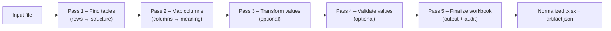

# ADE — Automatic Data Extractor

[](https://github.com/clac-ca/automatic-data-extractor/actions/workflows/ci.yml)
[](https://github.com/clac-ca/automatic-data-extractor/actions/workflows/release.yml)

ADE turns messy spreadsheets into consistent, auditable workbooks. It detects tables/columns, applies your rules, and produces normalized Excel files with a full audit trail.

## Monorepo overview

* **Frontend** — React (Vite) SPA for configs, builds, and runs.
* **Backend** — FastAPI service for metadata, builds, and orchestration.
* **Engine** — `ade_engine` package that executes detectors/hooks.
* **Config packages** — Your installable `ade_config` projects (versioned per workspace).

## How it works (at a glance)



Under the hood, each run executes your **ADE Config** (detectors, transforms, validators, hooks) inside a dedicated virtual environment alongside the **ADE Engine** runtime. Results and logs are written atomically per job.


<details>
<summary><strong>Repository layout</strong></summary>

```
automatic-data-extractor/
├─ apps/
│  ├─ ade-api/            # FastAPI service (serves /api + static SPA)
│  │  ├─ pyproject.toml
│  │  ├─ src/ade_api/     # Backend package
│  │  ├─ migrations/
│  │  └─ tests/
│  └─ ade-web/            # React (Vite) SPA
│     ├─ package.json
│     └─ src/…
├─ packages/
│  ├─ ade-engine/         # Runtime: ade_engine
│  └─ ade-schemas/        # Shared schemas: ade_schemas
├─ tools/
│  └─ ade-cli/            # Python orchestration CLI (console script: ade)
├─ examples/              # Sample inputs/outputs
├─ docs/                  # Developer guide, HOWTOs, runbooks
├─ infra/                 # Deployment bits (Docker, compose)
├─ scripts/               # Helper scripts (legacy or ad hoc)
└─ .env.example           # Documented env vars
```

</details>

Bundled ADE config templates now live under `apps/ade-api/src/ade_api/templates/config_packages/` inside the backend package.

Everything ADE produces (documents, configs, venvs, jobs, cache, …) lands under `./data/...` by default. Each storage path (`ADE_DOCUMENTS_DIR`, `ADE_CONFIGS_DIR`, `ADE_VENVS_DIR`, `ADE_JOBS_DIR`, `ADE_PIP_CACHE_DIR`) can point anywhere so you can mount different volumes as needed.

---

## Getting started

### Run the full app with Docker (recommended)

**Prereqs:** Docker & Docker Compose.

```bash
git clone https://github.com/clac-ca/automatic-data-extractor.git
cd automatic-data-extractor
cp .env.example .env

# Start the stack (API + built SPA)
docker compose -f infra/compose.yaml up --build
```

Now:

1. Open **[http://localhost:8000](http://localhost:8000)**.
2. Create a workspace and a **Config Package** (start from the “Default” template).
3. Click **Build** to freeze the environment for that config.
4. Upload a sample file (see `examples/`) and **Run** a job.
5. Download `output.xlsx` and inspect the per‑job audit at `logs/artifact.json`.

> By design, each built config has its own frozen virtualenv to ensure reproducible runs.

#### Use the published container image

Every successful push to `main` builds and publishes `ghcr.io/clac-ca/automatic-data-extractor:latest`, and tagged releases add a semantic version tag. To run the prebuilt image directly:

```bash
docker pull ghcr.io/clac-ca/automatic-data-extractor:latest
mkdir -p data
docker run -d \
  --name ade \
  -p 8000:8000 \
  -v "$(pwd)/data:/app/data" \
  --env-file .env \
  ghcr.io/clac-ca/automatic-data-extractor:latest
```

---

### Local development (API + Web)

**Prereqs:** Python 3.x, Node.js (latest LTS).

ADE assumes you create and activate a virtualenv yourself. Once `ade` is installed in that
environment, the commands run as-is (no hidden installs).

**macOS / Linux**

```bash
git clone https://github.com/clac-ca/automatic-data-extractor.git
cd automatic-data-extractor
cp .env.example .env

python3 -m venv .venv
source .venv/bin/activate

pip install -U pip
pip install -e apps/ade-cli
pip install -e packages/ade-schemas
pip install -e apps/ade-engine
pip install -e apps/ade-api

cd apps/ade-web
npm install         # or npm ci
cd -

ade dev             # backend + frontend dev servers
```

**Windows (PowerShell)**

```powershell
git clone https://github.com/clac-ca/automatic-data-extractor.git
cd automatic-data-extractor
copy .env.example .env

python -m venv .venv
.\.venv\Scripts\Activate.ps1

pip install -U pip
pip install -e apps/ade-cli
pip install -e packages/ade-schemas
pip install -e apps/ade-engine
pip install -e apps/ade-api

cd apps/ade-web
npm install
cd ..

ade dev
```

* API at **http://localhost:8000**
* Web at **http://localhost:5173** (set `VITE_API_URL=http://localhost:8000` in `apps/ade-web/.env.local` if needed)
* `ade dev --backend-only` or `--frontend-only` to run a single surface.
* `ade start` runs the backend without autoreload and builds frontend assets if the static bundle is missing.
* `ade build` compiles the frontend and copies it into `apps/ade-api/src/ade_api/web/static/` for `ade start`. It assumes you've already run `npm install`.
* Docker commands (`ade docker up|logs|down`) run without needing `.venv` (just Docker/Compose installed).

> Convenience: `./setup.sh` simply creates `.venv` and prints activation/install steps. It does **not** install dependencies or modify your shell.

---

## Concepts you’ll see in the UI

* **Config package (`ade_config`)** — your Python package that defines detectors, transforms, validators, and lifecycle hooks.
* **Build** — creates a dedicated virtualenv at `.venv/<config_id>/` and installs `ade_engine` + your `ade_config` (+ declared deps).
* **Run** — processes inputs using that frozen environment and writes `output.xlsx` + `artifact.json`.

> Config packages are versioned so you can draft, test, roll back, and extend safely.

---

## Configuration & environment

ADE is configured via environment variables; sensible defaults work for local use.

<details>
<summary><strong>Common variables</strong></summary>

| Variable                  | Default                         | Purpose                                                   |
| ------------------------- | ------------------------------- | --------------------------------------------------------- |
| `ADE_DOCUMENTS_DIR`       | `./data/documents`              | Uploaded files + generated artifacts                      |
| `ADE_CONFIGS_DIR`         | `./data/config_packages`        | Where installable config projects live                    |
| `ADE_VENVS_DIR`           | `./data/.venv`                  | One Python virtualenv per `config_id`                     |
| `ADE_JOBS_DIR`            | `./data/jobs`                   | Per‑job working directories                               |
| `ADE_PIP_CACHE_DIR`       | `./data/cache/pip`              | pip download/build cache                                  |
| `ADE_SAFE_MODE`          | `false`                         | Skip engine execution while runs API returns safe-mode info |
| `ADE_MAX_CONCURRENCY`     | `2`                             | Backend dispatcher parallelism                            |
| `ADE_QUEUE_SIZE`          | `10`                            | Back‑pressure threshold before API returns HTTP 429       |
| `ADE_JOB_TIMEOUT_SECONDS` | `300`                           | Wall‑clock timeout per worker                             |
| `ADE_WORKER_CPU_SECONDS`  | `60`                            | Best‑effort CPU limit per job (POSIX rlimit)              |
| `ADE_WORKER_MEM_MB`       | `512`                           | Best‑effort address‑space ceiling per job (POSIX rlimit)  |
| `ADE_WORKER_FSIZE_MB`     | `100`                           | Best‑effort max file size a job may create (POSIX rlimit) |

</details>

**Formats:** ADE reads `.xlsx` and `.csv` and always writes a normalized `.xlsx` (Excel via `openpyxl` streaming; CSV via Python stdlib).

---

## Learn more

* **Config Packages** — detectors, transforms, validators, hooks: `docs/01-config-packages.md`
* **Job Orchestration** — queues, workers, resource limits, atomic writes: `docs/02-job-orchestration.md`
* **Artifact Reference** — schema & examples for the per‑job audit trail: `docs/14-job_artifact_json.md`
* **Glossary** — common terms and system vocabulary: `docs/12-glossary.md`

---

## CI & releases

* `.github/workflows/ci.yml` installs dependencies via editable local packages (`pip install -e apps/ade-cli -e packages/ade-schemas -e apps/ade-engine -e apps/ade-api`), runs `ade ci` (OpenAPI generation, lint, test, build), and builds the Docker image. Commits that land on `main` publish `ghcr.io/clac-ca/automatic-data-extractor:latest` (plus a commit‑sha tag) so you always have a tested container.
* `.github/workflows/release.yml` reads the authoritative version from `apps/ade-api/pyproject.toml`, extracts the matching changelog entry, opens a GitHub release, and republishes the image with both `latest` and semantic version tags (for example `ghcr.io/clac-ca/automatic-data-extractor:0.1.0`).

Pull a specific artifact at any time with:

```bash
docker pull ghcr.io/clac-ca/automatic-data-extractor:<tag>
```

---

## Contributing

PRs and issues are welcome. Please run linters/tests before submitting (use the `ade` CLI and the workflows in `.github/workflows/`).

---

## License

Released under **TBD** — see [LICENSE](LICENSE).
