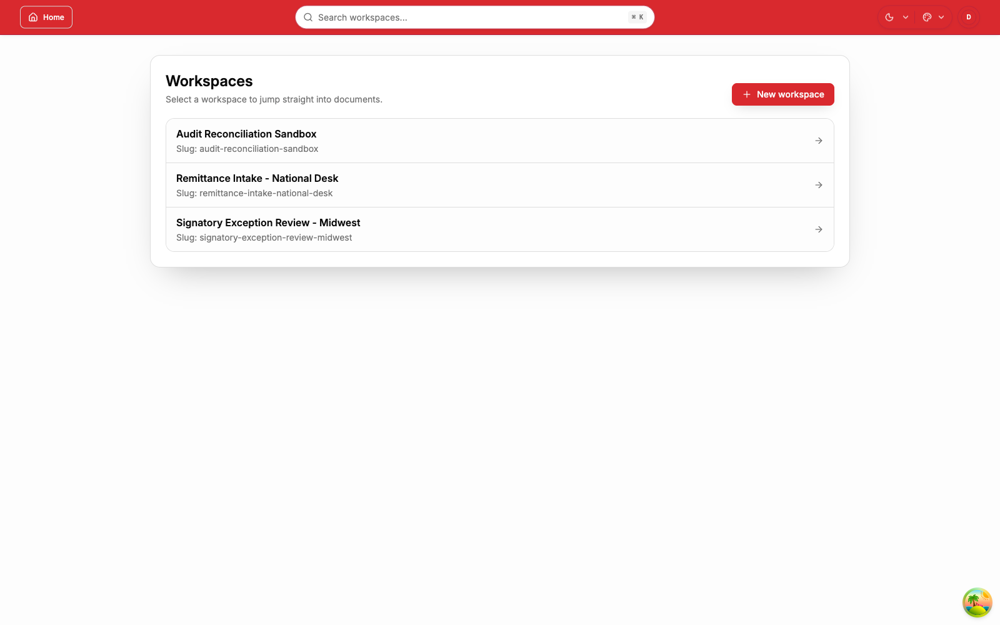
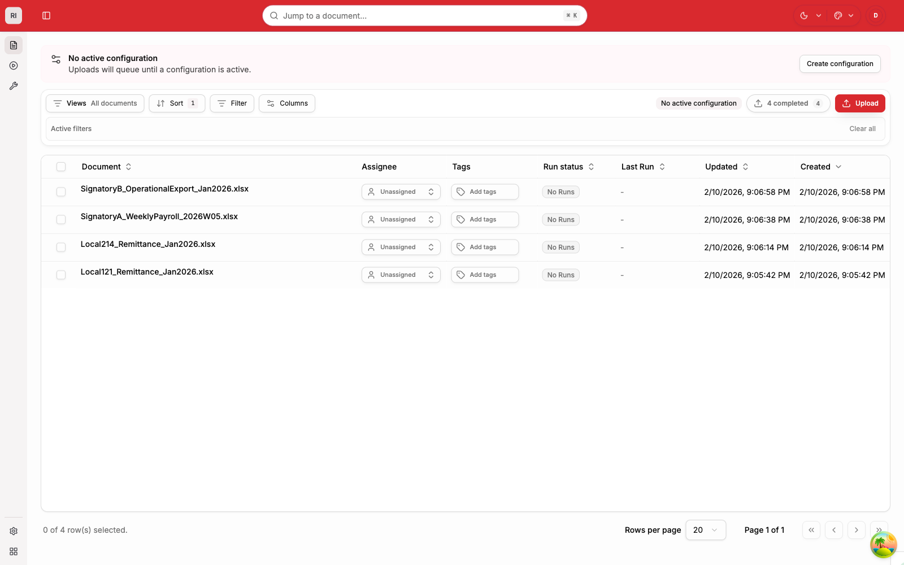
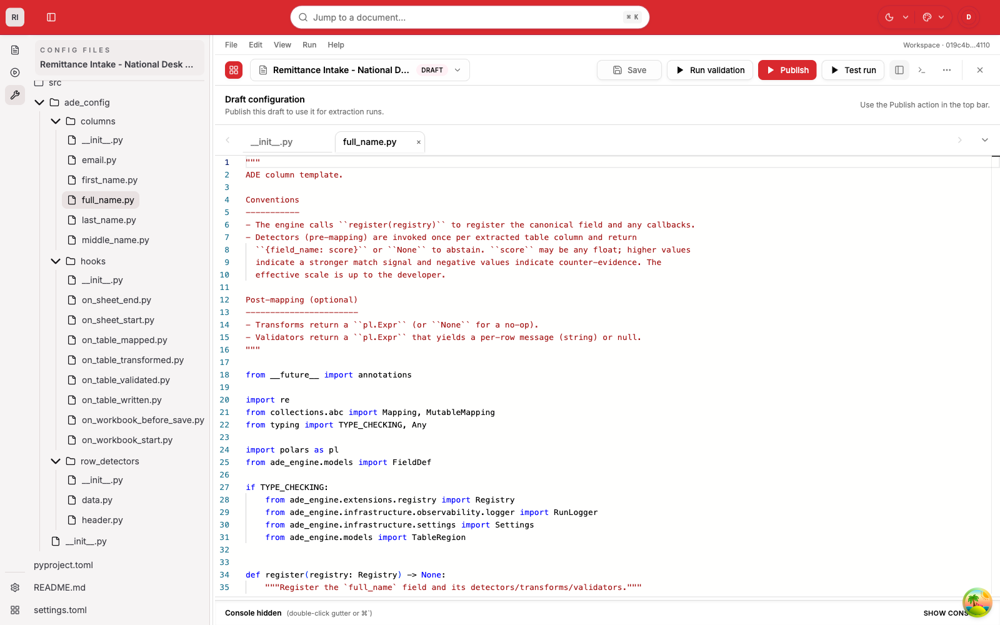

# Automatic Data Extractor (ADE)

ADE is a self-hosted platform for normalizing messy Excel/CSV inputs into
consistent, auditable outputs.

[](https://github.com/clac-ca/automatic-data-extractor/actions/workflows/ci-pr-gates.yaml)
[](https://github.com/clac-ca/automatic-data-extractor/releases)
[](LICENSE)

## Product at a Glance

### Workspace directory



Contributor-ready workspaces staged for remittance intake, exception handling,
and reconciliation.

### Upload preflight


Intentional upload controls for worksheet scope, queued processing behavior,
and conflict-safe ingestion.

### Documents ledger



A realistic operational queue with remittance exports and live run-state
visibility.

### Configuration workbench



The editor surface for configuration packages, file-level changes, validation,
and publish workflows.

## What ADE Includes

- `ade-api`: FastAPI control plane for auth, workspaces, configurations,
  documents, and runs.
- `ade-worker`: background run execution, environment lifecycle, retries, and
  artifacts.
- `ade-web`: React SPA for operators and configuration authors.
- Shared packages: `ade-db`, `ade-storage`, and unified backend CLI entrypoints.

## Contributor Quickstart

```bash
git clone https://github.com/clac-ca/automatic-data-extractor
cd automatic-data-extractor
docker compose up --build -d
```

Open `http://localhost:8000`.

API docs are opt-in. To enable built-in ReDoc + Swagger UI:

```bash
echo "ADE_API_DOCS_ENABLED=true" >> .env
echo "ADE_API_DOCS_ACCESS_MODE=public" >> .env
docker compose up --build -d
```

Use `ADE_API_DOCS_ACCESS_MODE=authenticated` (default) to require sign-in.
After editing `.env`, rerun `docker compose up --build -d` so running
containers reload the new settings.

Docs endpoints:

- `http://localhost:8000/api` (ReDoc)
- `http://localhost:8000/api/swagger` (Swagger UI)
- `http://localhost:8000/api/openapi.json` (OpenAPI JSON)

Common docs troubleshooting:

| Symptom | Likely cause | Fix |
| --- | --- | --- |
| `404` on docs URLs | docs disabled | set `ADE_API_DOCS_ENABLED=true` and restart |
| `/api` renders SPA instead of ReDoc | stale web container/nginx template | rebuild/restart with `docker compose up --build -d` |
| `csrf_failed` in Swagger "Try it out" | session auth without valid CSRF state | sign in first or use `X-API-Key` auth |
| requests target wrong host | mismatched public URL | set `ADE_PUBLIC_WEB_URL` to the external web URL |

Stop:

```bash
docker compose down
```

Full local reset:

```bash
docker compose down -v
```

## Native Dev Loop (Isolated Per Worktree)

```bash
./setup.sh
cd backend && uv run ade infra up -d --wait
cd backend && uv run ade dev
```

- `setup.sh` creates an isolated local profile per worktree.
- `ade dev` starts API, worker, and web with reload.
- To auto-open the browser when web is ready:
  `cd backend && uv run ade dev --open`.

## Daily Development Commands

| Task | Command |
| --- | --- |
| Start full local stack (dev mode) | `cd backend && uv run ade dev` |
| Start full local stack (prod-style) | `cd backend && uv run ade start` |
| API only | `cd backend && uv run ade api dev` |
| Worker only | `cd backend && uv run ade worker start` |
| Web only | `cd backend && uv run ade web dev` |
| Generate frontend API types | `cd backend && uv run ade api types` |
| Backend lint | `cd backend && uv run ade api lint` |
| Full test suite | `cd backend && uv run ade test` |
| Web build | `cd backend && uv run ade web build` |

## Documentation Map

- Docs hub: [`docs/README.md`](docs/README.md)
- Contributor setup: [`docs/tutorials/developer-setup.md`](docs/tutorials/developer-setup.md)
- Local dev loop: [`docs/how-to/run-local-dev-loop.md`](docs/how-to/run-local-dev-loop.md)
- CLI reference: [`docs/reference/cli-reference.md`](docs/reference/cli-reference.md)
- System architecture: [`docs/explanation/system-architecture.md`](docs/explanation/system-architecture.md)

## Contributing

- Default branch: `development`
- Conventional Commits: `feat:`, `fix:`, `deps:`, `chore:`
- Stage only task-related files
- Run relevant checks before merge

Details: [`CONTRIBUTING.md`](CONTRIBUTING.md)

## License

MIT. See [`LICENSE`](LICENSE).
