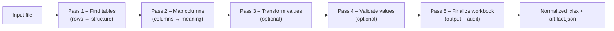

# ADE — Automatic Data Extractor

*Turn messy spreadsheets into consistent, auditable workbooks — automatically.*

ADE is a lightweight, configurable engine for normalizing Excel/CSV files at scale. It finds tables, recognizes columns, cleans and validates values, and produces a standardized workbook **with a full audit trail**. Teams use ADE to replace one‑off spreadsheet hacks with a **repeatable, deterministic** process that anyone can run.

## Monorepo overview

ADE brings four cooperating layers together:

* **Frontend** — React (Vite) SPA to author config packages and trigger builds/runs.
* **Backend** — FastAPI service that stores metadata, builds isolated Python environments, and orchestrates jobs.
* **Engine** — Installable `ade_engine` package that executes detectors/hooks and writes outputs.
* **Config packages** — Installable `ade_config` projects you author; versioned and built per workspace.

## How it works (at a glance)



Under the hood, each run executes your **ADE Config** (detectors, transforms, validators, hooks) inside a dedicated virtual environment alongside the **ADE Engine** runtime. Results and logs are written atomically per job.


<details>
<summary><strong>Repository layout</strong></summary>

```
automatic-data-extractor/
├─ apps/
│  ├─ api/                # FastAPI service (serves /api + static SPA)
│  │  └─ app/templates/config_packages/    # Bundled starter ADE config packages
│  └─ web/                # React (Vite) SPA
├─ packages/
│  └─ ade-engine/         # Runtime: ade_engine
├─ examples/              # Sample inputs/outputs
├─ docs/                  # Developer guide, HOWTOs, runbooks
├─ infra/
│  ├─ docker/             # API Dockerfile (builds SPA + bundles it)
│  └─ compose.yaml        # Local prod-style run
├─ Makefile               # Friendly entrypoints (setup/dev/build/run)
└─ .env.example           # Documented env vars
```

</details>

Bundled ADE config templates now live under `apps/api/app/templates/config_packages/` inside the backend package.

Everything ADE produces (documents, configs, venvs, jobs, cache, …) lands under `./data/...` by default. Each storage path (`ADE_DOCUMENTS_DIR`, `ADE_CONFIGS_DIR`, `ADE_VENVS_DIR`, `ADE_JOBS_DIR`, `ADE_PIP_CACHE_DIR`) can point anywhere so you can mount different volumes as needed.

---

## Getting started

You can try ADE in three ways. **Option 1** is the simplest to see the end‑to‑end flow.

### Option 1 — Run the full app with Docker (recommended)

**Prereqs:** Docker & Docker Compose.

```bash
git clone https://github.com/clac-ca/automatic-data-extractor.git
cd automatic-data-extractor
cp .env.example .env

# Start the stack (API + built SPA)
docker compose -f infra/compose.yaml up --build
```

Now:

1. Open **[http://localhost:8000](http://localhost:8000)**.
2. Create a workspace and a **Config Package** (start from the “Default” template).
3. Click **Build** to freeze the environment for that config.
4. Upload a sample file (see `examples/`) and **Run** a job.
5. Download `output.xlsx` and inspect the per‑job audit at `logs/artifact.json`.

> By design, each built config has its own frozen virtualenv to ensure reproducible runs.

---

### Option 2 — Local development (API + Web)

**Prereqs:** Python 3.x, Node.js (latest LTS).

```bash
# Clone & env
git clone https://github.com/clac-ca/automatic-data-extractor.git
cd automatic-data-extractor
cp .env.example .env

# Backend (FastAPI)
python -m venv .venv
source .venv/bin/activate  # Windows: .\.venv\Scripts\Activate.ps1
pip install -e apps/api[dev]
uvicorn apps.api.app.main:create_app --reload --factory --port 8000
```

In another terminal, run the SPA (dev mode):

```bash
npm install --prefix apps/web
npm run dev --prefix apps/web
```

* API at **[http://localhost:8000](http://localhost:8000)**
* Web at **[http://localhost:5173](http://localhost:5173)** (if the SPA needs it, set `VITE_API_URL=http://localhost:8000` in `apps/web/.env.local`)

Use the UI to create a config package, **Build**, then **Run** a job with a file from `examples/`.

---

### Option 3 — Headless engine smoke test (no UI)

If you already have a **built config** (from Option 1/2), you can reproduce a job from the command line using the frozen environment:

```bash
# Inspect the installed config manifest (run inside the config's venv)
${ADE_VENVS_DIR}/<config_id>/bin/python -I -B -m ade_engine
```

> The placeholder CLI prints the engine version and config manifest so you can
> confirm a build succeeded. The long‑running worker entry point (which will
> accept a `job_id`) lands once the job service is wired up.

Job folders are self‑contained:

```
${ADE_JOBS_DIR}/<job_id>/
  input/      # uploaded files
  output/     # output.xlsx (normalized workbook)
  logs/
    artifact.json   # human/audit-readable narrative
    events.ndjson   # append-only timeline
```

---

## Concepts you’ll see in the UI

* **Config package (`ade_config`)** — your Python package that defines detectors, transforms, validators, and lifecycle hooks.
* **Build** — creates a dedicated virtualenv at `.venv/<config_id>/` and installs `ade_engine` + your `ade_config` (+ declared deps).
* **Run** — processes inputs using that frozen environment and writes `output.xlsx` + `artifact.json`.

> Config packages are versioned so you can draft, test, roll back, and extend safely.

---

## Configuration & environment

ADE is configured via environment variables; sensible defaults work for local use.

<details>
<summary><strong>Common variables</strong></summary>

| Variable                  | Default                         | Purpose                                                   |
| ------------------------- | ------------------------------- | --------------------------------------------------------- |
| `ADE_DOCUMENTS_DIR`       | `./data/documents`              | Uploaded files + generated artifacts                      |
| `ADE_CONFIGS_DIR`         | `./data/config_packages`        | Where installable config projects live                    |
| `ADE_VENVS_DIR`           | `./data/.venv`                  | One Python virtualenv per `config_id`                     |
| `ADE_JOBS_DIR`            | `./data/jobs`                   | Per‑job working directories                               |
| `ADE_PIP_CACHE_DIR`       | `./data/cache/pip`              | pip download/build cache                                  |
| `ADE_MAX_CONCURRENCY`     | `2`                             | Backend dispatcher parallelism                            |
| `ADE_QUEUE_SIZE`          | `10`                            | Back‑pressure threshold before API returns HTTP 429       |
| `ADE_JOB_TIMEOUT_SECONDS` | `300`                           | Wall‑clock timeout per worker                             |
| `ADE_WORKER_CPU_SECONDS`  | `60`                            | Best‑effort CPU limit per job (POSIX rlimit)              |
| `ADE_WORKER_MEM_MB`       | `512`                           | Best‑effort address‑space ceiling per job (POSIX rlimit)  |
| `ADE_WORKER_FSIZE_MB`     | `100`                           | Best‑effort max file size a job may create (POSIX rlimit) |

</details>

**Formats:** ADE reads `.xlsx` and `.csv` and always writes a normalized `.xlsx` (Excel via `openpyxl` streaming; CSV via Python stdlib).

---

## Learn more

* **Config Packages** — detectors, transforms, validators, hooks: `docs/01-config-packages.md`
* **Job Orchestration** — queues, workers, resource limits, atomic writes: `docs/02-job-orchestration.md`
* **Artifact Reference** — schema & examples for the per‑job audit trail: `docs/14-job_artifact_json.md`
* **Glossary** — common terms and system vocabulary: `docs/12-glossary.md`

---

## Contributing

PRs and issues are welcome. Please run linters/tests before submitting (see `Makefile` and the workflows in `.github/workflows/`).

---

## License

Released under **TBD** — see [LICENSE](LICENSE).
