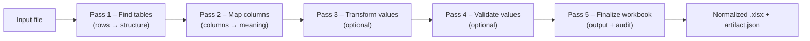

# ADE — Automatic Data Extractor

[](https://github.com/clac-ca/automatic-data-extractor/actions/workflows/ci.yml)
[](https://github.com/clac-ca/automatic-data-extractor/actions/workflows/release.yml)

ADE turns messy spreadsheets into consistent, auditable workbooks. It detects tables/columns, applies your rules, and produces normalized Excel files with a full audit trail.

## Monorepo overview

* **Frontend** — React (Vite) SPA for configs, builds, and runs.
* **Backend** — FastAPI service for metadata, builds, and orchestration.
* **Engine** — `ade_engine` package that executes detectors/hooks.
* **Config packages** — Your installable `ade_config` projects (versioned per workspace).

## How it works (at a glance)



Under the hood, each run executes your **ADE Config** (detectors, transforms, validators, hooks) inside a dedicated virtual environment alongside the **ADE Engine** runtime. Results and logs are written atomically per job.


<details>
<summary><strong>Repository layout</strong></summary>

```
automatic-data-extractor/
├─ apps/
│  ├─ ade-api/            # FastAPI service (serves /api + static SPA)
│  │  ├─ pyproject.toml
│  │  ├─ src/ade_api/     # Backend package
│  │  ├─ migrations/
│  │  └─ tests/
│  └─ ade-web/            # React (Vite) SPA
│     ├─ package.json
│     └─ src/…
├─ packages/
│  ├─ ade-engine/         # Runtime: ade_engine
│  └─ ade-schemas/        # Shared schemas: ade_schemas
├─ tools/
│  └─ ade-cli/            # Python orchestration CLI (console script: ade)
├─ examples/              # Sample inputs/outputs
├─ docs/                  # Developer guide, HOWTOs, runbooks
├─ infra/                 # Deployment bits (Docker, compose)
├─ scripts/               # Helper scripts (legacy or ad hoc)
└─ .env.example           # Documented env vars
```

</details>

Bundled ADE config templates now live under `apps/ade-api/src/ade_api/templates/config_packages/` inside the backend package.

Everything ADE produces (documents, configs, venvs, jobs, cache, …) lands under `./data/...` by default. Each storage path (`ADE_DOCUMENTS_DIR`, `ADE_CONFIGS_DIR`, `ADE_VENVS_DIR`, `ADE_JOBS_DIR`, `ADE_PIP_CACHE_DIR`) can point anywhere so you can mount different volumes as needed.

---

## Getting started

### Option 1 — Docker (recommended)

**Prereqs:** Docker & Docker Compose.

```bash
git clone https://github.com/clac-ca/automatic-data-extractor.git
cd automatic-data-extractor
cp .env.example .env

# Start the stack (API + built SPA)
docker compose -f infra/compose.yaml up --build
```

Then:

1. Open **[http://localhost:8000](http://localhost:8000)**
2. Create a workspace and a **Config Package** (start from the “Default” template)
3. Click **Build**
4. Upload a sample file (see `examples/`) and **Run** a job
5. Download `output.xlsx` and inspect `logs/artifact.json`

> Each built config has its own frozen virtualenv to keep runs reproducible.

#### Using the published image

```bash
docker pull ghcr.io/clac-ca/automatic-data-extractor:latest
mkdir -p data
docker run -d \
  --name ade \
  -p 8000:8000 \
  -v "$(pwd)/data:/app/data" \
  --env-file .env \
  ghcr.io/clac-ca/automatic-data-extractor:latest
```

---

### Option 2 — Local development (API + Web)

**Prereqs:** Python 3.x, Node.js (latest LTS).

#### macOS / Linux

```bash
# Clone the repository
git clone https://github.com/clac-ca/automatic-data-extractor.git
cd automatic-data-extractor

# Create a local .env file (edit as needed)
cp .env.example .env

# Create and activate a virtual environment
python3 -m venv .venv
source .venv/bin/activate

# Upgrade packaging tools (recommended for editable installs)
pip install -U pip setuptools wheel

# Install ADE backend components in editable mode
pip install -e apps/ade-cli       # ADE CLI (console entrypoint: `ade`)
pip install -e packages/ade-schemas
pip install -e apps/ade-engine
pip install -e apps/ade-api

# Install frontend dependencies
(cd apps/ade-web && npm install)

# Quick verification (shows CLI help)
ade --help

# Start backend + frontend dev servers (FastAPI + Vite)
ade dev
```

Notes:

* API: **[http://localhost:8000](http://localhost:8000)**
* Web: **[http://localhost:5173](http://localhost:5173)**
  (set `VITE_API_URL=http://localhost:8000` in `apps/ade-web/.env.local` if needed)
* `./setup.sh` is safe to re-run; it will reuse `.venv` and update dependencies.

#### Windows (PowerShell)

```powershell
git clone https://github.com/clac-ca/automatic-data-extractor.git
cd automatic-data-extractor
copy .env.example .env

python -m venv .venv
.\.venv\Scripts\Activate.ps1

pip install -U pip setuptools wheel
pip install -e tools/ade-cli
pip install -e packages/ade-schemas
pip install -e packages/ade-engine
pip install -e apps/ade-api

cd apps/ade-web
npm install
cd ../..
ade dev
```

Additional `ade` commands:

* `ade dev --backend-only` / `--frontend-only` — run a single surface
* `ade build` — build the frontend and copy it into `ade-api` static assets
* `ade start` — run the backend using the built SPA
* `ade docker up|logs|down` — manage Docker stack (no venv required, just Docker)

---

## Concepts in the UI

* **Config package (`ade_config`)** — Python package with detectors, transforms, validators, hooks.
* **Build** — creates a dedicated virtualenv per config and installs `ade_engine` + your `ade_config` (+ deps).
* **Run** — processes inputs using that frozen environment and writes `output.xlsx` + `artifact.json`.

Config packages are versioned so you can draft, test, roll back, and extend safely.

---

## Configuration & environment

ADE is configured via environment variables; defaults work for local dev.

<details>
<summary><strong>Common variables</strong></summary>

| Variable                  | Default                  | Purpose                                                   |
| ------------------------- | ------------------------ | --------------------------------------------------------- |
| `ADE_DOCUMENTS_DIR`       | `./data/documents`       | Uploaded files + generated artifacts                      |
| `ADE_CONFIGS_DIR`         | `./data/config_packages` | Installable config projects                               |
| `ADE_VENVS_DIR`           | `./data/.venv`           | One Python virtualenv per `config_id`                     |
| `ADE_JOBS_DIR`            | `./data/jobs`            | Per-job working directories                               |
| `ADE_PIP_CACHE_DIR`       | `./data/cache/pip`       | pip download/build cache                                  |
| `ADE_SAFE_MODE`           | `false`                  | Skip engine execution while runs API returns safe-mode    |
| `ADE_MAX_CONCURRENCY`     | `2`                      | Backend dispatcher parallelism                            |
| `ADE_QUEUE_SIZE`          | `10`                     | Back-pressure threshold before HTTP 429                   |
| `ADE_JOB_TIMEOUT_SECONDS` | `300`                    | Wall-clock timeout per worker                             |
| `ADE_WORKER_CPU_SECONDS`  | `60`                     | Best-effort CPU limit per job (POSIX rlimit)              |
| `ADE_WORKER_MEM_MB`       | `512`                    | Best-effort address-space ceiling per job (POSIX rlimit)  |
| `ADE_WORKER_FSIZE_MB`     | `100`                    | Best-effort max file size a job may create (POSIX rlimit) |

</details>

Input formats: `.xlsx`, `.csv`.
Output: normalized `.xlsx` (Excel via `openpyxl`, CSV via stdlib).

---

## Learn more

* **Config Packages** — `docs/01-config-packages.md`
* **Job Orchestration** — `docs/02-job-orchestration.md`
* **Artifact Reference** — `docs/14-job_artifact_json.md`
* **Glossary** — `docs/12-glossary.md`

---

## CI & releases

* `ci.yml` — installs editable packages, runs `ade ci` (OpenAPI, lint, test, build), and builds the Docker image. Pushes to `main` publish `ghcr.io/clac-ca/automatic-data-extractor:latest` + commit-sha tags.
* `release.yml` — reads version from `apps/ade-api/pyproject.toml`, pulls the changelog entry, creates a GitHub release, and publishes versioned images (e.g. `:0.1.0` + `:latest`).

Pull a specific image:

```bash
docker pull ghcr.io/clac-ca/automatic-data-extractor:<tag>
```

---

## Contributing

PRs and issues are welcome. Please run linters/tests via the `ade` CLI (and mirror the CI steps in `.github/workflows/`) before opening a PR.

---

## License

Released under **TBD** — see [LICENSE](LICENSE).