# **ADE — Automatic Data Extractor**

*A lightweight engine that turns messy Excel files into clean, consistent spreadsheets — automatically.*

ADE finds tables, recognizes columns, cleans and checks values, and writes a standardized workbook with a simple summary.

## **Why Teams Use ADE**

* 🕐 **Works faster** — eliminates repetitive cleanup and manual copy-paste.
* 🧩 **Easy to customize** — all detection and transformation logic lives in small, versioned scripts that you can edit or reuse directly in the web interface.
* ⚙️ **Predictable every time** — the same input and config always produce the same result.
* 🧠 **Built for scale** — streams data row by row instead of loading entire workbooks into memory.
* 📜 **Fully traceable** — records every step and decision in a detailed JSON artifact for easy review and audit.

## **How It Works (At a Glance)**

```mermaid
flowchart LR
    A["Input file"] --> B["Pass 1 – Find tables<br/>(rows → structure)"]
    B --> C["Pass 2 – Name columns<br/>(columns → mapping)"]
    C --> D["Pass 3 – Transform values<br/>(optional)"]
    D --> E["Pass 4 – Validate values<br/>(optional)"]
    E --> F["Pass 5 – Finalize workbook<br/>(output + summary)"]
    F --> G["Clean, structured output"]
```



ADE runs a few small passes.
Each pass does one job and passes its results to the next.

## **Getting Started**

You can run ADE locally for development or in Docker for production.

### 🧑‍💻 Local (developer setup)

```bash
git clone https://github.com/your-org/automatic-data-extractor.git
cd automatic-data-extractor
cp .env.example .env

# Create a virtual environment
python -m venv .venv
source .venv/bin/activate  # Windows: .\.venv\Scripts\Activate.ps1

# Install dependencies
pip install -e .[dev]
npm install

# Run the backend
uvicorn backend.app.main:create_app --reload --factory --port 8000
```

Then open [http://localhost:8000](http://localhost:8000) in your browser.
The backend automatically serves the web interface.

### 🐳 Docker (production setup)

```bash
# Build the image
npm run docker:build

# Start the container
npm run docker:run
```

This launches ADE on port `8000` using the `.env` file for configuration.
All runtime data (including uploaded files and job outputs) is stored in `./data` by default.

## **Learn More**

* 📘 [User Guide](docs/user-guide/README.md) — how to upload files, run jobs, and review results
* ⚙️ [Admin Guide](docs/admin-guide/README.md) — deployment, configuration, and operations
* 🧑‍💻 [Developer Docs](docs/developers/README.md) — extending ADE and writing config packages

## **License**

Released under the [TBD](LICENSE).