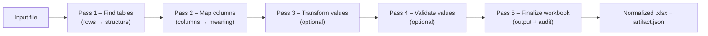

# Logical module layout (source -> sections below):
# - README.md - ADE — Automatic Data Extractor
# - apps/ade-web/README.md - ADE Web SPA (apps/ade-web)
# - apps/ade-web/src/app/App.tsx
# - apps/ade-web/src/app/AppProviders.tsx
# - apps/ade-web/src/app/nav/Link.tsx
# - apps/ade-web/src/app/nav/history.tsx
# - apps/ade-web/src/app/nav/urlState.ts
# - apps/ade-web/src/main.tsx
# - apps/ade-web/src/schema/adeArtifact.ts
# - apps/ade-web/src/schema/adeTelemetry.ts
# - apps/ade-web/src/schema/index.ts - Curated, app-facing types re-exported from the generated OpenAPI definitions.
# - apps/ade-web/src/screens/Workspace/api/workspaces-api.ts
# - apps/ade-web/src/screens/Workspace/sections/ConfigBuilder/workbench/defaultConfig.ts
# - apps/ade-web/src/screens/Workspace/sections/ConfigBuilder/workbench/seed/stubWorkbenchData.ts
# - apps/ade-web/src/screens/Workspace/sections/ConfigBuilder/workbench/state/useEditorThemePreference.ts
# - apps/ade-web/src/screens/Workspace/sections/ConfigBuilder/workbench/state/useUnsavedChangesGuard.ts
# - apps/ade-web/src/screens/Workspace/sections/ConfigBuilder/workbench/state/useWorkbenchFiles.ts
# - apps/ade-web/src/screens/Workspace/sections/ConfigBuilder/workbench/state/useWorkbenchUrlState.ts
# - apps/ade-web/src/screens/Workspace/sections/ConfigBuilder/workbench/state/workbenchWindowState.ts
# - apps/ade-web/src/screens/Workspace/sections/ConfigBuilder/workbench/types.ts
# - apps/ade-web/src/screens/Workspace/sections/ConfigBuilder/workbench/utils/console.ts
# - apps/ade-web/src/screens/Workspace/sections/ConfigBuilder/workbench/utils/drag.ts
# - apps/ade-web/src/screens/Workspace/sections/ConfigBuilder/workbench/utils/tree.ts
# - apps/ade-web/src/screens/Workspace/sections/Settings/hooks/useUpdateWorkspaceMutation.ts
# - apps/ade-web/src/screens/Workspace/sections/Settings/hooks/useWorkspaceMembers.ts
# - apps/ade-web/src/screens/Workspace/sections/Settings/hooks/useWorkspaceRoles.ts
# - apps/ade-web/src/screens/Workspace/state/workspace-preferences.ts
# - apps/ade-web/src/screens/Workspaces/New/hooks/useCreateWorkspaceMutation.ts
# - apps/ade-web/src/shared/api.ts
# - apps/ade-web/src/shared/api/client.ts
# - apps/ade-web/src/shared/api/csrf.ts
# - apps/ade-web/src/shared/api/ndjson.ts
# - apps/ade-web/src/shared/api/pagination.ts
# - apps/ade-web/src/shared/auth/api.ts
# - apps/ade-web/src/shared/auth/api/logout.ts
# - apps/ade-web/src/shared/auth/hooks/useAuthProvidersQuery.ts
# - apps/ade-web/src/shared/auth/hooks/useSessionQuery.ts
# - apps/ade-web/src/shared/auth/hooks/useSetupStatusQuery.ts
# - apps/ade-web/src/shared/auth/utils/authNavigation.ts
# - apps/ade-web/src/shared/builds/api.ts
# - apps/ade-web/src/shared/builds/types.ts
# - apps/ade-web/src/shared/configs/api.ts
# - apps/ade-web/src/shared/configs/hooks/useConfigFiles.ts
# - apps/ade-web/src/shared/configs/hooks/useConfigLifecycle.ts
# - apps/ade-web/src/shared/configs/hooks/useConfigManifest.ts
# - apps/ade-web/src/shared/configs/hooks/useConfigScripts.ts
# - apps/ade-web/src/shared/configs/hooks/useConfigVersionsQuery.ts
# - apps/ade-web/src/shared/configs/hooks/useConfigsQuery.ts
# - apps/ade-web/src/shared/configs/hooks/useCreateConfigMutation.ts
# - apps/ade-web/src/shared/configs/hooks/useValidateConfiguration.ts
# - apps/ade-web/src/shared/configs/index.ts
# - apps/ade-web/src/shared/configs/keys.ts
# - apps/ade-web/src/shared/configs/manifest.ts
# - apps/ade-web/src/shared/configs/types.ts
# - apps/ade-web/src/shared/documents.ts
# - apps/ade-web/src/shared/hooks/useHotkeys.ts
# - apps/ade-web/src/shared/hooks/useShortcutHint.ts
# - apps/ade-web/src/shared/jobs.ts
# - apps/ade-web/src/shared/notifications/index.ts
# - apps/ade-web/src/shared/notifications/types.ts
# - apps/ade-web/src/shared/notifications/useNotifications.ts
# - apps/ade-web/src/shared/runs/api.ts
# - apps/ade-web/src/shared/runs/types.ts
# - apps/ade-web/src/shared/setup/api.ts
# - apps/ade-web/src/shared/storage.ts
# - apps/ade-web/src/shared/system/api.ts
# - apps/ade-web/src/shared/system/hooks.ts
# - apps/ade-web/src/shared/system/index.ts
# - apps/ade-web/src/shared/users/api.ts
# - apps/ade-web/src/shared/users/hooks/useInviteUserMutation.ts
# - apps/ade-web/src/shared/users/hooks/useUsersQuery.ts
# - apps/ade-web/src/ui/Alert/index.ts
# - apps/ade-web/src/ui/Avatar/index.ts
# - apps/ade-web/src/ui/Button/index.ts
# - apps/ade-web/src/ui/CodeEditor/CodeEditor.types.ts
# - apps/ade-web/src/ui/CodeEditor/adeScriptApi.ts
# - apps/ade-web/src/ui/CodeEditor/index.ts
# - apps/ade-web/src/ui/CodeEditor/registerAdeScriptHelpers.ts - /apps/ade-web/src/ui/CodeEditor/registerAdeScriptHelpers.ts
# - apps/ade-web/src/ui/ContextMenu/index.ts
# - apps/ade-web/src/ui/FormField/index.ts
# - apps/ade-web/src/ui/Input/index.ts
# - apps/ade-web/src/ui/Select/index.ts
# - apps/ade-web/src/ui/SplitButton/index.ts
# - apps/ade-web/src/ui/Tabs/index.ts
# - apps/ade-web/vite.config.ts
# - apps/ade-web/vitest.config.ts

# README.md
```markdown
# ADE — Automatic Data Extractor

[](https://github.com/clac-ca/automatic-data-extractor/actions/workflows/ci.yml)
[](https://github.com/clac-ca/automatic-data-extractor/actions/workflows/release.yml)

ADE turns messy spreadsheets into consistent, auditable workbooks. It detects tables/columns, applies your rules, and produces normalized Excel files with a full audit trail.

## Monorepo overview

* **Frontend** — React (Vite) SPA for configs, builds, and runs.
* **Backend** — FastAPI service for metadata, builds, and orchestration.
* **Engine** — `ade_engine` package that executes detectors/hooks.
* **Config packages** — Your installable `ade_config` projects (versioned per workspace).

## How it works (at a glance)



Under the hood, each run executes your **ADE Config** (detectors, transforms, validators, hooks) inside a dedicated virtual environment alongside the **ADE Engine** runtime. Results and logs are written atomically per job.


<details>
<summary><strong>Repository layout</strong></summary>

```
automatic-data-extractor/
├─ apps/
│  ├─ ade-api/            # FastAPI service (serves /api + static SPA)
│  │  ├─ pyproject.toml
│  │  ├─ src/ade_api/     # Backend package
│  │  ├─ migrations/
│  │  └─ tests/
│  └─ ade-web/            # React (Vite) SPA
│     ├─ package.json
│     └─ src/…
├─ packages/
│  └─ ade-engine/         # Runtime: ade_engine (bundled manifest + telemetry schemas)
├─ tools/
│  └─ ade-cli/            # Python orchestration CLI (console script: ade)
├─ examples/              # Sample inputs/outputs
├─ docs/                  # Developer guide, HOWTOs, runbooks
├─ infra/                 # Deployment bits (Docker, compose)
├─ scripts/               # Helper scripts (legacy or ad hoc)
└─ .env.example           # Documented env vars
```

</details>

Bundled ADE config templates now live under `apps/ade-api/src/ade_api/templates/config_packages/` inside the backend package.

Everything ADE produces (documents, configs, venvs, jobs, cache, …) lands under `./data/...` by default. Each storage path (`ADE_DOCUMENTS_DIR`, `ADE_CONFIGS_DIR`, `ADE_VENVS_DIR`, `ADE_JOBS_DIR`, `ADE_PIP_CACHE_DIR`) can point anywhere so you can mount different volumes as needed.

---

## Getting started

### Option 1 — Docker (recommended)

**Prereqs:** Docker & Docker Compose.

```bash
git clone https://github.com/clac-ca/automatic-data-extractor.git
cd automatic-data-extractor
cp .env.example .env

# Start the stack (API + built SPA)
docker compose -f infra/compose.yaml up --build
```

Then:

1. Open **[http://localhost:8000](http://localhost:8000)**
2. Create a workspace and a **Config Package** (start from the “Default” template)
3. Click **Build**
4. Upload a sample file (see `examples/`) and **Run** a job
5. Download `output.xlsx` and inspect `logs/artifact.json`

> Each built config has its own frozen virtualenv to keep runs reproducible.

#### Using the published image

```bash
docker pull ghcr.io/clac-ca/automatic-data-extractor:latest
mkdir -p data
docker run -d \
  --name ade \
  -p 8000:8000 \
  -v "$(pwd)/data:/app/data" \
  --env-file .env \
  ghcr.io/clac-ca/automatic-data-extractor:latest
```

---

### Option 2 — Local development (API + Web)

**Prereqs:** Python 3.x, Node.js (latest LTS).

#### macOS / Linux

```bash
# Clone the repository
git clone https://github.com/clac-ca/automatic-data-extractor.git
cd automatic-data-extractor

# Create a local .env file (edit as needed)
cp .env.example .env

# Create and activate a virtual environment
python3 -m venv .venv
source .venv/bin/activate

# Upgrade packaging tools (recommended for editable installs)
pip install -U pip setuptools wheel

# Install ADE backend components in editable mode
pip install -e apps/ade-cli       # ADE CLI (console entrypoint: `ade`)
pip install -e apps/ade-engine
pip install -e apps/ade-api

# Install frontend dependencies
(cd apps/ade-web && npm install)

# Quick verification (shows CLI help)
ade --help

# Start backend + frontend dev servers (FastAPI + Vite)
ade dev
```

Notes:

* API: **[http://localhost:8000](http://localhost:8000)**
* Web: **[http://localhost:5173](http://localhost:5173)**
  (set `VITE_API_URL=http://localhost:8000` in `apps/ade-web/.env.local` if needed)
* `./setup.sh` is safe to re-run; it will reuse `.venv` and update dependencies.

#### Windows (PowerShell)

```powershell
git clone https://github.com/clac-ca/automatic-data-extractor.git
cd automatic-data-extractor
copy .env.example .env

python -m venv .venv
.\.venv\Scripts\Activate.ps1

pip install -U pip setuptools wheel
pip install -e tools/ade-cli
pip install -e packages/ade-engine
pip install -e apps/ade-api

cd apps/ade-web
npm install
cd ../..
ade dev
```

Additional `ade` commands:

* `ade dev --backend-only` / `--frontend-only` — run a single surface
* `ade build` — build the frontend and copy it into `ade-api` static assets
* `ade start` — run the backend using the built SPA
* `ade docker up|logs|down` — manage Docker stack (no venv required, just Docker)

---

## Concepts in the UI

* **Config package (`ade_config`)** — Python package with detectors, transforms, validators, hooks.
* **Build** — creates a dedicated virtualenv per config and installs `ade_engine` + your `ade_config` (+ deps).
* **Run** — processes inputs using that frozen environment and writes `output.xlsx` + `artifact.json`.

Config packages are versioned so you can draft, test, roll back, and extend safely.

---

## Configuration & environment

ADE is configured via environment variables; defaults work for local dev.

<details>
<summary><strong>Common variables</strong></summary>

| Variable                  | Default                  | Purpose                                                   |
| ------------------------- | ------------------------ | --------------------------------------------------------- |
| `ADE_DOCUMENTS_DIR`       | `./data/documents`       | Uploaded files + generated artifacts                      |
| `ADE_CONFIGS_DIR`         | `./data/config_packages` | Installable config projects                               |
| `ADE_VENVS_DIR`           | `./data/.venv`           | One Python virtualenv per `config_id`                     |
| `ADE_JOBS_DIR`            | `./data/jobs`            | Per-job working directories                               |
| `ADE_PIP_CACHE_DIR`       | `./data/cache/pip`       | pip download/build cache                                  |
| `ADE_SAFE_MODE`           | `false`                  | Skip engine execution while runs API returns safe-mode    |
| `ADE_MAX_CONCURRENCY`     | `2`                      | Backend dispatcher parallelism                            |
| `ADE_QUEUE_SIZE`          | `10`                     | Back-pressure threshold before HTTP 429                   |
| `ADE_JOB_TIMEOUT_SECONDS` | `300`                    | Wall-clock timeout per worker                             |
| `ADE_WORKER_CPU_SECONDS`  | `60`                     | Best-effort CPU limit per job (POSIX rlimit)              |
| `ADE_WORKER_MEM_MB`       | `512`                    | Best-effort address-space ceiling per job (POSIX rlimit)  |
| `ADE_WORKER_FSIZE_MB`     | `100`                    | Best-effort max file size a job may create (POSIX rlimit) |

</details>

Input formats: `.xlsx`, `.csv`.
Output: normalized `.xlsx` (Excel via `openpyxl`, CSV via stdlib).

---

## Learn more

* **Config Packages** — `docs/01-config-packages.md`
* **Job Orchestration** — `docs/02-job-orchestration.md`
* **Artifact Reference** — `docs/14-job_artifact_json.md`
* **Glossary** — `docs/12-glossary.md`

---

## CI & releases

* `ci.yml` — installs editable packages, runs `ade ci` (OpenAPI, lint, test, build), and builds the Docker image. Pushes to `main` publish `ghcr.io/clac-ca/automatic-data-extractor:latest` + commit-sha tags.
* `release.yml` — reads version from `apps/ade-api/pyproject.toml`, pulls the changelog entry, creates a GitHub release, and publishes versioned images (e.g. `:0.1.0` + `:latest`).

Pull a specific image:

```bash
docker pull ghcr.io/clac-ca/automatic-data-extractor:<tag>
```

---

## Contributing

PRs and issues are welcome. Please run linters/tests via the `ade` CLI (and mirror the CI steps in `.github/workflows/`) before opening a PR.

---

## License

Released under **TBD** — see [LICENSE](LICENSE).
```

# apps/ade-web/README.md
```markdown
# ADE Web SPA (apps/ade-web)

The ADE web client is a Vite-powered React single-page application that uses a lightweight history provider instead of React Router. Screens own their sections, hooks, and components so engineers (or AI agents) can find everything a surface needs in one folder. The normal way to work in the repo is via the root `ade` CLI, but frontend-only workflows still use the npm scripts below.

## Key commands

```bash
npm install          # install dependencies
npm run dev          # start the Vite dev server on http://localhost:5173
npm run build        # create a production bundle copied into the FastAPI image
npm run test         # run Vitest + Testing Library
ade openapi-types    # regenerate TypeScript types from the FastAPI schema
```

## Project layout

```
src/
├─ main.tsx                  # Vite bootstrap → renders <App />
├─ app/                      # Providers, navigation, and global shell chrome
│  ├─ App.tsx                # Wraps providers + <ScreenSwitch />
│  ├─ AppProviders.tsx       # React Query + shared providers
│  └─ nav/                   # History API helpers (NavProvider, Link, urlState)
├─ screens/                  # Screen-first folders (Home, Login, Workspace, …)
│  └─ Workspace/             # Sections + Config Builder module, co-located widgets
├─ shared/                   # Cross-cutting utilities (auth, API, storage, etc.)
├─ ui/                       # Presentational primitives (Button, Tabs, Dialog, …)
├─ schema/                   # Curated, stable type re-exports for UI code
├─ generated-types/          # Raw OpenAPI output (do not import directly)
└─ test/                     # Vitest setup + helpers
```

### Navigation & URL helpers

* React Router has been removed. `NavProvider` in `src/app/nav/history.tsx` exposes `useLocation`, `useNavigate`, and `<Link/NavLink>` wrappers that rely on the browser History API.
* `ScreenSwitch` inside `src/app/App.tsx` matches `window.location.pathname` and selects the right screen. Add new surfaces by extending that switch statement.
* URL query helpers live in `src/app/nav/urlState.ts` and power shareable Config Builder links.
* Config Builder deep links rely on `file`, `view`, `console`, and `pane` query parameters (e.g. `?file=/src/ade_config/hooks.py&view=split&console=open&pane=problems`). Use the helpers in `urlState.ts` to parse/merge them.

### Type layering

* Run `ade openapi-types` whenever the FastAPI schema changes; it overwrites `src/generated-types/openapi.d.ts`.
* UI code imports API shapes from `@schema` (see `src/schema/index.ts`). The generated file is implementation detail guarded by ESLint so we can evolve curated types safely.

### Testing & QA

* `@test/test-utils` wraps renders with `NavProvider` and `AppProviders` so most tests can call `render(<Component />)` directly.
* Add navigation or section tests under `src/app/nav/__tests__` and `src/screens/<Screen>/__tests__/` to exercise the routerless behavior.
* Before committing, run `npm run test`. The full CI pipeline (`ade ci`) runs lint, type-checks, tests, and the production build.
```

# apps/ade-web/src/app/App.tsx
```tsx
import { NavProvider, useLocation } from "@app/nav/history";

import { AppProviders } from "./AppProviders";
import HomeScreen from "@screens/Home";
import LoginScreen from "@screens/Login";
import AuthCallbackScreen from "@screens/AuthCallback";
import SetupScreen from "@screens/Setup";
import WorkspacesScreen from "@screens/Workspaces";
import WorkspaceCreateScreen from "@screens/Workspaces/New";
import WorkspaceScreen from "@screens/Workspace";
import LogoutScreen from "@screens/Logout";
import NotFoundScreen from "@screens/NotFound";

export function App() {
  return (
    <NavProvider>
      <AppProviders>
        <ScreenSwitch />
      </AppProviders>
    </NavProvider>
  );
}

export function ScreenSwitch() {
  const location = useLocation();
  const normalized = normalizePathname(location.pathname);
  const segments = normalized.split("/").filter(Boolean);

  if (segments.length === 0) {
    return <HomeScreen />;
  }

  const [first, second] = segments;

  switch (first) {
    case "login":
      return <LoginScreen />;
    case "logout":
      return <LogoutScreen />;
    case "auth":
      if (second === "callback") {
        return <AuthCallbackScreen />;
      }
      break;
    case "setup":
      return <SetupScreen />;
    case "workspaces":
      if (!second) {
        return <WorkspacesScreen />;
      }
      if (second === "new") {
        return <WorkspaceCreateScreen />;
      }
      return <WorkspaceScreen />;
    default:
      break;
  }

  return <NotFoundScreen />;
}

export function normalizePathname(pathname: string) {
  if (!pathname || pathname === "/") {
    return "/";
  }
  return pathname.endsWith("/") && pathname.length > 1 ? pathname.slice(0, -1) : pathname;
}

export default App;
```

# apps/ade-web/src/app/AppProviders.tsx
```tsx
import { QueryClient, QueryClientProvider } from "@tanstack/react-query";
import { ReactQueryDevtools } from "@tanstack/react-query-devtools";
import type { ReactNode } from "react";
import { useState } from "react";

interface AppProvidersProps {
  readonly children: ReactNode;
}

export function AppProviders({ children }: AppProvidersProps) {
  const [queryClient] = useState(
    () =>
      new QueryClient({
        defaultOptions: {
          queries: {
            retry: 1,
            staleTime: 30_000,
            refetchOnWindowFocus: false,
          },
        },
      }),
  );

  return (
    <QueryClientProvider client={queryClient}>
      {children}
      {import.meta.env.DEV ? (
        <ReactQueryDevtools initialIsOpen={false} />
      ) : null}
    </QueryClientProvider>
  );
}
```

# apps/ade-web/src/app/nav/Link.tsx
```tsx
import React from "react";
import { useNavigate, useLocation } from "./history";

type LinkProps = React.PropsWithChildren<{
  to: string;
  replace?: boolean;
  className?: string;
  title?: string;
  onClick?: React.MouseEventHandler<HTMLAnchorElement>;
}>;

export function Link({ to, replace, className, title, children, onClick }: LinkProps) {
  const navigate = useNavigate();
  return (
    <a
      href={to}
      className={className}
      title={title}
      onClick={(event) => {
        onClick?.(event);
        if (
          event.defaultPrevented ||
          event.metaKey ||
          event.ctrlKey ||
          event.shiftKey ||
          event.altKey
        ) {
          return;
        }
        event.preventDefault();
        navigate(to, { replace });
      }}
    >
      {children}
    </a>
  );
}

type NavLinkRenderArgs = { isActive: boolean };
type NavLinkClassName = string | ((args: NavLinkRenderArgs) => string);
type Renderable = React.ReactNode | ((args: NavLinkRenderArgs) => React.ReactNode);
type NavLinkProps = {
  to: string;
  end?: boolean;
  className?: NavLinkClassName;
  title?: string;
  onClick?: React.MouseEventHandler<HTMLAnchorElement>;
  children: Renderable;
};

export function NavLink({ to, end, className, children, title, onClick }: NavLinkProps) {
  const { pathname } = useLocation();
  const isActive = end
    ? pathname === to
    : pathname === to || pathname.startsWith(`${to}/`);
  const computedClassName =
    typeof className === "function" ? className({ isActive }) : className;
  const renderedChildren =
    typeof children === "function" ? children({ isActive }) : children;

  return (
    <Link to={to} className={computedClassName} title={title} onClick={onClick}>
      {renderedChildren}
    </Link>
  );
}
```

# apps/ade-web/src/app/nav/history.tsx
```tsx
import React, {
  createContext,
  useCallback,
  useContext,
  useEffect,
  useMemo,
  useRef,
  useState,
} from "react";

export type LocationLike = { pathname: string; search: string; hash: string };
type NavigateOptions = { replace?: boolean };

export type NavigationIntent = {
  readonly to: string;
  readonly location: LocationLike;
  readonly kind: "push" | "replace" | "pop";
};

export type NavigationBlocker = (intent: NavigationIntent) => boolean;

type NavContextValue = {
  location: LocationLike;
  navigate: (to: string, opts?: NavigateOptions) => void;
  registerBlocker: (blocker: NavigationBlocker) => () => void;
};

const NavCtx = createContext<NavContextValue | null>(null);

export function NavProvider({ children }: { children: React.ReactNode }) {
  const [loc, setLoc] = useState<LocationLike>(() => ({
    pathname: window.location.pathname,
    search: window.location.search,
    hash: window.location.hash,
  }));
  const blockersRef = useRef(new Set<NavigationBlocker>());
  const latestLocationRef = useRef<LocationLike>(loc);

  useEffect(() => {
    latestLocationRef.current = loc;
  }, [loc]);

  const runBlockers = useCallback(
    (intent: NavigationIntent) => {
      for (const blocker of blockersRef.current) {
        if (blocker(intent) === false) {
          return false;
        }
      }
      return true;
    },
    [],
  );

  useEffect(() => {
    const onPop = () => {
      const nextLocation: LocationLike = {
        pathname: window.location.pathname,
        search: window.location.search,
        hash: window.location.hash,
      };
      const target = `${nextLocation.pathname}${nextLocation.search}${nextLocation.hash}`;
      const allowed = runBlockers({ kind: "pop", to: target, location: nextLocation });
      if (!allowed) {
        const current = latestLocationRef.current;
        window.history.pushState(null, "", `${current.pathname}${current.search}${current.hash}`);
        return;
      }
      setLoc(nextLocation);
    };

    window.addEventListener("popstate", onPop);
    return () => window.removeEventListener("popstate", onPop);
  }, [runBlockers]);

  const registerBlocker = useCallback((blocker: NavigationBlocker) => {
    blockersRef.current.add(blocker);
    return () => {
      blockersRef.current.delete(blocker);
    };
  }, []);

  const navigate = useCallback(
    (to: string, opts?: NavigateOptions) => {
      const url = new URL(to, window.location.origin);
      const nextLocation: LocationLike = {
        pathname: url.pathname,
        search: url.search,
        hash: url.hash,
      };
      const target = `${nextLocation.pathname}${nextLocation.search}${nextLocation.hash}`;
      const kind: NavigationIntent["kind"] = opts?.replace ? "replace" : "push";
      const allowed = runBlockers({ kind, to: target, location: nextLocation });
      if (!allowed) {
        return;
      }
      if (opts?.replace) {
        window.history.replaceState(null, "", target);
      } else {
        window.history.pushState(null, "", target);
      }
      window.dispatchEvent(new PopStateEvent("popstate"));
    },
    [runBlockers],
  );

  const value = useMemo(
    () => ({
      location: loc,
      navigate,
      registerBlocker,
    }),
    [loc, navigate, registerBlocker],
  );

  return <NavCtx.Provider value={value}>{children}</NavCtx.Provider>;
}

export function useLocation() {
  const ctx = useContext(NavCtx);
  if (!ctx) {
    throw new Error("useLocation must be used within NavProvider");
  }
  return ctx.location;
}

export function useNavigate() {
  const ctx = useContext(NavCtx);
  if (!ctx) {
    throw new Error("useNavigate must be used within NavProvider");
  }
  return ctx.navigate;
}

export function useNavigationBlocker(blocker: NavigationBlocker, when = true) {
  const ctx = useContext(NavCtx);
  if (!ctx) {
    throw new Error("useNavigationBlocker must be used within NavProvider");
  }

  useEffect(() => {
    if (!when) {
      return;
    }
    return ctx.registerBlocker(blocker);
  }, [blocker, ctx, when]);
}
```

# apps/ade-web/src/app/nav/urlState.ts
```typescript
import { createContext, createElement, useCallback, useContext, useMemo, type ReactNode } from "react";

import { useLocation, useNavigate } from "./history";

type SearchParamPrimitive = string | number | boolean;
type SearchParamsRecordValue =
  | SearchParamPrimitive
  | readonly SearchParamPrimitive[]
  | null
  | undefined;
type SearchParamsRecord = Record<string, SearchParamsRecordValue>;

export type SearchParamsInit =
  | string
  | string[][]
  | URLSearchParams
  | SearchParamsRecord;

export function toURLSearchParams(init: SearchParamsInit): URLSearchParams {
  if (init instanceof URLSearchParams) {
    return new URLSearchParams(init);
  }

  if (typeof init === "string" || Array.isArray(init)) {
    return new URLSearchParams(init as string | string[][]);
  }

  const params = new URLSearchParams();

  for (const [key, rawValue] of Object.entries(init)) {
    if (rawValue == null) {
      continue;
    }

    const values = Array.isArray(rawValue) ? rawValue : [rawValue];
    for (const value of values) {
      if (value == null) {
        continue;
      }
      params.append(key, String(value));
    }
  }

  return params;
}

export function getParam(search: string, key: string) {
  return new URLSearchParams(search).get(key) ?? undefined;
}

type ParamPatchValue = string | number | boolean | null | undefined;

export function setParams(url: URL, patch: Record<string, ParamPatchValue>) {
  const next = new URL(url.toString());
  const query = new URLSearchParams(next.search);

  for (const [paramKey, value] of Object.entries(patch)) {
    if (value == null || value === "") {
      query.delete(paramKey);
    } else {
      query.set(paramKey, String(value));
    }
  }

  next.search = query.toString() ? `?${query}` : "";
  return `${next.pathname}${next.search}${next.hash}`;
}

export type SetSearchParamsInit = SearchParamsInit | ((prev: URLSearchParams) => SearchParamsInit);
export type SetSearchParamsOptions = { replace?: boolean };

interface SearchParamsOverrideValue {
  readonly params: URLSearchParams;
  readonly setSearchParams: (init: SetSearchParamsInit, options?: SetSearchParamsOptions) => void;
}

const SearchParamsOverrideContext = createContext<SearchParamsOverrideValue | null>(null);

export function SearchParamsOverrideProvider({
  value,
  children,
}: {
  readonly value: SearchParamsOverrideValue | null;
  readonly children: ReactNode;
}) {
  return createElement(SearchParamsOverrideContext.Provider, { value }, children);
}

export function useSearchParams(): [URLSearchParams, (init: SetSearchParamsInit, options?: SetSearchParamsOptions) => void] {
  const override = useContext(SearchParamsOverrideContext);
  const location = useLocation();
  const navigate = useNavigate();

  const params = useMemo(() => new URLSearchParams(location.search), [location.search]);

  const setSearchParams = useCallback(
    (init: SetSearchParamsInit, options?: SetSearchParamsOptions) => {
      const nextInit = typeof init === "function" ? init(new URLSearchParams(params)) : init;
      const next = toURLSearchParams(nextInit);
      const search = next.toString();
      const target = `${location.pathname}${search ? `?${search}` : ""}${location.hash}`;
      navigate(target, { replace: options?.replace });
    },
    [location.hash, location.pathname, navigate, params],
  );

  return [override?.params ?? params, override?.setSearchParams ?? setSearchParams];
}

export type ConfigBuilderTab = "editor";
export type ConfigBuilderPane = "console" | "validation";
export type ConfigBuilderConsole = "open" | "closed";
export type ConfigBuilderView = "editor" | "split" | "zen";

export interface ConfigBuilderSearchState {
  readonly tab: ConfigBuilderTab;
  readonly pane: ConfigBuilderPane;
  readonly console: ConfigBuilderConsole;
  readonly view: ConfigBuilderView;
  readonly file?: string;
}

export interface ConfigBuilderSearchSnapshot extends ConfigBuilderSearchState {
  readonly present: {
    readonly tab: boolean;
    readonly pane: boolean;
    readonly console: boolean;
    readonly view: boolean;
    readonly file: boolean;
  };
}

export const DEFAULT_CONFIG_BUILDER_SEARCH: ConfigBuilderSearchState = {
  tab: "editor",
  pane: "console",
  console: "closed",
  view: "editor",
};

const CONFIG_BUILDER_KEYS = ["tab", "pane", "console", "view", "file", "path"] as const;

function normalizeConsole(value: string | null): ConfigBuilderConsole {
  return value === "open" ? "open" : "closed";
}

function normalizePane(value: string | null): ConfigBuilderPane {
  if (value === "validation" || value === "problems") {
    return "validation";
  }
  return "console";
}

function normalizeView(value: string | null): ConfigBuilderView {
  return value === "split" || value === "zen" ? value : "editor";
}

export function readConfigBuilderSearch(
  source: URLSearchParams | string,
): ConfigBuilderSearchSnapshot {
  const params = source instanceof URLSearchParams ? source : new URLSearchParams(source);
  const tabRaw = params.get("tab");
  const paneRaw = params.get("pane");
  const consoleRaw = params.get("console");
  const viewRaw = params.get("view");
  const fileRaw = params.get("file") ?? params.get("path");

  const state: ConfigBuilderSearchState = {
    tab: tabRaw === "editor" ? "editor" : DEFAULT_CONFIG_BUILDER_SEARCH.tab,
    pane: normalizePane(paneRaw),
    console: normalizeConsole(consoleRaw),
    view: normalizeView(viewRaw),
    file: fileRaw ?? undefined,
  };

  return {
    ...state,
    present: {
      tab: params.has("tab"),
      pane: params.has("pane"),
      console: params.has("console"),
      view: params.has("view"),
      file: params.has("file") || params.has("path"),
    },
  };
}

export function mergeConfigBuilderSearch(
  current: URLSearchParams,
  patch: Partial<ConfigBuilderSearchState>,
): URLSearchParams {
  const existing = readConfigBuilderSearch(current);
  const nextState: ConfigBuilderSearchState = {
    ...DEFAULT_CONFIG_BUILDER_SEARCH,
    ...existing,
    ...patch,
  };

  const next = new URLSearchParams(current);
  for (const key of CONFIG_BUILDER_KEYS) {
    next.delete(key);
  }

  if (nextState.tab !== DEFAULT_CONFIG_BUILDER_SEARCH.tab) {
    next.set("tab", nextState.tab);
  }
  if (nextState.pane !== DEFAULT_CONFIG_BUILDER_SEARCH.pane) {
    next.set("pane", nextState.pane);
  }
  if (nextState.console !== DEFAULT_CONFIG_BUILDER_SEARCH.console) {
    next.set("console", nextState.console);
  }
  if (nextState.view !== DEFAULT_CONFIG_BUILDER_SEARCH.view) {
    next.set("view", nextState.view);
  }
  if (nextState.file && nextState.file.length > 0) {
    next.set("file", nextState.file);
  }

  return next;
}
```

# apps/ade-web/src/main.tsx
```tsx
import React from "react";
import ReactDOM from "react-dom/client";

import { App } from "@app/App";
import "@app/app.css";

ReactDOM.createRoot(document.getElementById("root") as HTMLElement).render(
  <React.StrictMode>
    <App />
  </React.StrictMode>,
);
```

# apps/ade-web/src/schema/adeArtifact.ts
```typescript
export interface ArtifactScoreContribution {
  readonly detector: string;
  readonly delta: number;
}

export interface ArtifactMappedColumn {
  readonly field: string;
  readonly header: string;
  readonly source_column_index: number;
  readonly score: number;
  readonly contributions: ArtifactScoreContribution[];
}

export interface ArtifactUnmappedColumn {
  readonly header: string;
  readonly source_column_index: number;
  readonly output_header: string;
}

export interface ArtifactValidationIssue {
  readonly row_index: number;
  readonly field: string;
  readonly code: string;
  readonly severity: string;
  readonly message?: string | null;
  readonly details?: Record<string, unknown> | null;
}

export interface ArtifactTableHeader {
  readonly row_index: number;
  readonly cells: string[];
}

export interface ArtifactTable {
  readonly source_file: string;
  readonly source_sheet?: string | null;
  readonly table_index: number;
  readonly header: ArtifactTableHeader;
  readonly mapped_columns: ArtifactMappedColumn[];
  readonly unmapped_columns: ArtifactUnmappedColumn[];
  readonly validation_issues: ArtifactValidationIssue[];
}

export interface ArtifactNote {
  readonly timestamp: string;
  readonly level: string;
  readonly message: string;
  readonly details?: Record<string, unknown> | null;
}

export interface ArtifactRunMetadata {
  readonly id: string;
  readonly status: string;
  readonly started_at: string;
  readonly completed_at?: string | null;
  readonly outputs: string[];
  readonly engine_version: string;
  readonly error?: {
    readonly code: string;
    readonly stage?: string | null;
    readonly message: string;
    readonly details?: Record<string, unknown> | null;
  } | null;
}

export interface ArtifactConfigMetadata {
  readonly schema: string;
  readonly version: string;
  readonly name?: string | null;
}

export interface ArtifactV1 {
  readonly schema: string;
  readonly version: string;
  readonly run: ArtifactRunMetadata;
  readonly config: ArtifactConfigMetadata;
  readonly tables: ArtifactTable[];
  readonly notes: ArtifactNote[];
}
```

# apps/ade-web/src/schema/adeTelemetry.ts
```typescript
import telemetrySchema from "../../../ade-engine/src/ade_engine/schemas/telemetry.event.v1.schema.json";

export const ADE_TELEMETRY_EVENT_SCHEMA =
  telemetrySchema.properties?.schema?.const ?? "ade.telemetry/run-event.v1";

export type TelemetryLevel = "debug" | "info" | "warning" | "error" | "critical";

export interface TelemetryEventPayload {
  readonly event: string;
  readonly level: TelemetryLevel;
  readonly [key: string]: unknown;
}

export interface TelemetryEnvelope {
  readonly schema: typeof ADE_TELEMETRY_EVENT_SCHEMA;
  readonly version: string;
  readonly job_id: string;
  readonly run_id?: string | null;
  readonly timestamp: string;
  readonly event: TelemetryEventPayload;
}

export { telemetrySchema };
```

# apps/ade-web/src/schema/index.ts
```typescript
// Curated, app-facing types re-exported from the generated OpenAPI definitions.
// Prefer importing from this module instead of referencing the raw generated file.
import type {
  components as GeneratedComponents,
  paths as GeneratedPaths,
  operations as GeneratedOperations,
} from "@generated-types/openapi";

// Base OpenAPI maps. Useful when you need to index into components or paths directly.
export type components = GeneratedComponents;
export type paths = GeneratedPaths;
export type operations = GeneratedOperations;

// Frequently used schema fragments. Extend this list as new app-level contracts emerge.
export type SessionEnvelope = GeneratedComponents["schemas"]["SessionEnvelope"];
export type SetupStatus = GeneratedComponents["schemas"]["SetupStatus"];
export type SetupRequest = GeneratedComponents["schemas"]["SetupRequest"];
export type UserProfile = GeneratedComponents["schemas"]["UserProfile"];
export type { ArtifactV1 } from "./adeArtifact";
```

# apps/ade-web/src/screens/Workspace/api/workspaces-api.ts
```typescript
import { useQuery } from "@tanstack/react-query";

import { client } from "@shared/api/client";
import type { components, paths } from "@schema";

const DEFAULT_WORKSPACE_PAGE_SIZE = 100;
const DEFAULT_MEMBER_PAGE_SIZE = 100;
const DEFAULT_ROLE_PAGE_SIZE = 100;
const DEFAULT_PERMISSION_PAGE_SIZE = 200;

type ListWorkspacesQuery = paths["/api/v1/workspaces"]["get"]["parameters"]["query"];
type ListWorkspaceMembersQuery =
  paths["/api/v1/workspaces/{workspace_id}/members"]["get"]["parameters"]["query"];
type ListWorkspaceRolesQuery =
  paths["/api/v1/workspaces/{workspace_id}/roles"]["get"]["parameters"]["query"];
type ListPermissionsQuery = paths["/api/v1/permissions"]["get"]["parameters"]["query"];

export interface ListWorkspacesOptions {
  readonly page?: number;
  readonly pageSize?: number;
  readonly includeTotal?: boolean;
  readonly signal?: AbortSignal;
}

export async function fetchWorkspaces(options: ListWorkspacesOptions = {}): Promise<WorkspaceListPage> {
  const { page, pageSize, includeTotal, signal } = options;
  const query: ListWorkspacesQuery = {};

  if (typeof page === "number" && page > 0) {
    query.page = page;
  }
  if (typeof pageSize === "number" && pageSize > 0) {
    query.page_size = pageSize;
  }
  if (includeTotal) {
    query.include_total = true;
  }

  const { data } = await client.GET("/api/v1/workspaces", {
    params: { query },
    signal,
  });

  if (!data) {
    throw new Error("Expected workspace page payload.");
  }

  const sorted = [...data.items].sort((a, b) => a.name.localeCompare(b.name));
  return { ...data, items: sorted };
}

export async function createWorkspace(payload: WorkspaceCreatePayload): Promise<WorkspaceProfile> {
  const { data } = await client.POST("/api/v1/workspaces", {
    body: payload,
  });

  if (!data) {
    throw new Error("Expected workspace payload.");
  }

  return data;
}

export async function updateWorkspace(
  workspaceId: string,
  payload: WorkspaceUpdatePayload,
): Promise<WorkspaceProfile> {
  const { data } = await client.PATCH("/api/v1/workspaces/{workspace_id}", {
    params: { path: { workspace_id: workspaceId } },
    body: payload,
  });

  if (!data) {
    throw new Error("Expected workspace payload.");
  }

  return data;
}

export type WorkspaceMemberCreatePayload = components["schemas"]["WorkspaceMemberCreate"];

export async function listWorkspaceMembers(
  workspaceId: string,
  options: ListWorkspaceMembersOptions = {},
): Promise<WorkspaceMemberPage> {
  const { page, pageSize, includeTotal, signal } = options;
  const query: ListWorkspaceMembersQuery = {};

  if (typeof page === "number" && page > 0) {
    query.page = page;
  }
  if (typeof pageSize === "number" && pageSize > 0) {
    query.page_size = pageSize;
  }
  if (includeTotal) {
    query.include_total = true;
  }

  const { data } = await client.GET("/api/v1/workspaces/{workspace_id}/members", {
    params: { path: { workspace_id: workspaceId }, query },
    signal,
  });

  if (!data) {
    throw new Error("Expected workspace member page payload.");
  }

  return data;
}

export async function addWorkspaceMember(
  workspaceId: string,
  payload: WorkspaceMemberCreatePayload,
) {
  const { data } = await client.POST("/api/v1/workspaces/{workspace_id}/members", {
    params: { path: { workspace_id: workspaceId } },
    body: payload,
  });

  if (!data) {
    throw new Error("Expected workspace member payload.");
  }

  return data;
}

export type WorkspaceMemberRolesUpdatePayload = components["schemas"]["WorkspaceMemberRolesUpdate"];

export async function updateWorkspaceMemberRoles(
  workspaceId: string,
  membershipId: string,
  payload: WorkspaceMemberRolesUpdatePayload,
) {
  const { data } = await client.PUT("/api/v1/workspaces/{workspace_id}/members/{membership_id}/roles", {
    params: {
      path: {
        workspace_id: workspaceId,
        membership_id: membershipId,
      },
    },
    body: payload,
  });

  if (!data) {
    throw new Error("Expected workspace member payload.");
  }

  return data;
}

export async function removeWorkspaceMember(workspaceId: string, membershipId: string) {
  await client.DELETE("/api/v1/workspaces/{workspace_id}/members/{membership_id}", {
    params: {
      path: {
        workspace_id: workspaceId,
        membership_id: membershipId,
      },
    },
  });
}

export interface ListWorkspaceMembersOptions {
  readonly page?: number;
  readonly pageSize?: number;
  readonly includeTotal?: boolean;
  readonly signal?: AbortSignal;
}

export interface ListWorkspaceRolesOptions {
  readonly page?: number;
  readonly pageSize?: number;
  readonly includeTotal?: boolean;
  readonly signal?: AbortSignal;
}

export async function listWorkspaceRoles(
  workspaceId: string,
  options: ListWorkspaceRolesOptions = {},
): Promise<RoleListPage> {
  const { page, pageSize, includeTotal, signal } = options;
  const query: ListWorkspaceRolesQuery = {};

  if (typeof page === "number" && page > 0) {
    query.page = page;
  }
  if (typeof pageSize === "number" && pageSize > 0) {
    query.page_size = pageSize;
  }
  if (includeTotal) {
    query.include_total = true;
  }

  const { data } = await client.GET("/api/v1/workspaces/{workspace_id}/roles", {
    params: { path: { workspace_id: workspaceId }, query },
    signal,
  });

  if (!data) {
    throw new Error("Expected workspace role page payload.");
  }

  return data;
}

export async function createWorkspaceRole(workspaceId: string, payload: RoleCreatePayload) {
  const { data } = await client.POST("/api/v1/workspaces/{workspace_id}/roles", {
    params: { path: { workspace_id: workspaceId } },
    body: payload,
  });

  if (!data) {
    throw new Error("Expected role payload.");
  }

  return data;
}

export async function updateWorkspaceRole(
  workspaceId: string,
  roleId: string,
  payload: RoleUpdatePayload,
) {
  const { data } = await client.PUT("/api/v1/workspaces/{workspace_id}/roles/{role_id}", {
    params: {
      path: {
        workspace_id: workspaceId,
        role_id: roleId,
      },
    },
    body: payload,
  });

  if (!data) {
    throw new Error("Expected role payload.");
  }

  return data;
}

export async function deleteWorkspaceRole(workspaceId: string, roleId: string) {
  await client.DELETE("/api/v1/workspaces/{workspace_id}/roles/{role_id}", {
    params: {
      path: {
        workspace_id: workspaceId,
        role_id: roleId,
      },
    },
  });
}

export interface ListPermissionsOptions {
  readonly scope?: string;
  readonly workspaceId?: string | null;
  readonly page?: number;
  readonly pageSize?: number;
  readonly includeTotal?: boolean;
  readonly signal?: AbortSignal;
}

export async function listPermissions(options: ListPermissionsOptions = {}) {
  const {
    scope = "global",
    workspaceId,
    page,
    pageSize,
    includeTotal,
    signal,
  } = options;
  const query: ListPermissionsQuery = { scope };

  if (workspaceId) {
    query.workspace_id = workspaceId;
  }
  if (typeof page === "number" && page > 0) {
    query.page = page;
  }
  if (typeof pageSize === "number" && pageSize > 0) {
    query.page_size = pageSize;
  }
  if (includeTotal) {
    query.include_total = true;
  }

  const { data } = await client.GET("/api/v1/permissions", {
    params: { query },
    signal,
  });

  if (!data) {
    throw new Error("Expected permission page payload.");
  }

  return data;
}

const defaultWorkspaceListParams: WorkspaceListParams = {
  page: 1,
  pageSize: DEFAULT_WORKSPACE_PAGE_SIZE,
  includeTotal: false,
};

const defaultMemberListParams = {
  page: 1,
  pageSize: DEFAULT_MEMBER_PAGE_SIZE,
  includeTotal: false,
} as const;

const defaultRoleListParams = {
  page: 1,
  pageSize: DEFAULT_ROLE_PAGE_SIZE,
  includeTotal: false,
} as const;

const defaultPermissionListParams = {
  scope: "global",
  page: 1,
  pageSize: DEFAULT_PERMISSION_PAGE_SIZE,
  includeTotal: false,
} as const;

type WorkspaceListParams = {
  readonly page: number;
  readonly pageSize: number;
  readonly includeTotal: boolean;
};

export const workspacesKeys = {
  all: () => ["workspaces"] as const,
  list: (params: WorkspaceListParams = defaultWorkspaceListParams) =>
    [...workspacesKeys.all(), "list", { ...params }] as const,
  detail: (workspaceId: string) => [...workspacesKeys.all(), "detail", workspaceId] as const,
  members: (workspaceId: string, params = defaultMemberListParams) =>
    [...workspacesKeys.detail(workspaceId), "members", { ...params }] as const,
  roles: (workspaceId: string, params = defaultRoleListParams) =>
    [...workspacesKeys.detail(workspaceId), "roles", { ...params }] as const,
  permissions: (params = defaultPermissionListParams) => ["permissions", { ...params }] as const,
};

interface WorkspacesQueryOptions {
  readonly enabled?: boolean;
  readonly page?: number;
  readonly pageSize?: number;
  readonly includeTotal?: boolean;
}

function workspacesListQueryOptions(options: WorkspacesQueryOptions = {}) {
  const page = options.page ?? defaultWorkspaceListParams.page;
  const pageSize = options.pageSize ?? defaultWorkspaceListParams.pageSize;
  const includeTotal = options.includeTotal ?? defaultWorkspaceListParams.includeTotal;

  return {
    queryKey: workspacesKeys.list({ page, pageSize, includeTotal }),
    queryFn: ({ signal }: { signal?: AbortSignal }) =>
      fetchWorkspaces({ page, pageSize, includeTotal, signal }),
    staleTime: 60_000,
    enabled: options.enabled ?? true,
  };
}

export function useWorkspacesQuery(options: WorkspacesQueryOptions = {}) {
  return useQuery<WorkspaceListPage>(workspacesListQueryOptions(options));
}

export const WORKSPACE_LIST_DEFAULT_PARAMS = {
  page: defaultWorkspaceListParams.page,
  pageSize: defaultWorkspaceListParams.pageSize,
  includeTotal: defaultWorkspaceListParams.includeTotal,
} as const;

export type WorkspaceListPage = components["schemas"]["WorkspacePage"];
export type WorkspaceProfile = WorkspaceListPage["items"][number];
export type WorkspaceMemberPage = components["schemas"]["WorkspaceMemberPage"];
export type WorkspaceMember = WorkspaceMemberPage["items"][number];
export type RoleListPage = components["schemas"]["RolePage"];
export type RoleDefinition = RoleListPage["items"][number];
export type PermissionListPage = components["schemas"]["PermissionPage"];
export type PermissionDefinition = PermissionListPage["items"][number];

export type WorkspaceCreatePayload = components["schemas"]["WorkspaceCreate"];
export type WorkspaceUpdatePayload = components["schemas"]["WorkspaceUpdate"];
export type RoleCreatePayload = components["schemas"]["RoleCreate"];
export type RoleUpdatePayload = components["schemas"]["RoleUpdate"];
```

# apps/ade-web/src/screens/Workspace/sections/ConfigBuilder/workbench/defaultConfig.ts
```typescript
export type WorkbenchFileKind = "file" | "folder";

export interface WorkbenchFileNode {
  readonly id: string;
  readonly name: string;
  readonly kind: WorkbenchFileKind;
  readonly language?: string;
  readonly children?: readonly WorkbenchFileNode[];
}

export const DEFAULT_FILE_TREE: WorkbenchFileNode = {
  id: "ade_config",
  name: "ade_config",
  kind: "folder",
  children: [
    { id: "ade_config/manifest.json", name: "manifest.json", kind: "file", language: "json" },
    { id: "ade_config/config.env", name: "config.env", kind: "file", language: "dotenv" },
    {
      id: "ade_config/header.py",
      name: "header.py",
      kind: "file",
      language: "python",
    },
    {
      id: "ade_config/detectors",
      name: "detectors",
      kind: "folder",
      children: [
        {
          id: "ade_config/detectors/membership.py",
          name: "membership.py",
          kind: "file",
          language: "python",
        },
        {
          id: "ade_config/detectors/duplicates.py",
          name: "duplicates.py",
          kind: "file",
          language: "python",
        },
      ],
    },
    {
      id: "ade_config/hooks",
      name: "hooks",
      kind: "folder",
      children: [
        {
          id: "ade_config/hooks/normalize.py",
          name: "normalize.py",
          kind: "file",
          language: "python",
        },
      ],
    },
    {
      id: "ade_config/tests",
      name: "tests",
      kind: "folder",
      children: [
        {
          id: "ade_config/tests/test_membership.py",
          name: "test_membership.py",
          kind: "file",
          language: "python",
        },
      ],
    },
  ],
};

export const DEFAULT_FILE_CONTENT: Record<string, string> = {
  "ade_config/manifest.json": `{
  "name": "membership-normalization",
  "version": "0.1.0",
  "description": "Normalize membership exports into ADE schema",
  "entry": {
    "module": "ade_config.detectors.membership",
    "callable": "build_pipeline"
  }
}`,
  "ade_config/config.env": `# Environment variables required to run this configuration
ADE_ENV=development
`,
  "ade_config/header.py": `"""Shared header helpers for ADE configuration."""

from ade_engine import ConfigContext

def build_header(context: ConfigContext) -> dict[str, str]:
    """Return metadata for ADE jobs."""
    return {
        "workspace": context.workspace_id,
        "generated_at": context.generated_at.isoformat(),
    }
`,
  "ade_config/detectors/membership.py": `"""Membership detector."""

def build_pipeline():
    return [
        {"step": "clean"},
        {"step": "validate"},
    ]
`,
  "ade_config/detectors/duplicates.py": `"""Duplicate row detector."""

def build_pipeline():
    return [
        {"step": "detect-duplicates"},
    ]
`,
  "ade_config/hooks/normalize.py": `def normalize(record: dict[str, str]) -> dict[str, str]:
    return {
        "first_name": record.get("First Name", "").title(),
        "last_name": record.get("Last Name", "").title(),
    }
`,
  "ade_config/tests/test_membership.py": `from ade_engine.testing import ConfigTest


def test_membership_happy_path(snapshot: ConfigTest):
    result = snapshot.run_job("membership", input_path="./fixtures/membership.csv")
    assert result.errors == []
`,
};

export function findFileNode(root: WorkbenchFileNode, id: string): WorkbenchFileNode | null {
  if (root.id === id) {
    return root;
  }
  if (!root.children) {
    return null;
  }
  for (const child of root.children) {
    const match = findFileNode(child, id);
    if (match) {
      return match;
    }
  }
  return null;
}

export function findFirstFile(root: WorkbenchFileNode): WorkbenchFileNode | null {
  if (root.kind === "file") {
    return root;
  }
  if (!root.children) {
    return null;
  }
  for (const child of root.children) {
    const file = findFirstFile(child);
    if (file) {
      return file;
    }
  }
  return null;
}
```

# apps/ade-web/src/screens/Workspace/sections/ConfigBuilder/workbench/seed/stubWorkbenchData.ts
```typescript
import type {
  WorkbenchConsoleLine,
  WorkbenchDataSeed,
  WorkbenchFileNode,
  WorkbenchValidationMessage,
} from "../types";

const tree: WorkbenchFileNode = {
  id: "ade_config",
  name: "ade_config",
  kind: "folder",
  children: [
    { id: "ade_config/manifest.json", name: "manifest.json", kind: "file", language: "json" },
    { id: "ade_config/config.env", name: "config.env", kind: "file", language: "dotenv" },
    {
      id: "ade_config/header.py",
      name: "header.py",
      kind: "file",
      language: "python",
    },
    {
      id: "ade_config/detectors",
      name: "detectors",
      kind: "folder",
      children: [
        {
          id: "ade_config/detectors/membership.py",
          name: "membership.py",
          kind: "file",
          language: "python",
        },
        {
          id: "ade_config/detectors/duplicates.py",
          name: "duplicates.py",
          kind: "file",
          language: "python",
        },
      ],
    },
    {
      id: "ade_config/hooks",
      name: "hooks",
      kind: "folder",
      children: [
        {
          id: "ade_config/hooks/normalize.py",
          name: "normalize.py",
          kind: "file",
          language: "python",
        },
      ],
    },
    {
      id: "ade_config/tests",
      name: "tests",
      kind: "folder",
      children: [
        {
          id: "ade_config/tests/test_membership.py",
          name: "test_membership.py",
          kind: "file",
          language: "python",
        },
      ],
    },
  ],
};

const content: Record<string, string> = {
  "ade_config/manifest.json": `{
  "name": "membership-normalization",
  "version": "0.1.0",
  "description": "Normalize membership exports into ADE schema",
  "entry": {
    "module": "ade_config.detectors.membership",
    "callable": "build_pipeline"
  }
}`,
  "ade_config/config.env": `# Environment variables required to run this configuration
ADE_ENV=development
`,
  "ade_config/header.py": `"""Shared header helpers for ADE configuration."""

from ade_engine import ConfigContext

def build_header(context: ConfigContext) -> dict[str, str]:
    """Return metadata for ADE jobs."""
    return {
        "workspace": context.workspace_id,
        "generated_at": context.generated_at.isoformat(),
    }
`,
  "ade_config/detectors/membership.py": `"""Membership detector."""

def build_pipeline():
    return [
        {"step": "clean"},
        {"step": "validate"},
    ]
`,
  "ade_config/detectors/duplicates.py": `"""Duplicate row detector."""

def build_pipeline():
    return [
        {"step": "detect-duplicates"},
    ]
`,
  "ade_config/hooks/normalize.py": `def normalize(record: dict[str, str]) -> dict[str, str]:
    return {
        "first_name": record.get("First Name", "").title(),
        "last_name": record.get("Last Name", "").title(),
    }
`,
  "ade_config/tests/test_membership.py": `from ade_engine.testing import ConfigTest


def test_membership_happy_path(snapshot: ConfigTest):
    result = snapshot.run_job("membership", input_path="./fixtures/membership.csv")
    assert result.errors == []
`,
};

const console: WorkbenchConsoleLine[] = [
  {
    level: "info",
    message: "Config workbench ready. Open a file to begin editing.",
    timestamp: "12:00:01",
  },
  {
    level: "success",
    message: "Loaded local ADE runtime stub.",
    timestamp: "12:00:02",
  },
];

const validation: WorkbenchValidationMessage[] = [
  {
    level: "warning",
    message: "Manifest description is short. Consider elaborating on the configuration purpose.",
  },
  {
    level: "info",
    message: "Detector membership.py compiled successfully.",
  },
];

export function createStubWorkbenchData(): WorkbenchDataSeed {
  return {
    tree,
    content,
    console,
    validation,
  };
}
```

# apps/ade-web/src/screens/Workspace/sections/ConfigBuilder/workbench/state/useEditorThemePreference.ts
```typescript
import { useCallback, useEffect, useMemo, useState } from "react";

import { createScopedStorage } from "@shared/storage";

export type EditorThemePreference = "system" | "light" | "dark";
export type EditorThemeId = "ade-dark" | "vs-light";

const DARK_MODE_QUERY = "(prefers-color-scheme: dark)";

function coercePreference(value: unknown): EditorThemePreference {
  if (value === "light" || value === "dark" || value === "system") {
    return value;
  }
  return "system";
}

function resolveTheme(preference: EditorThemePreference, systemPrefersDark: boolean): EditorThemeId {
  return preference === "dark" || (preference === "system" && systemPrefersDark) ? "ade-dark" : "vs-light";
}

export function useEditorThemePreference(storageKey: string) {
  const storage = useMemo(() => createScopedStorage(storageKey), [storageKey]);

  const [preference, setPreferenceState] = useState<EditorThemePreference>(() => {
    const stored = storage.get<EditorThemePreference>();
    return coercePreference(stored);
  });

  const [systemPrefersDark, setSystemPrefersDark] = useState(() => {
    if (typeof window === "undefined") {
      return false;
    }
    return window.matchMedia(DARK_MODE_QUERY).matches;
  });

  useEffect(() => {
    const next = coercePreference(storage.get<EditorThemePreference>());
    setPreferenceState((current) => (current === next ? current : next));
  }, [storage]);

  useEffect(() => {
    if (typeof window === "undefined") {
      return;
    }
    const media = window.matchMedia(DARK_MODE_QUERY);
    const handleChange = (event: MediaQueryListEvent) => {
      setSystemPrefersDark(event.matches);
    };

    if (typeof media.addEventListener === "function") {
      media.addEventListener("change", handleChange);
    } else if (typeof media.addListener === "function") {
      media.addListener(handleChange);
    }

    setSystemPrefersDark(media.matches);

    return () => {
      if (typeof media.removeEventListener === "function") {
        media.removeEventListener("change", handleChange);
      } else if (typeof media.removeListener === "function") {
        media.removeListener(handleChange);
      }
    };
  }, []);

  useEffect(() => {
    storage.set(preference);
  }, [preference, storage]);

  const resolvedTheme = useMemo(() => resolveTheme(preference, systemPrefersDark), [preference, systemPrefersDark]);

  const setPreference = useCallback((next: EditorThemePreference) => {
    setPreferenceState(next);
  }, []);

  return {
    preference,
    resolvedTheme,
    setPreference,
  };
}
```

# apps/ade-web/src/screens/Workspace/sections/ConfigBuilder/workbench/state/useUnsavedChangesGuard.ts
```typescript
import { useCallback, useEffect } from "react";

import { useLocation, useNavigationBlocker } from "@app/nav/history";

const DEFAULT_PROMPT = "You have unsaved changes in the config editor. Are you sure you want to leave?";

type ConfirmFn = (message: string) => boolean;

interface UseUnsavedChangesGuardOptions {
  readonly isDirty: boolean;
  readonly confirm?: ConfirmFn;
  readonly message?: string;
  readonly shouldBypassNavigation?: () => boolean;
}

export function useUnsavedChangesGuard({
  isDirty,
  confirm = window.confirm,
  message = DEFAULT_PROMPT,
  shouldBypassNavigation,
}: UseUnsavedChangesGuardOptions) {
  const location = useLocation();

  const blocker = useCallback<Parameters<typeof useNavigationBlocker>[0]>(
    (intent) => {
      if (!isDirty) {
        return true;
      }

      if (shouldBypassNavigation?.()) {
        return true;
      }

      if (intent.location.pathname === location.pathname) {
        return true;
      }

      return confirm(message);
    },
    [confirm, isDirty, location.pathname, message, shouldBypassNavigation],
  );

  useNavigationBlocker(blocker, isDirty);

  useEffect(() => {
    if (!isDirty) {
      return;
    }

    const onBeforeUnload = (event: BeforeUnloadEvent) => {
      event.preventDefault();
      event.returnValue = message;
      return message;
    };

    window.addEventListener("beforeunload", onBeforeUnload);
    return () => {
      window.removeEventListener("beforeunload", onBeforeUnload);
    };
  }, [isDirty, message]);
}

export { DEFAULT_PROMPT as UNSAVED_CHANGES_PROMPT };
```

# apps/ade-web/src/screens/Workspace/sections/ConfigBuilder/workbench/state/useWorkbenchFiles.ts
```typescript
import { useCallback, useEffect, useMemo, useRef, useState } from "react";

import type { WorkbenchFileMetadata, WorkbenchFileNode, WorkbenchFileTab } from "../types";
import { findFileNode, findFirstFile } from "../utils/tree";

interface WorkbenchFilesPersistence {
  readonly get: <T>() => T | null;
  readonly set: <T>(value: T) => void;
  readonly clear: () => void;
}

interface PersistedWorkbenchTabEntry {
  readonly id: string;
  readonly pinned?: boolean;
}

interface PersistedWorkbenchTabs {
  readonly openTabs: readonly (string | PersistedWorkbenchTabEntry)[];
  readonly activeTabId?: string | null;
  readonly mru?: readonly string[];
}

interface UseWorkbenchFilesOptions {
  readonly tree: WorkbenchFileNode | null;
  readonly initialActiveFileId?: string;
  readonly loadFile: (fileId: string) => Promise<{ content: string; etag?: string | null }>;
  readonly persistence?: WorkbenchFilesPersistence | null;
}

type WorkbenchTabZone = "pinned" | "regular";

interface MoveTabOptions {
  readonly zone?: WorkbenchTabZone;
}

interface WorkbenchFilesApi {
  readonly tree: WorkbenchFileNode | null;
  readonly tabs: readonly WorkbenchFileTab[];
  readonly activeTabId: string;
  readonly activeTab: WorkbenchFileTab | null;
  readonly openFile: (fileId: string) => void;
  readonly selectTab: (fileId: string) => void;
  readonly closeTab: (fileId: string) => void;
  readonly closeOtherTabs: (fileId: string) => void;
  readonly closeTabsToRight: (fileId: string) => void;
  readonly closeAllTabs: () => void;
  readonly moveTab: (fileId: string, targetIndex: number, options?: MoveTabOptions) => void;
  readonly pinTab: (fileId: string) => void;
  readonly unpinTab: (fileId: string) => void;
  readonly toggleTabPin: (fileId: string, pinned: boolean) => void;
  readonly selectRecentTab: (direction: "forward" | "backward") => void;
  readonly updateContent: (fileId: string, content: string) => void;
  readonly beginSavingTab: (fileId: string) => void;
  readonly completeSavingTab: (
    fileId: string,
    options?: { metadata?: WorkbenchFileMetadata; etag?: string | null },
  ) => void;
  readonly failSavingTab: (fileId: string, message: string) => void;
  readonly replaceTabContent: (
    fileId: string,
    payload: { content: string; metadata?: WorkbenchFileMetadata; etag?: string | null },
  ) => void;
  readonly isDirty: boolean;
}

export function useWorkbenchFiles({
  tree,
  initialActiveFileId,
  loadFile,
  persistence,
}: UseWorkbenchFilesOptions): WorkbenchFilesApi {
  const [tabs, setTabs] = useState<WorkbenchFileTab[]>([]);
  const [activeTabId, setActiveTabId] = useState<string>("");
  const [recentOrder, setRecentOrder] = useState<string[]>([]);
  const [hasHydratedPersistence, setHasHydratedPersistence] = useState(() => !persistence);
  const [hasOpenedInitialTab, setHasOpenedInitialTab] = useState(false);
  const pendingLoadsRef = useRef<Set<string>>(new Set());
  const tabsRef = useRef<WorkbenchFileTab[]>([]);
  const activeTabIdRef = useRef<string>("");
  const recentOrderRef = useRef<string[]>([]);

  const setActiveTab = useCallback((nextActiveId: string) => {
    setActiveTabId((prev) => (prev === nextActiveId ? prev : nextActiveId));
    setRecentOrder((current) => {
      const sanitized = current.filter((id) => tabsRef.current.some((tab) => tab.id === id));
      if (!nextActiveId) {
        return sanitized;
      }
      const withoutNext = sanitized.filter((id) => id !== nextActiveId);
      return [nextActiveId, ...withoutNext];
    });
  }, []);

  useEffect(() => {
    activeTabIdRef.current = activeTabId;
  }, [activeTabId]);

  useEffect(() => {
    recentOrderRef.current = recentOrder;
  }, [recentOrder]);

  useEffect(() => {
    if (!tree) {
      setTabs([]);
      setActiveTabId("");
      setRecentOrder([]);
      return;
    }
    setTabs((current) =>
      current
        .filter((tab) => Boolean(findFileNode(tree, tab.id)))
        .map((tab) => {
          const node = findFileNode(tree, tab.id);
          if (!node || node.kind !== "file") {
            return tab;
          }
          return {
            ...tab,
            name: node.name,
            language: node.language,
            metadata: node.metadata,
          };
        }),
    );
    const prevActive = activeTabIdRef.current;
    if (!prevActive || !findFileNode(tree, prevActive)) {
      setActiveTab("");
    }
  }, [tree, setActiveTab]);

  const activeTab = useMemo(
    () => tabs.find((tab) => tab.id === activeTabId) ?? tabs[0] ?? null,
    [activeTabId, tabs],
  );

  const loadIntoTab = useCallback(
    async (fileId: string) => {
      if (!tabsRef.current.some((tab) => tab.id === fileId)) {
        return;
      }
      let alreadyReady = false;
      setTabs((current) =>
        current.map((tab) => {
          if (tab.id !== fileId) {
            return tab;
          }
          if (tab.status === "ready") {
            alreadyReady = true;
            return tab;
          }
          return { ...tab, status: "loading", error: null };
        }),
      );

      if (alreadyReady) {
        return;
      }

      try {
        const payload = await loadFile(fileId);
        setTabs((current) =>
          current.map((tab) =>
            tab.id === fileId
              ? {
                  ...tab,
                  initialContent: payload.content,
                  content: payload.content,
                  status: "ready",
                  error: null,
                  etag: payload.etag ?? null,
                  saving: false,
                  saveError: null,
                }
              : tab,
          ),
        );
      } catch (error) {
        const message = error instanceof Error ? error.message : "Unable to load file.";
        setTabs((current) =>
          current.map((tab) => (tab.id === fileId ? { ...tab, status: "error", error: message } : tab)),
        );
      }
    },
    [loadFile],
  );

  const ensureFileOpen = useCallback(
    (fileId: string, options?: { activate?: boolean }) => {
      if (!tree) {
        return;
      }
      const node = findFileNode(tree, fileId);
      if (!node || node.kind !== "file") {
        return;
      }
      setTabs((current) => {
        if (current.some((tab) => tab.id === fileId)) {
          return current;
        }
        const nextTab: WorkbenchFileTab = {
          id: node.id,
          name: node.name,
          language: node.language,
          initialContent: "",
          content: "",
          status: "loading",
          error: null,
          etag: null,
          metadata: node.metadata,
          pinned: false,
          saving: false,
          saveError: null,
          lastSavedAt: null,
        };
        return [...current, nextTab];
      });
      if (options?.activate ?? true) {
        setActiveTab(fileId);
      }
    },
    [tree, setActiveTab],
  );

  useEffect(() => {
    if (hasHydratedPersistence || !persistence || !tree) {
      if (!persistence) {
        setHasHydratedPersistence(true);
      }
      return;
    }

    const snapshot = persistence.get<PersistedWorkbenchTabs>();
    const candidateEntries = snapshot?.openTabs ?? [];
    const normalizedEntries = candidateEntries
      .map((entry) => (typeof entry === "string" ? { id: entry, pinned: false } : entry))
      .filter((entry): entry is PersistedWorkbenchTabEntry => Boolean(entry && entry.id));

    if (normalizedEntries.length > 0) {
      const nextTabs: WorkbenchFileTab[] = [];

      for (const entry of normalizedEntries) {
        const node = findFileNode(tree, entry.id);
        if (!node || node.kind !== "file") {
          continue;
        }
        nextTabs.push({
          id: node.id,
          name: node.name,
          language: node.language,
          initialContent: "",
          content: "",
          status: "loading",
          error: null,
          etag: null,
          metadata: node.metadata,
          pinned: Boolean(entry.pinned),
          saving: false,
          saveError: null,
          lastSavedAt: null,
        });
      }

      if (nextTabs.length > 0) {
        setTabs(nextTabs);
        const preferredActiveId =
          (snapshot?.activeTabId && nextTabs.some((tab) => tab.id === snapshot.activeTabId)
            ? snapshot.activeTabId
            : nextTabs[0]?.id) ?? "";
        setActiveTabId(preferredActiveId);
        const preferredMru =
          snapshot?.mru && snapshot.mru.length > 0 ? snapshot.mru : nextTabs.map((tab) => tab.id);
        const normalizedMru = preferredMru.filter((id) => nextTabs.some((tab) => tab.id === id));
        setRecentOrder(normalizedMru);
        setHasOpenedInitialTab(true);
      }
    }

    setHasHydratedPersistence(true);
  }, [hasHydratedPersistence, persistence, tree]);

  useEffect(() => {
    if (!tree || !hasHydratedPersistence) {
      return;
    }
    if (tabs.length > 0) {
      if (!hasOpenedInitialTab) {
        setHasOpenedInitialTab(true);
      }
      return;
    }
    if (hasOpenedInitialTab) {
      return;
    }
    const preferred = (initialActiveFileId && findFileNode(tree, initialActiveFileId)) || findFirstFile(tree);
    if (!preferred) {
      setHasOpenedInitialTab(true);
      return;
    }
    ensureFileOpen(preferred.id);
    setHasOpenedInitialTab(true);
  }, [
    tree,
    initialActiveFileId,
    ensureFileOpen,
    hasHydratedPersistence,
    tabs.length,
    hasOpenedInitialTab,
  ]);

  const openFile = useCallback(
    (fileId: string) => {
      ensureFileOpen(fileId);
    },
    [ensureFileOpen],
  );

  const selectTab = useCallback(
    (fileId: string) => {
      setActiveTab(fileId);
      setTabs((current) =>
        current.map((tab) =>
          tab.id === fileId && tab.status === "error" ? { ...tab, status: "loading", error: null } : tab,
        ),
      );
    },
    [setActiveTab],
  );

  const closeTab = useCallback(
    (fileId: string) => {
      setTabs((current) => {
        const remaining = current.filter((tab) => tab.id !== fileId);
        const prevActive = activeTabIdRef.current;
        const nextActiveId =
          prevActive === fileId
            ? remaining[remaining.length - 1]?.id ?? ""
            : remaining.some((tab) => tab.id === prevActive)
              ? prevActive
              : remaining[remaining.length - 1]?.id ?? "";
        setActiveTab(nextActiveId);
        return remaining;
      });
    },
    [setActiveTab],
  );

  const closeOtherTabs = useCallback(
    (fileId: string) => {
      setTabs((current) => {
        if (!current.some((tab) => tab.id === fileId) || current.length <= 1) {
          return current;
        }
        setActiveTab(fileId);
        return current.filter((tab) => tab.id === fileId);
      });
    },
    [setActiveTab],
  );

  const closeTabsToRight = useCallback(
    (fileId: string) => {
      setTabs((current) => {
        const targetIndex = current.findIndex((tab) => tab.id === fileId);
        if (targetIndex === -1 || targetIndex === current.length - 1) {
          return current;
        }
        const next = current.slice(0, targetIndex + 1);
        const nextActiveId = next.some((tab) => tab.id === activeTabIdRef.current)
          ? activeTabIdRef.current
          : fileId;
        setActiveTab(nextActiveId);
        return next;
      });
    },
    [setActiveTab],
  );

  const closeAllTabs = useCallback(() => {
    setTabs([]);
    setActiveTabId("");
    setRecentOrder([]);
  }, []);

  const moveTab = useCallback(
    (fileId: string, targetIndex: number, options?: MoveTabOptions) => {
      setTabs((current) => {
        if (current.length <= 1) {
          return current;
        }
        const fromIndex = current.findIndex((tab) => tab.id === fileId);
        if (fromIndex === -1) {
          return current;
        }
        const boundedTarget = Math.max(0, Math.min(targetIndex, current.length));
        let insertIndex = boundedTarget;
        if (fromIndex < boundedTarget) {
          insertIndex -= 1;
        }
        const pinned: WorkbenchFileTab[] = [];
        const regular: WorkbenchFileTab[] = [];
        let moving: WorkbenchFileTab | null = null;
        current.forEach((tab, index) => {
          if (index === fromIndex) {
            moving = tab;
            return;
          }
          if (tab.pinned) {
            pinned.push(tab);
          } else {
            regular.push(tab);
          }
        });
        if (!moving) {
          return current;
        }
        const zone: WorkbenchTabZone =
          options?.zone ?? (insertIndex <= pinned.length ? "pinned" : "regular");
        if (zone === "pinned") {
          const clampedIndex = Math.max(0, Math.min(insertIndex, pinned.length));
          pinned.splice(clampedIndex, 0, { ...moving, pinned: true });
        } else {
          const relativeIndex = Math.max(0, Math.min(insertIndex - pinned.length, regular.length));
          regular.splice(relativeIndex, 0, { ...moving, pinned: false });
        }
        return [...pinned, ...regular];
      });
    },
    [],
  );

  const pinTab = useCallback((fileId: string) => {
    setTabs((current) => {
      const pinned: WorkbenchFileTab[] = [];
      const regular: WorkbenchFileTab[] = [];
      let target: WorkbenchFileTab | null = null;
      for (const tab of current) {
        if (tab.id === fileId) {
          target = tab;
          continue;
        }
        if (tab.pinned) {
          pinned.push(tab);
        } else {
          regular.push(tab);
        }
      }
      if (!target || target.pinned) {
        return current;
      }
      const updated = { ...target, pinned: true };
      return [...pinned, updated, ...regular];
    });
  }, []);

  const unpinTab = useCallback((fileId: string) => {
    setTabs((current) => {
      const pinned: WorkbenchFileTab[] = [];
      const regular: WorkbenchFileTab[] = [];
      let target: WorkbenchFileTab | null = null;
      for (const tab of current) {
        if (tab.id === fileId) {
          target = tab;
          continue;
        }
        if (tab.pinned) {
          pinned.push(tab);
        } else {
          regular.push(tab);
        }
      }
      if (!target || !target.pinned) {
        return current;
      }
      const updated = { ...target, pinned: false };
      return [...pinned, updated, ...regular];
    });
  }, []);

  const toggleTabPin = useCallback(
    (fileId: string, pinned: boolean) => {
      if (pinned) {
        pinTab(fileId);
      } else {
        unpinTab(fileId);
      }
    },
    [pinTab, unpinTab],
  );

  const selectRecentTab = useCallback(
    (direction: "forward" | "backward") => {
      const ordered = recentOrderRef.current.filter((id) =>
        tabsRef.current.some((tab) => tab.id === id),
      );
      if (ordered.length <= 1) {
        return;
      }
      const activeId = activeTabIdRef.current || ordered[0];
      const currentIndex = ordered.indexOf(activeId);
      const safeIndex = currentIndex >= 0 ? currentIndex : 0;
      const delta = direction === "forward" ? 1 : -1;
      const nextIndex = (safeIndex + delta + ordered.length) % ordered.length;
      const nextId = ordered[nextIndex];
      if (nextId && nextId !== activeId) {
        setActiveTab(nextId);
      }
    },
    [setActiveTab],
  );

  const updateContent = useCallback((fileId: string, content: string) => {
    setTabs((current) =>
      current.map((tab) =>
        tab.id === fileId
          ? {
              ...tab,
              content,
              status: tab.status === "ready" ? tab.status : "ready",
              error: null,
              saveError: null,
            }
          : tab,
      ),
    );
  }, []);

  const beginSavingTab = useCallback((fileId: string) => {
    setTabs((current) =>
      current.map((tab) =>
        tab.id === fileId
          ? {
              ...tab,
              saving: true,
              saveError: null,
            }
          : tab,
      ),
    );
  }, []);

  const completeSavingTab = useCallback(
    (fileId: string, options?: { metadata?: WorkbenchFileMetadata; etag?: string | null }) => {
      setTabs((current) =>
        current.map((tab) => {
          if (tab.id !== fileId) {
            return tab;
          }
          const resolvedMetadata = options?.metadata ?? tab.metadata ?? null;
          const resolvedEtag = options?.etag ?? tab.etag ?? null;
          return {
            ...tab,
            saving: false,
            saveError: null,
            initialContent: tab.content,
            etag: resolvedEtag,
            metadata: resolvedMetadata
              ? {
                  ...resolvedMetadata,
                  etag: resolvedMetadata.etag ?? resolvedEtag ?? null,
                }
              : resolvedMetadata,
            lastSavedAt: new Date().toISOString(),
          };
        }),
      );
    },
    [],
  );

  const failSavingTab = useCallback((fileId: string, message: string) => {
    setTabs((current) =>
      current.map((tab) =>
        tab.id === fileId
          ? {
              ...tab,
              saving: false,
              saveError: message,
            }
          : tab,
      ),
    );
  }, []);

  const replaceTabContent = useCallback(
    (fileId: string, payload: { content: string; metadata?: WorkbenchFileMetadata; etag?: string | null }) => {
      setTabs((current) =>
        current.map((tab) => {
          if (tab.id !== fileId) {
            return tab;
          }
          return {
            ...tab,
            content: payload.content,
            initialContent: payload.content,
            status: "ready",
            error: null,
            saving: false,
            saveError: null,
            etag: payload.etag ?? tab.etag ?? null,
            metadata: payload.metadata ?? tab.metadata,
          };
        }),
      );
    },
    [],
  );

  const isDirty = useMemo(
    () => tabs.some((tab) => tab.status === "ready" && tab.content !== tab.initialContent),
    [tabs],
  );

  useEffect(() => {
    tabsRef.current = tabs;
  }, [tabs]);

  useEffect(() => {
    setRecentOrder((current) => {
      const filtered = current.filter((id) => tabs.some((tab) => tab.id === id));
      return filtered.length === current.length ? current : filtered;
    });
  }, [tabs]);

  useEffect(() => {
    const visibleTabIds = new Set(tabs.map((tab) => tab.id));
    for (const pendingId of pendingLoadsRef.current) {
      if (!visibleTabIds.has(pendingId)) {
        pendingLoadsRef.current.delete(pendingId);
      }
    }
    for (const tab of tabs) {
      if (tab.status !== "loading" || pendingLoadsRef.current.has(tab.id)) {
        continue;
      }
      pendingLoadsRef.current.add(tab.id);
      const pending = loadIntoTab(tab.id);
      pending.finally(() => {
        pendingLoadsRef.current.delete(tab.id);
      });
    }
  }, [tabs, loadIntoTab]);

  useEffect(() => {
    if (!persistence || !hasHydratedPersistence) {
      return;
    }
    const orderedRecentTabs = [activeTabId, ...recentOrder]
      .filter((id): id is string => Boolean(id))
      .filter((id, index, array) => array.indexOf(id) === index)
      .filter((id) => tabs.some((tab) => tab.id === id));
    persistence.set<PersistedWorkbenchTabs>({
      openTabs: tabs.map((tab) => ({ id: tab.id, pinned: Boolean(tab.pinned) })),
      activeTabId: activeTabId || null,
      mru: orderedRecentTabs,
    });
  }, [persistence, tabs, activeTabId, recentOrder, hasHydratedPersistence]);

  return {
    tree,
    tabs,
    activeTabId,
    activeTab,
    openFile,
    selectTab,
    closeTab,
    closeOtherTabs,
    closeTabsToRight,
    closeAllTabs,
    moveTab,
    pinTab,
    unpinTab,
    toggleTabPin,
    selectRecentTab,
    updateContent,
    beginSavingTab,
    completeSavingTab,
    failSavingTab,
    replaceTabContent,
    isDirty,
  };
}
```

# apps/ade-web/src/screens/Workspace/sections/ConfigBuilder/workbench/state/useWorkbenchUrlState.ts
```typescript
import { useCallback, useMemo } from "react";

import {
  DEFAULT_CONFIG_BUILDER_SEARCH,
  mergeConfigBuilderSearch,
  readConfigBuilderSearch,
  useSearchParams,
} from "@app/nav/urlState";
import type { ConfigBuilderConsole, ConfigBuilderPane } from "@app/nav/urlState";

interface WorkbenchUrlState {
  readonly fileId?: string;
  readonly pane: ConfigBuilderPane;
  readonly console: ConfigBuilderConsole;
  readonly consoleExplicit: boolean;
  readonly setFileId: (fileId: string | undefined) => void;
  readonly setPane: (pane: ConfigBuilderPane) => void;
  readonly setConsole: (console: ConfigBuilderConsole) => void;
}

export function useWorkbenchUrlState(): WorkbenchUrlState {
  const [params, setSearchParams] = useSearchParams();
  const snapshot = useMemo(() => readConfigBuilderSearch(params), [params]);

  const setFileId = useCallback(
    (fileId: string | undefined) => {
      if (snapshot.file === fileId || (!fileId && !snapshot.present.file)) {
        return;
      }
      setSearchParams((current) => mergeConfigBuilderSearch(current, { file: fileId ?? undefined }), {
        replace: true,
      });
    },
    [setSearchParams, snapshot.file, snapshot.present.file],
  );

  const setPane = useCallback(
    (pane: ConfigBuilderPane) => {
      if (snapshot.pane === pane) {
        return;
      }
      setSearchParams((current) => mergeConfigBuilderSearch(current, { pane }), { replace: true });
    },
    [setSearchParams, snapshot.pane],
  );

  const setConsole = useCallback(
    (console: ConfigBuilderConsole) => {
      if (snapshot.console === console) {
        return;
      }
      setSearchParams((current) => mergeConfigBuilderSearch(current, { console }), { replace: true });
    },
    [setSearchParams, snapshot.console],
  );

  return {
    fileId: snapshot.file ?? DEFAULT_CONFIG_BUILDER_SEARCH.file,
    pane: snapshot.pane,
    console: snapshot.console,
    consoleExplicit: snapshot.present.console,
    setFileId,
    setPane,
    setConsole,
  };
}
```

# apps/ade-web/src/screens/Workspace/sections/ConfigBuilder/workbench/state/workbenchWindowState.ts
```typescript
export function getWorkbenchReturnPathStorageKey(workspaceId: string) {
  return `ade.ui.workspace.${workspaceId}.workbench.returnPath`;
}
```

# apps/ade-web/src/screens/Workspace/sections/ConfigBuilder/workbench/types.ts
```typescript
export type WorkbenchFileKind = "file" | "folder";

export interface WorkbenchFileMetadata {
  size?: number | null;
  modifiedAt?: string | null;
  contentType?: string | null;
  etag?: string | null;
}

export interface WorkbenchFileNode {
  id: string;
  name: string;
  kind: WorkbenchFileKind;
  language?: string;
  children?: WorkbenchFileNode[];
  metadata?: WorkbenchFileMetadata | null;
}

export type WorkbenchFileTabStatus = "loading" | "ready" | "error";

export interface WorkbenchFileTab {
  id: string;
  name: string;
  language?: string;
  initialContent: string;
  content: string;
  status: WorkbenchFileTabStatus;
  error?: string | null;
  etag?: string | null;
  metadata?: WorkbenchFileMetadata | null;
  pinned?: boolean;
  saving?: boolean;
  saveError?: string | null;
  lastSavedAt?: string | null;
}

export type WorkbenchConsoleLevel = "info" | "success" | "warning" | "error";

export interface WorkbenchConsoleLine {
  readonly level: WorkbenchConsoleLevel;
  readonly message: string;
  readonly timestamp?: string;
}

export interface WorkbenchValidationMessage {
  readonly level: "info" | "warning" | "error";
  readonly message: string;
  readonly path?: string;
}

export interface WorkbenchDataSeed {
  readonly tree: WorkbenchFileNode;
  readonly content: Record<string, string>;
  readonly console?: readonly WorkbenchConsoleLine[];
  readonly validation?: readonly WorkbenchValidationMessage[];
}

export interface WorkbenchValidationState {
  readonly status: "idle" | "running" | "success" | "error";
  readonly messages: readonly WorkbenchValidationMessage[];
  readonly lastRunAt?: string;
  readonly error?: string | null;
  readonly digest?: string | null;
}
```

# apps/ade-web/src/screens/Workspace/sections/ConfigBuilder/workbench/utils/console.ts
```typescript
import type { BuildEvent, BuildCompletedEvent, BuildLogEvent, BuildStepEvent } from "@shared/builds/types";
import { isTelemetryEnvelope } from "@shared/runs/types";
import type { RunCompletedEvent, RunLogEvent, RunStreamEvent } from "@shared/runs/types";
import type { TelemetryEnvelope } from "@schema/adeTelemetry";

import type { WorkbenchConsoleLine } from "../types";

const TIME_OPTIONS: Intl.DateTimeFormatOptions = {
  hour: "2-digit",
  minute: "2-digit",
  second: "2-digit",
};

export function formatConsoleTimestamp(value: number | Date): string {
  const date = typeof value === "number" ? new Date(value * 1000) : value;
  if (Number.isNaN(date.getTime())) {
    return "";
  }
  return date.toLocaleTimeString([], TIME_OPTIONS);
}

export function describeBuildEvent(event: BuildEvent): WorkbenchConsoleLine {
  switch (event.type) {
    case "build.created":
      return {
        level: "info",
        message: `Build ${event.build_id} created (status: ${event.status}).`,
        timestamp: formatConsoleTimestamp(event.created),
      };
    case "build.step":
      return formatBuildStep(event);
    case "build.log":
      return formatBuildLog(event);
    case "build.completed":
      return formatBuildCompletion(event);
    default:
      return {
        level: "info",
        message: JSON.stringify(event),
        timestamp: formatConsoleTimestamp(event.created),
      };
  }
}

export function describeRunEvent(event: RunStreamEvent): WorkbenchConsoleLine {
  if (isTelemetryEnvelope(event)) {
    return formatTelemetry(event);
  }
  switch (event.type) {
    case "run.created":
      return {
        level: "info",
        message: `Run ${event.run_id} created (status: ${event.status}).`,
        timestamp: formatConsoleTimestamp(event.created),
      };
    case "run.started":
      return {
        level: "info",
        message: "Run started.",
        timestamp: formatConsoleTimestamp(event.created),
      };
    case "run.log":
      return formatRunLog(event);
    case "run.completed":
      return formatRunCompletion(event);
    default: {
      const neverEvent: never = event;
      return {
        level: "info",
        message: JSON.stringify(neverEvent),
        timestamp: "",
      };
    }
  }
}

function formatTelemetry(event: TelemetryEnvelope): WorkbenchConsoleLine {
  const { event: payload, timestamp } = event;
  const { event: name, level, ...rest } = payload;
  const normalizedLevel = telemetryToConsoleLevel(level);
  const extras = Object.keys(rest).length > 0 ? ` ${JSON.stringify(rest)}` : "";
  return {
    level: normalizedLevel,
    message: extras ? `Telemetry: ${name}${extras}` : `Telemetry: ${name}`,
    timestamp: formatConsoleTimestamp(new Date(timestamp)),
  };
}

function telemetryToConsoleLevel(level: TelemetryEnvelope["event"]["level"]): WorkbenchConsoleLine["level"] {
  switch (level) {
    case "warning":
      return "warning";
    case "error":
    case "critical":
      return "error";
    default:
      return "info";
  }
}

function formatBuildStep(event: BuildStepEvent): WorkbenchConsoleLine {
  const friendly = buildStepDescriptions[event.step] ?? event.step.replaceAll("_", " ");
  const message = event.message?.trim() ? event.message : friendly;
  return {
    level: "info",
    message,
    timestamp: formatConsoleTimestamp(event.created),
  };
}

const buildStepDescriptions: Record<BuildStepEvent["step"], string> = {
  create_venv: "Creating virtual environment…",
  upgrade_pip: "Upgrading pip inside the build environment…",
  install_engine: "Installing ade_engine package…",
  install_config: "Installing configuration package…",
  verify_imports: "Verifying ADE imports…",
  collect_metadata: "Collecting build metadata…",
};

function formatBuildLog(event: BuildLogEvent): WorkbenchConsoleLine {
  return {
    level: event.stream === "stderr" ? "warning" : "info",
    message: event.message,
    timestamp: formatConsoleTimestamp(event.created),
  };
}

function formatBuildCompletion(event: BuildCompletedEvent): WorkbenchConsoleLine {
  const timestamp = formatConsoleTimestamp(event.created);
  if (event.status === "active") {
    return {
      level: "success",
      message: event.summary?.trim() || "Build completed successfully.",
      timestamp,
    };
  }
  if (event.status === "canceled") {
    return {
      level: "warning",
      message: "Build was canceled before completion.",
      timestamp,
    };
  }
  const error = event.error_message?.trim() || "Build failed.";
  const exit = typeof event.exit_code === "number" ? ` (exit code ${event.exit_code})` : "";
  return {
    level: "error",
    message: `${error}${exit}`,
    timestamp,
  };
}

function formatRunLog(event: RunLogEvent): WorkbenchConsoleLine {
  return {
    level: event.stream === "stderr" ? "warning" : "info",
    message: event.message,
    timestamp: formatConsoleTimestamp(event.created),
  };
}

function formatRunCompletion(event: RunCompletedEvent): WorkbenchConsoleLine {
  const timestamp = formatConsoleTimestamp(event.created);
  if (event.status === "succeeded") {
    const exit = typeof event.exit_code === "number" ? ` (exit code ${event.exit_code})` : "";
    return {
      level: "success",
      message: `Run completed successfully${exit}.`,
      timestamp,
    };
  }
  if (event.status === "canceled") {
    return {
      level: "warning",
      message: "Run was canceled before completion.",
      timestamp,
    };
  }
  const error = event.error_message?.trim() || "Run failed.";
  const exit = typeof event.exit_code === "number" ? ` (exit code ${event.exit_code})` : "";
  return {
    level: "error",
    message: `${error}${exit}`,
    timestamp,
  };
}
```

# apps/ade-web/src/screens/Workspace/sections/ConfigBuilder/workbench/utils/drag.ts
```typescript
import type { PointerEvent as ReactPointerEvent } from "react";

export function clamp(value: number, min: number, max: number) {
  return Math.min(Math.max(value, min), max);
}

interface PointerDragOptions {
  readonly onMove: (moveEvent: PointerEvent) => void;
  readonly onEnd?: (moveEvent: PointerEvent) => void;
  readonly cursor?: "col-resize" | "row-resize";
}

export function trackPointerDrag(event: ReactPointerEvent, options: PointerDragOptions) {
  const { onMove, onEnd, cursor } = options;

  if (typeof window === "undefined") {
    return;
  }

  event.preventDefault();

  const pointerId = event.pointerId;
  const target = event.currentTarget as HTMLElement;
  const previousCursor = document.body.style.cursor;
  const previousUserSelect = document.body.style.userSelect;
  let animationFrame: number | null = null;
  let lastMoveEvent: PointerEvent | null = null;
  let active = true;

  const cleanup = (finalEvent: PointerEvent) => {
    if (!active) {
      return;
    }
    active = false;
    if (animationFrame !== null) {
      cancelAnimationFrame(animationFrame);
      animationFrame = null;
    }
    document.body.style.cursor = previousCursor;
    document.body.style.userSelect = previousUserSelect;
    window.removeEventListener("pointermove", handleMove);
    window.removeEventListener("pointerup", handleUpOrCancel);
    window.removeEventListener("pointercancel", handleUpOrCancel);
    target.removeEventListener("lostpointercapture", handleLostCapture);
    if (target.hasPointerCapture?.(pointerId)) {
      try {
        target.releasePointerCapture(pointerId);
      } catch {
        // ignore release failures caused by stale handles
      }
    }
    if (onEnd) {
      onEnd(finalEvent);
    }
  };

  const handleMove = (moveEvent: PointerEvent) => {
    if (!active || moveEvent.pointerId !== pointerId) {
      return;
    }
    lastMoveEvent = moveEvent;
    if (animationFrame !== null) {
      return;
    }
    animationFrame = window.requestAnimationFrame(() => {
      animationFrame = null;
      if (lastMoveEvent) {
        onMove(lastMoveEvent);
      }
    });
  };

  const handleUpOrCancel = (pointerEvent: PointerEvent) => {
    if (pointerEvent.pointerId !== pointerId) {
      return;
    }
    cleanup(pointerEvent);
  };

  const handleLostCapture = (pointerEvent: PointerEvent) => {
    if (pointerEvent.pointerId !== pointerId) {
      return;
    }
    cleanup(pointerEvent);
  };

  if (cursor) {
    document.body.style.cursor = cursor;
  }
  document.body.style.userSelect = "none";

  try {
    target.setPointerCapture(pointerId);
  } catch {
    // Pointer capture is not critical; ignore failures (e.g., when ref is gone)
  }

  window.addEventListener("pointermove", handleMove);
  window.addEventListener("pointerup", handleUpOrCancel);
  window.addEventListener("pointercancel", handleUpOrCancel);
  target.addEventListener("lostpointercapture", handleLostCapture);
}
```

# apps/ade-web/src/screens/Workspace/sections/ConfigBuilder/workbench/utils/tree.ts
```typescript
import type { FileListing } from "@shared/configs/types";

import type { WorkbenchFileNode } from "../types";

const LANGUAGE_BY_EXTENSION: Record<string, string> = {
  json: "json",
  py: "python",
  ts: "typescript",
  tsx: "typescriptreact",
  js: "javascript",
  jsx: "javascriptreact",
  env: "dotenv",
  md: "markdown",
  yml: "yaml",
  yaml: "yaml",
  toml: "toml",
};

export function createWorkbenchTreeFromListing(listing: FileListing): WorkbenchFileNode | null {
  const rootId = listing.root || listing.prefix || listing.entries[0]?.parent || "";
  const hasEntries = listing.entries.length > 0;

  if (!rootId && !hasEntries) {
    return null;
  }

  const canonicalRootId = canonicalizePath(rootId);

  const rootNode: WorkbenchFileNode = {
    id: rootId,
    name: extractName(rootId),
    kind: "folder",
    children: [],
  };

  const nodes = new Map<string, WorkbenchFileNode>([[rootId, rootNode]]);

  const ensureFolder = (path: string): WorkbenchFileNode => {
    if (path.length === 0) {
      return rootNode;
    }
    const normalizedPath = canonicalizePath(path);
    const nodeId = normalizedPath === canonicalRootId ? rootId : normalizedPath;
    const existing = nodes.get(nodeId);
    if (existing) {
      return existing;
    }
    const folder: WorkbenchFileNode = {
      id: nodeId,
      name: extractName(nodeId),
      kind: "folder",
      children: [],
    };
    nodes.set(nodeId, folder);
    const parentPath = nodeId === rootId ? "" : deriveParent(nodeId) ?? rootId;
    const parentNode = ensureFolder(parentPath);
    addChild(parentNode, folder);
    return folder;
  };

  const sortedEntries = [...listing.entries].sort((a, b) => {
    if (a.depth !== b.depth) {
      return a.depth - b.depth;
    }
    return a.path.localeCompare(b.path);
  });

  for (const entry of sortedEntries) {
    const parentPath = entry.parent && entry.parent.length > 0 ? canonicalizePath(entry.parent) : rootId;
    const parentNode = ensureFolder(parentPath);

    if (entry.kind === "dir") {
      const folder = ensureFolder(entry.path);
      folder.name = entry.name;
      folder.metadata = {
        size: entry.size ?? null,
        modifiedAt: entry.mtime,
        contentType: entry.content_type,
        etag: entry.etag,
      };
      if (folder !== parentNode) {
        addChild(parentNode, folder);
      }
      continue;
    }

    const fileNode: WorkbenchFileNode = {
      id: entry.path,
      name: entry.name,
      kind: "file",
      language: inferLanguage(entry.path),
      metadata: {
        size: entry.size ?? null,
        modifiedAt: entry.mtime,
        contentType: entry.content_type,
        etag: entry.etag,
      },
    };
    nodes.set(entry.path, fileNode);
    addChild(parentNode, fileNode);
  }

  return rootNode;
}

function addChild(parent: WorkbenchFileNode, child: WorkbenchFileNode) {
  const existing = parent.children ?? [];
  const next = existing.some((node) => node.id === child.id)
    ? existing.map((node) => (node.id === child.id ? child : node))
    : [...existing, child];
  parent.children = next.sort(compareNodes);
}

function compareNodes(a: WorkbenchFileNode, b: WorkbenchFileNode): number {
  if (a.kind !== b.kind) {
    return a.kind === "folder" ? -1 : 1;
  }
  return a.name.localeCompare(b.name);
}

function inferLanguage(path: string): string | undefined {
  const normalized = path.toLowerCase();
  const extensionIndex = normalized.lastIndexOf(".");
  if (extensionIndex === -1) {
    return undefined;
  }
  const extension = normalized.slice(extensionIndex + 1);
  return LANGUAGE_BY_EXTENSION[extension];
}

function extractName(path: string): string {
  const normalized = canonicalizePath(path);
  if (!normalized) {
    return "";
  }
  const index = normalized.lastIndexOf("/");
  return index >= 0 ? normalized.slice(index + 1) : normalized;
}

function deriveParent(path: string): string | undefined {
  const normalized = canonicalizePath(path);
  if (!normalized) {
    return undefined;
  }
  const index = normalized.lastIndexOf("/");
  if (index === -1) {
    return "";
  }
  return normalized.slice(0, index);
}

function canonicalizePath(path: string): string {
  if (!path) {
    return "";
  }
  return path.replace(/\/+$/, "");
}

export function findFileNode(root: WorkbenchFileNode, id: string): WorkbenchFileNode | null {
  if (root.id === id) {
    return root;
  }
  if (!root.children) {
    return null;
  }
  for (const child of root.children) {
    const match = findFileNode(child, id);
    if (match) {
      return match;
    }
  }
  return null;
}

export function findFirstFile(root: WorkbenchFileNode): WorkbenchFileNode | null {
  if (root.kind === "file") {
    return root;
  }
  if (!root.children) {
    return null;
  }
  for (const child of root.children) {
    const file = findFirstFile(child);
    if (file) {
      return file;
    }
  }
  return null;
}
```

# apps/ade-web/src/screens/Workspace/sections/Settings/hooks/useUpdateWorkspaceMutation.ts
```typescript
import { useMutation, useQueryClient } from "@tanstack/react-query";

import {
  workspacesKeys,
  updateWorkspace,
  type WorkspaceListPage,
  type WorkspaceProfile,
  type WorkspaceUpdatePayload,
  WORKSPACE_LIST_DEFAULT_PARAMS,
} from "@screens/Workspace/api/workspaces-api";

export function useUpdateWorkspaceMutation(workspaceId: string) {
  const queryClient = useQueryClient();

  return useMutation<WorkspaceProfile, Error, WorkspaceUpdatePayload>({
    mutationFn: (payload: WorkspaceUpdatePayload) => updateWorkspace(workspaceId, payload),
    onSuccess: (workspace) => {
      queryClient.setQueryData<WorkspaceListPage>(workspacesKeys.list(WORKSPACE_LIST_DEFAULT_PARAMS), (current) => {
        if (!current) {
          return current;
        }
        return {
          ...current,
          items: current.items.map((entry) => (entry.id === workspace.id ? workspace : entry)),
        };
      });
      queryClient.invalidateQueries({ queryKey: workspacesKeys.detail(workspaceId), exact: false });
    },
  });
}
```

# apps/ade-web/src/screens/Workspace/sections/Settings/hooks/useWorkspaceMembers.ts
```typescript
import { useMutation, useQuery, useQueryClient } from "@tanstack/react-query";

import {
  workspacesKeys,
  addWorkspaceMember,
  listWorkspaceMembers,
  removeWorkspaceMember,
  updateWorkspaceMemberRoles,
  type WorkspaceMember,
  type WorkspaceMemberPage,
  type WorkspaceMemberRolesUpdatePayload,
  type WorkspaceMemberCreatePayload,
} from "@screens/Workspace/api/workspaces-api";
import type { components } from "@schema";

const MEMBERS_PAGE_SIZE = 200;

export function useWorkspaceMembersQuery(workspaceId: string) {
  const memberListParams = { page: 1, pageSize: MEMBERS_PAGE_SIZE };
  return useQuery<WorkspaceMemberPage>({
    queryKey: workspacesKeys.members(workspaceId, memberListParams),
    queryFn: ({ signal }) =>
      listWorkspaceMembers(workspaceId, { signal, pageSize: MEMBERS_PAGE_SIZE, includeTotal: true }),
    enabled: workspaceId.length > 0,
    staleTime: 15_000,
    placeholderData: (previous) => previous,
  });
}

interface AddMemberInput {
  readonly user: UserProfile;
  readonly roleIds: readonly string[];
}

export function useAddWorkspaceMemberMutation(workspaceId: string) {
  const queryClient = useQueryClient();
  const queryKey = workspacesKeys.members(workspaceId, { page: 1, pageSize: MEMBERS_PAGE_SIZE });

  return useMutation<
    WorkspaceMember,
    Error,
    AddMemberInput,
    { previous?: WorkspaceMemberPage; optimisticId: string }
  >({
    mutationFn: async ({ user, roleIds }: AddMemberInput) => {
      const payload: WorkspaceMemberCreatePayload = {
        user_id: user.id,
        role_ids: Array.from(roleIds),
      };
      return addWorkspaceMember(workspaceId, payload);
    },
    onMutate: async ({ user, roleIds }) => {
      await queryClient.cancelQueries({ queryKey });
      const previous = queryClient.getQueryData<WorkspaceMemberPage>(queryKey);
      const optimisticMember: WorkspaceMember = {
        id: `optimistic-${Date.now()}`,
        workspace_id: workspaceId,
        roles: Array.from(roleIds),
        permissions: [],
        is_default: false,
        user,
      };
      queryClient.setQueryData<WorkspaceMemberPage>(queryKey, (current) => {
        if (!current) {
          return current;
        }
        return {
          ...current,
          items: [optimisticMember, ...current.items],
          total: typeof current.total === "number" ? current.total + 1 : current.total,
        };
      });
      return { previous, optimisticId: optimisticMember.id };
    },
    onError: (_error, _variables, context) => {
      if (context?.previous) {
        queryClient.setQueryData(queryKey, context.previous);
      }
    },
    onSuccess: (member, _variables, context) => {
      queryClient.setQueryData<WorkspaceMemberPage>(queryKey, (current) => {
        if (!current) {
          return current;
        }
        if (!context) {
          return {
            ...current,
            items: [member, ...current.items],
            total: typeof current.total === "number" ? current.total + 1 : current.total,
          };
        }
        return {
          ...current,
          items: current.items.map((entry) => (entry.id === context.optimisticId ? member : entry)),
        };
      });
    },
    onSettled: () => {
      queryClient.invalidateQueries({ queryKey });
    },
  });
}

interface UpdateMemberRolesInput {
  readonly membershipId: string;
  readonly roleIds: readonly string[];
}

export function useUpdateWorkspaceMemberRolesMutation(workspaceId: string) {
  const queryClient = useQueryClient();
  const queryKey = workspacesKeys.members(workspaceId, { page: 1, pageSize: MEMBERS_PAGE_SIZE });

  return useMutation<WorkspaceMember, Error, UpdateMemberRolesInput, { previous?: WorkspaceMemberPage }>({
    mutationFn: ({ membershipId, roleIds }: UpdateMemberRolesInput) =>
      updateWorkspaceMemberRoles(workspaceId, membershipId, buildRolesUpdatePayload(roleIds)),
    onMutate: async ({ membershipId, roleIds }) => {
      await queryClient.cancelQueries({ queryKey });
      const previous = queryClient.getQueryData<WorkspaceMemberPage>(queryKey);
      queryClient.setQueryData<WorkspaceMemberPage>(queryKey, (current) => {
        if (!current) {
          return current;
        }
        return {
          ...current,
          items: current.items.map((member) =>
            member.id === membershipId ? { ...member, roles: Array.from(roleIds) } : member,
          ),
        };
      });
      return { previous };
    },
    onError: (_error, _variables, context) => {
      if (context?.previous) {
        queryClient.setQueryData(queryKey, context.previous);
      }
    },
    onSuccess: (member) => {
      queryClient.setQueryData<WorkspaceMemberPage>(queryKey, (current) => {
        if (!current) {
          return current;
        }
        return {
          ...current,
          items: current.items.map((entry) => (entry.id === member.id ? member : entry)),
        };
      });
    },
    onSettled: () => {
      queryClient.invalidateQueries({ queryKey });
    },
  });
}

export function useRemoveWorkspaceMemberMutation(workspaceId: string) {
  const queryClient = useQueryClient();
  const queryKey = workspacesKeys.members(workspaceId, { page: 1, pageSize: MEMBERS_PAGE_SIZE });

  return useMutation<void, Error, string, { previous?: WorkspaceMemberPage }>({
    mutationFn: (membershipId: string) => removeWorkspaceMember(workspaceId, membershipId),
    onMutate: async (membershipId) => {
      await queryClient.cancelQueries({ queryKey });
      const previous = queryClient.getQueryData<WorkspaceMemberPage>(queryKey);
      queryClient.setQueryData<WorkspaceMemberPage>(queryKey, (current) => {
        if (!current) {
          return current;
        }
        const nextItems = current.items.filter((member) => member.id !== membershipId);
        return {
          ...current,
          items: nextItems,
          total: typeof current.total === "number" ? Math.max(current.total - 1, 0) : current.total,
        };
      });
      return { previous };
    },
    onError: (_error, _membershipId, context) => {
      if (context?.previous) {
        queryClient.setQueryData(queryKey, context.previous);
      }
    },
    onSettled: () => {
      queryClient.invalidateQueries({ queryKey });
    },
  });
}

type UserProfile = components["schemas"]["UserProfile"];

function buildRolesUpdatePayload(roleIds: readonly string[]): WorkspaceMemberRolesUpdatePayload {
  return {
    role_ids: Array.from(roleIds),
  };
}
```

# apps/ade-web/src/screens/Workspace/sections/Settings/hooks/useWorkspaceRoles.ts
```typescript
import { useMutation, useQuery, useQueryClient } from "@tanstack/react-query";

import {
  workspacesKeys,
  createWorkspaceRole,
  deleteWorkspaceRole,
  listPermissions,
  listWorkspaceRoles,
  updateWorkspaceRole,
  type PermissionListPage,
  type RoleDefinition,
  type RoleListPage,
  type RoleCreatePayload,
  type RoleUpdatePayload,
} from "@screens/Workspace/api/workspaces-api";

const ROLES_PAGE_SIZE = 200;
const PERMISSIONS_PAGE_SIZE = 200;

export function useWorkspaceRolesQuery(workspaceId: string) {
  const roleListParams = { page: 1, pageSize: ROLES_PAGE_SIZE };
  return useQuery<RoleListPage>({
    queryKey: workspacesKeys.roles(workspaceId, roleListParams),
    queryFn: ({ signal }) =>
      listWorkspaceRoles(workspaceId, { signal, pageSize: ROLES_PAGE_SIZE, includeTotal: true }),
    enabled: workspaceId.length > 0,
    staleTime: 15_000,
    placeholderData: (previous) => previous,
  });
}

export function usePermissionsQuery() {
  const permissionKeyParams = { scope: "global", page: 1, pageSize: PERMISSIONS_PAGE_SIZE };
  return useQuery<PermissionListPage>({
    queryKey: workspacesKeys.permissions(permissionKeyParams),
    queryFn: ({ signal }) =>
      listPermissions({ signal, scope: "global", pageSize: PERMISSIONS_PAGE_SIZE }),
    staleTime: 60_000,
    placeholderData: (previous) => previous,
  });
}

export function useCreateWorkspaceRoleMutation(workspaceId: string) {
  const queryClient = useQueryClient();
  const queryKey = workspacesKeys.roles(workspaceId, { page: 1, pageSize: ROLES_PAGE_SIZE });

  return useMutation<RoleDefinition, Error, RoleCreatePayload, { previous?: RoleListPage; optimisticId: string }>({
    mutationFn: (payload: RoleCreatePayload) => createWorkspaceRole(workspaceId, payload),
    onMutate: async (payload) => {
      await queryClient.cancelQueries({ queryKey });
      const previous = queryClient.getQueryData<RoleListPage>(queryKey);
      const optimisticRole: RoleDefinition = {
        id: `optimistic-${Date.now()}`,
        slug: payload.slug ?? payload.name.toLowerCase().replace(/\s+/g, "-"),
        name: payload.name,
        description: payload.description ?? null,
        scope_type: "workspace",
        scope_id: workspaceId,
        permissions: Array.from(payload.permissions ?? []),
        built_in: false,
        editable: true,
      };
      queryClient.setQueryData<RoleListPage>(queryKey, (current) =>
        appendRole(current, optimisticRole),
      );
      return { previous, optimisticId: optimisticRole.id };
    },
    onError: (_error, _variables, context) => {
      if (context?.previous) {
        queryClient.setQueryData(queryKey, context.previous);
      }
    },
    onSuccess: (role, _variables, context) => {
      queryClient.setQueryData<RoleListPage>(queryKey, (current) => {
        if (!current) {
          return current;
        }
        if (!context) {
          return appendRole(current, role);
        }
        return {
          ...current,
          items: current.items.map((entry) => (entry.id === context.optimisticId ? role : entry)),
        };
      });
    },
    onSettled: () => {
      queryClient.invalidateQueries({ queryKey });
    },
  });
}

interface UpdateRoleInput {
  readonly roleId: string;
  readonly payload: RoleUpdatePayload;
}

export function useUpdateWorkspaceRoleMutation(workspaceId: string) {
  const queryClient = useQueryClient();
  const queryKey = workspacesKeys.roles(workspaceId, { page: 1, pageSize: ROLES_PAGE_SIZE });

  return useMutation<RoleDefinition, Error, UpdateRoleInput, { previous?: RoleListPage }>({
    mutationFn: ({ roleId, payload }: UpdateRoleInput) => updateWorkspaceRole(workspaceId, roleId, payload),
    onMutate: async ({ roleId, payload }) => {
      await queryClient.cancelQueries({ queryKey });
      const previous = queryClient.getQueryData<RoleListPage>(queryKey);
      queryClient.setQueryData<RoleListPage>(queryKey, (current) => {
        if (!current) {
          return current;
        }
        return {
          ...current,
          items: current.items.map((role) =>
            role.id === roleId
              ? {
                  ...role,
                  name: payload.name,
                  description: payload.description ?? null,
                  permissions: Array.from(payload.permissions ?? []),
                }
              : role,
          ),
        };
      });
      return { previous };
    },
    onError: (_error, _variables, context) => {
      if (context?.previous) {
        queryClient.setQueryData(queryKey, context.previous);
      }
    },
    onSuccess: (role) => {
      queryClient.setQueryData<RoleListPage>(queryKey, (current) => {
        if (!current) {
          return current;
        }
        return {
          ...current,
          items: current.items.map((entry) => (entry.id === role.id ? role : entry)),
        };
      });
    },
    onSettled: () => {
      queryClient.invalidateQueries({ queryKey });
    },
  });
}

export function useDeleteWorkspaceRoleMutation(workspaceId: string) {
  const queryClient = useQueryClient();
  const queryKey = workspacesKeys.roles(workspaceId, { page: 1, pageSize: ROLES_PAGE_SIZE });

  return useMutation<void, Error, string, { previous?: RoleListPage }>({
    mutationFn: (roleId: string) => deleteWorkspaceRole(workspaceId, roleId),
    onMutate: async (roleId) => {
      await queryClient.cancelQueries({ queryKey });
      const previous = queryClient.getQueryData<RoleListPage>(queryKey);
      queryClient.setQueryData<RoleListPage>(queryKey, (current) => {
        if (!current) {
          return current;
        }
        const items = current.items.filter((role) => role.id !== roleId);
        return {
          ...current,
          items,
          total: typeof current.total === "number" ? Math.max(current.total - 1, 0) : current.total,
        };
      });
      return { previous };
    },
    onError: (_error, _roleId, context) => {
      if (context?.previous) {
        queryClient.setQueryData(queryKey, context.previous);
      }
    },
    onSettled: () => {
      queryClient.invalidateQueries({ queryKey });
    },
  });
}

function appendRole(page: RoleListPage | undefined, role: RoleDefinition): RoleListPage | undefined {
  if (!page) {
    return {
      items: [role],
      page: 1,
      page_size: ROLES_PAGE_SIZE,
      has_next: false,
      has_previous: false,
      total: 1,
    };
  }
  return {
    ...page,
    items: [role, ...page.items],
    total: typeof page.total === "number" ? page.total + 1 : page.total,
  };
}
```

# apps/ade-web/src/screens/Workspace/state/workspace-preferences.ts
```typescript
import type { WorkspaceProfile } from "@screens/Workspace/api/workspaces-api";
import { createScopedStorage } from "@shared/storage";

const STORAGE_KEY = "backend.app.active_workspace";
const storage = createScopedStorage(STORAGE_KEY);

export function readPreferredWorkspaceId(): string | null {
  return storage.get<string>();
}

export function writePreferredWorkspace(workspace: WorkspaceProfile | null): void {
  if (!workspace) {
    storage.clear();
    return;
  }
  storage.set(workspace.id);
}
```

# apps/ade-web/src/screens/Workspaces/New/hooks/useCreateWorkspaceMutation.ts
```typescript
import { useMutation, useQueryClient } from "@tanstack/react-query";

import {
  createWorkspace,
  workspacesKeys,
  type WorkspaceCreatePayload,
  type WorkspaceListPage,
  type WorkspaceProfile,
} from "@screens/Workspace/api/workspaces-api";

export function useCreateWorkspaceMutation() {
  const queryClient = useQueryClient();

  return useMutation<WorkspaceProfile, Error, WorkspaceCreatePayload>({
    mutationFn: createWorkspace,
    onSuccess(workspace) {
      queryClient.setQueryData(workspacesKeys.detail(workspace.id), workspace);

      queryClient
        .getQueriesData<WorkspaceListPage>({ queryKey: workspacesKeys.all() })
        .forEach(([key, page]) => {
          if (!Array.isArray(key) || key[0] !== "workspaces" || key[1] !== "list" || !page) {
            return;
          }

          const existingIndex = page.items.findIndex((item) => item.id === workspace.id);
          const mergedItems =
            existingIndex >= 0
              ? page.items.map((item) => (item.id === workspace.id ? workspace : item))
              : [...page.items, workspace];

          const sortedItems = [...mergedItems].sort((a, b) => a.name.localeCompare(b.name));
          const total = typeof page.total === "number" && existingIndex === -1 ? page.total + 1 : page.total;

          queryClient.setQueryData(key, { ...page, items: sortedItems, total });
        });

      queryClient.invalidateQueries({ queryKey: workspacesKeys.all() });
    },
  });
}
```

# apps/ade-web/src/shared/api.ts
```typescript
import { readCsrfToken } from "./api/csrf";

const DEFAULT_BASE_URL = "/api/v1";
const SAFE_METHODS = new Set(["GET", "HEAD", "OPTIONS"]);

export type ApiOptions = RequestInit & {
  readonly parseJson?: boolean;
  readonly returnRawResponse?: boolean;
};

export interface ProblemDetails {
  readonly type?: string;
  readonly title?: string;
  readonly status?: number;
  readonly detail?: string;
  readonly errors?: Record<string, string[]>;
}

export class ApiError extends Error {
  readonly status: number;
  readonly problem?: ProblemDetails;

  constructor(message: string, status: number, problem?: ProblemDetails) {
    super(message);
    this.name = "ApiError";
    this.status = status;
    this.problem = problem;
  }
}

export class ApiClient {
  private readonly baseUrl: string;

  constructor(baseUrl: string = DEFAULT_BASE_URL) {
    this.baseUrl = baseUrl.endsWith("/") ? baseUrl.slice(0, -1) : baseUrl;
  }

  async request<T = unknown>(path: string, options: ApiOptions = {}): Promise<T> {
    const {
      parseJson = true,
      returnRawResponse = false,
      headers: headersInit,
      body,
      method: rawMethod,
      credentials,
      ...rest
    } = options;

    const method = (rawMethod ?? "GET").toUpperCase();
    const url = this.composeUrl(path);

    const requestHeaders = new Headers({
      Accept: parseJson && !returnRawResponse ? "application/json" : "*/*",
    });

    this.copyHeaders(requestHeaders, headersInit);

    if (body && !(body instanceof FormData) && !requestHeaders.has("Content-Type")) {
      requestHeaders.set("Content-Type", "application/json");
    }

    if (!SAFE_METHODS.has(method) && !requestHeaders.has("X-CSRF-Token")) {
      const csrfToken = readCsrfToken();
      if (csrfToken) {
        requestHeaders.set("X-CSRF-Token", csrfToken);
      }
    }

    const response = await fetch(url, {
      ...rest,
      method,
      headers: requestHeaders,
      body,
      credentials: credentials ?? "include",
    });

    if (!response.ok) {
      const problem = await this.tryParseProblem(response);
      const message = problem?.title ?? `Request failed with status ${response.status}`;
      throw new ApiError(message, response.status, problem);
    }

    if (returnRawResponse) {
      return response as unknown as T;
    }

    if (!parseJson) {
      return undefined as T;
    }

    if (response.status === 204) {
      return undefined as T;
    }

    const text = await response.text();
    return text ? (JSON.parse(text) as T) : (undefined as T);
  }

  private composeUrl(path: string) {
    if (!path.startsWith("/")) {
      throw new Error("API paths must include a leading slash.");
    }

    if (!this.baseUrl) {
      return path;
    }

    return `${this.baseUrl}${path}`;
  }

  private copyHeaders(target: Headers, init?: HeadersInit) {
    if (!init) {
      return;
    }

    if (init instanceof Headers) {
      init.forEach((value, key) => target.set(key, value));
      return;
    }

    if (Array.isArray(init)) {
      init.forEach(([key, value]) => target.set(key, value));
      return;
    }

    Object.entries(init).forEach(([key, value]) => {
      if (typeof value === "undefined") {
        return;
      }
      target.set(key, Array.isArray(value) ? value.join(", ") : value);
    });
  }

  private async tryParseProblem(response: Response): Promise<ProblemDetails | undefined> {
    const contentType = response.headers.get("content-type") ?? "";
    if (!contentType.includes("application/json")) {
      return undefined;
    }

    try {
      return (await response.json()) as ProblemDetails;
    } catch (error: unknown) {
      const reason = error instanceof Error ? error : new Error(String(error));
      console.warn("Failed to parse problem details", reason);
      return undefined;
    }
  }
}

const defaultClient = new ApiClient(import.meta.env.VITE_API_BASE_URL ?? DEFAULT_BASE_URL);

export function get<T>(path: string, options?: ApiOptions) {
  return defaultClient.request<T>(path, { ...options, method: "GET" });
}

export function post<T>(path: string, body?: unknown, options?: ApiOptions) {
  const payload =
    body instanceof FormData ? body : body === undefined ? undefined : JSON.stringify(body);
  return defaultClient.request<T>(path, {
    ...options,
    method: "POST",
    body: payload,
  });
}

export function put<T>(path: string, body?: unknown, options?: ApiOptions) {
  const payload = body === undefined ? undefined : JSON.stringify(body);
  return defaultClient.request<T>(path, {
    ...options,
    method: "PUT",
    body: payload,
  });
}
```

# apps/ade-web/src/shared/api/client.ts
```typescript
import createClient, { type Middleware } from "openapi-fetch";

import { readCsrfToken } from "./csrf";
import { ApiError } from "../api";
import type { paths } from "@schema";

const SAFE_METHODS = new Set(["GET", "HEAD", "OPTIONS", "TRACE"]);

const rawBaseUrl = (import.meta.env.VITE_API_BASE_URL as string | undefined)?.trim() ?? "";
const baseUrl = rawBaseUrl.endsWith("/api/v1") ? rawBaseUrl.slice(0, -"/api/v1".length) : rawBaseUrl;

function resolveApiUrl(path: string) {
  if (!path.startsWith("/")) {
    throw new Error("API paths must begin with '/' relative to the server root");
  }
  return baseUrl.length > 0 ? `${baseUrl}${path}` : path;
}

export async function apiFetch(path: string, init: RequestInit = {}) {
  const target = resolveApiUrl(path);
  const headers = new Headers(init.headers ?? {});
  headers.set("X-Requested-With", "fetch");
  const method = init.method?.toUpperCase() ?? "GET";
  if (!SAFE_METHODS.has(method)) {
    const token = readCsrfToken();
    if (token && !headers.has("X-CSRF-Token")) {
      headers.set("X-CSRF-Token", token);
    }
  }
  const response = await fetch(target, {
    credentials: "include",
    ...init,
    headers,
  });
  return response;
}

export const client = createClient<paths>({
  baseUrl: baseUrl.length > 0 ? baseUrl : undefined,
  credentials: "include",
  headers: {
    "X-Requested-With": "fetch",
  },
});

const csrfMiddleware: Middleware = {
  onRequest({ request }) {
    const method = request.method?.toUpperCase() ?? "GET";
    if (!SAFE_METHODS.has(method)) {
      const token = readCsrfToken();
      if (token && !request.headers.has("X-CSRF-Token")) {
        request.headers.set("X-CSRF-Token", token);
      }
    }
    return request;
  },
};

const throwOnError: Middleware = {
  async onResponse({ response }) {
    if (response.ok) {
      return response;
    }

    const problem = await tryParseProblem(response);
    const message = problem?.title ?? `Request failed with status ${response.status}`;
    throw new ApiError(message, response.status, problem);
  },
};

client.use(csrfMiddleware);
client.use(throwOnError);

async function tryParseProblem(response: Response) {
  const contentType = response.headers.get("content-type") ?? "";
  if (!contentType.includes("application/json")) {
    return undefined;
  }
  try {
    return await response.clone().json();
  } catch {
    return undefined;
  }
}
```

# apps/ade-web/src/shared/api/csrf.ts
```typescript
const DEFAULT_CSRF_COOKIE_NAMES = ["ade_csrf", "backend_app_csrf"];

function getConfiguredCookieNames(): readonly string[] {
  const configured =
    import.meta.env.VITE_SESSION_CSRF_COOKIE ?? import.meta.env.VITE_SESSION_CSRF_COOKIE_NAME;
  if (typeof configured === "string") {
    const trimmed = configured.trim();
    if (trimmed.length > 0) {
      return [trimmed];
    }
  }
  return DEFAULT_CSRF_COOKIE_NAMES;
}

function readCookieMap(): Map<string, string> | null {
  if (typeof document === "undefined") {
    return null;
  }
  const rawCookies = document.cookie;
  if (!rawCookies) {
    return null;
  }

  const map = new Map<string, string>();
  const entries = rawCookies.split(";");
  for (const entry of entries) {
    const [rawName, ...valueParts] = entry.trim().split("=");
    if (!rawName) {
      continue;
    }
    map.set(rawName, decodeURIComponent(valueParts.join("=")));
  }
  return map;
}

export function readCsrfToken(): string | null {
  const cookies = readCookieMap();
  if (!cookies) {
    return null;
  }

  for (const name of getConfiguredCookieNames()) {
    const token = cookies.get(name);
    if (token) {
      return token;
    }
  }

  return null;
}
```

# apps/ade-web/src/shared/api/ndjson.ts
```typescript
const NEWLINE = /\r?\n/;
const textDecoder = new TextDecoder();

export async function* parseNdjsonStream<T = unknown>(response: Response): AsyncGenerator<T> {
  const body = response.body;
  if (!body) {
    throw new Error("Response body is not a readable stream.");
  }

  const reader = body.getReader();
  let buffer = "";

  try {
    while (true) {
      const { value, done } = await reader.read();
      if (done) {
        break;
      }

      buffer += textDecoder.decode(value, { stream: true });

      while (true) {
        const newlineIndex = buffer.search(NEWLINE);
        if (newlineIndex === -1) {
          break;
        }

        const line = buffer.slice(0, newlineIndex);
        buffer = buffer.slice(newlineIndex + (buffer[newlineIndex] === "\r" ? 2 : 1));

        const trimmed = line.trim();
        if (!trimmed) {
          continue;
        }

        yield JSON.parse(trimmed) as T;
      }
    }

    buffer += textDecoder.decode();
    const leftover = buffer.trim();
    if (leftover) {
      yield JSON.parse(leftover) as T;
    }
  } finally {
    reader.releaseLock();
  }
}
```

# apps/ade-web/src/shared/api/pagination.ts
```typescript
import { useMemo } from "react";

type PageWithItems<T> = {
  readonly items?: readonly T[] | null;
};

export function useFlattenedPages<T>(
  pages: readonly PageWithItems<T>[] | undefined,
  getKey: (item: T) => string,
) {
  return useMemo(() => {
    if (!pages || pages.length === 0) {
      return [] as T[];
    }

    const combined: T[] = [];
    const indexByKey = new Map<string, number>();

    for (const page of pages) {
      const pageItems = Array.isArray(page.items) ? (page.items as readonly T[]) : [];
      for (const item of pageItems) {
        const key = getKey(item);
        const existingIndex = indexByKey.get(key);

        if (existingIndex === undefined) {
          indexByKey.set(key, combined.length);
          combined.push(item);
          continue;
        }

        combined[existingIndex] = item;
      }
    }

    return combined;
  }, [pages, getKey]);
}
```

# apps/ade-web/src/shared/auth/api.ts
```typescript
import { ApiError } from "@shared/api";
import { client } from "@shared/api/client";
import type { components } from "@schema";

export const sessionKeys = {
  root: ["auth"] as const,
  detail: () => [...sessionKeys.root, "session"] as const,
  providers: () => [...sessionKeys.root, "providers"] as const,
  setupStatus: () => [...sessionKeys.root, "setup-status"] as const,
};

export async function fetchSession(options: RequestOptions = {}): Promise<SessionEnvelope | null> {
  try {
    const { data } = await client.GET("/api/v1/auth/session", {
      signal: options.signal,
    });
    return extractSessionEnvelope(data);
  } catch (error: unknown) {
    if (error instanceof ApiError && (error.status === 401 || error.status === 403)) {
      return null;
    }
    throw error;
  }
}

export async function fetchAuthProviders(options: RequestOptions = {}): Promise<AuthProviderResponse> {
  try {
    const { data } = await client.GET("/api/v1/auth/providers", {
      signal: options.signal,
    });
    return normalizeAuthProviderResponse(data);
  } catch (error: unknown) {
    if (error instanceof ApiError && error.status === 404) {
      return { providers: [], force_sso: false };
    }
    throw error;
  }
}

export async function createSession(payload: LoginPayload, options: RequestOptions = {}): Promise<SessionEnvelope> {
  const { data } = await client.POST("/api/v1/auth/session", {
    body: payload,
    signal: options.signal,
  });
  if (!data) {
    throw new Error("Expected session payload.");
  }
  return normalizeSessionEnvelope(data);
}

export async function refreshSession(options: RequestOptions = {}): Promise<SessionEnvelope> {
  const { data } = await client.POST("/api/v1/auth/session/refresh", {
    signal: options.signal,
  });
  if (!data) {
    throw new Error("Expected session payload.");
  }
  return normalizeSessionEnvelope(data);
}

export function normalizeSessionEnvelope(envelope: SessionEnvelopeWire): SessionEnvelope {
  return {
    ...envelope,
    expires_at: envelope.expires_at ?? null,
    refresh_expires_at: envelope.refresh_expires_at ?? null,
    return_to: envelope.return_to ?? null,
  };
}

function extractSessionEnvelope(payload: unknown): SessionEnvelope | null {
  if (!payload) {
    return null;
  }

  if (isSessionResponse(payload)) {
    return payload.session ? normalizeSessionEnvelope(payload.session) : null;
  }

  if (isSessionEnvelope(payload)) {
    return normalizeSessionEnvelope(payload);
  }

  throw new Error("Unexpected session payload shape returned by the server.");
}

function isSessionResponse(payload: unknown): payload is SessionResponse {
  if (!payload || typeof payload !== "object") {
    return false;
  }

  const candidate = payload as Partial<SessionResponse>;
  return (
    "session" in candidate &&
    "providers" in candidate &&
    Array.isArray(candidate.providers) &&
    "force_sso" in candidate
  );
}

function isSessionEnvelope(payload: unknown): payload is SessionEnvelopeWire {
  if (!payload || typeof payload !== "object") {
    return false;
  }
  const candidate = payload as Partial<SessionEnvelopeWire>;
  return Boolean(candidate.user);
}

function normalizeAuthProviderResponse(data: unknown): AuthProviderResponse {
  if (!isAuthProviderResponse(data)) {
    return { providers: [], force_sso: false };
  }

  return {
    providers: data.providers.map((provider) => ({
      ...provider,
      icon_url: provider.icon_url ?? null,
    })),
    force_sso: data.force_sso,
  };
}

function isAuthProviderResponse(value: unknown): value is AuthProviderResponse {
  if (!isRecord(value)) {
    return false;
  }
  if (!Array.isArray(value.providers) || typeof value.force_sso !== "boolean") {
    return false;
  }
  return value.providers.every(isAuthProvider);
}

function isAuthProvider(value: unknown): value is AuthProvider {
  if (!isRecord(value)) {
    return false;
  }
  if (
    typeof value.id !== "string" ||
    typeof value.label !== "string" ||
    typeof value.start_url !== "string"
  ) {
    return false;
  }
  return value.icon_url === undefined || value.icon_url === null || typeof value.icon_url === "string";
}

function isRecord(value: unknown): value is Record<string, unknown> {
  return typeof value === "object" && value !== null;
}

interface RequestOptions {
  readonly signal?: AbortSignal;
}

type SessionEnvelopeWire = components["schemas"]["SessionEnvelope"];
type SessionResponse = Readonly<
  {
    session: SessionEnvelopeWire | null;
  } & AuthProviderResponse
>;
type LoginRequestSchema = components["schemas"]["LoginRequest"];

type AuthProvider = components["schemas"]["AuthProvider"];
export type AuthProviderResponse = Readonly<{
  providers: AuthProvider[];
  force_sso: boolean;
}>;
type LoginPayload = Readonly<Omit<LoginRequestSchema, "email"> & { email: string }>;
export type SessionEnvelope = Readonly<
  SessionEnvelopeWire & {
    expires_at: string | null;
    refresh_expires_at: string | null;
    return_to: string | null;
  }
>;
```

# apps/ade-web/src/shared/auth/api/logout.ts
```typescript
import { ApiError } from "@shared/api";
import { client } from "@shared/api/client";

interface PerformLogoutOptions {
  readonly signal?: AbortSignal;
}

export async function performLogout({ signal }: PerformLogoutOptions = {}) {
  try {
    await client.DELETE("/api/v1/auth/session", { signal });
  } catch (error: unknown) {
    if (error instanceof ApiError && (error.status === 401 || error.status === 403)) {
      return;
    }
    if (import.meta.env.DEV) {
      const reason = error instanceof Error ? error : new Error(String(error));
      console.warn("Failed to terminate session", reason);
    }
  }
}
```

# apps/ade-web/src/shared/auth/hooks/useAuthProvidersQuery.ts
```typescript
import { useQuery } from "@tanstack/react-query";

import { fetchAuthProviders, sessionKeys, type AuthProviderResponse } from "../api";

export function useAuthProvidersQuery() {
  return useQuery<AuthProviderResponse>({
    queryKey: sessionKeys.providers(),
    queryFn: ({ signal }) => fetchAuthProviders({ signal }),
    staleTime: 600_000,
    retry: false,
    refetchOnWindowFocus: false,
  });
}
```

# apps/ade-web/src/shared/auth/hooks/useSessionQuery.ts
```typescript
import { useEffect } from "react";
import { useQuery, useQueryClient } from "@tanstack/react-query";

import { fetchSession, sessionKeys, type SessionEnvelope } from "../api";

interface UseSessionQueryOptions {
  readonly enabled?: boolean;
}

export function useSessionQuery(options: UseSessionQueryOptions = {}) {
  const queryClient = useQueryClient();

  const query = useQuery<SessionEnvelope | null>({
    queryKey: sessionKeys.detail(),
    queryFn: ({ signal }) => fetchSession({ signal }),
    enabled: options.enabled ?? true,
    staleTime: 60_000,
    gcTime: 600_000,
    refetchOnWindowFocus: false,
    refetchOnMount: true,
  });

  const session = query.data ?? null;

  useEffect(() => {
    if (!session) {
      queryClient.removeQueries({ queryKey: sessionKeys.providers(), exact: false });
    }
  }, [queryClient, session]);

  return {
    ...query,
    session,
  };
}
```

# apps/ade-web/src/shared/auth/hooks/useSetupStatusQuery.ts
```typescript
import { useQuery, type UseQueryResult } from "@tanstack/react-query";

import { fetchSetupStatus, type SetupStatus } from "@shared/setup/api";
import { sessionKeys } from "../api";

export function useSetupStatusQuery(enabled = true): UseQueryResult<SetupStatus> {
  return useQuery<SetupStatus>({
    queryKey: sessionKeys.setupStatus(),
    queryFn: ({ signal }) => fetchSetupStatus({ signal }),
    enabled,
    staleTime: 300_000,
    refetchOnWindowFocus: false,
  });
}
```

# apps/ade-web/src/shared/auth/utils/authNavigation.ts
```typescript
import type { LocationLike } from "@app/nav/history";

export const DEFAULT_APP_HOME = "/workspaces";

const PUBLIC_PATHS = new Set<string>(["/", "/login", "/setup", "/logout"]);

export function isPublicPath(path: string): boolean {
  if (!path) {
    return true;
  }

  const normalized = normalizePathname(path);

  if (PUBLIC_PATHS.has(normalized)) {
    return true;
  }

  if (normalized === "/auth" || normalized.startsWith("/auth/")) {
    return true;
  }

  return false;
}

export function joinPath(location: LocationLike): string {
  return `${location.pathname}${location.search}${location.hash}`;
}

export function normalizeNextFromLocation(location: LocationLike): string {
  const raw = joinPath(location) || "/";
  const sanitized = sanitizeNextPath(raw);
  return sanitized ?? DEFAULT_APP_HOME;
}

export function sanitizeNextPath(value: string | null | undefined): string | null {
  if (!value) {
    return null;
  }

  const trimmed = value.trim();
  if (!trimmed.startsWith("/")) {
    return null;
  }

  if (trimmed.startsWith("//")) {
    return null;
  }

  if (trimmed === "/") {
    return DEFAULT_APP_HOME;
  }

  if (isPublicPath(trimmed)) {
    return null;
  }

  return trimmed;
}

export function resolveRedirectParam(value: string | null | undefined): string {
  return sanitizeNextPath(value) ?? DEFAULT_APP_HOME;
}

export function buildLoginRedirect(next: string): string {
  return buildRedirectUrl("/login", next);
}

export function buildSetupRedirect(next: string): string {
  return buildRedirectUrl("/setup", next);
}

export function buildRedirectUrl(basePath: string, next: string): string {
  const safeNext = resolveRedirectParam(next);
  const params = new URLSearchParams();
  if (safeNext !== DEFAULT_APP_HOME) {
    params.set("redirectTo", safeNext);
  }
  const query = params.toString();
  return query ? `${basePath}?${query}` : basePath;
}

export function chooseDestination(
  sessionReturnTo: string | null | undefined,
  queryNext: string | null | undefined,
): string {
  const sessionDestination = sanitizeNextPath(sessionReturnTo);
  if (sessionDestination) {
    return sessionDestination;
  }

  const queryDestination = sanitizeNextPath(queryNext);
  if (queryDestination) {
    return queryDestination;
  }

  return DEFAULT_APP_HOME;
}

function normalizePathname(path: string): string {
  let truncated = path;
  const hashIndex = truncated.indexOf("#");
  if (hashIndex >= 0) {
    truncated = truncated.slice(0, hashIndex);
  }
  const queryIndex = truncated.indexOf("?");
  if (queryIndex >= 0) {
    truncated = truncated.slice(0, queryIndex);
  }
  if (!truncated) {
    return "/";
  }
  if (!truncated.startsWith("/")) {
    return `/${truncated}`;
  }
  return truncated;
}
```

# apps/ade-web/src/shared/builds/api.ts
```typescript
import { post } from "@shared/api";
import { parseNdjsonStream } from "@shared/api/ndjson";

import type { BuildEvent } from "./types";

export interface BuildStreamOptions {
  readonly force?: boolean;
  readonly wait?: boolean;
}

export async function* streamBuild(
  workspaceId: string,
  configId: string,
  options: BuildStreamOptions = {},
  signal?: AbortSignal,
): AsyncGenerator<BuildEvent> {
  const path = `/workspaces/${encodeURIComponent(workspaceId)}/configs/${encodeURIComponent(configId)}/builds`;
  const response = await post<Response>(
    path,
    { stream: true, options },
    {
      parseJson: false,
      returnRawResponse: true,
      headers: { Accept: "application/x-ndjson" },
      signal,
    },
  );

  for await (const event of parseNdjsonStream<BuildEvent>(response)) {
    yield event;
  }
}
```

# apps/ade-web/src/shared/builds/types.ts
```typescript
export type BuildStatus = "queued" | "building" | "active" | "failed" | "canceled";

export type BuildEvent =
  | BuildCreatedEvent
  | BuildStepEvent
  | BuildLogEvent
  | BuildCompletedEvent;

export interface BuildEventBase {
  readonly object: "ade.build.event";
  readonly build_id: string;
  readonly created: number;
  readonly type: BuildEvent["type"];
}

export interface BuildCreatedEvent extends BuildEventBase {
  readonly type: "build.created";
  readonly status: BuildStatus;
  readonly config_id: string;
}

export interface BuildStepEvent extends BuildEventBase {
  readonly type: "build.step";
  readonly step:
    | "create_venv"
    | "upgrade_pip"
    | "install_engine"
    | "install_config"
    | "verify_imports"
    | "collect_metadata";
  readonly message?: string | null;
}

export interface BuildLogEvent extends BuildEventBase {
  readonly type: "build.log";
  readonly stream: "stdout" | "stderr";
  readonly message: string;
}

export interface BuildCompletedEvent extends BuildEventBase {
  readonly type: "build.completed";
  readonly status: BuildStatus;
  readonly exit_code?: number | null;
  readonly error_message?: string | null;
  readonly summary?: string | null;
}
```

# apps/ade-web/src/shared/configs/api.ts
```typescript
import { apiFetch, client } from "@shared/api/client";

import { ApiError } from "@shared/api";

import type {
  ConfigRecord,
  ConfigScriptContent,
  ConfigVersionRecord,
  ConfigVersionTestResponse,
  ConfigVersionValidateResponse,
  ConfigurationValidateResponse,
  ManifestEnvelope,
  ManifestEnvelopeWithEtag,
  ManifestPatchRequest,
  FileListing,
  FileReadJson,
  FileWriteResponse,
  FileRenameResponse,
  ConfigurationPage,
} from "./types";
import type { paths } from "@schema";

const textEncoder = new TextEncoder();

type ListConfigsQuery = paths["/api/v1/workspaces/{workspace_id}/configurations"]["get"]["parameters"]["query"];

export interface ListConfigsOptions {
  readonly page?: number;
  readonly pageSize?: number;
  readonly includeTotal?: boolean;
  readonly signal?: AbortSignal;
}

export async function listConfigs(
  workspaceId: string,
  options: ListConfigsOptions = {},
): Promise<ConfigurationPage> {
  const { signal, page, pageSize, includeTotal } = options;
  const query: ListConfigsQuery = {};

  if (typeof page === "number" && page > 0) {
    query.page = page;
  }
  if (typeof pageSize === "number" && pageSize > 0) {
    query.page_size = pageSize;
  }
  if (includeTotal) {
    query.include_total = true;
  }

  const { data } = await client.GET("/api/v1/workspaces/{workspace_id}/configurations", {
    params: {
      path: { workspace_id: workspaceId },
      query,
    },
    signal,
  });

  if (!data) {
    throw new Error("Expected configuration page payload.");
  }

  return data;
}

export async function readConfiguration(
  workspaceId: string,
  configId: string,
  signal?: AbortSignal,
): Promise<ConfigRecord | null> {
  const { data } = await client.GET(
    "/api/v1/workspaces/{workspace_id}/configurations/{config_id}",
    {
      params: { path: { workspace_id: workspaceId, config_id: configId } },
      signal,
    },
  );
  return (data ?? null) as ConfigRecord | null;
}

export async function validateConfiguration(
  workspaceId: string,
  configId: string,
): Promise<ConfigurationValidateResponse> {
  const { data } = await client.POST(
    "/api/v1/workspaces/{workspace_id}/configurations/{config_id}/validate",
    {
      params: { path: { workspace_id: workspaceId, config_id: configId } },
    },
  );
  if (!data) {
    throw new Error("Expected validation payload.");
  }
  return data as ConfigurationValidateResponse;
}

export async function activateConfiguration(workspaceId: string, configId: string): Promise<ConfigRecord> {
  const { data } = await client.POST(
    "/api/v1/workspaces/{workspace_id}/configurations/{config_id}/activate",
    {
      params: { path: { workspace_id: workspaceId, config_id: configId } },
    },
  );
  if (!data) {
    throw new Error("Expected configuration payload.");
  }
  return data as ConfigRecord;
}

export async function deactivateConfiguration(workspaceId: string, configId: string): Promise<ConfigRecord> {
  const { data } = await client.POST(
    "/api/v1/workspaces/{workspace_id}/configurations/{config_id}/deactivate",
    {
      params: { path: { workspace_id: workspaceId, config_id: configId } },
    },
  );
  if (!data) {
    throw new Error("Expected configuration payload.");
  }
  return data as ConfigRecord;
}

export interface ListConfigFilesOptions {
  readonly prefix?: string;
  readonly depth?: "0" | "1" | "infinity";
  readonly include?: readonly string[];
  readonly exclude?: readonly string[];
  readonly limit?: number;
  readonly pageToken?: string | null;
  readonly sort?: "path" | "name" | "mtime" | "size";
  readonly order?: "asc" | "desc";
  readonly signal?: AbortSignal;
}

export async function listConfigFiles(
  workspaceId: string,
  configId: string,
  options: ListConfigFilesOptions = {},
): Promise<FileListing> {
  const { prefix, depth, include, exclude, limit, pageToken, sort, order, signal } = options;
  const { data } = await client.GET(
    "/api/v1/workspaces/{workspace_id}/configurations/{config_id}/files",
    {
      params: {
        path: { workspace_id: workspaceId, config_id: configId },
        query: {
          prefix: prefix ?? "",
          depth: depth ?? "infinity",
          include: include?.length ? [...include] : undefined,
          exclude: exclude?.length ? [...exclude] : undefined,
          limit,
          page_token: pageToken ?? undefined,
          sort,
          order,
        },
      },
      signal,
      requestInitExt: { cache: "no-store" },
    },
  );
  if (!data) {
    throw new Error("Expected file listing payload.");
  }
  return data as FileListing;
}

export async function readConfigFileJson(
  workspaceId: string,
  configId: string,
  filePath: string,
  signal?: AbortSignal,
): Promise<FileReadJson> {
  const { data } = await client.GET(
    "/api/v1/workspaces/{workspace_id}/configurations/{config_id}/files/{file_path}",
    {
      params: {
        path: { workspace_id: workspaceId, config_id: configId, file_path: filePath },
      },
      headers: {
        Accept: "application/json",
      },
      signal,
      requestInitExt: { cache: "no-store" },
    },
  );
  if (!data) {
    throw new Error("Expected file payload.");
  }
  return data as FileReadJson;
}

export interface UpsertConfigFilePayload {
  readonly path: string;
  readonly content: string;
  readonly parents?: boolean;
  readonly etag?: string | null;
  readonly create?: boolean;
}

export async function upsertConfigFile(
  workspaceId: string,
  configId: string,
  payload: UpsertConfigFilePayload,
): Promise<FileWriteResponse> {
  const encodedPath = encodeFilePath(payload.path);
  const query = payload.parents ? "?parents=1" : "";
  const response = await apiFetch(
    `/api/v1/workspaces/${workspaceId}/configurations/${configId}/files/${encodedPath}${query}`,
    {
      method: "PUT",
      body: textEncoder.encode(payload.content),
      headers: {
        "Content-Type": "application/octet-stream",
        ...(payload.create ? { "If-None-Match": "*" } : payload.etag ? { "If-Match": payload.etag } : {}),
      },
    },
  );

  if (!response.ok) {
    const problem = await tryParseProblem(response);
    const message = problem?.title ?? `Request failed with status ${response.status}`;
    throw new ApiError(message, response.status, problem);
  }

  const data = (await response.json().catch(() => ({}))) as FileWriteResponse;
  if (!data || !data.path) {
    throw new Error("Expected write response payload.");
  }
  return data;
}

export interface RenameConfigFilePayload {
  readonly fromPath: string;
  readonly toPath: string;
  readonly overwrite?: boolean;
  readonly destIfMatch?: string | null;
}

export async function renameConfigFile(
  workspaceId: string,
  configId: string,
  payload: RenameConfigFilePayload,
): Promise<FileRenameResponse> {
  const { data } = await client.PATCH(
    "/api/v1/workspaces/{workspace_id}/configurations/{config_id}/files/{file_path}",
    {
      params: {
        path: { workspace_id: workspaceId, config_id: configId, file_path: payload.fromPath },
      },
      body: {
        op: "move",
        to: payload.toPath,
        overwrite: payload.overwrite ?? false,
        dest_if_match: payload.destIfMatch ?? undefined,
      },
    },
  );
  if (!data) {
    throw new Error("Expected rename payload.");
  }
  return data as FileRenameResponse;
}

export async function deleteConfigFile(
  workspaceId: string,
  configId: string,
  filePath: string,
  options: { etag?: string | null } = {},
): Promise<void> {
  await client.DELETE("/api/v1/workspaces/{workspace_id}/configurations/{config_id}/files/{file_path}", {
    params: {
      path: { workspace_id: workspaceId, config_id: configId, file_path: filePath },
    },
    headers: options.etag ? { "If-Match": options.etag } : undefined,
  });
}

export type ConfigSourceInput =
  | { readonly type: "template"; readonly templateId: string }
  | { readonly type: "clone"; readonly configId: string };

export interface CreateConfigPayload {
  readonly displayName: string;
  readonly source: ConfigSourceInput;
}

function serializeConfigSource(source: ConfigSourceInput) {
  if (source.type === "template") {
    return {
      type: "template" as const,
      template_id: source.templateId.trim(),
    };
  }
  return {
    type: "clone" as const,
    config_id: source.configId.trim(),
  };
}

export async function createConfig(
  workspaceId: string,
  payload: CreateConfigPayload,
): Promise<ConfigRecord> {
  const { data } = await client.POST(
    "/api/v1/workspaces/{workspace_id}/configurations",
    {
      params: {
        path: { workspace_id: workspaceId },
      },
      body: {
        display_name: payload.displayName.trim(),
        source: serializeConfigSource(payload.source),
      },
    },
  );
  if (!data) {
    throw new Error("Expected configuration payload.");
  }
  return data as ConfigRecord;
}

export interface ListConfigVersionsOptions {
  readonly signal?: AbortSignal;
}

export async function listConfigVersions(
  workspaceId: string,
  configId: string,
  options: ListConfigVersionsOptions = {},
): Promise<ConfigVersionRecord[]> {
  const { signal } = options;
  const { data } = await client.GET(
    "/api/v1/workspaces/{workspace_id}/configurations/{config_id}/versions",
    {
      params: {
        path: { workspace_id: workspaceId, config_id: configId },
      },
      signal,
    },
  );
  return (data ?? []) as ConfigVersionRecord[];
}

export async function readConfigVersion(
  workspaceId: string,
  configId: string,
  configVersionId: string,
  signal?: AbortSignal,
): Promise<ConfigVersionRecord | null> {
  const { data } = await client.GET(
    "/api/v1/workspaces/{workspace_id}/configurations/{config_id}/versions/{config_version_id}",
    {
      params: {
        path: { workspace_id: workspaceId, config_id: configId, config_version_id: configVersionId },
      },
      signal,
    },
  );
  return (data ?? null) as ConfigVersionRecord | null;
}

export async function createVersion(
  workspaceId: string,
  configId: string,
  payload: { semver: string; message?: string | null; sourceVersionId?: string | null; seedDefaults?: boolean },
) {
  const { data } = await client.POST(
    "/api/v1/workspaces/{workspace_id}/configurations/{config_id}/versions",
    {
      params: { path: { workspace_id: workspaceId, config_id: configId } },
      body: {
        semver: payload.semver,
        message: payload.message ?? null,
        source_version_id: payload.sourceVersionId ?? null,
        seed_defaults: payload.seedDefaults ?? false,
      },
    },
  );
  if (!data) {
    throw new Error("Expected version payload.");
  }
  return data;
}

export async function activateVersion(workspaceId: string, configId: string, configVersionId: string) {
  const { data } = await client.POST(
    "/api/v1/workspaces/{workspace_id}/configurations/{config_id}/versions/{config_version_id}/activate",
    {
      params: {
        path: { workspace_id: workspaceId, config_id: configId, config_version_id: configVersionId },
      },
    },
  );
  if (!data) {
    throw new Error("Expected version payload.");
  }
  return data;
}

export async function archiveVersion(workspaceId: string, configId: string, configVersionId: string) {
  await client.DELETE(
    "/api/v1/workspaces/{workspace_id}/configurations/{config_id}/versions/{config_version_id}",
    {
      params: {
        path: { workspace_id: workspaceId, config_id: configId, config_version_id: configVersionId },
      },
    },
  );
}

export async function permanentlyDeleteVersion(
  workspaceId: string,
  configId: string,
  configVersionId: string,
) {
  await client.DELETE(
    "/api/v1/workspaces/{workspace_id}/configurations/{config_id}/versions/{config_version_id}",
    {
      params: {
        path: { workspace_id: workspaceId, config_id: configId, config_version_id: configVersionId },
        query: { purge: true },
      },
    },
  );
}

export async function restoreVersion(workspaceId: string, configId: string, configVersionId: string) {
  const { data } = await client.POST(
    "/api/v1/workspaces/{workspace_id}/configurations/{config_id}/versions/{config_version_id}/restore",
    {
      params: {
        path: { workspace_id: workspaceId, config_id: configId, config_version_id: configVersionId },
      },
    },
  );
  if (!data) {
    throw new Error("Expected version payload.");
  }
  return data;
}

export async function validateVersion(
  workspaceId: string,
  configId: string,
  configVersionId: string,
): Promise<ConfigVersionValidateResponse> {
  const { data } = await client.POST(
    "/api/v1/workspaces/{workspace_id}/configurations/{config_id}/versions/{config_version_id}/validate",
    {
      params: {
        path: { workspace_id: workspaceId, config_id: configId, config_version_id: configVersionId },
      },
    },
  );
  if (!data) {
    throw new Error("Expected validation payload.");
  }
  return data;
}

export async function testVersion(
  workspaceId: string,
  configId: string,
  configVersionId: string,
  documentId: string,
  notes?: string | null,
): Promise<ConfigVersionTestResponse> {
  const { data } = await client.POST(
    "/api/v1/workspaces/{workspace_id}/configurations/{config_id}/versions/{config_version_id}/test",
    {
      params: {
        path: { workspace_id: workspaceId, config_id: configId, config_version_id: configVersionId },
      },
      body: {
        document_id: documentId,
        notes: notes ?? null,
      },
    },
  );
  if (!data) {
    throw new Error("Expected test response payload.");
  }
  return data;
}

export async function listScripts(workspaceId: string, configId: string, configVersionId: string, signal?: AbortSignal) {
  const { data } = await client.GET(
    "/api/v1/workspaces/{workspace_id}/configurations/{config_id}/versions/{config_version_id}/scripts",
    {
      params: {
        path: { workspace_id: workspaceId, config_id: configId, config_version_id: configVersionId },
      },
      signal,
    },
  );
  return data ?? [];
}

export async function readScript(
  workspaceId: string,
  configId: string,
  configVersionId: string,
  scriptPath: string,
  signal?: AbortSignal,
): Promise<ConfigScriptContent | null> {
  const { data } = await client.GET(
    "/api/v1/workspaces/{workspace_id}/configurations/{config_id}/versions/{config_version_id}/scripts/{script_path}",
    {
      params: {
        path: {
          workspace_id: workspaceId,
          config_id: configId,
          config_version_id: configVersionId,
          script_path: scriptPath,
        },
      },
      signal,
    },
  );
  return data ?? null;
}

export async function createScript(
  workspaceId: string,
  configId: string,
  configVersionId: string,
  payload: { path: string; template?: string | null; language?: string | null },
): Promise<ConfigScriptContent> {
  const { data } = await client.POST(
    "/api/v1/workspaces/{workspace_id}/configurations/{config_id}/versions/{config_version_id}/scripts",
    {
      params: {
        path: { workspace_id: workspaceId, config_id: configId, config_version_id: configVersionId },
      },
      body: {
        path: payload.path,
        template: payload.template ?? null,
        language: payload.language ?? null,
      },
    },
  );
  if (!data) {
    throw new Error("Expected script payload.");
  }
  return data;
}

export interface UpdateScriptPayload {
  readonly code: string;
  readonly etag?: string | null;
}

export async function updateScript(
  workspaceId: string,
  configId: string,
  configVersionId: string,
  scriptPath: string,
  payload: UpdateScriptPayload,
): Promise<ConfigScriptContent> {
  const { data } = await client.PUT(
    "/api/v1/workspaces/{workspace_id}/configurations/{config_id}/versions/{config_version_id}/scripts/{script_path}",
    {
      params: {
        path: {
          workspace_id: workspaceId,
          config_id: configId,
          config_version_id: configVersionId,
          script_path: scriptPath,
        },
      },
      body: { code: payload.code },
      headers: payload.etag ? { "If-Match": payload.etag } : undefined,
    },
  );
  if (!data) {
    throw new Error("Expected script payload.");
  }
  return data;
}

export async function deleteScript(
  workspaceId: string,
  configId: string,
  configVersionId: string,
  scriptPath: string,
) {
  await client.DELETE(
    "/api/v1/workspaces/{workspace_id}/configurations/{config_id}/versions/{config_version_id}/scripts/{script_path}",
    {
      params: {
        path: {
          workspace_id: workspaceId,
          config_id: configId,
          config_version_id: configVersionId,
          script_path: scriptPath,
        },
      },
    },
  );
}

export async function readManifest(
  workspaceId: string,
  configId: string,
  configVersionId: string,
  signal?: AbortSignal,
): Promise<ManifestEnvelopeWithEtag> {
  const { data, response } = await client.GET(
    "/api/v1/workspaces/{workspace_id}/configurations/{config_id}/versions/{config_version_id}/manifest",
    {
      params: {
        path: { workspace_id: workspaceId, config_id: configId, config_version_id: configVersionId },
      },
      signal,
    },
  );
  if (!data) {
    throw new Error("Expected manifest payload.");
  }
  const etag = response.headers.get("etag");
  return { ...data, etag } as ManifestEnvelopeWithEtag;
}

export async function patchManifest(
  workspaceId: string,
  configId: string,
  configVersionId: string,
  manifest: ManifestPatchRequest,
  etag?: string | null,
): Promise<ManifestEnvelope> {
  const { data } = await client.PATCH(
    "/api/v1/workspaces/{workspace_id}/configurations/{config_id}/versions/{config_version_id}/manifest",
    {
      params: {
        path: { workspace_id: workspaceId, config_id: configId, config_version_id: configVersionId },
      },
      body: manifest,
      headers: etag ? { "If-Match": etag } : undefined,
    },
  );
  if (!data) {
    throw new Error("Expected manifest payload.");
  }
  return data;
}

export async function cloneVersion(
  workspaceId: string,
  configId: string,
  sourceVersionId: string,
  options: { semver: string; message?: string | null },
): Promise<ConfigVersionRecord> {
  const { data } = await client.POST(
    "/api/v1/workspaces/{workspace_id}/configurations/{config_id}/versions/{config_version_id}/clone",
    {
      params: {
        path: { workspace_id: workspaceId, config_id: configId, config_version_id: sourceVersionId },
      },
      body: {
        semver: options.semver,
        message: options.message ?? null,
      },
    },
  );
  if (!data) {
    throw new Error("Expected version payload.");
  }
  return data;
}

export function findActiveVersion(versions: readonly ConfigVersionRecord[]) {
  return versions.find((version) => version.status === "active" || version.activated_at) ?? null;
}

export function findLatestInactiveVersion(versions: readonly ConfigVersionRecord[]) {
  const inactive = versions.filter((version) => version.status !== "active" && !version.deleted_at);
  return inactive.sort((a, b) => new Date(b.created_at).getTime() - new Date(a.created_at).getTime())[0] ?? null;
}

function encodeFilePath(path: string) {
  return path
    .split("/")
    .map((segment) => encodeURIComponent(segment))
    .join("/");
}

async function tryParseProblem(response: Response) {
  const contentType = response.headers.get("content-type") ?? "";
  if (!contentType.includes("application/json")) {
    return undefined;
  }
  try {
    return await response.clone().json();
  } catch {
    return undefined;
  }
}
```

# apps/ade-web/src/shared/configs/hooks/useConfigFiles.ts
```typescript
import { useMutation, useQuery, useQueryClient } from "@tanstack/react-query";

import {
  listConfigFiles,
  readConfigFileJson,
  renameConfigFile,
  upsertConfigFile,
  type ListConfigFilesOptions,
  type RenameConfigFilePayload,
  type UpsertConfigFilePayload,
} from "../api";
import { configsKeys } from "../keys";
import type { FileListing, FileReadJson, FileRenameResponse, FileWriteResponse } from "../types";

interface UseConfigFilesQueryOptions extends Partial<ListConfigFilesOptions> {
  readonly workspaceId: string;
  readonly configId: string;
  readonly enabled?: boolean;
}

export function useConfigFilesQuery({ workspaceId, configId, enabled = true, ...options }: UseConfigFilesQueryOptions) {
  const {
    prefix = "",
    depth = "infinity",
    include,
    exclude,
    limit,
    pageToken,
    sort = "path",
    order = "asc",
  } = options;

  return useQuery<FileListing>({
    queryKey: [
      ...configsKeys.files(workspaceId, configId),
      prefix,
      depth,
      include?.join("|") ?? "",
      exclude?.join("|") ?? "",
      limit ?? "",
      pageToken ?? "",
      sort,
      order,
    ],
    queryFn: ({ signal }) =>
      listConfigFiles(workspaceId, configId, {
        prefix,
        depth,
        include,
        exclude,
        limit,
        pageToken,
        sort,
        order,
        signal,
      }),
    enabled: enabled && workspaceId.length > 0 && configId.length > 0,
    staleTime: 5_000,
  });
}

interface UseConfigFileQueryOptions {
  readonly workspaceId: string;
  readonly configId: string;
  readonly path?: string | null;
  readonly enabled?: boolean;
}

export function useConfigFileQuery({ workspaceId, configId, path, enabled = true }: UseConfigFileQueryOptions) {
  return useQuery<FileReadJson | null>({
    queryKey: configsKeys.file(workspaceId, configId, path ?? ""),
    queryFn: ({ signal }) => {
      if (!path) {
        return Promise.resolve(null);
      }
      return readConfigFileJson(workspaceId, configId, path, signal);
    },
    enabled: enabled && Boolean(workspaceId) && Boolean(configId) && Boolean(path),
    staleTime: 0,
    gcTime: 60_000,
  });
}

export function useSaveConfigFileMutation(workspaceId: string, configId: string) {
  const queryClient = useQueryClient();
  return useMutation<FileWriteResponse, Error, UpsertConfigFilePayload>({
    mutationFn: (payload) => upsertConfigFile(workspaceId, configId, payload),
    async onSuccess(_, variables) {
      await Promise.all([
        queryClient.invalidateQueries({ queryKey: configsKeys.files(workspaceId, configId) }),
        queryClient.invalidateQueries({ queryKey: configsKeys.file(workspaceId, configId, variables.path) }),
      ]);
    },
  });
}

export function useRenameConfigFileMutation(workspaceId: string, configId: string) {
  const queryClient = useQueryClient();
  return useMutation<FileRenameResponse, Error, RenameConfigFilePayload>({
    mutationFn: (payload) => renameConfigFile(workspaceId, configId, payload),
    async onSuccess(_, variables) {
      await Promise.all([
        queryClient.invalidateQueries({ queryKey: configsKeys.files(workspaceId, configId) }),
        queryClient.invalidateQueries({ queryKey: configsKeys.file(workspaceId, configId, variables.fromPath) }),
        queryClient.invalidateQueries({ queryKey: configsKeys.file(workspaceId, configId, variables.toPath) }),
      ]);
    },
  });
}
```

# apps/ade-web/src/shared/configs/hooks/useConfigLifecycle.ts
```typescript
import { useMutation } from "@tanstack/react-query";

import { activateConfiguration, deactivateConfiguration } from "../api";
import type { ConfigRecord } from "../types";

export function useActivateConfigurationMutation(workspaceId: string, configId: string) {
  return useMutation<ConfigRecord, Error, void>({
    mutationFn: () => activateConfiguration(workspaceId, configId),
  });
}

export function useDeactivateConfigurationMutation(workspaceId: string, configId: string) {
  return useMutation<ConfigRecord, Error, void>({
    mutationFn: () => deactivateConfiguration(workspaceId, configId),
  });
}
```

# apps/ade-web/src/shared/configs/hooks/useConfigManifest.ts
```typescript
import { useMutation, useQuery, useQueryClient } from "@tanstack/react-query";

import { patchManifest, readManifest } from "../api";
import { configsKeys } from "../keys";
import type { ManifestEnvelope, ManifestEnvelopeWithEtag, ManifestPatchRequest } from "../types";

interface UseConfigManifestOptions {
  readonly workspaceId: string;
  readonly configId: string;
  readonly versionId: string;
  readonly enabled?: boolean;
}

export function useConfigManifestQuery({ workspaceId, configId, versionId, enabled = true }: UseConfigManifestOptions) {
  return useQuery<ManifestEnvelopeWithEtag>({
    queryKey: configsKeys.manifest(workspaceId, configId, versionId),
    queryFn: ({ signal }) => readManifest(workspaceId, configId, versionId, signal),
    enabled: enabled && workspaceId.length > 0 && configId.length > 0 && versionId.length > 0,
    staleTime: 10_000,
  });
}

export function usePatchManifestMutation(
  workspaceId: string,
  configId: string,
  versionId: string,
) {
  const queryClient = useQueryClient();
  return useMutation<ManifestEnvelope, Error, { manifest: ManifestPatchRequest; etag?: string | null }>({
    mutationFn: ({ manifest, etag }) => patchManifest(workspaceId, configId, versionId, manifest, etag),
    onSuccess: () => {
      queryClient.invalidateQueries({ queryKey: configsKeys.manifest(workspaceId, configId, versionId) });
    },
  });
}
```

# apps/ade-web/src/shared/configs/hooks/useConfigScripts.ts
```typescript
import { useMutation, useQuery, useQueryClient } from "@tanstack/react-query";

import { createScript, deleteScript, listScripts, readScript, updateScript } from "../api";
import { configsKeys } from "../keys";
import type { ConfigScriptContent, ConfigScriptSummary } from "../types";

interface UseConfigScriptsOptions {
  readonly workspaceId: string;
  readonly configId: string;
  readonly versionId: string;
  readonly enabled?: boolean;
}

export function useConfigScriptsQuery({ workspaceId, configId, versionId, enabled = true }: UseConfigScriptsOptions) {
  return useQuery<ConfigScriptSummary[]>({
    queryKey: configsKeys.scripts(workspaceId, configId, versionId),
    queryFn: ({ signal }) => listScripts(workspaceId, configId, versionId, signal),
    enabled: enabled && workspaceId.length > 0 && configId.length > 0 && versionId.length > 0,
    staleTime: 5_000,
    placeholderData: (previous) => previous ?? [],
  });
}

export function useConfigScriptQuery(
  workspaceId: string,
  configId: string,
  versionId: string,
  path: string,
  enabled = true,
) {
  return useQuery<ConfigScriptContent | null>({
    queryKey: configsKeys.script(workspaceId, configId, versionId, path),
    queryFn: ({ signal }) => readScript(workspaceId, configId, versionId, path, signal),
    enabled: enabled && workspaceId.length > 0 && configId.length > 0 && versionId.length > 0 && path.length > 0,
    staleTime: 2_000,
  });
}

export function useCreateScriptMutation(workspaceId: string, configId: string, versionId: string) {
  const queryClient = useQueryClient();
  return useMutation<ConfigScriptContent, Error, { path: string; template?: string | null; language?: string | null }>({
    mutationFn: (payload) => createScript(workspaceId, configId, versionId, payload),
    onSuccess: (script) => {
      queryClient.invalidateQueries({ queryKey: configsKeys.scripts(workspaceId, configId, versionId) });
      queryClient.setQueryData(configsKeys.script(workspaceId, configId, versionId, script.path), script);
    },
  });
}

export function useUpdateScriptMutation(workspaceId: string, configId: string, versionId: string) {
  const queryClient = useQueryClient();
  return useMutation<ConfigScriptContent, Error, { path: string; code: string; etag?: string | null }>({
    mutationFn: ({ path, code, etag }) => updateScript(workspaceId, configId, versionId, path, { code, etag }),
    onSuccess: (script) => {
      queryClient.invalidateQueries({ queryKey: configsKeys.script(workspaceId, configId, versionId, script.path) });
      queryClient.invalidateQueries({ queryKey: configsKeys.scripts(workspaceId, configId, versionId) });
    },
  });
}

export function useDeleteScriptMutation(workspaceId: string, configId: string, versionId: string) {
  const queryClient = useQueryClient();
  return useMutation<void, Error, { path: string }>({
    mutationFn: ({ path }) => deleteScript(workspaceId, configId, versionId, path),
    onSuccess: (_, variables) => {
      queryClient.invalidateQueries({ queryKey: configsKeys.scripts(workspaceId, configId, versionId) });
      queryClient.removeQueries({ queryKey: configsKeys.script(workspaceId, configId, versionId, variables.path) });
    },
  });
}
```

# apps/ade-web/src/shared/configs/hooks/useConfigVersionsQuery.ts
```typescript
import { useQuery, useQueryClient } from "@tanstack/react-query";

import { listConfigVersions, readConfigVersion } from "../api";
import { configsKeys } from "../keys";
import type { ConfigVersionRecord } from "../types";

interface UseConfigVersionsOptions {
  readonly workspaceId: string;
  readonly configId: string;
  readonly enabled?: boolean;
}

export function useConfigVersionsQuery({
  workspaceId,
  configId,
  enabled = true,
}: UseConfigVersionsOptions) {
  return useQuery<ConfigVersionRecord[]>({
    queryKey: configsKeys.versions(workspaceId, configId),
    queryFn: ({ signal }) => listConfigVersions(workspaceId, configId, { signal }),
    enabled: enabled && workspaceId.length > 0 && configId.length > 0,
    placeholderData: (previous) => previous ?? [],
    staleTime: 15_000,
  });
}

export function useConfigVersionQuery(workspaceId: string, configId: string, versionId: string, enabled = true) {
  return useQuery<ConfigVersionRecord | null>({
    queryKey: configsKeys.version(workspaceId, configId, versionId),
    queryFn: ({ signal }) => readConfigVersion(workspaceId, configId, versionId, signal),
    enabled: enabled && workspaceId.length > 0 && configId.length > 0 && versionId.length > 0,
    staleTime: 10_000,
  });
}

export function useInvalidateConfigVersions(workspaceId: string, configId: string) {
  const queryClient = useQueryClient();
  return () => {
    queryClient.invalidateQueries({ queryKey: configsKeys.detail(workspaceId, configId) });
  };
}
```

# apps/ade-web/src/shared/configs/hooks/useConfigsQuery.ts
```typescript
import { useQuery, useQueryClient } from "@tanstack/react-query";

import { listConfigs, readConfiguration } from "../api";
import { configsKeys } from "../keys";
import type { ConfigRecord, ConfigurationPage } from "../types";

const CONFIGS_PAGE_SIZE = 100;

interface UseConfigsQueryOptions {
  readonly workspaceId: string;
  readonly enabled?: boolean;
  readonly page?: number;
  readonly pageSize?: number;
}

export function useConfigsQuery({
  workspaceId,
  enabled = true,
  page = 1,
  pageSize = CONFIGS_PAGE_SIZE,
}: UseConfigsQueryOptions) {
  return useQuery<ConfigurationPage>({
    queryKey: configsKeys.list(workspaceId, { page, pageSize }),
    queryFn: ({ signal }) => listConfigs(workspaceId, { page, pageSize, signal }),
    enabled: enabled && workspaceId.length > 0,
    staleTime: 15_000,
    placeholderData: (previous) => previous,
  });
}

export function useInvalidateConfigs(workspaceId: string) {
  const queryClient = useQueryClient();
  return () => {
    queryClient.invalidateQueries({ queryKey: configsKeys.root(workspaceId) });
  };
}

interface UseConfigQueryOptions {
  readonly workspaceId: string;
  readonly configId?: string;
  readonly enabled?: boolean;
}

export function useConfigQuery({ workspaceId, configId, enabled = true }: UseConfigQueryOptions) {
  return useQuery<ConfigRecord | null>({
    queryKey: configsKeys.detail(workspaceId, configId ?? ""),
    queryFn: ({ signal }) => {
      if (!configId) {
        return Promise.resolve(null);
      }
      return readConfiguration(workspaceId, configId, signal);
    },
    enabled: enabled && workspaceId.length > 0 && Boolean(configId),
    staleTime: 10_000,
  });
}
```

# apps/ade-web/src/shared/configs/hooks/useCreateConfigMutation.ts
```typescript
import { useMutation, useQueryClient } from "@tanstack/react-query";

import { configsKeys } from "../keys";
import { createConfig, type CreateConfigPayload } from "../api";
import type { ConfigRecord } from "../types";

export function useCreateConfigMutation(workspaceId: string) {
  const queryClient = useQueryClient();

  return useMutation<ConfigRecord, Error, CreateConfigPayload>({
    mutationFn: (payload) => createConfig(workspaceId, payload),
    async onSuccess() {
      await queryClient.invalidateQueries({ queryKey: configsKeys.root(workspaceId) });
    },
  });
}
```

# apps/ade-web/src/shared/configs/hooks/useValidateConfiguration.ts
```typescript
import { useMutation } from "@tanstack/react-query";

import { validateConfiguration } from "../api";
import type { ConfigurationValidateResponse } from "../types";

export function useValidateConfigurationMutation(workspaceId: string, configId: string) {
  return useMutation<ConfigurationValidateResponse, Error, void>({
    mutationFn: () => validateConfiguration(workspaceId, configId),
  });
}
```

# apps/ade-web/src/shared/configs/index.ts
```typescript
export * from "./api";
export * from "./hooks/useConfigsQuery";
export * from "./hooks/useConfigVersionsQuery";
export * from "./hooks/useConfigManifest";
export * from "./hooks/useConfigScripts";
export * from "./hooks/useConfigFiles";
export * from "./hooks/useCreateConfigMutation";
export * from "./hooks/useValidateConfiguration";
export * from "./hooks/useConfigLifecycle";
export * from "./manifest";
export * from "./types";
export * from "./keys";
```

# apps/ade-web/src/shared/configs/keys.ts
```typescript
export const configsKeys = {
  root: (workspaceId: string) => ["workspaces", workspaceId, "configs"] as const,
  list: (workspaceId: string, params: { page?: number; pageSize?: number } = {}) =>
    [...configsKeys.root(workspaceId), "list", { ...params }] as const,
  detail: (workspaceId: string, configId: string) =>
    [...configsKeys.root(workspaceId), "detail", configId] as const,
  versions: (workspaceId: string, configId: string) =>
    [...configsKeys.detail(workspaceId, configId), "versions"] as const,
  version: (workspaceId: string, configId: string, versionId: string) =>
    [...configsKeys.detail(workspaceId, configId), "version", versionId] as const,
  scripts: (workspaceId: string, configId: string, versionId: string) =>
    [...configsKeys.version(workspaceId, configId, versionId), "scripts"] as const,
  script: (workspaceId: string, configId: string, versionId: string, path: string) =>
    [...configsKeys.scripts(workspaceId, configId, versionId), "script", path] as const,
  manifest: (workspaceId: string, configId: string, versionId: string) =>
    [...configsKeys.version(workspaceId, configId, versionId), "manifest"] as const,
  files: (workspaceId: string, configId: string) =>
    [...configsKeys.detail(workspaceId, configId), "files"] as const,
  file: (workspaceId: string, configId: string, path: string) =>
    [...configsKeys.files(workspaceId, configId), "file", path] as const,
};
```

# apps/ade-web/src/shared/configs/manifest.ts
```typescript
import { z } from "zod";

import type { ConfigManifest, ParsedManifest, ManifestColumn, ManifestTableSection } from "./types";

const manifestColumnSchema = z
  .object({
    key: z.string(),
    label: z.string(),
    path: z.string(),
    ordinal: z.number().int(),
    required: z.boolean().optional(),
    enabled: z.boolean().optional(),
    depends_on: z.array(z.string()).optional(),
  })
  .transform((value) => ({
    ...value,
    depends_on: value.depends_on ?? [],
  }));

const tableEntrySchema = z
  .object({
    path: z.string(),
  })
  .strict();

const manifestSchema = z
  .object({
    name: z.string(),
    files_hash: z.string().default(""),
    columns: z.array(manifestColumnSchema).default([]),
    table: z
      .object({
        transform: tableEntrySchema.nullable().optional(),
        validators: tableEntrySchema.nullable().optional(),
      })
      .partial()
      .optional(),
  })
  .passthrough();

export function parseManifest(raw: ConfigManifest | null | undefined): ParsedManifest {
  if (!raw) {
    return {
      name: "",
      filesHash: "",
      columns: [],
      table: undefined,
      raw: {},
    };
  }

  const parsed = manifestSchema.safeParse(raw);
  if (!parsed.success) {
    console.warn("Unable to parse manifest payload", parsed.error);
    return {
      name: "",
      filesHash: "",
      columns: [],
      table: undefined,
      raw,
    };
  }

  const { name, files_hash: filesHash, columns, table, ...rest } = parsed.data;

  return {
    name,
    filesHash,
    columns: columns.map<ManifestColumn>((column) => ({
      key: column.key,
      label: column.label,
      path: column.path,
      ordinal: column.ordinal,
      required: column.required ?? false,
      enabled: column.enabled ?? true,
      depends_on: column.depends_on ?? [],
    })),
    table: table
      ? ({
          transform: table.transform ?? null,
          validators: table.validators ?? null,
        } satisfies ManifestTableSection)
      : undefined,
    raw: { ...rest, name, files_hash: filesHash, columns, table },
  };
}

export function composeManifestPatch(current: ParsedManifest, nextColumns: ManifestColumn[]): ConfigManifest {
  return {
    ...current.raw,
    name: current.name,
    files_hash: current.filesHash,
    columns: nextColumns.map((column) => ({
      key: column.key,
      label: column.label,
      path: column.path,
      ordinal: column.ordinal,
      required: column.required ?? false,
      enabled: column.enabled ?? true,
      depends_on: Array.from(column.depends_on ?? []),
    })),
    table: current.table
      ? {
          transform: current.table.transform ?? null,
          validators: current.table.validators ?? null,
        }
      : undefined,
  };
}
```

# apps/ade-web/src/shared/configs/types.ts
```typescript
import type { components } from "@schema";

export type ConfigurationPage = components["schemas"]["ConfigurationPage"];
export type ConfigRecord = components["schemas"]["ConfigurationRecord"];
export interface ConfigVersionRecord {
  readonly config_version_id: string;
  readonly config_id: string;
  readonly workspace_id: string;
  readonly status: "draft" | "published" | "active" | "inactive";
  readonly semver?: string | null;
  readonly content_digest?: string | null;
  readonly created_at: string;
  readonly updated_at: string;
  readonly activated_at?: string | null;
  readonly deleted_at?: string | null;
}
export type ConfigScriptSummary = components["schemas"]["ConfigScriptSummary"];
export type ConfigScriptContent = components["schemas"]["ConfigScriptContent"];
export type ConfigVersionValidateResponse = components["schemas"]["ConfigVersionValidateResponse"];
export type ConfigVersionTestResponse = components["schemas"]["ConfigVersionTestResponse"];
export type ConfigurationValidateResponse = components["schemas"]["ConfigurationValidateResponse"];
export type ManifestResponse = components["schemas"]["ManifestResponse"];
export type ManifestPatchRequest = components["schemas"]["ManifestPatchRequest"];

export type ManifestEnvelope = ManifestResponse;
export interface ManifestEnvelopeWithEtag extends ManifestEnvelope {
  readonly etag?: string | null;
}

export type ConfigManifest = ManifestEnvelope["manifest"];

export interface ManifestColumn {
  readonly key: string;
  readonly label: string;
  readonly path: string;
  readonly ordinal: number;
  readonly required?: boolean;
  readonly enabled?: boolean;
  readonly depends_on?: readonly string[];
}

export interface ManifestTableSection {
  readonly transform?: { readonly path: string } | null;
  readonly validators?: { readonly path: string } | null;
}

export interface ParsedManifest {
  readonly name: string;
  readonly filesHash: string;
  readonly columns: ManifestColumn[];
  readonly table?: ManifestTableSection;
  readonly raw: ConfigManifest;
}

export type FileEntry = components["schemas"]["FileEntry"];
export type FileListing = components["schemas"]["FileListing"];
export type FileReadJson = components["schemas"]["FileReadJson"];
export type FileWriteResponse = components["schemas"]["FileWriteResponse"];
export type FileRenameResponse = components["schemas"]["FileRenameResponse"];
```

# apps/ade-web/src/shared/documents.ts
```typescript
import { client } from "@shared/api/client";
import type { components } from "@schema";

export type DocumentSheet = components["schemas"]["DocumentSheet"];

export async function fetchDocumentSheets(
  workspaceId: string,
  documentId: string,
  signal?: AbortSignal,
): Promise<DocumentSheet[]> {
  const { data } = await client.GET(
    "/api/v1/workspaces/{workspace_id}/documents/{document_id}/sheets",
    {
      params: { path: { workspace_id: workspaceId, document_id: documentId } },
      signal,
    },
  );

  return (data ?? []) as DocumentSheet[];
}
```

# apps/ade-web/src/shared/hooks/useHotkeys.ts
```typescript
import { useEffect, useRef } from "react";

interface HotkeyOptions {
  readonly enabled?: boolean;
  readonly allowInInputs?: boolean;
  readonly preventDefault?: boolean;
  readonly stopPropagation?: boolean;
  readonly sequenceTimeoutMs?: number;
}

export interface HotkeyConfig {
  readonly combo: string;
  readonly handler: (event: KeyboardEvent) => void;
  readonly options?: HotkeyOptions;
}

interface ChordSegment {
  readonly key: string;
  readonly ctrl?: boolean;
  readonly meta?: boolean;
  readonly alt?: boolean;
  readonly shift?: boolean;
}

interface ParsedChord {
  readonly type: "chord";
  readonly segment: ChordSegment;
}

interface ParsedSequence {
  readonly type: "sequence";
  readonly segments: readonly string[];
  readonly timeout: number;
}

type ParsedHotkey = (ParsedChord | ParsedSequence) & {
  readonly config: HotkeyConfig;
};

function normalizeKey(key: string): string {
  if (key.length === 1) {
    return key.toLowerCase();
  }
  switch (key) {
    case "ArrowUp":
      return "arrowup";
    case "ArrowDown":
      return "arrowdown";
    case "ArrowLeft":
      return "arrowleft";
    case "ArrowRight":
      return "arrowright";
    case "Escape":
      return "escape";
    case "Enter":
      return "enter";
    case " ":
    case "Space":
      return "space";
    default:
      return key.toLowerCase();
  }
}

function parseCombo(config: HotkeyConfig): ParsedHotkey | null {
  const { combo, options } = config;
  const parts = combo
    .trim()
    .split(" ")
    .map((part) => part.trim())
    .filter(Boolean);

  if (parts.length === 0) {
    return null;
  }

  if (parts.length === 1) {
    const modifiers = new Set(
      parts[0]
        .split("+")
        .map((value) => value.trim().toLowerCase())
        .filter(Boolean),
    );
    const key = normalizeKey(parts[0].split("+").pop() ?? "");
    if (!key) {
      return null;
    }
    return {
      type: "chord",
      segment: {
        key,
        ctrl: modifiers.has("ctrl") || modifiers.has("control"),
        meta: modifiers.has("meta") || modifiers.has("cmd") || modifiers.has("command"),
        alt: modifiers.has("alt") || modifiers.has("option"),
        shift: modifiers.has("shift"),
      },
      config,
    };
  }

  const segments = parts.map((part) => normalizeKey(part));
  const timeout = options?.sequenceTimeoutMs ?? 600;
  return {
    type: "sequence",
    segments,
    timeout,
    config,
  };
}

function isEditableTarget(element: HTMLElement | null): boolean {
  if (!element) {
    return false;
  }
  const tag = element.tagName;
  if (tag === "INPUT" || tag === "TEXTAREA") {
    return true;
  }
  if (element.isContentEditable) {
    return true;
  }
  return false;
}

export function useHotkeys(configs: readonly HotkeyConfig[]) {
  const configsRef = useRef(configs);
  const sequenceRef = useRef<string[]>([]);
  const timeoutRef = useRef<number | null>(null);

  useEffect(() => {
    configsRef.current = configs;
  }, [configs]);

  useEffect(() => {
    const parsed = configsRef.current
      .map(parseCombo)
      .filter((value): value is ParsedHotkey => value !== null);

    if (parsed.length === 0) {
      return;
    }

    const resetSequence = () => {
      sequenceRef.current = [];
      if (timeoutRef.current !== null) {
        window.clearTimeout(timeoutRef.current);
        timeoutRef.current = null;
      }
    };

    const handleKeyDown = (event: KeyboardEvent) => {
      for (const entry of parsed) {
        const { config } = entry;
        if (config.options?.enabled === false) {
          continue;
        }
        if (!config.options?.allowInInputs && isEditableTarget(event.target as HTMLElement | null)) {
          continue;
        }
        if (entry.type === "chord") {
          if (event.repeat) {
            continue;
          }
          const { segment } = entry;
          const key = normalizeKey(event.key);
          if (key !== segment.key) {
            continue;
          }
          if (Boolean(event.ctrlKey) !== Boolean(segment.ctrl)) {
            continue;
          }
          if (Boolean(event.metaKey) !== Boolean(segment.meta)) {
            continue;
          }
          if (Boolean(event.altKey) !== Boolean(segment.alt)) {
            continue;
          }
          if (Boolean(event.shiftKey) !== Boolean(segment.shift)) {
            continue;
          }
          if (config.options?.preventDefault !== false) {
            event.preventDefault();
          }
          if (config.options?.stopPropagation) {
            event.stopPropagation();
          }
          config.handler(event);
          resetSequence();
          return;
        }
      }

      const sequenceHandlers = parsed.filter((entry): entry is ParsedSequence & { config: HotkeyConfig } => entry.type === "sequence");
      if (sequenceHandlers.length === 0) {
        return;
      }

      const key = normalizeKey(event.key);

      if (event.ctrlKey || event.metaKey || event.altKey) {
        resetSequence();
        return;
      }

      sequenceRef.current = [...sequenceRef.current, key];
      if (timeoutRef.current !== null) {
        window.clearTimeout(timeoutRef.current);
      }

      let matched = false;
      for (const sequence of sequenceHandlers) {
        const { config, segments, timeout } = sequence;
        if (config.options?.enabled === false) {
          continue;
        }
        const current = sequenceRef.current;
        const requiredLength = segments.length;
        if (current.length > requiredLength) {
          continue;
        }
        const isPrefix = segments.slice(0, current.length).every((segmentKey, index) => segmentKey === current[index]);
        if (!isPrefix) {
          continue;
        }
        matched = true;
        if (current.length === requiredLength) {
          if (config.options?.preventDefault !== false) {
            event.preventDefault();
          }
          if (config.options?.stopPropagation) {
            event.stopPropagation();
          }
          config.handler(event);
          resetSequence();
          return;
        }
        if (timeoutRef.current !== null) {
          window.clearTimeout(timeoutRef.current);
        }
        timeoutRef.current = window.setTimeout(() => {
          resetSequence();
        }, timeout);
      }

      if (!matched) {
        resetSequence();
      }
    };

    window.addEventListener("keydown", handleKeyDown);
    return () => {
      window.removeEventListener("keydown", handleKeyDown);
      resetSequence();
    };
  }, [configs]);
}
```

# apps/ade-web/src/shared/hooks/useShortcutHint.ts
```typescript
import { useEffect, useState } from "react";

interface ShortcutHintOptions {
  readonly macLabel?: string;
  readonly windowsLabel?: string;
}

const DEFAULT_MAC_LABEL = "⌘K";
const DEFAULT_WINDOWS_LABEL = "Ctrl+K";

export function useShortcutHint({ macLabel = DEFAULT_MAC_LABEL, windowsLabel = DEFAULT_WINDOWS_LABEL }: ShortcutHintOptions = {}) {
  const [hint, setHint] = useState(macLabel);

  useEffect(() => {
    if (typeof window === "undefined") {
      return;
    }
    const platform = window.navigator.platform ?? "";
    const isApplePlatform = /Mac|iPhone|iPad|Macintosh/.test(platform);
    setHint(isApplePlatform ? macLabel : windowsLabel);
  }, [macLabel, windowsLabel]);

  return hint;
}
```

# apps/ade-web/src/shared/jobs.ts
```typescript
import { client } from "@shared/api/client";
import type { ArtifactV1, components, paths } from "@schema";
import type { TelemetryEnvelope } from "@schema/adeTelemetry";

export type JobRecord = components["schemas"]["JobRecord"];
export type JobStatus = JobRecord["status"];
export type JobOutputListing = components["schemas"]["JobOutputListing"];

type ListJobsParameters = paths["/api/v1/workspaces/{workspace_id}/jobs"]["get"]["parameters"];
type ListJobsQuery = ListJobsParameters extends { query?: infer Q }
  ? (Q extends undefined ? Record<string, never> : Q)
  : Record<string, never>;

export async function fetchWorkspaceJobs(
  workspaceId: string,
  options: {
    status?: JobStatus | "all" | null;
    inputDocumentId?: string | null;
    limit?: number | null;
    offset?: number | null;
  },
  signal?: AbortSignal,
): Promise<JobRecord[]> {
  const query: ListJobsQuery = {};
  if (options.status && options.status !== "all") query.status = options.status;
  if (options.inputDocumentId) query.input_document_id = options.inputDocumentId;
  if (typeof options.limit === "number") query.limit = options.limit;
  if (typeof options.offset === "number") query.offset = options.offset;

  const { data } = await client.GET("/api/v1/workspaces/{workspace_id}/jobs", {
    params: { path: { workspace_id: workspaceId }, query },
    signal,
  });

  return (data ?? []) as JobRecord[];
}

export async function fetchJob(
  workspaceId: string,
  jobId: string,
  signal?: AbortSignal,
): Promise<JobRecord> {
  const { data } = await client.GET("/api/v1/workspaces/{workspace_id}/jobs/{job_id}", {
    params: { path: { workspace_id: workspaceId, job_id: jobId } },
    signal,
  });

  if (!data) throw new Error("Job not found");
  return data as JobRecord;
}

export async function fetchJobOutputs(
  workspaceId: string,
  jobId: string,
  signal?: AbortSignal,
): Promise<JobOutputListing> {
  const { data } = await client.GET("/api/v1/workspaces/{workspace_id}/jobs/{job_id}/outputs", {
    params: { path: { workspace_id: workspaceId, job_id: jobId } },
    signal,
  });

  if (!data) throw new Error("Job outputs unavailable");
  return data as JobOutputListing;
}

export async function fetchJobArtifact(
  workspaceId: string,
  jobId: string,
  signal?: AbortSignal,
): Promise<ArtifactV1> {
  const response = await fetch(
    `/api/v1/workspaces/${encodeURIComponent(workspaceId)}/jobs/${encodeURIComponent(jobId)}/artifact`,
    { headers: { Accept: "application/json" }, signal },
  );

  if (!response.ok) {
    throw new Error("Job artifact unavailable");
  }

  return (await response.json()) as ArtifactV1;
}

export async function fetchJobTelemetry(
  workspaceId: string,
  jobId: string,
  signal?: AbortSignal,
): Promise<TelemetryEnvelope[]> {
  const response = await fetch(
    `/api/v1/workspaces/${encodeURIComponent(workspaceId)}/jobs/${encodeURIComponent(jobId)}/logs`,
    { headers: { Accept: "application/x-ndjson" }, signal },
  );

  if (!response.ok) {
    throw new Error("Job telemetry unavailable");
  }

  const text = await response.text();
  return text
    .split(/\r?\n/)
    .filter(Boolean)
    .map((line) => {
      try {
        return JSON.parse(line) as TelemetryEnvelope;
      } catch (error) {
        console.warn("Skipping invalid job telemetry line", { error, line });
        return null;
      }
    })
    .filter((value): value is TelemetryEnvelope => Boolean(value));
}

export const workspaceJobsKeys = {
  all: (workspaceId: string) => ["workspace-jobs", workspaceId] as const,
  list: (workspaceId: string, filterKey: unknown) =>
    [...workspaceJobsKeys.all(workspaceId), "list", filterKey] as const,
};
```

# apps/ade-web/src/shared/notifications/index.ts
```typescript
export { NotificationsProvider } from "./NotificationsProvider";
export { useNotifications } from "./useNotifications";
export type { ToastOptions, BannerOptions, NotificationAction, NotificationIntent } from "./types";
```

# apps/ade-web/src/shared/notifications/types.ts
```typescript
import type { ReactNode } from "react";

export type NotificationIntent = "info" | "success" | "warning" | "danger";

export interface NotificationAction {
  readonly label: string;
  readonly onSelect: () => void;
  readonly variant?: "primary" | "secondary" | "ghost";
}

interface NotificationBase {
  readonly id?: string;
  readonly title: string;
  readonly description?: string;
  readonly intent?: NotificationIntent;
  readonly dismissible?: boolean;
  readonly actions?: readonly NotificationAction[];
  readonly duration?: number | null;
  readonly scope?: string;
  readonly persistKey?: string;
  readonly icon?: ReactNode;
}

export interface ToastOptions extends NotificationBase {
  readonly kind?: "toast";
}

export interface BannerOptions extends NotificationBase {
  readonly kind?: "banner";
  readonly sticky?: boolean;
}
```

# apps/ade-web/src/shared/notifications/useNotifications.ts
```typescript
import { useMemo } from "react";

import type { BannerOptions, ToastOptions } from "./types";
import { useNotificationsContext } from "./NotificationsProvider";

export function useNotifications() {
  const context = useNotificationsContext();

  return useMemo(
    () => ({
      notifyToast: (options: ToastOptions) => context.pushToast(options),
      notifyBanner: (options: BannerOptions) => context.pushBanner(options),
      dismissNotification: (id: string) => context.dismiss(id),
      dismissScope: (scope: string, kind?: "toast" | "banner") => context.clearScope(scope, kind),
    }),
    [context],
  );
}
```

# apps/ade-web/src/shared/runs/api.ts
```typescript
import { post } from "@shared/api";
import { client } from "@shared/api/client";
import { parseNdjsonStream } from "@shared/api/ndjson";

import type { ArtifactV1 } from "@schema";
import type { TelemetryEnvelope } from "@schema/adeTelemetry";

import type { components } from "@schema";

import type { RunStreamEvent } from "./types";

export type RunOutputListing = components["schemas"]["RunOutputListing"];

export interface RunStreamOptions {
  readonly dry_run?: boolean;
  readonly validate_only?: boolean;
  readonly input_document_id?: string;
  readonly input_sheet_name?: string;
  readonly input_sheet_names?: readonly string[];
}

export async function* streamRun(
  configId: string,
  options: RunStreamOptions = {},
  signal?: AbortSignal,
): AsyncGenerator<RunStreamEvent> {
  const path = `/configs/${encodeURIComponent(configId)}/runs`;
  const response = await post<Response>(
    path,
    { stream: true, options },
    {
      parseJson: false,
      returnRawResponse: true,
      headers: { Accept: "application/x-ndjson" },
      signal,
    },
  );

  for await (const event of parseNdjsonStream<RunStreamEvent>(response)) {
    yield event;
  }
}

export async function fetchRunOutputs(
  runId: string,
  signal?: AbortSignal,
): Promise<RunOutputListing> {
  const { data } = await client.GET("/api/v1/runs/{run_id}/outputs", {
    params: { path: { run_id: runId } },
    signal,
  });

  if (!data) throw new Error("Run outputs unavailable");
  return data as RunOutputListing;
}

export async function fetchRunArtifact(
  runId: string,
  signal?: AbortSignal,
): Promise<ArtifactV1> {
  const response = await fetch(`/api/v1/runs/${encodeURIComponent(runId)}/artifact`, {
    headers: { Accept: "application/json" },
    signal,
  });

  if (!response.ok) {
    throw new Error("Run artifact unavailable");
  }

  return (await response.json()) as ArtifactV1;
}

export async function fetchRunTelemetry(
  runId: string,
  signal?: AbortSignal,
): Promise<TelemetryEnvelope[]> {
  const response = await fetch(`/api/v1/runs/${encodeURIComponent(runId)}/logfile`, {
    headers: { Accept: "application/x-ndjson" },
    signal,
  });

  if (!response.ok) {
    throw new Error("Run telemetry unavailable");
  }

  const text = await response.text();
  return text
    .split(/\r?\n/)
    .filter(Boolean)
    .map((line) => {
      try {
        return JSON.parse(line) as TelemetryEnvelope;
      } catch (error) {
        console.warn("Skipping invalid telemetry line", { error, line });
        return null;
      }
    })
    .filter((value): value is TelemetryEnvelope => Boolean(value));
}
```

# apps/ade-web/src/shared/runs/types.ts
```typescript
import { ADE_TELEMETRY_EVENT_SCHEMA } from "@schema/adeTelemetry";
import type { TelemetryEnvelope } from "@schema/adeTelemetry";

export type RunStatus = "queued" | "running" | "succeeded" | "failed" | "canceled";

export type RunEvent =
  | RunCreatedEvent
  | RunStartedEvent
  | RunLogEvent
  | RunCompletedEvent;

export interface RunEventBase {
  readonly object: "ade.run.event";
  readonly run_id: string;
  readonly created: number;
  readonly type: RunEvent["type"];
}

export interface RunCreatedEvent extends RunEventBase {
  readonly type: "run.created";
  readonly status: RunStatus;
  readonly config_id: string;
}

export interface RunStartedEvent extends RunEventBase {
  readonly type: "run.started";
}

export interface RunLogEvent extends RunEventBase {
  readonly type: "run.log";
  readonly stream: "stdout" | "stderr";
  readonly message: string;
}

export interface RunCompletedEvent extends RunEventBase {
  readonly type: "run.completed";
  readonly status: RunStatus;
  readonly exit_code?: number | null;
  readonly error_message?: string | null;
  readonly artifact_path?: string | null;
  readonly events_path?: string | null;
  readonly output_paths?: string[];
  readonly processed_files?: string[];
}

export type RunStreamEvent = RunEvent | TelemetryEnvelope;

export function isTelemetryEnvelope(event: RunStreamEvent): event is TelemetryEnvelope {
  return (event as TelemetryEnvelope).schema === ADE_TELEMETRY_EVENT_SCHEMA;
}
```

# apps/ade-web/src/shared/setup/api.ts
```typescript
import { ApiError } from "@shared/api";
import { client } from "@shared/api/client";
import { normalizeSessionEnvelope, type SessionEnvelope } from "@shared/auth/api";
import type { components } from "@schema";

export async function fetchSetupStatus(options: RequestOptions = {}): Promise<SetupStatus> {
  try {
    const { data } = await client.GET("/api/v1/setup/status", {
      signal: options.signal,
    });
    if (!data) {
      throw new Error("Expected setup status payload.");
    }
    return data as SetupStatus;
  } catch (error: unknown) {
    if (error instanceof ApiError && error.status === 404) {
      return { requires_setup: false, force_sso: false };
    }
    throw error;
  }
}

export async function completeSetup(payload: SetupPayload): Promise<SessionEnvelope> {
  const { data } = await client.POST("/api/v1/setup", {
    body: payload,
  });

  if (!data) {
    throw new Error("Expected session payload.");
  }

  return normalizeSessionEnvelope(data);
}

export type SetupStatus = components["schemas"]["SetupStatus"];
type SetupPayload = components["schemas"]["SetupRequest"];

interface RequestOptions {
  readonly signal?: AbortSignal;
}
```

# apps/ade-web/src/shared/storage.ts
```typescript
function normalizeError(error: unknown): Error {
  return error instanceof Error ? error : new Error(String(error));
}

export function createScopedStorage(key: string) {
  return {
    get<T>(): T | null {
      if (typeof window === "undefined") {
        return null;
      }
      try {
        const raw = window.localStorage.getItem(key);
        return raw ? (JSON.parse(raw) as T) : null;
      } catch (error: unknown) {
        console.warn("Failed to read from storage", normalizeError(error));
        return null;
      }
    },
    set<T>(value: T) {
      if (typeof window === "undefined") {
        return;
      }
      try {
        window.localStorage.setItem(key, JSON.stringify(value));
      } catch (error: unknown) {
        console.warn("Failed to write to storage", normalizeError(error));
      }
    },
    clear() {
      if (typeof window === "undefined") {
        return;
      }
      try {
        window.localStorage.removeItem(key);
      } catch (error: unknown) {
        console.warn("Failed to clear storage", normalizeError(error));
      }
    },
  };
}
```

# apps/ade-web/src/shared/system/api.ts
```typescript
import { client } from "@shared/api/client";

export interface SafeModeStatus {
  readonly enabled: boolean;
  readonly detail: string;
}

export interface SafeModeUpdateRequest {
  readonly enabled: boolean;
  readonly detail?: string | null;
}

interface RequestOptions {
  readonly signal?: AbortSignal;
}

export async function fetchSafeModeStatus(options: RequestOptions = {}): Promise<SafeModeStatus> {
  const { data } = await client.GET("/api/v1/system/safe-mode", {
    signal: options.signal,
  });

  const payload = (data ?? {}) as Partial<SafeModeStatus>;
  const enabled = Boolean(payload.enabled);
  const detail =
    typeof payload.detail === "string" && payload.detail.trim().length > 0
      ? payload.detail.trim()
      : DEFAULT_SAFE_MODE_MESSAGE;

  return { enabled, detail };
}

export async function updateSafeModeStatus(
  payload: SafeModeUpdateRequest,
  options: RequestOptions = {},
): Promise<SafeModeStatus> {
  const { data } = await client.PUT("/api/v1/system/safe-mode", {
    body: payload,
    signal: options.signal,
  });

  const normalized = (data ?? {}) as Partial<SafeModeStatus>;
  return {
    enabled: Boolean(normalized.enabled),
    detail:
      typeof normalized.detail === "string" && normalized.detail.trim().length > 0
        ? normalized.detail.trim()
        : DEFAULT_SAFE_MODE_MESSAGE,
  };
}

export const DEFAULT_SAFE_MODE_MESSAGE =
  "ADE safe mode enabled; skipping engine execution until ADE_SAFE_MODE is disabled.";
```

# apps/ade-web/src/shared/system/hooks.ts
```typescript
import { useMutation, useQuery, useQueryClient } from "@tanstack/react-query";

import {
  DEFAULT_SAFE_MODE_MESSAGE,
  fetchSafeModeStatus,
  updateSafeModeStatus,
  type SafeModeStatus,
  type SafeModeUpdateRequest,
} from "./api";

const SAFE_MODE_QUERY_KEY = ["system", "safe-mode"] as const;

export function useSafeModeStatus() {
  return useQuery<SafeModeStatus>({
    queryKey: SAFE_MODE_QUERY_KEY,
    queryFn: ({ signal }) => fetchSafeModeStatus({ signal }),
    staleTime: 30_000,
    refetchInterval: 60_000,
  });
}

export function useUpdateSafeModeStatus() {
  const queryClient = useQueryClient();
  return useMutation<SafeModeStatus, Error, SafeModeUpdateRequest>({
    mutationFn: (payload) => updateSafeModeStatus(payload),
    onSuccess: () => {
      void queryClient.invalidateQueries({ queryKey: SAFE_MODE_QUERY_KEY });
    },
  });
}

export { DEFAULT_SAFE_MODE_MESSAGE, type SafeModeStatus, type SafeModeUpdateRequest };
```

# apps/ade-web/src/shared/system/index.ts
```typescript
export * from "./api";
export * from "./hooks";
```

# apps/ade-web/src/shared/users/api.ts
```typescript
import { post } from "@shared/api";
import { client } from "@shared/api/client";
import type { components, paths } from "@schema";

export interface FetchUsersOptions {
  readonly page?: number;
  readonly pageSize?: number;
  readonly search?: string;
  readonly includeTotal?: boolean;
  readonly signal?: AbortSignal;
}

export async function fetchUsers(options: FetchUsersOptions = {}): Promise<UserListPage> {
  const { page, pageSize, search, includeTotal, signal } = options;
  const query: ListUsersQuery = {};

  if (typeof page === "number" && page > 0) {
    query.page = page;
  }
  if (typeof pageSize === "number" && pageSize > 0) {
    query.page_size = pageSize;
  }
  if (includeTotal) {
    query.include_total = true;
  }
  const trimmedSearch = search?.trim();
  if (trimmedSearch) {
    query.q = trimmedSearch;
  }

  const { data } = await client.GET("/api/v1/users", {
    params: { query },
    signal,
  });

  if (!data) {
    throw new Error("Expected user page payload.");
  }

  return data;
}

export interface InviteUserPayload {
  readonly email: string;
  readonly display_name?: string | null;
}

export function inviteUser(payload: InviteUserPayload) {
  return post<UserProfile>("/users/invitations", payload);
}

type ListUsersQuery = paths["/api/v1/users"]["get"]["parameters"]["query"];
type UserListPage = components["schemas"]["UserPage"];
type UserSummary = UserListPage["items"][number];
type UserProfile = components["schemas"]["UserProfile"];

export type { UserListPage, UserSummary };
```

# apps/ade-web/src/shared/users/hooks/useInviteUserMutation.ts
```typescript
import { useMutation, useQueryClient } from "@tanstack/react-query";

import { inviteUser } from "../api";

interface InviteUserInput {
  readonly email: string;
  readonly displayName?: string;
}

export function useInviteUserMutation() {
  const queryClient = useQueryClient();

  return useMutation({
    mutationFn: ({ email, displayName }: InviteUserInput) =>
      inviteUser({
        email,
        display_name: displayName?.trim() ? displayName.trim() : undefined,
      }),
    onSuccess: () => {
      queryClient.invalidateQueries({ queryKey: ["users", "all"] });
    },
  });
}
```

# apps/ade-web/src/shared/users/hooks/useUsersQuery.ts
```typescript
import { useCallback } from "react";
import { useInfiniteQuery } from "@tanstack/react-query";

import { fetchUsers, type FetchUsersOptions, type UserListPage } from "../api";
import { useFlattenedPages } from "@shared/api/pagination";

export interface UseUsersQueryOptions {
  readonly enabled?: boolean;
  readonly search?: string;
  readonly pageSize?: number;
}

export function useUsersQuery(options: UseUsersQueryOptions = {}) {
  const {
    enabled = true,
    search = "",
    pageSize,
  } = options;

  const trimmedSearch = search.trim();
  const effectiveSearch = trimmedSearch.length >= 2 ? trimmedSearch : "";

  const query = useInfiniteQuery<UserListPage, Error>({
    queryKey: ["users", "all", { search: trimmedSearch, pageSize }],
    initialPageParam: 1,
    queryFn: ({ pageParam, signal }) =>
      fetchUsers(normalizeFetchOptions({
        page: typeof pageParam === "number" ? pageParam : 1,
        pageSize,
        search: effectiveSearch || undefined,
        signal,
      })),
    getNextPageParam: (lastPage) => (lastPage.has_next ? lastPage.page + 1 : undefined),
    enabled,
    staleTime: 60_000,
  });

  const getUserKey = useCallback((user: UserListPage["items"][number]) => user.id, []);
  const users = useFlattenedPages(query.data?.pages, getUserKey);

  return {
    ...query,
    users,
  };
}

function normalizeFetchOptions(options: FetchUsersOptions): FetchUsersOptions {
  const next: FetchUsersOptions = { ...options };
  if (!next.page || next.page < 1) {
    next.page = 1;
  }
  return next;
}
```

# apps/ade-web/src/ui/Alert/index.ts
```typescript
export { Alert } from "./Alert";
export type { AlertProps } from "./Alert";
```

# apps/ade-web/src/ui/Avatar/index.ts
```typescript
export { Avatar } from "./Avatar";
export type { AvatarProps } from "./Avatar";
```

# apps/ade-web/src/ui/Button/index.ts
```typescript
export { Button } from "./Button";
export type { ButtonProps, ButtonVariant, ButtonSize } from "./Button";
```

# apps/ade-web/src/ui/CodeEditor/CodeEditor.types.ts
```typescript
export interface CodeEditorHandle {
  focus: () => void;
  revealLine: (lineNumber: number) => void;
}

export interface CodeEditorProps {
  readonly value: string;
  readonly onChange: (value: string) => void;
  readonly language?: string;
  readonly path?: string;
  readonly readOnly?: boolean;
  readonly onSaveShortcut?: () => void;
  readonly className?: string;
  readonly theme?: string;
}
```

# apps/ade-web/src/ui/CodeEditor/adeScriptApi.ts
```typescript
export type AdeFunctionKind =
  | "row_detector"
  | "column_detector"
  | "column_transform"
  | "column_validator"
  | "hook_on_job_start"
  | "hook_after_mapping"
  | "hook_before_save"
  | "hook_on_job_end";

export interface AdeFunctionSpec {
  kind: AdeFunctionKind;
  name: string;
  label: string;
  signature: string;
  doc: string;
  snippet: string;
  parameters: string[];
}

const rowDetectorSpec: AdeFunctionSpec = {
  kind: "row_detector",
  name: "detect_*",
  label: "ADE: row detector (detect_*)",
  signature: [
    "def detect_*(",
    "    *,",
    "    job,",
    "    state,",
    "    row_index: int,",
    "    row_values: list,",
    "    logger,",
    "    **_,",
    ") -> dict:",
  ].join("\n"),
  doc: "Row detector entrypoint: return tiny score deltas to help the engine classify streamed rows as header/data.",
  snippet: `
def detect_\${1:name}(
    *,
    job,
    state,
    row_index: int,
    row_values: list,
    logger,
    **_,
) -> dict:
    """\${2:Explain what this detector scores.}"""
    score = 0.0
    return {"scores": {"\${3:label}": score}}
`.trim(),
  parameters: ["job", "state", "row_index", "row_values", "logger"],
};

const columnDetectorSpec: AdeFunctionSpec = {
  kind: "column_detector",
  name: "detect_*",
  label: "ADE: column detector (detect_*)",
  signature: [
    "def detect_*(",
    "    *,",
    "    job,",
    "    state,",
    "    field_name: str,",
    "    field_meta: dict,",
    "    header: str | None,",
    "    column_values_sample: list,",
    "    column_values: tuple,",
    "    table: dict,",
    "    column_index: int,",
    "    logger,",
    "    **_,",
    ") -> dict:",
  ].join("\n"),
  doc: "Column detector entrypoint: score how likely the current raw column maps to this canonical field.",
  snippet: `
def detect_\${1:value_shape}(
    *,
    job,
    state,
    field_name: str,
    field_meta: dict,
    header: str | None,
    column_values_sample: list,
    column_values: tuple,
    table: dict,
    column_index: int,
    logger,
    **_,
) -> dict:
    """\${2:Describe your heuristic for this field.}"""
    score = 0.0
    # TODO: inspect header, column_values_sample, etc.
    return {"scores": {field_name: score}}
`.trim(),
  parameters: [
    "job",
    "state",
    "field_name",
    "field_meta",
    "header",
    "column_values_sample",
    "column_values",
    "table",
    "column_index",
    "logger",
  ],
};

const columnTransformSpec: AdeFunctionSpec = {
  kind: "column_transform",
  name: "transform",
  label: "ADE: column transform",
  signature: [
    "def transform(",
    "    *,",
    "    job,",
    "    state,",
    "    row_index: int,",
    "    field_name: str,",
    "    value,",
    "    row: dict,",
    "    logger,",
    "    **_,",
    ") -> dict | None:",
  ].join("\n"),
  doc: "Column transform: normalize the mapped value or populate additional canonical fields for this row.",
  snippet: `
def transform(
    *,
    job,
    state,
    row_index: int,
    field_name: str,
    value,
    row: dict,
    logger,
    **_,
) -> dict | None:
    """\${1:Normalize or expand the value for this row.}"""
    if value in (None, ""):
        return None
    normalized = value
    return {field_name: normalized}
`.trim(),
  parameters: ["job", "state", "row_index", "field_name", "value", "row", "logger"],
};

const columnValidatorSpec: AdeFunctionSpec = {
  kind: "column_validator",
  name: "validate",
  label: "ADE: column validator",
  signature: [
    "def validate(",
    "    *,",
    "    job,",
    "    state,",
    "    row_index: int,",
    "    field_name: str,",
    "    value,",
    "    row: dict,",
    "    field_meta: dict | None,",
    "    logger,",
    "    **_,",
    ") -> list[dict]:",
  ].join("\n"),
  doc: "Column validator: emit structured issues for the current row after transforms run.",
  snippet: `
def validate(
    *,
    job,
    state,
    row_index: int,
    field_name: str,
    value,
    row: dict,
    field_meta: dict | None,
    logger,
    **_,
) -> list[dict]:
    """\${1:Return validation issues for this field/row.}"""
    issues: list[dict] = []
    if field_meta and field_meta.get("required") and value in (None, ""):
        issues.append({
            "row_index": row_index,
            "code": "required_missing",
            "severity": "error",
            "message": f"{field_name} is required.",
        })
    return issues
`.trim(),
  parameters: [
    "job",
    "state",
    "row_index",
    "field_name",
    "value",
    "row",
    "field_meta",
    "logger",
  ],
};

const hookOnJobStartSpec: AdeFunctionSpec = {
  kind: "hook_on_job_start",
  name: "on_job_start",
  label: "ADE hook: on_job_start",
  signature: [
    "def on_job_start(",
    "    *,",
    "    job_id: str,",
    "    manifest: dict,",
    "    env: dict | None = None,",
    "    artifact: dict | None = None,",
    "    logger=None,",
    "    **_,",
    ") -> None:",
  ].join("\n"),
  doc: "Hook called once before detectors run. Use it for logging or lightweight setup.",
  snippet: `
def on_job_start(
    *,
    job_id: str,
    manifest: dict,
    env: dict | None = None,
    artifact: dict | None = None,
    logger=None,
    **_,
) -> None:
    """\${1:Log or hydrate state before the job starts.}"""
    if logger:
        logger.info("job_start id=%s", job_id)
    return None
`.trim(),
  parameters: ["job_id", "manifest", "env", "artifact", "logger"],
};

const hookAfterMappingSpec: AdeFunctionSpec = {
  kind: "hook_after_mapping",
  name: "after_mapping",
  label: "ADE hook: after_mapping",
  signature: [
    "def after_mapping(",
    "    *,",
    "    table: dict,",
    "    manifest: dict,",
    "    env: dict | None = None,",
    "    logger=None,",
    "    **_,",
    ") -> dict:",
  ].join("\n"),
  doc: "Hook to tweak the materialized table after column mapping but before transforms/validators.",
  snippet: `
def after_mapping(
    *,
    table: dict,
    manifest: dict,
    env: dict | None = None,
    logger=None,
    **_,
) -> dict:
    """\${1:Adjust headers/rows before transforms run.}"""
    # Example: rename a header
    table["headers"] = [h if h != "Work Email" else "Email" for h in table["headers"]]
    return table
`.trim(),
  parameters: ["table", "manifest", "env", "logger"],
};

const hookBeforeSaveSpec: AdeFunctionSpec = {
  kind: "hook_before_save",
  name: "before_save",
  label: "ADE hook: before_save",
  signature: [
    "def before_save(",
    "    *,",
    "    workbook,",
    "    artifact: dict | None = None,",
    "    logger=None,",
    "    **_,",
    ") -> object:",
  ].join("\n"),
  doc: "Hook to polish the OpenPyXL workbook before it is written to disk.",
  snippet: `
def before_save(
    *,
    workbook,
    artifact: dict | None = None,
    logger=None,
    **_,
):
    """\${1:Style or summarize the workbook before it is saved.}"""
    ws = workbook.active
    ws.title = "Normalized"
    if logger:
        logger.info("before_save: rows=%s", ws.max_row)
    return workbook
`.trim(),
  parameters: ["workbook", "artifact", "logger"],
};

const hookOnJobEndSpec: AdeFunctionSpec = {
  kind: "hook_on_job_end",
  name: "on_job_end",
  label: "ADE hook: on_job_end",
  signature: [
    "def on_job_end(",
    "    *,",
    "    artifact: dict | None = None,",
    "    logger=None,",
    "    **_,",
    ") -> None:",
  ].join("\n"),
  doc: "Hook called once after the job completes. Inspect the artifact for summary metrics.",
  snippet: `
def on_job_end(
    *,
    artifact: dict | None = None,
    logger=None,
    **_,
) -> None:
    """\${1:Log a completion summary.}"""
    if logger:
        total_sheets = len((artifact or {}).get("sheets", []))
        logger.info("job_end: sheets=%s", total_sheets)
    return None
`.trim(),
  parameters: ["artifact", "logger"],
};

export const ADE_FUNCTIONS: AdeFunctionSpec[] = [
  rowDetectorSpec,
  columnDetectorSpec,
  columnTransformSpec,
  columnValidatorSpec,
  hookOnJobStartSpec,
  hookAfterMappingSpec,
  hookBeforeSaveSpec,
  hookOnJobEndSpec,
];

export type AdeFileScope = "row_detectors" | "column_detectors" | "hooks" | "other";

function normalizePath(filePath: string | undefined): string {
  if (!filePath) {
    return "";
  }
  return filePath.replace(/\\/g, "/").toLowerCase();
}

export function getFileScope(filePath: string | undefined): AdeFileScope {
  const normalized = normalizePath(filePath);
  if (normalized.includes("/row_detectors/")) {
    return "row_detectors";
  }
  if (normalized.includes("/column_detectors/")) {
    return "column_detectors";
  }
  if (normalized.includes("/hooks/")) {
    return "hooks";
  }
  return "other";
}

export function isAdeConfigFile(filePath: string | undefined): boolean {
  return getFileScope(filePath) !== "other";
}

const hookSpecsByName = new Map<string, AdeFunctionSpec>([
  [hookOnJobStartSpec.name, hookOnJobStartSpec],
  [hookAfterMappingSpec.name, hookAfterMappingSpec],
  [hookBeforeSaveSpec.name, hookBeforeSaveSpec],
  [hookOnJobEndSpec.name, hookOnJobEndSpec],
]);

export function getHoverSpec(word: string, filePath: string | undefined): AdeFunctionSpec | undefined {
  const scope = getFileScope(filePath);
  if (!word) {
    return undefined;
  }
  if (scope === "row_detectors" && word.startsWith("detect_")) {
    return rowDetectorSpec;
  }
  if (scope === "column_detectors") {
    if (word.startsWith("detect_")) {
      return columnDetectorSpec;
    }
    if (word === columnTransformSpec.name) {
      return columnTransformSpec;
    }
    if (word === columnValidatorSpec.name) {
      return columnValidatorSpec;
    }
  }
  if (scope === "hooks") {
    return hookSpecsByName.get(word);
  }
  return undefined;
}

export function getSnippetSpecs(filePath: string | undefined): AdeFunctionSpec[] {
  const scope = getFileScope(filePath);
  if (scope === "row_detectors") {
    return [rowDetectorSpec];
  }
  if (scope === "column_detectors") {
    return [columnDetectorSpec, columnTransformSpec, columnValidatorSpec];
  }
  if (scope === "hooks") {
    return Array.from(hookSpecsByName.values());
  }
  return [];
}
```

# apps/ade-web/src/ui/CodeEditor/index.ts
```typescript
export { CodeEditor } from "./CodeEditor";
export type { CodeEditorHandle, CodeEditorProps } from "./CodeEditor";
```

# apps/ade-web/src/ui/CodeEditor/registerAdeScriptHelpers.ts
```typescript
// /apps/ade-web/src/ui/CodeEditor/registerAdeScriptHelpers.ts

import type * as Monaco from "monaco-editor";

import type { AdeFunctionSpec } from "./adeScriptApi";
import { getHoverSpec, getSnippetSpecs, isAdeConfigFile } from "./adeScriptApi";

type Registration = {
  disposables: Monaco.IDisposable[];
  refCount: number;
};

const registrations = new Map<string, Registration>();

export function registerAdeScriptHelpers(
  monaco: typeof import("monaco-editor"),
  languageId = "python",
): void {
  const lang = languageId || "python";
  const existing = registrations.get(lang);
  if (existing) {
    existing.refCount += 1;
    return;
  }

  const disposables: Monaco.IDisposable[] = [
    registerHoverProvider(monaco, lang),
    registerCompletionProvider(monaco, lang),
    registerSignatureProvider(monaco, lang),
  ];

  registrations.set(lang, { disposables, refCount: 1 });
}

export function disposeAdeScriptHelpers(languageId = "python"): void {
  const lang = languageId || "python";
  const registration = registrations.get(lang);
  if (!registration) return;
  registration.refCount -= 1;
  if (registration.refCount <= 0) {
    registration.disposables.forEach((disposable) => disposable.dispose());
    registrations.delete(lang);
  }
}

/* ---------- Hover ---------- */

function registerHoverProvider(
  monaco: typeof import("monaco-editor"),
  languageId: string,
): Monaco.IDisposable {
  return monaco.languages.registerHoverProvider(languageId, {
    provideHover(model, position) {
      const filePath = getModelPath(model);
      if (!isAdeConfigFile(filePath)) return null;

      const word = model.getWordAtPosition(position);
      if (!word) return null;

      const spec = getHoverSpec(word.word, filePath);
      if (!spec) return null;

      const range = new monaco.Range(
        position.lineNumber,
        word.startColumn,
        position.lineNumber,
        word.endColumn,
      );

      return {
        range,
        contents: [
          { value: ["```python", spec.signature, "```"].join("\n") },
          { value: spec.doc },
        ],
      };
    },
  });
}

/* ---------- Completion: minimal, file-scoped, always on in ADE files ---------- */

function registerCompletionProvider(
  monaco: typeof import("monaco-editor"),
  languageId: string,
): Monaco.IDisposable {
  const EMPTY_COMPLETIONS = { suggestions: [] as Monaco.languages.CompletionItem[] };

  return monaco.languages.registerCompletionItemProvider(languageId, {
    // Helpful but not critical; Ctrl+Space always works
    triggerCharacters: [" ", "d", "t", "_"],

    provideCompletionItems(model, position) {
      const filePath = getModelPath(model);
      if (!isAdeConfigFile(filePath)) {
        return EMPTY_COMPLETIONS;
      }

      const specs = getSnippetSpecs(filePath);
      if (!specs || specs.length === 0) {
        return EMPTY_COMPLETIONS;
      }

      const lineNumber = position.lineNumber;
      const word = model.getWordUntilPosition(position);

      // If there's a current word, replace just that; otherwise replace from the caret.
      const range =
        word && word.word
          ? new monaco.Range(lineNumber, word.startColumn, lineNumber, word.endColumn)
          : new monaco.Range(lineNumber, position.column, lineNumber, position.column);

      const suggestions = specs.map((spec, index) =>
        createSnippetSuggestion(monaco, spec, range, index),
      );

      if (import.meta.env?.DEV) {
        console.debug("[ade-completions] ADE specs for file", {
          filePath,
          specs: specs.map((s) => s.name),
        });
        console.debug(
          "[ade-completions] ADE suggestions",
          suggestions.map((s) => s.label),
        );
      }

      return { suggestions };
    },
  });
}

/* ---------- Signature help ---------- */

function registerSignatureProvider(
  monaco: typeof import("monaco-editor"),
  languageId: string,
): Monaco.IDisposable {
  return monaco.languages.registerSignatureHelpProvider(languageId, {
    signatureHelpTriggerCharacters: ["(", ","],
    signatureHelpRetriggerCharacters: [","],
    provideSignatureHelp(model, position) {
      const filePath = getModelPath(model);
      if (!isAdeConfigFile(filePath)) {
        return null;
      }

      const lineContent = model.getLineContent(position.lineNumber);
      const prefix = lineContent.slice(0, position.column);
      const match = /([A-Za-z_][\w]*)\s*\($/.exec(prefix);
      if (!match) {
        return null;
      }

      const spec = getHoverSpec(match[1], filePath);
      if (!spec) {
        return null;
      }

      const activeParameter = computeActiveParameter(prefix);
      const parameters = spec.parameters.map((param) => ({ label: param }));

      return {
        value: {
          signatures: [
            {
              label: spec.signature,
              documentation: spec.doc,
              parameters,
            },
          ],
          activeSignature: 0,
          activeParameter: Math.min(
            Math.max(activeParameter, 0),
            Math.max(parameters.length - 1, 0),
          ),
        },
        dispose: () => {
          // nothing to clean up for one-off signature hints
        },
      };
    },
  });
}

/* ---------- Shared helpers ---------- */

function getModelPath(model: Monaco.editor.ITextModel | undefined): string | undefined {
  if (!model) return undefined;
  const uri = model.uri;
  if (!uri) return undefined;

  const rawPath = uri.path || uri.toString();
  if (!rawPath) return undefined;

  const normalized = rawPath.startsWith("/") ? rawPath.slice(1) : rawPath;

  if (import.meta.env?.DEV) {
    console.debug("[ade] getModelPath", { rawPath, normalized });
  }

  return normalized;
}

function computeActiveParameter(prefix: string): number {
  const parenIndex = prefix.lastIndexOf("(");
  if (parenIndex === -1) return 0;
  const argsSoFar = prefix.slice(parenIndex + 1);
  if (!argsSoFar.trim()) return 0;
  return argsSoFar.split(",").length - 1;
}

/* ---------- Snippet suggestion creation ---------- */

function createSnippetSuggestion(
  monaco: typeof import("monaco-editor"),
  spec: AdeFunctionSpec,
  range: Monaco.Range,
  index: number,
): Monaco.languages.CompletionItem {
  return {
    label: spec.label,
    kind: monaco.languages.CompletionItemKind.Snippet,
    insertText: spec.snippet,
    insertTextRules: monaco.languages.CompletionItemInsertTextRule.InsertAsSnippet,
    documentation: { value: spec.doc },
    detail: spec.signature,
    range,
    sortText: `0${index}`,
  };
}
```

# apps/ade-web/src/ui/ContextMenu/index.ts
```typescript
export type { ContextMenuItem, ContextMenuProps } from "./ContextMenu";
export { ContextMenu } from "./ContextMenu";
```

# apps/ade-web/src/ui/FormField/index.ts
```typescript
export { FormField } from "./FormField";
export type { FormFieldProps } from "./FormField";
```

# apps/ade-web/src/ui/Input/index.ts
```typescript
export { Input, TextArea } from "./Input";
export type { InputProps, TextAreaProps } from "./Input";
```

# apps/ade-web/src/ui/Select/index.ts
```typescript
export { Select } from "./Select";
export type { SelectProps } from "./Select";
```

# apps/ade-web/src/ui/SplitButton/index.ts
```typescript
export { SplitButton } from "./SplitButton";
export type { SplitButtonProps } from "./SplitButton";
```

# apps/ade-web/src/ui/Tabs/index.ts
```typescript
export { TabsRoot, TabsList, TabsTrigger, TabsContent } from "./Tabs";
export type { TabsRootProps, TabsTriggerProps, TabsContentProps } from "./Tabs";
```

# apps/ade-web/vite.config.ts
```typescript
import path from "node:path";
import { fileURLToPath } from "node:url";

import tailwindcss from "@tailwindcss/vite";
import { defineConfig } from "vite";
import tsconfigPaths from "vite-tsconfig-paths";
import react from "@vitejs/plugin-react";

const projectRoot = fileURLToPath(new URL(".", import.meta.url));
const resolveSrc = (relativePath: string) => path.resolve(projectRoot, "src", relativePath);

const frontendPort = Number.parseInt(process.env.DEV_FRONTEND_PORT ?? "8000", 10);
const backendPort = process.env.DEV_BACKEND_PORT ?? "8000";

export default defineConfig({
  plugins: [tailwindcss(), react(), tsconfigPaths()],
  resolve: {
    alias: {
      "@app": resolveSrc("app"),
      "@screens": resolveSrc("screens"),
      "@ui": resolveSrc("ui"),
      "@shared": resolveSrc("shared"),
      "@schema": resolveSrc("schema"),
      "@generated-types": resolveSrc("generated-types"),
      "@test": resolveSrc("test"),
    },
  },
  server: {
    port: Number.isNaN(frontendPort) ? 8000 : frontendPort,
    host: process.env.DEV_FRONTEND_HOST ?? "0.0.0.0",
    proxy: {
      "/api": {
        target: `http://localhost:${backendPort}`,
        changeOrigin: true,
      },
    },
  },
});
```

# apps/ade-web/vitest.config.ts
```typescript
import { fileURLToPath, URL } from "node:url";

import { defineConfig } from "vitest/config";

export default defineConfig({
  resolve: {
    alias: {
      "@app": fileURLToPath(new URL("./src/app", import.meta.url)),
      "@screens": fileURLToPath(new URL("./src/screens", import.meta.url)),
      "@shared": fileURLToPath(new URL("./src/shared", import.meta.url)),
      "@ui": fileURLToPath(new URL("./src/ui", import.meta.url)),
      "@schema": fileURLToPath(new URL("./src/schema", import.meta.url)),
      "@generated-types": fileURLToPath(new URL("./src/generated-types", import.meta.url)),
      "@test": fileURLToPath(new URL("./src/test", import.meta.url)),
    },
  },
  test: {
    environment: "jsdom",
    setupFiles: "./src/test/setup.ts",
    globals: true,
    coverage: {
      provider: "v8",
    },
  },
  esbuild: {
    jsx: "automatic",
  },
});
```
