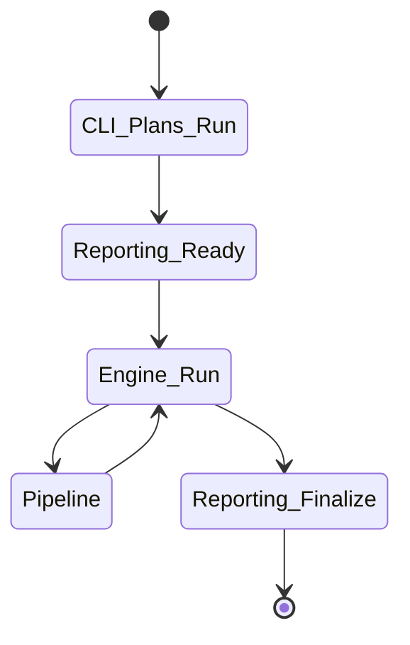
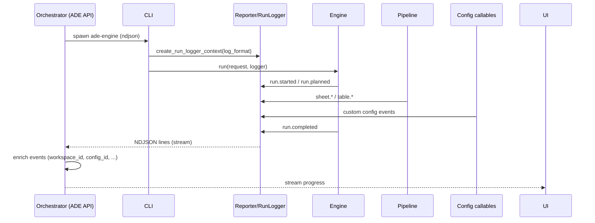

# AGENTS.md — Runtime “agents” and collaboration model

This project uses the term **agent** in the “systems” sense: a bounded component with a clear responsibility and a well-defined interface. These are **not** autonomous AI/LLM agents; they’re deterministic runtime actors that collaborate to normalize spreadsheets.

This document is a reference for how those actors interact, what messages they exchange, and how to integrate `ade-engine` into a larger system (e.g., an API that streams progress to a UI).

---

## Agent catalog

### 1) CLI Agent (`ade_engine.main`)
**Role:** Entry point for humans and automation.
- **Inputs:** CLI flags (inputs, config package, output paths, reporting mode)
- **Outputs:** exit code, optional console summary, artifacts on disk
- **Responsibilities:**
  - plan per-input runs
  - build reporting (`text` or `ndjson`)
  - keep stdout clean in NDJSON mode (redirect stray prints to stderr)

### 2) Reporting Agent (`ade_engine.logging`)
**Role:** Convert engine activity into a stream of consumable messages.
- **Inputs:** `logger.event(event, **fields)` calls and standard logging records
- **Outputs:** text lines or NDJSON objects to stdout/stderr/file
- **Responsibilities:**
  - generate timestamps
  - ensure reporting failures do not crash the engine

### 3) Engine Agent (`ade_engine.engine.Engine`)
**Role:** Orchestrate a single normalization run.
- **Inputs:** `RunRequest`, `logger`
- **Outputs:** `RunResult`, normalized workbook artifact
- **Responsibilities:**
  - path normalization and config resolution
  - error classification and stage tracking
  - run-level events (started/planned/completed)

### 4) Config Runtime Agent (`ade_engine.config.*`)
**Role:** Load and validate the configuration package.
- **Inputs:** config package reference (module or path)
- **Outputs:** `ConfigRuntime` (manifest + registries)
- **Responsibilities:**
  - validate `manifest.toml`
  - discover and validate plugin callables
  - provide stable invocation rules

### 5) Pipeline Agents (`ade_engine.pipeline.*`)
A set of stage-focused components:

- **Detector Agent (`TableDetector`)**
  - finds table regions using row detectors
- **Extractor Agent (`TableExtractor`)**
  - converts regions to an extracted table (header + rows)
- **Mapper Agent (`ColumnMapper`)**
  - maps source columns to canonical fields
- **Normalizer Agent (`TableNormalizer`)**
  - applies transforms + validators
- **Renderer Agent (`TableRenderer`)**
  - writes normalized tables to the output workbook

### 6) Hook Agent (`ade_engine.hooks.HookDispatcher`)
**Role:** Execute hook callables at lifecycle points.
- **Inputs:** lifecycle contexts (`RunContext`, `WorksheetContext`, `TableContext`)
- **Outputs:** optional `ColumnMappingPatch` from `on_table_mapped`
- **Responsibilities:** fan out calls and convert failures into `HookError`

### 7) Config Script Agents (external, in `ade_config`)
These are “user-provided agents”:
- row detector functions
- column detector functions
- transforms/validators
- hook modules

They operate under strict invocation rules:
- keyword-only parameters
- accept `**_`
- treat `logger` as their output channel

---

## Messages: logs and events

### Event stream schema

An emitted event becomes a JSON object with this general shape:

```json
{
  "timestamp": "2025-12-07T12:34:56.789Z",
  "level": "info",
  "event": "table.mapped",
  "message": "Mapped 10/12 fields",
  "data": {
    "sheet_name": "Sheet1",
    "table_index": 0,
    "mapped_fields": 10,
    "total_fields": 12
  }
}
```

Reserved (top-level) keys:
- `timestamp`, `level`, `event`, `message`
- `data` (arbitrary structured payload)
- `error` (optional, with `type`, `message`, `stack_trace`)

### Log events

Standard Python logging is converted into event name `log`:

```json
{"event":"engine.log","level":"info","message":"..."}
```

---

## Agent lifecycle

### Run lifecycle



### Collaboration / handoff



---

## Examples

### 1) Local CLI (text)

```bash
python -m ade_engine run --input ./source.xlsx
```

Produces human-friendly lines to stderr and writes `output/normalized.xlsx`.

### 2) API mode (NDJSON to stdout)

```bash
python -m ade_engine run --input ./source.xlsx --log-format ndjson \
```

Consumes as an event stream, one JSON object per line.

### 3) A config transformer that emits an event

```python
def transform(*, row_index: int, field_name: str, value: object, logger, **_):
    if field_name == "email" and value is None:
        logger.event("config.email.missing", row_index=row_index)
    return None
```

### 4) A hook that patches mapping

```python
from ade_engine.types.mapping import ColumnMappingPatch

def run(*, table_ctx, **_):
    # Force "email" to use source column 2 (0-based index 1)
    return ColumnMappingPatch(assign={"email": 1})
```

---

## Integration notes for orchestrators

If you run `ade-engine` as a subprocess:

- Prefer `--log-format ndjson` and read stdout line-by-line.
- Treat each line as a complete JSON object (no framing).
- Assume events are additive and forward-compatible (new fields may appear).
- Keep stdout clean: avoid prints in config scripts; use logger instead.
