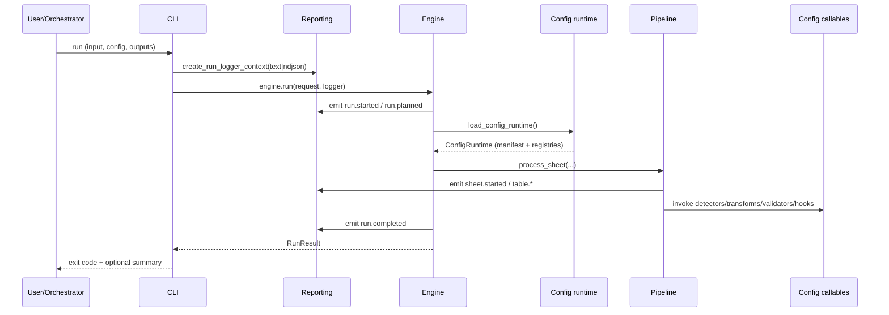

# Architecture

This document describes the main components of `ade-engine`, how they are wired, and where custom behavior plugs in.

---

## Component map

### 1) CLI (`ade_engine.main`)
- Parses CLI flags.
- Plans outputs (output workbook path, logs path).
- Builds **reporting** (`text` or `ndjson`) and injects it into the engine.
- Runs one or more inputs and summarizes results.

### 2) Engine (`ade_engine.engine.Engine`)
High-level orchestration:

- normalizes the `RunRequest`
- loads the config runtime (manifest + module registries)
- opens the source workbook and creates the output workbook
- delegates sheet/table work to the `Pipeline`
- handles error classification + final run result
- emits run-level events (`run.started`, `run.completed`, …)

### 3) Config runtime (`ade_engine.config.*`)
Responsible for loading and validating:

- `manifest.toml` → `ManifestContext` (validated via Pydantic)
- column modules (`ColumnRegistry`)
- hook modules (`HooksRuntime`)
- row detector modules (`discover_row_detectors`)

Config callables are required to be **keyword-only** and accept `**_` for forward compatibility.

### 4) Pipeline (`ade_engine.pipeline.*`)
Implements the main Workbook → Sheet → Table flow:

- `TableDetector`: find table regions on a sheet
- `TableExtractor`: slice region into header + rows
- `ColumnMapper`: match source columns to canonical fields
- `TableNormalizer`: apply transforms + validators
- `TableRenderer`: write normalized tables into output workbook

The pipeline emits stage-level events (sheet/table progress).

### 5) Reporting (`ade_engine.logging`)
Provides run-scoped structured logging:

- `RunLogger` wraps stdlib logging so every line carries an `event` (default `engine.log`) plus optional `data`. It also exposes `.event(...)` for domain events and is passed into the engine/pipeline/config runtime.

Reporting can write to:

- stdout (ndjson mode)
- stderr (text mode)
- an explicit file

---

## Data and control flow



---

## Extension points

### Config package layout

A typical config package is importable as `ade_config`:

```
ade_config/
  manifest.toml
  column_detectors/
    email.py
    first_name.py
  row_detectors/
    header.py
    data.py
  hooks/
    table_patch.py
```

### Column detector modules
For each canonical field, provide a module with:

- `detect_*` functions
- optional `transform`
- optional `validate`

### Row detectors
Row detector functions (named `detect_*`) score rows as header/data.

### Hooks
Hook modules are wired via `manifest.toml` and can run at lifecycle stages.

---

## Error handling

The engine uses a `StageTracker` to record the current stage. When an error happens:

- it is classified into a structured `RunError` (`config_error`, `input_error`, `hook_error`, `pipeline_error`, `unknown_error`)
- a `run.completed` event is emitted with stage + error details
