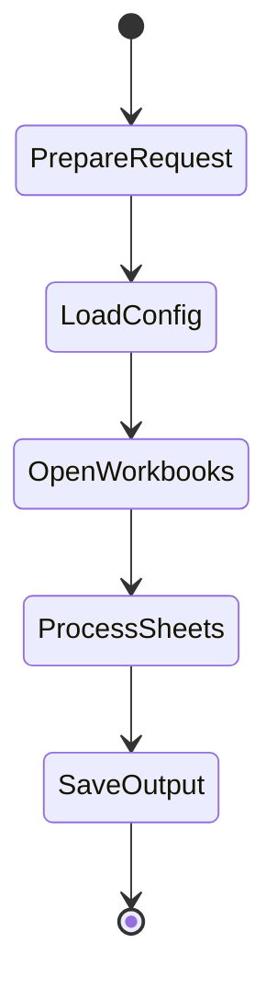
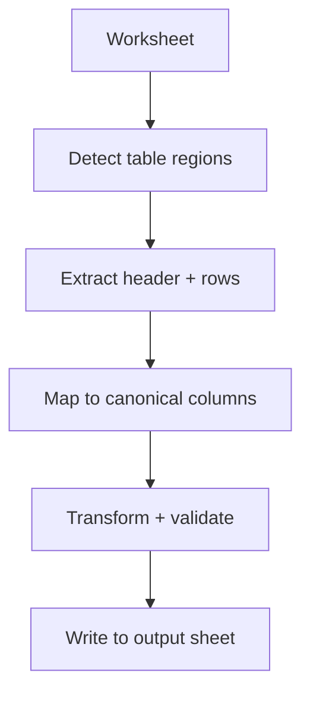

# Workflow (data flow)

This document walks through how `ade-engine` processes an input file, what each stage outputs, and how reporting works.

---

## Run lifecycle (happy path)

### 1) Prepare request
`prepare_run_request` normalizes paths and resolves the config package reference (module name or filesystem path).

Outputs:
- resolved config package + sys.path entry (if needed)
- `output_dir`, `output_file`
- optional `logs_dir`, `logs_file`

### 2) Load config
`load_config_runtime`:
- reads and validates `manifest.toml`
- loads column modules + detectors
- loads hook modules
- discovers row detectors

If `manifest.script_api_version != 3`, the run fails early with a `ConfigError`.

### 3) Open workbooks
- Source workbook is opened read-only (XLSX) or synthesized from CSV.
- Output workbook is created empty (no default sheet).

### 4) Process sheets
For each selected sheet:

### 5) Save output
The output workbook is saved to `output_file`.

---

## Table detection (row detectors)

Row detectors score each row. Each detector returns either:

- a float score (applied to its default label), or
- a dict mapping label → delta score, e.g. `{"header": 0.7}` or `{"data": 0.4}`

The default table region finder looks for:
- a row whose **header score** ≥ `HEADER_SCORE_THRESHOLD`
- followed by one or more consecutive rows whose **data score** ≥ `DATA_SCORE_THRESHOLD`

Each region becomes a `TableRegion(min_row, max_row, min_col=1, max_col=width)`.

---

## Column mapping (column detectors)

The mapper builds “column candidates” (header + values) and calls each field’s detectors.

Detector return values:

- `float`: score contribution for the module’s default field
- `dict`: score contributions for one or more fields
  - may be wrapped as `{"scores": {...}}` for compatibility

The mapper aggregates scores, then chooses the best candidate ≥ `MAPPING_SCORE_THRESHOLD` for each canonical field.

Unmapped columns can be preserved as passthrough columns if `writer.append_unmapped_columns = true`.

---

## Normalization

For each extracted data row:

1. **Canonical row build:** assign raw values into canonical fields based on mapping.
2. **Transforms:** per-field `transform(...)` may update one or more fields.
3. **Validation:** per-field `validate(...)` returns issue dicts.

The output is:
- `NormalizedTable.rows` (canonical values + passthrough values)
- `NormalizedTable.issues` (structured issues with severity, code, message)

---

## Reporting and events

The engine and pipeline emit structured events via `events.emit(...)`.

In NDJSON mode, each call becomes one JSON object on stdout (or a log file). In text mode, they are rendered into readable lines.

Common event names:
- `run.started`, `run.planned`, `config.loaded`, `workbook.started`, `run.completed`
- `sheet.started`, `sheet.tables_detected`
- `table.detected`, `table.extracted`, `table.mapped`, `table.mapping_patched`, `table.normalized`, `table.written`

See `docs/api.md` and `AGENTS.md` for the event schema and examples.
