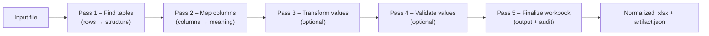

# Logical module layout (source -> sections below):
# - .dockerignore - Git metadata
# - .github/workflows/ci.yml
# - .github/workflows/release.yml
# - Dockerfile - syntax=docker/dockerfile:1.6
# - README.md - ADE — Automatic Data Extractor
# - compose.yaml
# - setup.sh

# .dockerignore
```
# Git metadata
.git
.github

# Python artifacts
__pycache__/
*.py[cod]
*.egg-info/
.venv/
.mypy_cache/
.pytest_cache/

# Node artifacts
node_modules/
npm-debug.log*
yarn-error.log*
.pnpm-store/

# Build outputs
dist/
build/
apps/ade-web/dist/
frontend/build/
artifacts/
data/
.workpackage/
.old-codebase/

# Env files
.env
.env.*
frontend/.env*
apps/ade-web/.env*
```

# .github/workflows/ci.yml
```yaml
name: ci

on:
  push:
    branches:
      - main
  pull_request:
    branches:
      - main

env:
  REGISTRY: ghcr.io
  IMAGE_NAME: clac-ca/automatic-data-extractor

permissions:
  contents: read
  packages: write

runs:
  test-and-build:
    runs-on: ubuntu-latest
    steps:
      - name: Checkout repository
        uses: actions/checkout@v4

      - name: Set up Python
        uses: actions/setup-python@v5
        with:
          python-version: "3.14"
          cache: pip
          cache-dependency-path: |
            apps/ade-cli/pyproject.toml
            apps/ade-api/pyproject.toml
            apps/ade-engine/pyproject.toml

      - name: Set up Node.js
        uses: actions/setup-node@v4
        with:
          node-version: 20
          cache: npm
          cache-dependency-path: apps/ade-web/package-lock.json

      - name: Install frontend dependencies
        run: npm ci
        working-directory: apps/ade-web

      - name: Install ade CLI
        run: |
          python -m pip install -U pip
          python -m pip install -e apps/ade-cli -e apps/ade-engine -e apps/ade-api
          python -m pip install ruff==0.14.7 pytest==9.0.1 pytest-asyncio==1.3.0 pytest-cov==7.0.0 asgi-lifespan==2.1.0 openapi-spec-validator==0.7.2

      - name: Run repo CI (lint, test, build)
        run: ade ci

      - name: Set up QEMU
        uses: docker/setup-qemu-action@v3

      - name: Set up Docker Buildx
        uses: docker/setup-buildx-action@v3

      - name: Log in to GHCR
        if: github.event_name == 'push' && github.ref == 'refs/heads/main'
        uses: docker/login-action@v3
        with:
          registry: ${{ env.REGISTRY }}
          username: ${{ github.actor }}
          password: ${{ secrets.GITHUB_TOKEN }}

      - name: Build (and optionally push) image
        uses: docker/build-push-action@v6
        with:
          context: .
          file: ./Dockerfile
          push: ${{ github.event_name == 'push' && github.ref == 'refs/heads/main' }}
          tags: |
            ${{ env.REGISTRY }}/${{ env.IMAGE_NAME }}:sha-${{ github.sha }}
            ${{ env.REGISTRY }}/${{ env.IMAGE_NAME }}:latest
          cache-from: type=gha
          cache-to: type=gha,mode=max
```

# .github/workflows/release.yml
```yaml
name: release

on:
  push:
    branches:
      - main

concurrency:
  group: release-${{ github.ref }}
  cancel-in-progress: true

permissions:
  contents: write
  packages: write

env:
  REGISTRY: ghcr.io
  IMAGE_NAME: clac-ca/automatic-data-extractor

runs:
  changelog-release:
    name: changelog-release
    runs-on: ubuntu-latest
    steps:
      - name: Checkout
        uses: actions/checkout@v4
        with:
          fetch-depth: 0

      - name: Set up Python 3.14
        uses: actions/setup-python@v5
        with:
          python-version: '3.14'

      - name: Determine project version
        id: versions
        run: |
          python <<'PY'
          from __future__ import annotations

          import os
          import re
          import subprocess
          import tomllib

          SEMVER_RE = re.compile(
              r"^(0|[1-9]\d*)\.(0|[1-9]\d*)\.(0|[1-9]\d*)"
              r"(?:-([0-9A-Za-z-]+(?:\.[0-9A-Za-z-]+)*))?"
              r"(?:\+([0-9A-Za-z-]+(?:\.[0-9A-Za-z-]+)*))?$"
          )

          TARGET_FILE = "apps/ade-api/pyproject.toml"

          def version_for_ref(ref: str) -> str:
              try:
                  output = subprocess.check_output(
                      ["git", "show", f"{ref}:{TARGET_FILE}"],
                      text=True,
                  )
              except subprocess.CalledProcessError:
                  return ""

              data = tomllib.loads(output)
              return data.get("project", {}).get("version", "")

          current = version_for_ref("HEAD")
          is_semver = "true" if current and SEMVER_RE.fullmatch(current) else "false"

          tag = f"v{current}" if current else ""
          try:
              subprocess.check_call(["git", "rev-parse", "--verify", tag], stdout=subprocess.DEVNULL, stderr=subprocess.DEVNULL)
          except subprocess.CalledProcessError:
              tag_exists = "false"
          else:
              tag_exists = "true"

          outputs = {
              "version": current,
              "is_semver": is_semver,
              "tag": tag,
              "tag_exists": tag_exists,
          }

          with open(os.environ["GITHUB_OUTPUT"], "a", encoding="utf-8") as fh:
              for key, value in outputs.items():
                  fh.write(f"{key}={value}\n")
          PY

      - name: Extract changelog entry
        id: changelog
        if: steps.versions.outputs.is_semver == 'true' && steps.versions.outputs.tag_exists == 'false'
        env:
          RELEASE_TAG: ${{ steps.versions.outputs.tag }}
        run: |
          python <<'PY'
          from __future__ import annotations

          import os
          import re
          from pathlib import Path

          changelog_path = Path("CHANGELOG.md")
          if not changelog_path.is_file():
              raise SystemExit("CHANGELOG.md is required to publish release notes")

          tag = os.environ["RELEASE_TAG"]
          changelog = changelog_path.read_text(encoding="utf-8")

          pattern = re.compile(rf"## \[{re.escape(tag)}\] - [^\n]+\n(?P<body>.*?)(?=\n## \[|$)", re.S)
          match = pattern.search(changelog)
          if not match:
              raise SystemExit(f"Unable to find changelog entry for {tag}")

          notes = match.group("body").strip() or "_No notable changes._"

          output_path = Path("release-notes.md")
          output_path.write_text(notes + "\n", encoding="utf-8")

          with open(os.environ["GITHUB_OUTPUT"], "a", encoding="utf-8") as fh:
              fh.write("notes<<EOF\n")
              fh.write(notes)
              fh.write("\nEOF\n")
          PY

      - name: Create GitHub release
        if: steps.versions.outputs.is_semver == 'true' && steps.versions.outputs.tag_exists == 'false'
        uses: softprops/action-gh-release@v2
        with:
          tag_name: ${{ steps.versions.outputs.tag }}
          name: ${{ steps.versions.outputs.tag }}
          body: ${{ steps.changelog.outputs.notes }}
          draft: false
          prerelease: false

      - name: Summarize release
        if: steps.versions.outputs.is_semver == 'true' && steps.versions.outputs.tag_exists == 'false'
        run: |
          {
            echo "## Release" >> "$GITHUB_STEP_SUMMARY";
            echo "- Tag: ${{ steps.versions.outputs.tag }}" >> "$GITHUB_STEP_SUMMARY";
          }

      - name: Set up QEMU
        if: steps.versions.outputs.is_semver == 'true' && steps.versions.outputs.tag_exists == 'false'
        uses: docker/setup-qemu-action@v3

      - name: Set up Docker Buildx
        if: steps.versions.outputs.is_semver == 'true' && steps.versions.outputs.tag_exists == 'false'
        uses: docker/setup-buildx-action@v3

      - name: Log in to GHCR
        if: steps.versions.outputs.is_semver == 'true' && steps.versions.outputs.tag_exists == 'false'
        uses: docker/login-action@v3
        with:
          registry: ${{ env.REGISTRY }}
          username: ${{ github.actor }}
          password: ${{ secrets.GITHUB_TOKEN }}

      - name: Build and publish release image
        if: steps.versions.outputs.is_semver == 'true' && steps.versions.outputs.tag_exists == 'false'
        uses: docker/build-push-action@v6
        with:
          context: .
          file: ./Dockerfile
          push: true
          tags: |
            ${{ env.REGISTRY }}/${{ env.IMAGE_NAME }}:${{ steps.versions.outputs.version }}
            ${{ env.REGISTRY }}/${{ env.IMAGE_NAME }}:latest
          cache-from: type=gha
          cache-to: type=gha,mode=max
```

# Dockerfile
```
# syntax=docker/dockerfile:1.6

ARG PYTHON_VERSION=3.14
ARG NODE_VERSION=20

# -----------------------------------------------------------------------------
# Stage 1: Build frontend (Vite SPA)
# -----------------------------------------------------------------------------
FROM node:${NODE_VERSION}-alpine AS web-build
WORKDIR /app

# Install frontend dependencies using only package manifests (better caching)
COPY apps/ade-web/package*.json apps/ade-web/
RUN npm ci --prefix apps/ade-web --no-audit --no-fund

# Copy source and telemetry schemas needed at build time
COPY apps/ade-web apps/ade-web
COPY apps/ade-engine/src/ade_engine/schemas apps/ade-engine/src/ade_engine/schemas

# Build production SPA bundle
RUN npm run build --prefix apps/ade-web

# -----------------------------------------------------------------------------
# Stage 2: Build backend / Python packages
# -----------------------------------------------------------------------------
FROM python:${PYTHON_VERSION}-slim AS backend-build

ENV PYTHONDONTWRITEBYTECODE=1 \
    PYTHONUNBUFFERED=1 \
    PIP_DISABLE_PIP_VERSION_CHECK=on

WORKDIR /app

# System deps to compile any native extensions during pip install
RUN apt-get update \
    && apt-get install -y --no-install-recommends build-essential git \
    && rm -rf /var/lib/apt/lists/*

# Copy minimal metadata first for better caching
COPY README.md ./ \
     apps/ade-cli/pyproject.toml    apps/ade-cli/ \
     apps/ade-engine/pyproject.toml apps/ade-engine/ \
     apps/ade-api/pyproject.toml    apps/ade-api/

# Now copy the full apps tree
COPY apps ./apps

# Install CLI, engine, and API into /install so we can copy into runtime
RUN python -m pip install -U pip \
    && pip install --no-cache-dir --prefix=/install \
        ./apps/ade-cli \
        ./apps/ade-engine \
        ./apps/ade-api

# -----------------------------------------------------------------------------
# Stage 3: Runtime image
# -----------------------------------------------------------------------------
FROM python:${PYTHON_VERSION}-slim

ENV PYTHONDONTWRITEBYTECODE=1 \
    PYTHONUNBUFFERED=1 \
    PYTHONPATH=/app \
    API_ROOT=/app/apps/ade-api \
    ALEMBIC_INI_PATH=/app/apps/ade-api/alembic.ini \
    ALEMBIC_MIGRATIONS_DIR=/app/apps/ade-api/migrations

WORKDIR /app

LABEL org.opencontainers.image.title="automatic-data-extractor" \
      org.opencontainers.image.description="ADE — Automatic Data Extractor" \
      org.opencontainers.image.source="https://github.com/clac-ca/automatic-data-extractor"

# Copy installed packages and console scripts from the build stage
COPY --from=backend-build /install /usr/local

# Copy source tree for Alembic configs, migrations, templates, etc.
COPY apps ./apps

# Copy built SPA into the API's static assets directory
COPY --from=web-build /app/apps/ade-web/dist ./apps/ade-api/src/ade_api/web/static

# Create dedicated user and data directory, then fix ownership
RUN groupadd -r ade && useradd -r -g ade ade \
    && mkdir -p /app/data/db /app/data/documents \
    && chown -R ade:ade /app

VOLUME ["/app/data"]
EXPOSE 8000

USER ade

CMD ["uvicorn", "ade_api.main:create_app", "--factory", "--host", "0.0.0.0", "--port", "8000"]
```

# README.md
```markdown
# ADE — Automatic Data Extractor

[](https://github.com/clac-ca/automatic-data-extractor/actions/workflows/ci.yml)
[](https://github.com/clac-ca/automatic-data-extractor/actions/workflows/release.yml)

ADE turns messy spreadsheets into consistent, auditable workbooks. It detects tables/columns, applies your rules, and produces normalized Excel files with a full audit trail.

## Monorepo overview

* **Frontend** — React (Vite) SPA for configs, builds, and runs.
* **Backend** — FastAPI service for metadata, builds, and orchestration.
* **Engine** — `ade_engine` package that executes detectors/hooks.
* **Config packages** — Your installable `ade_config` projects (versioned per workspace).

## How it works (at a glance)



Under the hood, each run executes your **ADE Config** (detectors, transforms, validators, hooks) inside a dedicated virtual environment alongside the **ADE Engine** runtime. Results and logs are written atomically per run.


<details>
<summary><strong>Repository layout</strong></summary>

```
automatic-data-extractor/
├─ apps/
│  ├─ ade-api/            # FastAPI service (serves /api + static SPA)
│  │  ├─ pyproject.toml
│  │  ├─ src/ade_api/     # Backend package
│  │  ├─ migrations/
│  │  └─ tests/
│  └─ ade-web/            # React (Vite) SPA
│     ├─ package.json
│     └─ src/…
├─ packages/
│  └─ ade-engine/         # Runtime: ade_engine (bundled manifest + telemetry schemas)
├─ tools/
│  └─ ade-cli/            # Python orchestration CLI (console script: ade)
├─ examples/              # Sample inputs/outputs
├─ docs/                  # Developer guide, HOWTOs, runbooks
├─ infra/                 # Deployment bits (Docker, compose)
├─ scripts/               # Helper scripts (legacy or ad hoc)
└─ .env.example           # Documented env vars
```

</details>

Bundled ADE config templates now live under `apps/ade-api/src/ade_api/templates/config_packages/` inside the backend package.

Everything ADE produces (documents, configs, venvs, runs, cache, …) lands under `./data/workspaces/<workspace_id>/...` by default. Use `ADE_WORKSPACES_DIR` to move the workspace root, or override `ADE_DOCUMENTS_DIR`, `ADE_CONFIGS_DIR`, `ADE_VENVS_DIR`, or `ADE_RUNS_DIR` to place a specific storage type elsewhere—ADE always nests the workspace ID under the override.

---

## Getting started

### Option 1 — Docker (recommended)

**Prereqs:** Docker & Docker Compose.

```bash
git clone https://github.com/clac-ca/automatic-data-extractor.git
cd automatic-data-extractor
cp .env.example .env

# Start the stack (API + built SPA)
docker compose up --build
```

Then:

1. Open **[http://localhost:8000](http://localhost:8000)**
2. Create a workspace and a **Config Package** (start from the “Default” template)
3. Click **Build**
4. Upload a sample file (see `examples/`) and **Run** a run
5. Download `output.xlsx` and inspect `logs/artifact.json`

> Each built config has its own frozen virtualenv to keep runs reproducible.

#### Using the published image

```bash
docker pull ghcr.io/clac-ca/automatic-data-extractor:latest
mkdir -p data
docker run -d \
  --name ade \
  -p 8000:8000 \
  -v "$(pwd)/data:/app/data" \
  --env-file .env \
  ghcr.io/clac-ca/automatic-data-extractor:latest
```

---

### Option 2 — Local development (API + Web)

**Prereqs:** Python 3.x, Node.js (latest LTS).

#### macOS / Linux

```bash
# Clone the repository
git clone https://github.com/clac-ca/automatic-data-extractor.git
cd automatic-data-extractor

# Create a local .env file (edit as needed)
cp .env.example .env

# Create and activate a virtual environment
python3 -m venv .venv
source .venv/bin/activate

# Upgrade packaging tools (recommended for editable installs)
pip install -U pip setuptools wheel

# Install ADE backend components in editable mode
pip install -e apps/ade-cli       # ADE CLI (console entrypoint: `ade`)
pip install -e apps/ade-engine
pip install -e apps/ade-api

# Install frontend dependencies
(cd apps/ade-web && npm install)

# Quick verification (shows CLI help)
ade --help

# Start backend + frontend dev servers (FastAPI + Vite)
ade dev
```

Notes:

* API: **[http://localhost:8000](http://localhost:8000)**
* Web: **[http://localhost:5173](http://localhost:5173)**
  (set `VITE_API_URL=http://localhost:8000` in `apps/ade-web/.env.local` if needed)
* `./setup.sh` is safe to re-run; it will reuse `.venv` and update dependencies.

#### Windows (PowerShell)

```powershell
git clone https://github.com/clac-ca/automatic-data-extractor.git
cd automatic-data-extractor
copy .env.example .env

python -m venv .venv
.\.venv\Scripts\Activate.ps1

pip install -U pip setuptools wheel
pip install -e tools/ade-cli
pip install -e packages/ade-engine
pip install -e apps/ade-api

cd apps/ade-web
npm install
cd ../..
ade dev
```

Additional `ade` commands:

* `ade dev --backend-only` / `--frontend-only` — run a single surface
* `ade build` — build the frontend and copy it into `ade-api` static assets
* `ade start` — run the backend using the built SPA
* `ade docker up|logs|down` — manage Docker stack (no venv required, just Docker)

---

## Concepts in the UI

* **Config package (`ade_config`)** — Python package with detectors, transforms, validators, hooks.
* **Build** — creates a dedicated virtualenv per config and installs `ade_engine` + your `ade_config` (+ deps).
* **Run** — processes inputs using that frozen environment and writes `output.xlsx` + `artifact.json`.

Config packages are versioned so you can draft, test, roll back, and extend safely.

---

## Configuration & environment

ADE is configured via environment variables; defaults work for local dev.

<details>
<summary><strong>Common variables</strong></summary>

| Variable                  | Default                  | Purpose                                                   |
| ------------------------- | ------------------------ | --------------------------------------------------------- |
| `ADE_WORKSPACES_DIR`      | `./data/workspaces`      | Workspace root for ADE storage                            |
| `ADE_DOCUMENTS_DIR`       | `./data/workspaces`      | Base for documents (`<ws>/documents/...`)                 |
| `ADE_CONFIGS_DIR`         | `./data/workspaces`      | Base for configs (`<ws>/config_packages/...`)             |
| `ADE_VENVS_DIR`           | `./data/workspaces`      | Base for venvs (`<ws>/.venv/<cfg>/<id>/...`)              |
| `ADE_RUNS_DIR`            | `./data/workspaces`      | Per-run working directories (`<ws>/runs/<run_id>/...`)    |
| `ADE_PIP_CACHE_DIR`       | `./data/cache/pip`       | pip download/build cache                                  |
| `ADE_SAFE_MODE`           | `false`                  | Skip engine execution while runs API returns safe-mode    |
| `ADE_MAX_CONCURRENCY`     | `2`                      | Backend dispatcher parallelism                            |
| `ADE_QUEUE_SIZE`          | `10`                     | Back-pressure threshold before HTTP 429                   |
| `ADE_RUN_TIMEOUT_SECONDS` | `300`                    | Wall-clock timeout per worker                             |
| `ADE_WORKER_CPU_SECONDS`  | `60`                     | Best-effort CPU limit per run (POSIX rlimit)              |
| `ADE_WORKER_MEM_MB`       | `512`                    | Best-effort address-space ceiling per run (POSIX rlimit)  |
| `ADE_WORKER_FSIZE_MB`     | `100`                    | Best-effort max file size a run may create (POSIX rlimit) |

</details>

Input formats: `.xlsx`, `.csv`.
Output: normalized `.xlsx` (Excel via `openpyxl`, CSV via stdlib).

---

## Learn more

* **Config Packages** — `docs/01-config-packages.md`
* **Run Orchestration** — `docs/02-run-orchestration.md`
* **Artifact Reference** — `docs/14-run_artifact_json.md`
* **Glossary** — `docs/12-glossary.md`

---

## CI & releases

* `ci.yml` — installs editable packages, runs `ade ci` (OpenAPI, lint, test, build), and builds the Docker image. Pushes to `main` publish `ghcr.io/clac-ca/automatic-data-extractor:latest` + commit-sha tags.
* `release.yml` — reads version from `apps/ade-api/pyproject.toml`, pulls the changelog entry, creates a GitHub release, and publishes versioned images (e.g. `:0.1.0` + `:latest`).

Pull a specific image:

```bash
docker pull ghcr.io/clac-ca/automatic-data-extractor:<tag>
```

---

## Contributing

PRs and issues are welcome. Please run linters/tests via the `ade` CLI (and mirror the CI steps in `.github/workflows/`) before opening a PR.

---

## License

Released under **TBD** — see [LICENSE](LICENSE).
```

# compose.yaml
```yaml
services:
  ade:
    image: ghcr.io/clac-ca/automatic-data-extractor:local
    build:
      context: .
      dockerfile: ./Dockerfile
    container_name: ade
    env_file:
      - .env
    ports:
      - "8000:8000"
    volumes:
      - ./data:/app/data
    restart: unless-stopped

# Uncomment to use a named volume instead of a bind mount
# volumes:
#   ade-data:
```

# setup.sh
```bash
#!/usr/bin/env bash
set -euo pipefail

# Create and activate virtual environment
python3 -m venv .venv
source .venv/bin/activate

# Install backend packages
pip install -U pip setuptools wheel
pip install -e apps/ade-cli
pip install -e apps/ade-engine
pip install -e apps/ade-api

# Install frontend dependencies
(cd apps/ade-web && npm install)

# Verify CLI
ade --help
```
