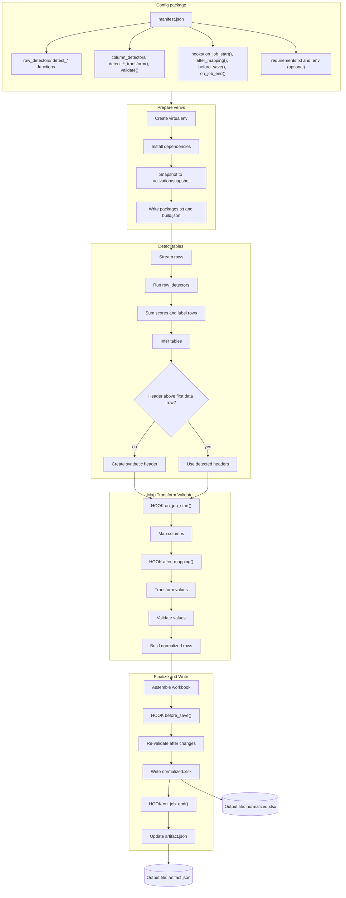

# What a config package is (and where things live)

A **config package** is a small folder that tells ADE *how to read* a messy spreadsheet. It contains:

```
${ADE_DATA_DIR}/
├─ config_packages/
│   └─ <config_id>/
│       ├─ manifest.json              # Manifest v1.0 (required)
│       ├─ requirements.txt           # Optional (pinned) dependencies
│       ├─ .env                       # Optional environment variables imported in venvs
│       ├─ row_detectors/
│       │   ├─ header.py              # row detector functions (detect_*)
│       │   └─ data.py                # row detector functions (detect_*)
│       ├─ column_detectors/
│       │   ├─ sin_number.py          # column detector functions (detect_*), optional transform/validate
│       │   ├─ member_id.py
│       │   └─ employee_number.py
│       ├─ hooks/
│       │  ├─ on_job_start.py         # def run(*, job, **_): ...
│       │  ├─ after_mapping.py        # def after_mapping(*, job, table, **_): ...
│       │  ├─ before_save.py          # def before_save(*, job, book, **_): ...
│       │  └─ on_job_end.py           # def run(*, job, **_): ...
```

When you **prepare** a config, ADE freezes this folder into a **read-only snapshot** inside its own versioned virtual environment (`venvs/<config_id>/activation/snapshot/`).
Every job that uses this config imports from that snapshot—not from your working directory—ensuring deterministic behavior and reproducible results.

> **In practice:**
> You author and test configs in the ADE UI. Each save creates a new internal version you can test safely.
> You can export configs as folders for review or source control, import them into other workspaces, and promote a validated version to production.
> ADE automatically keeps historical versions available, so any past job can always reference the exact rules that generated its output.


Below is a shorter, more approachable walk‑through you can drop into `docs/developers/01-config-packages.md`. It explains the flow in plain sentences, then uses small examples to make each idea stick. After each example, we build on what you’ve learned.

---

## How ADE reads spreadsheets and calls your detectors

ADE opens Excel files with **OpenPyXL** in streaming mode:

```python
import openpyxl
wb = openpyxl.load_workbook(path, read_only=True, data_only=True)
ws = wb["Sheet1"]
for row in ws.iter_rows(values_only=True):
    ...  # row is a tuple of plain Python values
```

ADE passes each row’s **values** (not cell objects) to your **row detectors**. Each detector returns tiny score hints like `{"header": +0.6}` or `{"data": -0.2}`. ADE **adds** the hints from all detectors and labels the row with the highest total.

If a spreadsheet starts with data before any header, ADE simply inserts synthetic column names (`column_1`, `column_2`, …) so that the rest of the process can keep running consistently.

### Row detectors (Pass 1)

**Call signature (all arguments shown):**

```python
def detect_*(
    *,
    job_id: str,                 # "job_01HF3M8J6ZK9WQ5R2N3S7A"
    source_file: str,            # "employees.xlsx"
    sheet_name: str,             # "Roster"
    row_index: int,              # 1-based index in the sheet (1 = top row)
    row_values_sample: list,     # e.g., ["SIN", "Member No.", "Employee ID", "Full Name"]
    manifest: dict,              # parsed manifest.json; policy defaults live here
    env: dict | None,            # {"LOCALE": "en-CA", "TZ": "America/Toronto"} (optional)
    artifact: dict,              # read-only snapshot so far (labels, notes, scratch)
    **_                          # MUST accept extra kwargs for forward compat
) -> dict:
    """
    Return shape:
      {"scores": {"header": float, "data": float, "separator": float}}
    Include only non-zero entries. Keep deltas in [-1.0, +1.0].
    """
```

**Two tiny row detector examples:**

```python
# row_detectors/header.py
def detect_header_by_text_density(*, row_values_sample, **_):
    cells = [c for c in row_values_sample if c not in (None, "")]
    if not cells:
        return {"scores": {"separator": 0.3}}      # empty-ish row gently separates blocks
    ratio = sum(isinstance(c, str) for c in cells) / len(cells)
    return {"scores": {"header": 0.6}} if ratio >= 0.7 else {"scores": {}}
```

```python
# row_detectors/data.py
def detect_data_by_numeric_density(*, row_values_sample, **_):
    nums = sum(str(c).strip().isdigit() for c in row_values_sample if c not in (None, ""))
    return {"scores": {"data": 0.6}} if nums >= 2 else {"scores": {}}
```

---

### Column Detectors (Pass 2)

After ADE has identified the tables in a sheet, it looks at each **column** and asks a simple question: *“Which field in the manifest does this column represent?”* Your **column detectors** are responsible for answering that question.

Each column detector examines the column’s header text and a small sample of its values. It returns score deltas for one or more possible target fields. ADE adds these deltas together — small pieces of positive and negative evidence — and assigns the column to the field with the highest total score, provided it passes a configurable confidence threshold.

This system works because it’s additive. Instead of one rule deciding everything, many small detectors contribute weak hints that add up to a strong decision. A single detector can also improve accuracy by *boosting* the right field and *deflating* similar but incorrect ones. For example, a SIN detector can raise the score for `sin` while slightly lowering it for `member_id` and `employee_number`. This reduces false positives without extra code.

**Call signature (all arguments shown):**

```python
def detect_*(
    *,
    job_id: str,                 # "job_01HF3M8J6ZK9WQ5R2N3S7A"
    source_file: str,            # "employees.xlsx"
    sheet_name: str,             # "Roster"
    table_id: str,               # "table_1" (ADE's id inside the sheet)
    column_index: int,           # 1-based within the table, e.g., 3
    header: str | None,          # normalized header, e.g., "SIN" or None
    values_sample: list,         # small sample, e.g., ["046 454 286", "123 456 789", None]
    field_name: str,             # the field this file owns, e.g., "sin"
    field_meta: dict,            # manifest.columns.meta[field_name]
    manifest: dict,              # entire manifest
    env: dict | None,            # {"LOCALE": "en-CA"} (optional)
    artifact: dict,              # read-only artifact snapshot
    **_
) -> dict:
    """
    Return shape:
      {"scores": {"<field_id>": float, "<other_field_id>": float, ...}}
    You may score multiple fields (positive and negative). Unknown ids are ignored.
    Keep deltas in [-1.0, +1.0].
    """
```

**Example — SIN (boost true matches, deflate lookalikes):**

```python
# column_detectors/sin_number.py
import re
NINE_DIGITS = re.compile(r"^\D*(?:\d\D*){9}$")

def detect_header_synonyms(*, header: str | None, field_meta: dict, **_):
    if not header: return {"scores": {}}
    h = header.lower()
    bump = sum(0.6 for syn in (field_meta.get("synonyms") or []) if syn.lower() in h)
    return {"scores": {"sin": min(1.0, bump)}} if bump else {"scores": {}}

def detect_value_shape_9_digits(*, values_sample: list, **_):
    if not values_sample: return {"scores": {}}
    hits = sum(bool(NINE_DIGITS.match(str(v))) for v in values_sample if v not in (None, ""))
    ratio = hits / max(1, len(values_sample))
    if ratio == 0: return {"scores": {}}
    scores = {"sin": round(min(0.7, 0.7 * ratio), 3)}  # positive for SIN
    if ratio > 0.6:
        scores["member_id"] = -0.3                    # gently deflate near‑miss fields
        scores["employee_number"] = -0.2
    return {"scores": scores}
```

> **Calibration:** keep per‑rule deltas in **[-1.0, +1.0]** so several weak hints can add up. Use the manifest’s `mapping_score_threshold` to avoid low‑confidence auto‑maps.

---

### Transform and validate (Pass 3 & 4)

Once each column has been mapped to a manifest field, ADE gives your code the full column of values for that field. At this stage, two kinds of functions come into play: **transform** and **validate**.

The transform step is about *cleaning*. You might strip whitespace, remove punctuation, normalize case, or convert dates — anything that makes the data consistent. Your transform function returns the same number of values it received, so the output stays aligned with the original rows.

Next comes validation. Validators don’t fix data; they check it. They look at the cleaned values and return structured “issues” that describe what’s wrong: missing required fields, invalid formats, duplicates, or inconsistencies. ADE records those issues in the artifact so that you can see exactly which rows failed and why. By separating transformation (fixing) from validation (checking), ADE keeps each step simple, predictable, and testable.

### Transform (Pass 3) — full signature and example

**Call signature (all arguments shown):**

```python
def transform(
    *,
    job_id: str,                 # "job_01HF3M8J6ZK9WQ5R2N3S7A"
    source_file: str,            # "employees.xlsx"
    sheet_name: str,             # "Roster"
    table_id: str,               # "table_1"
    column_index: int,           # raw column index (1-based) within the table
    header: str | None,          # normalized header (or None)
    values: list,                # full column values in table row order
    field_name: str,             # e.g., "sin"
    field_meta: dict,            # manifest.columns.meta[field_name]
    manifest: dict,              # entire manifest
    env: dict | None,            # {"LOCALE": "en-CA"} (optional)
    artifact: dict,              # read-only artifact snapshot
    **_
) -> dict:
    """
    Return shape:
      {"values": list, "warnings": list[str]}
    'values' must be the same length as input 'values'.
    """
```

**Example — normalize to 9 digits or None:**

```python
def transform(*, values, **_):
    out, changed = [], False
    for v in values:
        if v is None or str(v).strip() == "":
            out.append(None); continue
        digits = "".join(ch for ch in str(v) if ch.isdigit())
        changed |= digits != str(v)
        out.append(digits if len(digits) == 9 else None)
    return {"values": out, "warnings": ["normalized to 9 digits"] if changed else []}
```

### Validate (Pass 4) — full signature and example

```python
def validate(
    *,
    job_id: str,                 # "job_01HF3M8J6ZK9WQ5R2N3S7A"
    source_file: str,            # "employees.xlsx"
    sheet_name: str,             # "Roster"
    table_id: str,               # "table_1"
    column_index: int,           # raw column index (1-based)
    header: str | None,          # normalized header text
    values: list,                # post-transform values aligned to table rows
    field_name: str,             # e.g., "sin"
    field_meta: dict,            # manifest.columns.meta[field_name]
    manifest: dict,              # entire manifest
    env: dict | None,            # {"LOCALE": "en-CA"} (optional)
    artifact: dict,              # read-only artifact snapshot
    **_
) -> dict:
    """
    Return shape:
      {"issues": [
        {"row_index": int, "code": "str",
         "severity": "error" | "warning" | "info",
         "message": "human description"},
        ...
      ]}
    'row_index' is 1-based within this table.
    """
```

**Example — required + shape guard:**

```python
def validate(*, values, field_name, field_meta, **_):
    issues = []
    required = bool(field_meta.get("required", False))
    for i, v in enumerate(values, start=1):
        if not v and required:
            issues.append({"row_index": i, "code": "required_missing", "severity": "error",
                           "message": f"{field_name} is required."})
        elif v and (len(v) != 9 or not v.isdigit()):
            issues.append({"row_index": i, "code": "invalid_format", "severity": "warning",
                           "message": f"{field_name} should be 9 digits."})
    return {"issues": issues}
```

---

## Writing the workbook (and `before_save`)

After transformation and validation are complete, ADE rebuilds everything into a clean, normalized workbook. It does this using a real **OpenPyXL `Workbook`**, created inside the job’s virtual environment with your pinned dependencies.

Before ADE saves the file, it calls your **`before_save(job, workbook)`** hook. This hook gives you the exact workbook object OpenPyXL uses to write the Excel file. You can rename the sheet, freeze the header, set column widths, add an “Issues” tab, or include a summary page. Because you’re working with the real object, you can use the official OpenPyXL API directly — there’s no wrapper layer or special syntax.

When your hook finishes, ADE saves the workbook as `normalized.xlsx` and notes the changes in the artifact. This is the final, human-readable output of your config package: a single, consistent file with clean data and a clear audit trail of what happened along the way.

**Call signature (objects and helpers shown):**

```python
# hooks/before_save.py
from openpyxl.workbook.workbook import Workbook

def before_save(
    *,
    job,                          # Tiny helper with:
                                  #   job.job_id       -> "job_01HF..."
                                  #   job.file_name    -> "employees.xlsx"
                                  #   job.manifest     -> parsed manifest
                                  #   job.env          -> dict from manifest["env"] + .env
                                  #   job.state        -> small dict (scratch) you set in hooks
                                  #   job.set(**kv)    -> merge {**kv} into job.state
                                  #   job.get(key, d)  -> read from job.state with default
                                  #   job.note(str)    -> append short audit note
    workbook: Workbook,           # The real openpyxl Workbook (in the venv)
    **_
) -> None:
    ...
```

**Example — rename tab, freeze header, set widths, add Issues sheet:**

```python
from openpyxl.utils import get_column_letter

def before_save(*, job, workbook, **_):
    ws = workbook["Normalized"]

    # Put version in the tab title
    title = job.manifest["info"]["title"]; ver = job.manifest["info"]["version"]
    ws.title = f"{title} v{ver}"

    # Freeze header and set a few widths
    ws.freeze_panes = "A2"
    for c, w in {1: 14, 2: 24, 3: 20}.items():
        ws.column_dimensions[get_column_letter(c)].width = w

    # Optional: add an Issues sheet from the artifact
    issues = workbook.create_sheet("Issues")
    issues.append(["Sheet","Table","Row","Field","Severity","Code","Message"])
    for row in _collect_issues(job):  # your helper that reads the artifact
        issues.append(row)

    job.note("Customized workbook: renamed tab, froze header, added Issues.")
```

---

## Hooks — why they exist and how they work

Hooks are small, intentional places to adjust a run without re‑writing the engine. They all run **inside the prepared venv** (same sandbox as your rules; CPU/memory/file caps; network off by default). Each hook receives rich objects where it’s helpful so you don’t learn a new façade.

* **`on_job_start(job)`** runs first. Use it to set tiny state your detectors can read later (ADE mirrors it into the artifact).
* **`after_mapping(job, table)`** runs once per table after columns are mapped. Fix edge cases, reorder output fields, decide whether to append `raw_*` columns.
* **`before_save(job, workbook)`** runs once at the end. Make the file look the way you want with OpenPyXL.
* **`on_job_end(job)`** runs last. Leave a short audit note.

### `on_job_start(job)` — full signature and example

```python
# hooks/on_job_start.py
def run(
    *,
    job,                        # same helper as before_save
    **_
) -> None | dict:
    job.set(locale=(job.env or {}).get("LOCALE", "en-CA"), prefer_member=True)
    job.note(f"Start {job.job_id} · file={job.file_name}")
```

### `after_mapping(job, table)` — full signature and example

```python
# hooks/after_mapping.py
def after_mapping(
    *,
    job,                        # job helper
    table,                      # structured table plan with helpers:
                                #   table.sheet_name        -> "Roster"
                                #   table.table_id          -> "table_1"
                                #   table.field_order       -> ["sin", "member_id", ...]
                                #   table.raw               -> iterable of raw columns (rc):
                                #                              rc.raw_id, rc.header, rc.column_index
                                #   table.mapping           -> { rc.raw_id: "field_id" | None }
                                #   table.map_to(raw_id, field_id, reason:str)
                                #   table.move_field_first(field_id, reason:str)
                                #   table.move_field_after(field_id, after_field_id, reason:str)
                                #   table.remove_field(field_id, reason:str)
                                #   table.append_unmapped_raw   (bool toggle you may set)
                                #   table.unmapped_prefix       (default "raw_")
    **_
) -> None:
    # Example: ensure Member ID is mapped if present and policy prefers it
    if job.get("prefer_member", False):
        for rc in table.raw:
            if (rc.header or "").strip().lower() in {"member id", "member no."}:
                if table.mapping.get(rc.raw_id) is None:
                    table.map_to(rc.raw_id, "member_id", "policy: prefer_member")

    # Put SIN first in the output order; append unmapped columns to the right
    if "sin" in table.field_order:
        table.move_field_first("sin", "highlight identifier")
    table.append_unmapped_raw = True
```

### `on_job_end(job)` — full signature and example

```python
# hooks/on_job_end.py
def run(
    *,
    job,                        # job helper
    **_
) -> None | dict:
    job.note(f"End {job.job_id} · wrote normalized.xlsx")
```

---

## Where reading and writing happen (the venv)

Everything—read, transform, validate, write—happens **inside the job’s prepared virtual environment**. That venv is built at **prepare** time from your config’s `requirements.txt`, frozen with `packages.txt`, and your scripts are snapshotted. Running inside the venv gives you:

* **Determinism:** same libraries + same code ⇒ same results.
* **Safety:** your code runs in a sandboxed subprocess, not the API server; network is off by default.
* **Simplicity:** hooks receive the **real** `openpyxl.Workbook` to edit, no wrappers.

**Manifest writer settings (v1):**

```json
{
  "engine": {
    "writer": {
      "backend": "openpyxl",
      "append_unmapped_columns": true,
      "unmapped_prefix": "raw_",
      "allow_normalized_value_edits": false
    }
  }
}
```

**requirements.txt (pinned inside the config venv):**

```
openpyxl==3.1.*
```

---

## Return‑shape quick reference

* **Row detector:**
  `{"scores": {"header": float, "data": float, "separator": float}}`

* **Column detector:**
  `{"scores": {"<field_id>": float, "<other_field_id>": float, ...}}`

* **Transform:**
  `{"values": list, "warnings": list[str]}`

* **Validate:**
  `{"issues": [{"row_index": int, "code": str, "severity": "error|warning|info", "message": str}]}`

* **Hooks:**
  `on_job_start(job)` → `None | {"notes": "..."}`
  `after_mapping(job, table)` → mutate `table` in place; return `None`
  `before_save(job, workbook)` → mutate workbook in place; return `None`
  `on_job_end(job)` → `None | {"notes": "..."}`

---

## Design simplifications we’ve locked in for v1

* **One mental model:** small additive scores; ADE sums and chooses cautiously.
* **Consistent names:** `row_values_sample` (rows), `values_sample` (columns), `values` (full post‑mapping).
* **Boost and deflate:** detectors can raise a target’s score and lower lookalikes.
* **Pure functions:** you get values, you return tiny shapes; ADE handles I/O, audit, and writing.
* **Forward‑compatible:** every callable accepts `**_`; adding new context won’t break packages.

This is the entire surface of **Config Package Script API v1**: sentences that explain how it works, full signatures with all arguments, and concrete examples you can copy into a new package and run.