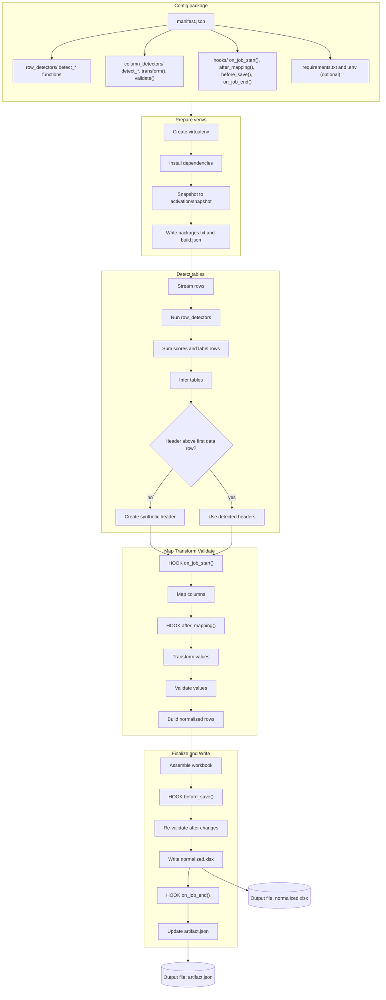

# What a config package is (and where things live)

A **config package** is a small folder that tells ADE *how to read* a messy spreadsheet. It contains:

```
${ADE_DATA_DIR}/
├─ config_packages/
│   └─ <config_id>/
│       ├─ manifest.json              # Manifest v1.0 (required)
│       ├─ requirements.txt           # Optional (pinned) dependencies
│       ├─ .env                       # Optional environment variables imported in venvs
│       ├─ row_detectors/
│       │   ├─ header.py              # row detector functions (detect_*)
│       │   └─ data.py                # row detector functions (detect_*)
│       ├─ column_detectors/
│       │   ├─ sin_number.py          # column detector functions (detect_*), optional transform/validate
│       │   ├─ member_id.py
│       │   └─ employee_number.py
│       ├─ hooks/
│       │  ├─ on_job_start.py         # def run(*, job, **_): ...
│       │  ├─ after_mapping.py        # def after_mapping(*, job, table, **_): ...
│       │  ├─ before_save.py          # def before_save(*, job, book, **_): ...
│       │  └─ on_job_end.py           # def run(*, job, **_): ...
```

When you **prepare** a config, ADE freezes this folder into a **read-only snapshot** inside its own versioned virtual environment (`venvs/<config_id>/activation/snapshot/`).
Every job that uses this config imports from that snapshot—not from your working directory—ensuring deterministic behavior and reproducible results.

> **In practice:**
> You author and test configs in the ADE UI. Each save creates a new internal version you can test safely.
> You can export configs as folders for review or source control, import them into other workspaces, and promote a validated version to production.
> ADE automatically keeps historical versions available, so any past job can always reference the exact rules that generated its output.



## 1. How ADE Reads Spreadsheets and Calls Your Detectors

ADE starts by reads spreadsheets efficiently by **streaming** each sheet, one row at a time—rather than loading the entire file.
Each row is passed to every `detect_*` function in your `row_detectors/header.py` and `row_detectors/data.py` modules, along with helpful context such as the sheet name, row index, manifest, and environment.
Each detector returns small **score hints** like `{"header": +0.6}` or `{"data": +0.3}`.
ADE adds all these deltas, labels the row with the highest total, and uses those labels to build a map of the sheet.

### 1A. Row Detector Examples (${ADE_DATA_DIR}/config_packages/<config_id>/row_detectors/)

**Files:** `row_detectors/header.py` and `row_detectors/data.py`

> These detectors label rows as **header**, **data**, or **separator** using small, composable hints.
> ADE adds the hints from all rules and infers table boundaries.

```python
# row_detectors/header.py
# Several small hints that, together, identify header rows and separators.

from __future__ import annotations

# Return shape: {"scores": {"header": float, "data": float, "separator": float}}
# Deltas typically in [-1.0, +1.0]. Include only non-zero entries.

def detect_header_by_text_density(
    *,
    job_id: str,                 # e.g., "job_01HF3M8J6ZK9WQ5R2N3S7A"
    source_file: str,            # original filename, e.g., "employees_roster.xlsx"
    sheet_name: str,             # e.g., "Sheet1"
    row_index: int,              # 1-based row index in the sheet, e.g., 1 for the top row
    row_values_sample: list,     # e.g., ["SIN", "Member No.", "Employee ID", "Full Name"]
    manifest: dict,              # parsed manifest.json (exact structure from your manifest)
    env: dict | None,            # from manifest["env"], e.g., {"LOCALE": "en-CA"}
    artifact: dict,              # read-only: partial artifact built so far
    **_                          # MUST accept extra kwargs for forward-compat
) -> dict:
    """
    Heuristic: header rows are often mostly text and non-empty.
    """
    non_blank = [c for c in row_values_sample if c not in (None, "")]
    if not non_blank:
        return {"scores": {"separator": 0.3}}  # empty-ish row acts as weak separator
    text_ratio = sum(isinstance(c, str) for c in non_blank) / len(non_blank)
    return {"scores": {"header": 0.6}} if text_ratio >= 0.7 else {"scores": {}}
```

```python
# row_detectors/data.py
# Return shape: {"scores": {"header": float, "data": float, "separator": float}}

def detect_data_by_numeric_density(
    *,
    job_id: str,                 # e.g., "job_01HF3M8J6ZK9WQ5R2N3S7A"
    source_file: str,            # e.g., "employees_roster.xlsx"
    sheet_name: str,             # e.g., "Sheet1"
    row_index: int,              # e.g., 2 (first data row under the header)
    row_values_sample: list,     # e.g., ["046 454 286", "17", "9932", "Lee, A."]
    manifest: dict,              # manifest dict
    env: dict | None,            # env dict
    artifact: dict,              # read-only artifact snapshot
    **_
) -> dict:
    """
    Heuristic: data rows often have multiple numeric-looking cells.
    """
    digits = sum(str(c).strip().isdigit() for c in row_values_sample if c not in (None, ""))
    return {"scores": {"data": 0.6}} if digits >= 2 else {"scores": {}}
```

After labeling and inferring tables, ADE moves on to column mapping, where `column_detectors` decide what each column represents.

---

## 2) Mapping Columns with Additive Scoring
Once ADE knows how each row is labeled, it can infer **table ranges** automatically:
a table begins at a `header` row, and everything below it counts as **data** until another header appears.
If a data row is found with no header above it, ADE generates a **synthetic header** (e.g., `column_1`, `column_2`, …) so column mapping can continue normally.
This allows ADE to work even on files with missing or inconsistent headers.

After finding tables, ADE evaluates each column.
Every `detect_*` in `column_detectors/*.py` inspects the header and a small **values_sample**, returning additive deltas:

```python
{"scores": {"sin": +0.8, "member_id": -0.4, "employee_number": -0.2}}
```

ADE totals these by field, picks the top score above the threshold, and maps the column.
Multiple detectors can **share what they learn**, raising scores for likely fields and lowering scores for lookalikes—reducing false positives.

### 2B. Column detector example (${ADE_DATA_DIR}/config_packages/<config_id>/column_detectors/)

**File:** `column_detectors/sin_number.py`

> This detector maps a raw column to the **`sin`** field (Canadian Social Insurance Number).
> It uses **three independent detectors** that vote with **additive scores**, **positive and negative**.
> Then it **normalizes** the values (transform) and **checks** them (validate).

```python
# column_detectors/sin_number.py
# Column Detector for 'sin' (Social Insurance Number)

# Detectors return: {"scores": {"<field_id>": float, "<other_field_id>": float, ...}}
# Transform returns: {"values": list, "warnings": list[str]}
# Validate returns: {"issues": [{"row_index": int, "code": str, "severity": "error"|"warning"|"info", "message": str}, ...]}

from __future__ import annotations
import re
from typing import Any

# Simple "probable SIN" placeholder:
# Any cell containing exactly 9 digits (ignoring punctuation) is "probable".
# Replace with a proper checksum (e.g., Luhn) if you want high precision.
NINE_DIGITS = re.compile(r"^\D*(?:\d\D*){9}$")

def _only_digits(s: str) -> str:
    return "".join(ch for ch in s if ch.isdigit())

# -----------------------------
# DETECTOR 1 — header synonyms
# -----------------------------
def detect_header_synonyms(
    *,
    job_id: str,                 # e.g., "job_01HF3M8J6ZK9WQ5R2N3S7A"
    source_file: str,            # e.g., "employees_roster.xlsx"
    sheet_name: str,             # e.g., "Sheet1"
    table_id: str,               # ADE-assigned table id in this sheet, e.g., "table_1"
    column_index: int,           # 1-based index within the table, e.g., 1
    header: str | None,          # normalized header text, e.g., "SIN"
    values_sample: list,         # representative sample, e.g., ["046 454 286","123 456 789",None]
    field_name: str,             # the manifest field this file "owns", e.g., "sin"
    field_meta: dict,            # manifest.columns.meta[field_name], e.g., {"label": "SIN", ...}
    manifest: dict,              # full manifest dict
    env: dict | None,            # from manifest["env"]
    artifact: dict,              # read-only artifact snapshot
    **_
) -> dict:
    """
    Boost 'sin' when the header contains any configured synonym.
    """
    if not header:
        return {"scores": {}}
    h = header.lower()
    bump = sum(0.6 for syn in (field_meta.get("synonyms") or []) if syn.lower() in h)
    return {"scores": {"sin": min(1.0, bump)}} if bump else {"scores": {}}

# ---------------------------------------
# DETECTOR 2 — value shape (9-digit hint)
# ---------------------------------------
def detect_value_shape_9_digits(
    *,
    job_id: str,                 # e.g., "job_01HF3M8J6ZK9WQ5R2N3S7A"
    source_file: str,            # e.g., "employees_roster.xlsx"
    sheet_name: str,             # e.g., "Sheet1"
    table_id: str,               # e.g., "table_1"
    column_index: int,           # e.g., 1
    header: str | None,          # e.g., "SIN"
    values_sample: list,         # e.g., ["046 454 286","123 456 789",None]
    field_name: str,             # "sin"
    field_meta: dict,            # metadata for 'sin'
    manifest: dict,              # manifest dict
    env: dict | None,            # {"LOCALE": "en-CA", ...}
    artifact: dict,              # read-only artifact snapshot
    **_
) -> dict:
    """
    Positive evidence for 'sin' when many samples contain 9 digits.
    Also provide small negative hints against lookalikes to reduce false positives.
    """
    if not values_sample:
        return {"scores": {}}
    hits = sum(bool(NINE_DIGITS.match(str(v))) for v in values_sample if v not in (None, ""))
    ratio = hits / max(1, len(values_sample))  # 0..1
    if ratio == 0:
        return {"scores": {}}

    scores = {"sin": round(min(0.7, 0.7 * ratio), 3)}  # up to +0.7
    if ratio > 0.6:
        scores["member_id"] = -0.3
        scores["employee_number"] = -0.2
    return {"scores": scores}

# ----------------
# TRANSFORM — 'sin'
# ----------------
def transform(
    *,
    job_id: str,                 # "job_01HF..."
    source_file: str,            # "employees_roster.xlsx"
    sheet_name: str,             # "Sheet1"
    table_id: str,               # "table_1"
    column_index: int,           # 1
    header: str | None,          # "SIN"
    values: list,                # full column values for this table, e.g., ["046 454 286","123456789",...]
    field_name: str,             # "sin"
    field_meta: dict,            # {"label":"SIN","required":true,...}
    manifest: dict,              # manifest dict
    env: dict | None,            # {"LOCALE":"en-CA",...}
    artifact: dict,              # read-only artifact snapshot
    **_
) -> dict:
    """
    Normalize SIN to exactly 9 digits where possible; everything else becomes None.
    """
    out: list[str | None] = []
    changed = False
    for v in values:
        if v is None or str(v).strip() == "":
            out.append(None)
            continue
        digits = _only_digits(str(v))
        if digits != str(v):
            changed = True
        out.append(digits if len(digits) == 9 else None)

    warnings = ["normalized to 9 digits"] if changed else []
    return {"values": out, "warnings": warnings}

# ---------------
# VALIDATE — 'sin'
# ---------------
def validate(
    *,
    job_id: str,                 # "job_01HF..."
    source_file: str,            # "employees_roster.xlsx"
    sheet_name: str,             # "Sheet1"
    table_id: str,               # "table_1"
    column_index: int,           # 1
    header: str | None,          # "SIN"
    values: list,                # post-transform values, e.g., ["046454286","123456789",None,...]
    field_name: str,             # "sin"
    field_meta: dict,            # {"required": true, ...}
    manifest: dict,              # manifest dict
    env: dict | None,            # {"LOCALE":"en-CA",...}
    artifact: dict,              # read-only artifact snapshot
    **_
) -> dict:
    """
    Emit issues but do not change data.
    - required_missing (error)   when field is required and value is empty
    - invalid_format (warning)   when value exists but is not 9 digits (paranoia check)
    """
    issues: list[dict] = []
    required = bool(field_meta.get("required", False))

    for i, v in enumerate(values, start=1):  # table-relative 1-based row index
        if not v:
            if required:
                issues.append({
                    "row_index": i,
                    "code": "required_missing",
                    "severity": "error",
                    "message": f"{field_name} is required."
                })
            continue
        if len(v) != 9 or not v.isdigit():
            issues.append({
                "row_index": i,
                "code": "invalid_format",
                "severity": "warning",
                "message": f"{field_name} should be a 9-digit identifier."
            })

    return {"issues": issues}
```


