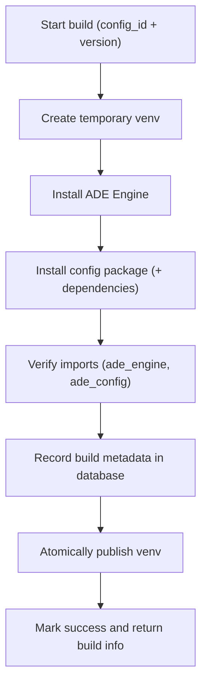

# 02 — Build: Freeze the Runtime (Virtual Environment)

When you press **Build** in the frontend config builder, ADE takes your editable configuration and turns it into a **ready-to-run runtime environment**.
This process—called a **build**—packages your configuration together with the ADE Engine in an isolated Python environment.
That environment is then reused for every job that runs against that configuration version.

---

## What a Build Does

Each build creates a **virtual environment** (a “venv”)—a private folder containing:

1. **A dedicated Python interpreter**, separate from the system one.
2. **The ADE Engine** (`ade_engine`) — the runtime that knows how to process spreadsheets and apply your rules.
3. **Your Config Package** (`ade_config`) — the detectors, transforms, validators, and hooks that define your logic.

Once built, every job for that configuration runs inside this frozen environment, guaranteeing that results are **reproducible**, **auditable**, and **isolated** from other workspaces.

---

## Where Builds Are Stored

The location of the virtual environments is controlled by the environment variable `ADE_VENVS_DIR`.
If you don’t specify it, ADE defaults to `./data/.venv` (ignored by Git).
If you do specify it—such as mounting a volume or network share—builds will automatically persist there.

Typical structure:

```text
./data/.venv/
└─ <workspace_id>/
   └─ <config_id>/
      ├─ bin/python
      └─ <site-packages>/
         ├─ ade_engine/...    # Installed ADE engine
         └─ ade_config/...    # Installed config package
```

This keeps builds separate from workspace data.
Persist them if you want them to survive restarts, or let them live ephemerally if you prefer a stateless setup.

---

## How a Build Works (Step by Step)



**Key points**

* **Atomic:** a venv only appears once fully built and validated.
* **Safe:** if any step fails, ADE keeps the previous build intact.
* **Fast:** the pip cache (`ADE_PIP_CACHE_DIR`) accelerates rebuilds by reusing downloaded wheels.
* **Centralized:** all metadata is recorded in the database—no additional runtime files are written to disk.

---

## Database Tracking

Build metadata is stored in a small SQLite table, which makes it easy for the API and UI to check status without reading files.

| Field            | Description                                  |
| ---------------- | -------------------------------------------- |
| `workspace_id`   | Workspace the build belongs to               |
| `config_id`      | Config this build represents                 |
| `config_version` | Version or digest used during build          |
| `build_id`       | Unique identifier (ULID)                     |
| `status`         | `building`, `active`, or `failed`            |
| `engine_version` | ADE Engine version used                      |
| `python_version` | Interpreter version                          |
| `built_at`       | Timestamp when build completed               |
| `expires_at`     | Optional expiration (if TTL policy enabled)  |
| `last_used_at`   | Updated each time a job runs with this build |
| `error`          | Failure message, if applicable               |

This record acts as the single source of truth for build metadata.

---

## Change Detection & Rebuild Triggers

ADE maintains **one active build per configuration** and rebuilds only when needed.

A build is created or replaced automatically when any of the following is true:

* No existing build exists for that configuration.
* The configuration **version or digest** has changed.

  * *Version:* if you keep a numeric `config_version` in the database.
  * *Digest:* if you compute a content hash (e.g., of `pyproject.toml`, `src/ade_config/**`, `manifest.json`, `config.env`).
* The ADE Engine **version** changed (e.g., engine upgrade).
* The **Python interpreter** changed (e.g., 3.11 → 3.12).
* The build has **expired** (`expires_at` passed, if TTL is enabled).
* The user explicitly **forces** a rebuild.

Otherwise, ADE reuses the existing build.
The process is **idempotent**—repeated build requests simply return the active build’s metadata.

---

## Compatibility & Validation

To avoid subtle runtime issues, ADE performs a small set of checks during build:

* **Import check:** `import ade_engine, ade_config` must succeed.
* **Engine compatibility (optional):** if your config declares a minimum engine version, the builder can verify it and fail fast with a clear error.
* **Python version pinning (recommended):** standardize on a minor version (e.g., Python 3.11) to keep wheels consistent across environments.

These checks keep builds predictable and errors easy to diagnose.

---

## Concurrency, Atomicity & Safety

* **Exclusive build lock:** builds for a given configuration run under a simple file lock at
  `${ADE_VENVS_DIR}/<workspace_id>/<config_id>/.build.lock`.
  This prevents duplicate work and race conditions.
* **Atomic publish:** ADE creates the venv in a temporary directory and **renames** it into place only after all steps succeed.
* **Rebuild safety gate:** for the simplest, safest behavior, ADE rebuilds a configuration **only when no jobs for that configuration are running**.
  If a job is active and a rebuild is requested, the API returns `409 Conflict` (unless you explicitly design for a pointer/symlink swap, which is more complex and not required here).
* **Idempotent ensure:** the `ensure_build()` function returns the current build if it’s already valid, and only executes a build when truly needed.

---

## Jobs and Build Reuse

Before each job starts, ADE ensures a valid build exists:

1. The backend calls `ensure_build(workspace_id, config_id)`:

   * Returns the current active build if valid.
   * Otherwise, builds one immediately.
2. The job runs inside that environment:

```bash
${ADE_VENVS_DIR}/<workspace_id>/<config_id>/bin/python \
  -I -B -m ade_engine.worker <job_id>
```

Jobs do **not** install anything.
They always execute inside a pre-built, verified runtime.

---

## API Endpoints

Each configuration has a **single build resource**.

### Get current build

```
GET /api/v1/workspaces/{workspace_id}/configurations/{config_id}/build
```

### Create or rebuild

```
PUT /api/v1/workspaces/{workspace_id}/configurations/{config_id}/build
```

Body:

```json
{ "force": false }
```

* If a valid build already exists, this returns it (idempotent).
* If not, this builds synchronously and returns the result.
* If jobs for the configuration are currently running and a rebuild would replace the venv, the route returns `409 Conflict`.

### Delete build

```
DELETE /api/v1/workspaces/{workspace_id}/configurations/{config_id}/build
```

Removes the venv on disk and clears the DB record. The next job or `PUT /build` will recreate it.

---

## Environment Variables

| Variable                  | Default            | Description                              |
| ------------------------- | ------------------ | ---------------------------------------- |
| `ADE_DOCUMENTS_DIR`       | `./data/documents` | Uploaded files + generated artifacts     |
| `ADE_VENVS_DIR`           | `./data/.venv`     | Where virtual environments are created   |
| `ADE_PIP_CACHE_DIR`       | `./data/cache/pip` | Cache for pip downloads (safe to delete) |
| `ADE_BUILD_TTL_DAYS`      | —                  | Optional expiry for builds               |
| `ADE_MAX_CONCURRENCY`     | `2`                | Maximum concurrent builds/jobs           |
| `ADE_JOB_TIMEOUT_SECONDS` | `300`              | Hard timeout for jobs                    |
| `ADE_WORKER_CPU_SECONDS`  | `60`               | CPU limit per job                        |
| `ADE_WORKER_MEM_MB`       | `512`              | Memory limit per job                     |
| `ADE_WORKER_FSIZE_MB`     | `100`              | Max file size a job may create           |

**Operational tips**

* A shared pip cache (`ADE_PIP_CACHE_DIR`) makes rebuilds much faster.
* Pin dependency versions in `pyproject.toml` for stable, deterministic rebuilds.

---

## Backend Architecture Overview

The build system fits naturally inside the **Configurations** feature:

* **Router** — exposes REST endpoints (`GET`, `PUT`, `DELETE /build`).
* **Service** — orchestrates logic (`ensure_build()`): checks the database and spawns a build if needed.
* **Builder** — low-level runner that:

  * Creates a venv (`python -m venv ...`)
  * Installs `ade_engine` and the config package
  * Verifies imports
  * Publishes atomically
  * Records metadata in the database
* **Database** — the single source of truth for build metadata.

Jobs invoke the same `ensure_build()` logic before execution, so they always run against a verified environment.
If the venv disappears (for example, after a container restart), it’s transparently rebuilt on demand.

---

## Local Example (Manual Steps)

```bash
# Create venv
python -m venv data/.venv/ws_local/my_config/

# Install ADE Engine
data/.venv/ws_local/my_config/bin/pip install ./packages/ade-engine/

# Install config package
data/.venv/ws_local/my_config/bin/pip install ./data/workspaces/ws_local/config_packages/my_config/

# Verify
data/.venv/ws_local/my_config/bin/python -I -B -c "import ade_engine, ade_config; print('ok')"
```

Then run a job:

```bash
data/.venv/ws_local/my_config/bin/python -I -B -m ade_engine.worker job_001
```

---

## Implementation Notes & Checklist

These choices keep the system simple and safe while covering real-world edge cases:

* **Change detection:** Prefer a **config version** if you already maintain one; otherwise compute a **digest** of config sources to detect edits.
* **Rebuild safety:** Only rebuild when **no jobs** for that configuration are running, or return `409`.
* **Atomic publish:** Always build in a temp directory and **rename** into place.
* **Locking:** Use a config-scoped **file lock** to serialize builds: `.../<ws>/<cfg>/.build.lock`.
* **Compatibility:** Enforce engine/Python requirements during build; fail fast with clear errors.
* **Observability (optional):** log build duration, success/failure counts, and cache hit rate; these help diagnose slow builds.
* **Idempotency:** `PUT /build` should return the active build when nothing needs rebuilding.
* **No disk metadata files:** All build metadata lives in SQLite. The venv contains only executables and installed packages.