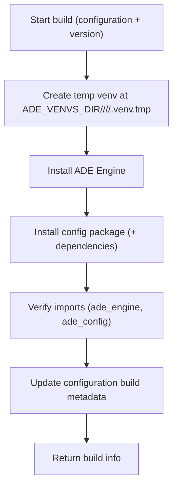

# 02 — Build: Freeze the Runtime (Virtual Environment)

When you press **Build** in the frontend config builder, ADE takes your editable configuration and turns it into a **ready‑to‑run runtime environment**.
This process—called a **build**—packages your configuration together with the ADE Engine in an isolated Python environment.
That environment is then reused for every run that uses that configuration.

---

## What a Build Does

Each build creates a **virtual environment** (a “venv”)—a private folder containing:

1. **A dedicated Python interpreter**, separate from the system one.
2. **The ADE Engine** (`ade_engine`) — the runtime that knows how to process spreadsheets and apply your rules.
3. **Your Config Package** (`ade_config`) — the detectors, transforms, validators, and hooks that define your logic.

Once built, every run for that configuration runs inside this frozen environment, guaranteeing that results are **reproducible**, **auditable**, and **isolated** from other workspaces.

---

## Where Builds Are Stored

Virtual environments live on local storage at `ADE_VENVS_DIR/<workspace>/<configuration>/<build_id>/.venv/`. They are not co-located with the configuration or shared storage.

```text
ADE_VENVS_DIR/                     # default: /tmp/ade-venvs (local, non-shared)
└─ <workspace_id>/
   └─ <configuration_id>/
      └─ <build_id>/
         └─ .venv/                 # build-scoped environment
            ├─ bin/python
            └─ <site-packages>/
               ├─ ade_engine/...   # installed engine
               └─ ade_config/...   # installed config package
```

ADE maintains **one active build pointer per configuration**. The configuration row stores build state/metadata, and each build gets its own folder; new builds never mutate old venvs.

---

## How a Build Works (Step by Step)



**Key points**

* **Atomic by pointer:** ADE updates the **database pointer** only after a successful build and verification.
* **Atomic swap:** build happens in `.venv.tmp`, then is renamed to `.venv` per `build_id`.
* **Safe on failure:** if the build fails, ADE **deletes** the temp folder and leaves previous builds untouched.
* **Fast installs:** the pip cache (`ADE_PIP_CACHE_DIR`) accelerates rebuilds by reusing downloaded wheels.

---

## Database Tracking

Build metadata lives primarily in the `builds` history table; the configuration keeps only the pointer to the current build:

| Field                       | Description                                            |
| --------------------------- | ------------------------------------------------------ |
| `active_build_id`           | Current build ID (immutable env path)                  |
| `active_build_fingerprint`  | Hash of config digest + engine spec/version + python   |
| `builds` table              | Source of truth for status, timestamps, errors, python/engine/config metadata |

The active environment lives at `ADE_VENVS_DIR/<workspace>/<configuration>/<build_id>/.venv`; switching builds is a DB pointer update, not an in-place rebuild.

---

## Change Detection & Rebuild Triggers

ADE maintains **one active build per configuration** and rebuilds only when fingerprints change or force is requested.
The **build fingerprint** mixes the config digest with the engine spec/version and Python interpreter so reuse only happens when both the config and the runtime match; the config digest alone would miss engine/Python changes.

ADE (re)builds when any of the following change:

* No active build exists for the configuration.
* `content_digest` changed since the last build.
* Engine spec/version or Python interpreter changed (fingerprint mismatch).
* The request sets `force=true`.

Otherwise, ADE reuses the existing build. Requests are **idempotent**—you get the current active environment.

---

## Concurrency & Safety

**Simple, DB‑based dedupe (no per‑config file locks):**

* **Single‑builder rule:** a partial unique index ensures at most one `queued/building` row per configuration; requests against an inflight build either wait briefly or return a conflict, depending on options.
* **No half builds:** build rows are marked `active` only after the venv is successfully provisioned and imports are verified; the configuration pointer flips to that build on success.

This keeps behavior correct and predictable without introducing filesystem locks.

---

## Timeouts & Wait Behavior

**Build timeout:**

* A single build is capped by `ADE_BUILD_TIMEOUT_SECONDS`.
* If exceeded (including crash/kill), the build is marked `failed` and any partial folder is deleted.

**Ensure wait (server‑side runs):**

* When a run calls `ensure_build()` and finds an inflight build row, the server **waits up to `ADE_BUILD_ENSURE_WAIT_SECONDS`** for it to finish.
* If it completes within that window, the run proceeds. Otherwise, the run submission returns a retriable error (e.g., `409 build_in_progress`) and can retry shortly.

**UI behavior (Build button):**

* `PUT /build` returns immediately with `"status":"building"` when another build is already running; the UI polls `GET /build` until `active` or `failed`.

---

## Crash Recovery & Stale Build Healing

If the app crashes mid‑build, you won’t get stuck:

* Every `building` row stores a `started_at` timestamp.
* On **startup** and on every `ensure_build()` call, ADE checks for **stale** building rows:

  * If `now - started_at > ADE_BUILD_TIMEOUT_SECONDS`, ADE marks the row `failed` and deletes the partial folder (if present).
  * The next ensure will start a fresh build normally.

This self‑healing logic guarantees that a crash during build does not permanently block new builds.

---

## Cleanup

**On failure:** delete the just‑created temp folder and set `status=failed` with an error message.

**On success:** the `.venv` stays alongside its `build_id`; previous builds remain immutable until pruned.

**On startup / periodic sweep:** if a build folder is missing, the next ensure recreates it from DB metadata.

---

## Runs and Build Reuse

Before each run, the backend calls `ensure_active_build(workspace_id, configuration_id)`, records the `build_id` on the run, and hydrates the local env if missing. Runs launch using the build-scoped venv:

```bash
${ADE_VENVS_DIR}/<workspace_id>/<configuration_id>/<build_id>/.venv/bin/python -I -B -m ade_engine.run <run_id>
```

Runs never install packages; they always run inside the verified build venv. The run record stores the `build_id` used for audit and reproducibility.

---

## API Endpoints

Build orchestration now mirrors the runs contract with dedicated build resources and streaming events.

### Create or rebuild (supports streaming)

```
POST /api/v1/workspaces/{workspace_id}/configurations/{configuration_id}/builds
```

Body:

```json
{
  "stream": false,
  "options": {
    "force": false,
    "wait": false
  }
}
```

* `stream: false` — enqueue a background build and return a `Build` snapshot immediately. Progress is emitted as run events (see below).
* `stream: true` — execute inline and stream `EventRecord` dictionaries (`build.*` + `console.line` with `scope:"build"`) over SSE.

### List build history

```
GET /api/v1/workspaces/{workspace_id}/configurations/{configuration_id}/builds?status=failed&limit=20
```

Returns a paged collection of builds (newest first). Filters support repeated `status` values. Pagination uses `page`, `page_size` (or `limit` alias), and `include_total`.

### Get build status

```
GET /api/v1/builds/{build_id}
```

Returns the persisted `Build` resource including timestamps, status, and exit metadata.

### Stream build/run events

Build activity is part of the run stream. After creating a run, attach to:

```
GET /api/v1/runs/{run_id}/events/stream?after_sequence=<cursor>
```

This returns an SSE stream of `EventRecord` objects; the API emits a monotonic `id:` counter per event (build lifecycle + `console.line scope=build` + subsequent run events). Use `after_sequence` or `Last-Event-ID` to resume; the cursor maps to the SSE `id` field.

> **Runs API (submit):** clients provide `configuration_id` to `/configurations/{configuration_id}/runs`. The server resolves the workspace, ensures the build, and records `build_id` at submit time.

---

## Environment Variables

| Variable                        | Default                | Description                                     |
| ------------------------------- | ---------------------- | ----------------------------------------------- |
| `ADE_WORKSPACES_DIR`            | `./data/workspaces`    | Workspace root for ADE storage                  |
| `ADE_DOCUMENTS_DIR`             | `./data/workspaces`    | Base for documents (`<ws>/documents/...`)       |
| `ADE_CONFIGS_DIR`               | `./data/workspaces`    | Base for configs (`<ws>/config_packages/...`)   |
| `ADE_VENVS_DIR`                 | `/tmp/ade-venvs`       | Local base for venvs (`<ws>/<configuration>/<build>/...`) |
| `ADE_RUNS_DIR`                  | `./data/workspaces`    | Base for runs (`<ws>/runs/<run_id>/...`)        |
| `ADE_PIP_CACHE_DIR`             | `./data/cache/pip`     | Cache for pip downloads (safe to delete)        |
| `ADE_BUILD_TTL_DAYS`            | —                      | Optional expiry for builds                      |
| `ADE_ENGINE_SPEC`               | `apps/ade-engine/` | How to install the engine (path or pinned dist) |
| `ADE_PYTHON_BIN`                | system default         | Python executable to use for `venv` (optional)  |
| `ADE_BUILD_TIMEOUT_SECONDS`     | `600`                  | Max duration for a single build before failing  |
| `ADE_BUILD_ENSURE_WAIT_SECONDS` | `30`                   | How long server waits for an in‑progress build  |
| `ADE_MAX_CONCURRENCY`           | `2`                    | Maximum concurrent builds/runs                  |
| `ADE_RUN_TIMEOUT_SECONDS`       | `300`                  | Hard timeout for runs                           |
| `ADE_WORKER_CPU_SECONDS`        | `60`                   | CPU limit per run                               |
| `ADE_WORKER_MEM_MB`             | `512`                  | Memory limit per run                            |
| `ADE_WORKER_FSIZE_MB`           | `100`                  | Max file size a run may create                  |

---

## Backend Architecture (Essentials)

* **Router** — `POST /workspaces/{workspace_id}/configurations/{configuration_id}/builds` plus status/log polling endpoints under `/builds/{build_id}`.
* **Service (`ensure_build`)** — checks the DB, computes the fingerprint, applies force rules, **uses the `builds` table (one queued/building row per config) to deduplicate concurrent requests**, and triggers the builder if needed.
* **Builder** — creates `<ADE_VENVS_DIR>/<ws>/<configuration>/<build_id>/.venv`, installs engine + config, verifies imports + smoke checks, **updates the configuration’s active_build pointer on success**, deletes the temp folder on failure.
* **Runs** — call `ensure_active_build()` then run the worker using the returned `venv_path`. Each run row stores the `build_id`.
* **Database** — `configurations` holds the active build pointer/fingerprint; `builds` tracks job history + status. Build logs are streamed as `console.line` in the run event stream.

---

## Summary

* Keep it simple: **DB‑based dedupe** (queued/building rows) guarantees **one** build at a time per configuration—no filesystem locks.
* **Coalesce** concurrent requests: UI returns `"building"` quickly; runs wait briefly for the status to flip via build rows.
* **Self‑heal** stale in-progress states after crashes using `started_at + ADE_BUILD_TIMEOUT_SECONDS`.
* Allow **rebuilds while runs run**; new builds land in new folders and runs continue using their pinned build_id.
* Runs **don’t pass** `build_id`—the server chooses and **records** the job ID for reproducibility.
* No renames, no symlinks—just clean metadata updates, timeouts, and simple cleanup.
