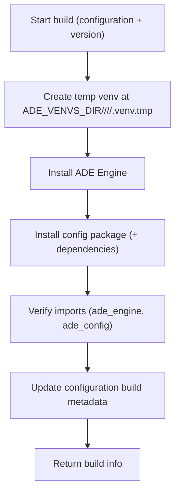

# 02 — Build: Freeze the Runtime (Virtual Environment)

When you press **Build** in the frontend config builder, ADE takes your editable configuration and turns it into a **ready‑to‑run runtime environment**.
This process—called a **build**—packages your configuration together with the ADE Engine in an isolated Python environment.
That environment is then reused for every run that uses that configuration.

---

## What a Build Does

Each build creates a **virtual environment** (a “venv”)—a private folder containing:

1. **A dedicated Python interpreter**, separate from the system one.
2. **The ADE Engine** (`ade_engine`) — the runtime that knows how to process spreadsheets and apply your rules.
3. **Your Config Package** (`ade_config`) — the detectors, transforms, validators, and hooks that define your logic.

Once built, every run for that configuration runs inside this frozen environment, guaranteeing that results are **reproducible**, **auditable**, and **isolated** from other workspaces.

---

## Where Builds Are Stored

Virtual environments live on local storage at `ADE_VENVS_DIR/<workspace>/<configuration>/<build_id>/.venv/`. They are not co-located with the configuration or shared storage.

```text
ADE_VENVS_DIR/                     # default: ./data/venvs (local, non-shared)
└─ <workspace_id>/
   └─ <configuration_id>/
      └─ <build_id>/
         └─ .venv/                 # build-scoped environment
            ├─ bin/python
            └─ <site-packages>/
               ├─ ade_engine/...   # installed engine
               └─ ade_config/...   # installed config package
```

ADE maintains **one active build pointer per configuration**. The configuration row stores build state/metadata, and each build gets its own folder; new builds never mutate old venvs.

---

## How a Build Works (Step by Step)



**Key points**

* **Atomic by pointer:** ADE updates the **database pointer** only after a successful build and verification.
* **Atomic swap:** build happens in `.venv.tmp`, then is renamed to `.venv` per `build_id`.
* **Safe on failure:** if the build fails, ADE **deletes** the temp folder and leaves previous builds untouched.
* **Fast installs:** the pip cache (`ADE_PIP_CACHE_DIR`) accelerates rebuilds by reusing downloaded wheels.

---

## Database Tracking

Build metadata lives primarily in the `builds` history table; the configuration keeps only the pointer to the current build:

| Field                       | Description                                            |
| --------------------------- | ------------------------------------------------------ |
| `active_build_id`           | Current build ID (immutable env path)                  |
| `active_build_fingerprint`  | Hash of config digest + engine spec/version + python   |
| `builds` table              | Source of truth for status, timestamps, errors, python/engine/config metadata |

The active environment lives at `ADE_VENVS_DIR/<workspace>/<configuration>/<build_id>/.venv`; switching builds is a DB pointer update, not an in-place rebuild.

---

## Change Detection & Rebuild Triggers

ADE maintains **one active build per configuration** and rebuilds only when fingerprints change or force is requested.
The **build fingerprint** mixes the config digest with the engine spec/version and Python interpreter so reuse only happens when both the config and the runtime match; the config digest alone would miss engine/Python changes.

ADE (re)builds when any of the following change:

* No active build exists for the configuration.
* `content_digest` changed since the last build.
* Engine spec/version or Python interpreter changed (fingerprint mismatch).
* The request sets `force=true`.

Otherwise, ADE reuses the existing build. Requests are **idempotent**—you get the current active environment.

---

## Concurrency & Safety

**Simple, DB‑based dedupe (no per‑config file locks):**

* **Fingerprint dedupe:** a unique constraint on `(configuration_id, fingerprint)` ensures concurrent requests converge on a single build row for that fingerprint.
* **Single runner:** build execution is claimed via `UPDATE ... WHERE status='queued'`, so only one worker runs the build at a time.
* **No half builds:** build rows are marked `ready` only after the venv is successfully provisioned and imports are verified; the configuration pointer flips to that build on success.

This keeps behavior correct and predictable without introducing filesystem locks.

---

## Timeouts & Queue Behavior

**Build timeout:**

* A single build is capped by `ADE_BUILD_TIMEOUT` (seconds).
* If exceeded (including crash/kill), the build is marked `failed` and any partial folder is deleted.

**Runs waiting on builds:**

* Runs remain `queued` while the build is pending; there is no `waiting_for_build` status.
* If the build fails or is cancelled, the run is failed with a build‑failure message.

**UI behavior (Build button):**

* `PUT /build` returns immediately with the current build status (for example `"building"`); the UI polls `GET /build` until `ready` or `failed`.

---

## Crash Recovery & Stale Build Healing

If the app crashes mid‑build, you won’t get stuck:

* Every `building` row stores a `started_at` timestamp.
* During normal worker operation and build reads, ADE checks for **stale** building rows:

  * If `now - started_at > ADE_BUILD_TIMEOUT`, ADE marks the row `failed` and deletes the partial folder (if present).
  * The next build request will start a fresh build normally.

This self‑healing logic guarantees that a crash during build does not permanently block new builds.

---

## Cleanup

**On failure:** delete the just‑created temp folder and set `status=failed` with an error message.

**On success:** the `.venv` stays alongside its `build_id`; previous builds remain immutable until pruned.

**On startup / periodic sweep:** if a build folder is missing, the next ensure recreates it from DB metadata.

---

## Runs and Build Reuse

Before each run, the API resolves the build for the configuration fingerprint, records the `build_id` on the run, and enqueues the job. The worker hydrates the local env if missing and launches the engine using the build-scoped venv:

```bash
${ADE_VENVS_DIR}/<workspace_id>/<configuration_id>/<build_id>/.venv/bin/python -I -B -m ade_engine process ...
```

Runs never install packages; they always run inside the verified build venv. The run record stores the `build_id` used for audit and reproducibility.

---

## API Endpoints

Build orchestration uses dedicated build resources; execution happens in the worker.

### Create or rebuild (enqueue)

```
POST /api/v1/workspaces/{workspaceId}/configurations/{configurationId}/builds
```

Body:

```json
{
  "options": {
    "force": false,
    "wait": false
  }
}
```

This enqueues a build and returns a `Build` snapshot immediately. Progress is written by the worker to the build event log.

### List build history

```
GET /api/v1/workspaces/{workspaceId}/configurations/{configurationId}/builds?perPage=20&filters=[{"id":"status","operator":"eq","value":"failed"}]
```

Returns a paged collection of builds (newest first). Filtering uses the canonical DSL (`filters`, `joinOperator`, `q`) and pagination uses `page` + `perPage`.

### Get build status

```
GET /api/v1/builds/{buildId}
```

Returns the persisted `Build` resource including timestamps, status, and exit metadata.

### Stream build events

Build activity is streamed from the build log:

```
GET /api/v1/builds/{buildId}/events/stream?after_sequence=<cursor>
```

This returns an SSE stream of `EventRecord` objects. Use `after_sequence` or `Last-Event-ID` to resume; the cursor maps to the SSE `id` field.

> **Runs API (submit):** clients provide `configuration_id` to `/configurations/{configurationId}/runs`. The server resolves the workspace, queues the build if needed, and records `build_id` at submit time.

---

## Environment Variables

| Variable                        | Default                | Description                                     |
| ------------------------------- | ---------------------- | ----------------------------------------------- |
| `ADE_WORKSPACES_DIR`            | `./data/workspaces`    | Workspace root for ADE storage                  |
| `ADE_DOCUMENTS_DIR`             | `./data/workspaces`    | Base for documents (`<ws>/documents/...`)       |
| `ADE_CONFIGS_DIR`               | `./data/workspaces`    | Base for configs (`<ws>/config_packages/...`)   |
| `ADE_VENVS_DIR`                 | `./data/venvs`         | Local base for venvs (`<ws>/<configuration>/<build>/...`) |
| `ADE_RUNS_DIR`                  | `./data/workspaces`    | Base for runs (`<ws>/runs/<run_id>/...`)        |
| `ADE_PIP_CACHE_DIR`             | `./data/cache/pip`     | Cache for pip downloads (safe to delete)        |
| `ADE_BUILD_TTL_DAYS`            | —                      | Optional expiry for builds                      |
| `ADE_ENGINE_SPEC`               | `apps/ade-engine/` | How to install the engine (path or pinned dist) |
| `ADE_PYTHON_BIN`                | system default         | Python executable to use for `venv` (optional)  |
| `ADE_BUILD_TIMEOUT`             | `600`                  | Max duration (seconds) for a single build before failing |
| `ADE_WORKER_CONCURRENCY`        | `1`                    | Worker concurrency per process                  |
| `ADE_WORKER_POLL_INTERVAL`      | `2`                    | Idle poll interval for workers (seconds)        |
| `ADE_QUEUE_SIZE`                | —                      | Maximum queued runs allowed (server-level)      |
| `ADE_RUN_TIMEOUT_SECONDS`       | `300`                  | Hard timeout for runs                           |
| `ADE_WORKER_CPU_SECONDS`        | `60`                   | CPU limit per run                               |
| `ADE_WORKER_MEM_MB`             | `512`                  | Memory limit per run                            |
| `ADE_WORKER_FSIZE_MB`           | `100`                  | Max file size a run may create                  |

---

## Backend Architecture (Essentials)

* **Router** — `POST /workspaces/{workspaceId}/configurations/{configurationId}/builds` plus status/log polling endpoints under `/builds/{buildId}`.
* **API service** — computes the fingerprint, **get‑or‑creates by `(configuration_id, fingerprint)`**, and enqueues a build row (status = `queued`).
* **Worker** — claims build rows, creates `<ADE_VENVS_DIR>/<ws>/<configuration>/<build_id>/.venv`, installs engine + config, verifies imports + smoke checks, **updates the configuration’s active_build pointer on success**, deletes the temp folder on failure, and writes `events.ndjson`.
* **Runs** — API records the `build_id` on each run; worker executes runs inside the build‑scoped venv.
* **Database** — `configurations` holds the active build pointer/fingerprint; `builds` tracks job history + status. Build logs live alongside the venv in `events.ndjson`.

---

## Summary

* Keep it simple: **DB‑based dedupe** (unique `(configuration_id, fingerprint)` rows) guarantees **one** build row per fingerprint—no filesystem locks.
* **Coalesce** concurrent requests: UI returns `"building"` quickly; runs remain queued until the build is ready.
* **Self‑heal** stale in-progress states after crashes using `started_at + ADE_BUILD_TIMEOUT`.
* Allow **rebuilds while runs run**; new builds land in new folders and runs continue using their pinned build_id.
* Runs **don’t pass** `build_id`—the server chooses and **records** the job ID for reproducibility.
* No renames, no symlinks—just clean metadata updates, timeouts, and simple cleanup.
