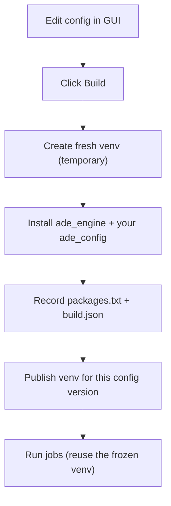

# Build — freeze a configuration into a reusable Python environment

> **Goal in one sentence:**
> Turn a human‑editable configuration (your detection, mapping, and cleanup rules) into a **frozen, reusable runtime** so every job runs the same way every time.

ADE separates *authoring* from *execution*. You (or your users) write rules in an **ADE Config** package. When you click **Build**, ADE creates a dedicated, isolated **Python virtual environment** (a *venv*) that contains:

* the ADE Engine (the software that reads spreadsheets and applies your rules), and
* your exact config package (plus any optional dependencies it declares).

Once built, that venv is reused for all jobs that reference that specific **config version**. This guarantees reproducible results.

---

## Table of contents

1. [What problem does “Build” solve?](#what-problem-does-build-solve)
2. [Key terms (no Python knowledge required)](#key-terms-no-python-knowledge-required)
3. [Where things live on disk](#where-things-live-on-disk)
4. [The Build contract](#the-build-contract)
5. [How a build works (step by step)](#how-a-build-works-step-by-step)
6. [Running jobs after a build](#running-jobs-after-a-build)
7. [API contract (trigger + poll)](#api-contract-trigger--poll)
8. [Local quickstart (no frontend required)](#local-quickstart-no-frontend-required)
9. [Reproducibility & idempotency](#reproducibility--idempotency)
10. [Security & resource limits](#security--resource-limits)
11. [Troubleshooting](#troubleshooting)
12. [FAQ](#faq)
13. [Glossary](#glossary)

[Back to top](#build--freeze-a-configuration-into-a-reusable-python-environment)

---

## What problem does “Build” solve?

Spreadsheets vary wildly. You’ll tweak your rules (detectors, transforms, validators) while testing. If jobs pulled those rules directly from your working folder, two runs made a day apart might behave differently even when the input file hasn’t changed.

**Build** creates a **frozen runtime**:

* Your rules are packaged as installable software.
* The ADE Engine and your rules are installed together into a **virtual environment** (venv).
* The exact dependency set is recorded.
* Every subsequent run for that config version uses the **same** runtime.

This makes results **reproducible** and **auditable**.

---

## Key terms (no Python knowledge required)

* **ADE Config** — your rules, written as a tiny project (files and folders) that can be installed. Think of it like a zip file of logic the engine can import.
* **ADE Engine** — the runtime that opens spreadsheets, finds tables, maps columns, transforms/validates values, and writes a clean workbook.
* **Virtual environment (venv)** — a private folder with its own Python and its own installed packages. It isolates one project from another so versions don’t collide.
* **Build** — the act of creating a venv and installing the engine + your config into it.
* **Run** — processing an input file with a previously built venv.

You don’t need to write Python to use any of this. Builds and runs are managed by the ADE backend and the web UI.

---

## Where things live on disk

ADE stores all its state under a single **data directory**. In development, that default is `./data`. In production, it’s commonly a shared, persistent volume.

```text
${ADE_DATA_DIR}/
├─ workspaces/
│  └─ <workspace_id>/
│     ├─ config_packages/              # editable sources managed in the UI (truth)
│     │  └─ <config_id>/               # e.g., "membership"
│     │     ├─ pyproject.toml          # declares dependencies (optional but recommended)
│     │     └─ src/ade_config/...      # your detectors, transforms, validators, hooks
│     └─ venvs/
│        └─ <config_id>/
│           └─ <version>/              # one venv per config version
│              ├─ bin/python           # Python interpreter inside the venv
│              └─ ade-runtime/
│                 ├─ packages.txt      # fully resolved dependency list (pip freeze)
│                 └─ build.json        # metadata about this build
├─ jobs/                                # one folder per job (inputs, output, logs)
├─ cache/pip/                           # pip download/build cache (optional)
└─ db/, logs/, etc.
```

> **Important:** The **source** under `config_packages/` is never modified by the build process. The venv is a separate, compiled/installed copy.

---

## The Build contract

A successful build must satisfy all of the following:

1. **Isolation**
   Each *config version* gets its **own venv**:
   `venvs/<config_id>/<version>/…`

2. **Engine + Config installed**
   The venv contains:

   * `ade_engine` (the runtime), and
   * your config as an installable package named `ade_config` (plus any declared dependencies).

3. **Frozen dependency record**
   The venv contains:

   * `ade-runtime/packages.txt` — the exact versions that were installed.
   * `ade-runtime/build.json` — metadata like engine version, config version, Python version, and timestamp.

4. **Reusable**
   Job runs **reuse** this environment. No network or re‑install needed during a run.

If any of these steps fail (e.g., a dependency can’t be resolved), the build is marked **failed** and the venv is not published.

---

## How a build works (step by step)

Behind the scenes, the backend performs these steps:

1. **Resolve inputs**

   * Identify the workspace, `config_id`, and **config version** to build.
   * Locate the config source at
     `workspaces/<workspace_id>/config_packages/<config_id>/`.

2. **Create a fresh venv (temporary)**

   * Use Python’s built‑in `venv` module to create an isolated environment in a temporary folder.

3. **Install the engine and your config**

   * Upgrade the venv’s installer tooling.
   * Install `ade_engine` (editable in dev; pinned version in prod).
   * Install your config package from its folder (this reads `pyproject.toml` if present).
   * Optionally apply a `requirements.txt` overlay if your tooling exposes one.

4. **Record the exact dependency set**

   * Write `packages.txt` with `pip freeze` (all resolved versions).
   * Write `build.json` with metadata, for example:

     ```json
     {
       "build_id": "01HF4X4WJ4…",
       "workspace_id": "ws-123",
       "config_id": "membership",
       "config_version": 12,
       "engine_version": "0.4.2",
       "python_version": "3.11.8",
       "built_at": "2025-11-10T12:34:56Z"
     }
     ```

5. **Publish atomically**

   * Move the finished venv into `venvs/<config_id>/<version>/` in one step and mark it ready.

If a build step fails, ADE captures the error message for inspection and leaves any existing, last‑known‑good venv untouched.

---

## Running jobs after a build

A job always runs inside the venv for its config version:

```bash
${ADE_DATA_DIR}/workspaces/<workspace_id>/venvs/<config_id>/<version>/bin/python \
  -I -B -m ade_engine.worker <job_id>
```

* `-I` starts Python in *isolated* mode (ignores user‑wide settings).
* `-B` avoids writing `.pyc` files during execution.

The worker reads the job’s inputs, imports your `ade_config`, and writes a normalized Excel workbook along with an **audit artifact** that explains every important decision.

---

## API contract (trigger + poll)

The frontend (or any client) can request and track builds with simple endpoints:

### Start a build

```
POST /api/v1/workspaces/{workspace_id}/configs/{config_id}/builds
Content-Type: application/json

{
  "version": 12,
  "force": false
}
```

**Responses**

* `201 Created` — a new build was accepted/started.
* `200 OK` — a build for this fingerprint already exists and is **succeeded** (idempotent).
* `409 Conflict` — a build is already **running** for the same fingerprint.
* `400 Bad Request` — version or paths invalid.

**Example response**

```json
{
  "build_id": "01HF4X4WJ4…",
  "workspace_id": "ws-123",
  "config_id": "membership",
  "config_version": 12,
  "status": "queued",
  "engine_version": "0.4.2",
  "python_version": "3.11.8",
  "venv_path": "/data/workspaces/ws-123/venvs/membership/12",
  "created_at": "2025-11-10T12:34:12Z"
}
```

### Poll build status

```
GET /api/v1/workspaces/{workspace_id}/configs/{config_id}/builds/{build_id}
```

**Statuses:** `queued`, `running`, `succeeded`, `failed`
On `succeeded`, the payload includes the final `venv_path`. On `failed`, the payload includes a succinct `error` string.

> **Pre‑run guard:** If you try to run a job for a config version that has no successful build, the API may respond with **`412 Precondition Required`**. The UI should offer a “Build now” action.

---

## Local quickstart (no frontend required)

You can try everything from a terminal. The example below uses generic IDs—feel free to change them.

```bash
# 0) Choose your folders
export ADE_DATA_DIR=$(pwd)/data
export WS=ws-123
export CFG=membership
export VER=12

# 1) Create a config from the template (or use the web editor)
mkdir -p "$ADE_DATA_DIR/workspaces/$WS/config_packages"
cp -r templates/config-packages/default "$ADE_DATA_DIR/workspaces/$WS/config_packages/$CFG"

# 2) Create a per-version venv
python -m venv "$ADE_DATA_DIR/workspaces/$WS/venvs/$CFG/$VER"

# 3) Install engine + your config into that venv
"$ADE_DATA_DIR/workspaces/$WS/venvs/$CFG/$VER/bin/pip" install -U pip wheel
"$ADE_DATA_DIR/workspaces/$WS/venvs/$CFG/$VER/bin/pip" install packages/ade-engine/
"$ADE_DATA_DIR/workspaces/$WS/venvs/$CFG/$VER/bin/pip" install "$ADE_DATA_DIR/workspaces/$WS/config_packages/$CFG/"

# 4) Freeze the set of packages (for auditability)
"$ADE_DATA_DIR/workspaces/$WS/venvs/$CFG/$VER/bin/python" -m pip freeze \
  > "$ADE_DATA_DIR/workspaces/$WS/venvs/$CFG/$VER/ade-runtime/packages.txt"

# 5) Sanity check: imports work
"$ADE_DATA_DIR/workspaces/$WS/venvs/$CFG/$VER/bin/python" -I -B -c \
  "import ade_engine, ade_config; print('ok')"
```

Now your venv is ready for jobs.

---

## Reproducibility & idempotency

**Why builds are consistent**

* **Per‑version venvs.** Changing your config creates or uses a *new* version → a *new* venv.
* **`packages.txt`.** The full dependency set is recorded at build time, so you can reproduce the environment.

**Why duplicate requests are safe**

* The backend defines a **build fingerprint**:
  `(workspace_id, config_id, config_version, python_version, engine_version)`
* A build with the same fingerprint returns the existing successful build instead of doing the work again.

---

## Security & resource limits

Builds and runs are isolated and conservative:

* **Isolated Python** (`-I -B`) for workers.
* **Resource limits** (CPU seconds, memory ceiling, max file size, wall‑clock timeout) are applied to worker processes where supported.
* **No source mutation.** The backend never edits files in `config_packages/` during build. It only installs them into a venv and records metadata.
* **Network discipline.** Build steps only talk to Python package indexes to resolve dependencies. In production, you can pin or mirror indexes and cache wheels in `${ADE_DATA_DIR}/cache/pip/`.

---

## Troubleshooting

**Build failed: “Could not build wheels / dependency error.”**

* Check your config’s `pyproject.toml` for typos or missing dependencies.
* Try to install locally inside the venv to see the exact pip error:

  ```bash
  <venv>/bin/pip install -v <your-config-path>
  ```

**Worker import error: “No module named ade_config.”**

* Verify the config actually installed into the venv:

  ```bash
  <venv>/bin/python -I -B -c "import ade_engine, ade_config; print('ok')"
  ```

**Run looks different after editing rules.**

* Confirm you built the **new version** and that the job is pointing at that version’s venv.

**Performance is sluggish.**

* Large third‑party packages in your config will increase build time. Prefer smaller, focused dependencies.
* Reuse the pip cache by setting `ADE_PIP_CACHE_DIR` (enabled by default under `${ADE_DATA_DIR}/cache/pip`).

---

## FAQ

**Do I need to know Python to use ADE?**
No. You can author configs in the web editor, click **Build**, and run jobs. Knowing Python helps when writing detectors, but the build/run flow does not require Python expertise.

**Why not run jobs directly from the editable source?**
Because that would silently pick up changes and break reproducibility. Freezing into a venv ensures “same inputs → same outputs.”

**Can multiple builds exist for the same config?**
Yes—one per **version** (and Python/engine pair). Older builds remain available for rollback and comparison.

**Are venvs portable between machines?**
Treat them as **machine‑local** artifacts. Rebuild on the target environment (or ship containers) for portability.

---

## Glossary

* **Build** — Create an isolated venv with the engine + your config; record the dependency set.
* **Run** — Execute a job inside a previously built venv.
* **Config version** — A numbered snapshot of your rules; changing rules increments the version.
* **Venv** — A self‑contained Python + packages folder used to isolate dependencies.
* **`packages.txt`** — A text file listing all exact package versions installed in a build.
* **`build.json`** — A small JSON file with metadata about the build (who/what/when).

---

## Visual overview



---

## Environment variables (defaults for dev)

| Variable                  | Default                                         | Purpose                                   |
| ------------------------- | ----------------------------------------------- | ----------------------------------------- |
| `ADE_DATA_DIR`            | `./data`                                        | Root folder for all ADE state             |
| `ADE_CONFIGS_DIR`         | `$ADE_DATA_DIR/workspaces/<ws>/config_packages` | Where editable config sources live        |
| `ADE_VENVS_DIR`           | `$ADE_DATA_DIR/workspaces/<ws>/venvs`           | Where per‑version venvs are created       |
| `ADE_PIP_CACHE_DIR`       | `$ADE_DATA_DIR/cache/pip`                       | Speeds up repeat builds                   |
| `ADE_JOB_TIMEOUT_SECONDS` | `300`                                           | Max wall‑clock time per job (best‑effort) |
| `ADE_WORKER_CPU_SECONDS`  | `60`                                            | CPU limit per job (best‑effort)           |
| `ADE_WORKER_MEM_MB`       | `512`                                           | Memory ceiling per job (best‑effort)      |
| `ADE_WORKER_FSIZE_MB`     | `100`                                           | Max file size a job can create            |

> In production, these live in your service environment or container runtime configuration.

---

### Where to go next

* **Config Packages** — how to write detectors, transforms, validators, and hooks.
* **Job Orchestration** — queues, worker limits, and the audit artifact.

[Back to top](#build--freeze-a-configuration-into-a-reusable-python-environment)