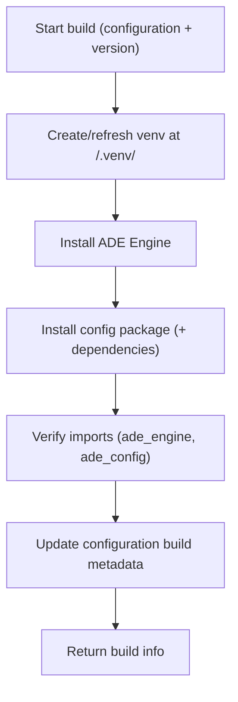

# 02 — Build: Freeze the Runtime (Virtual Environment)

When you press **Build** in the frontend config builder, ADE takes your editable configuration and turns it into a **ready‑to‑run runtime environment**.
This process—called a **build**—packages your configuration together with the ADE Engine in an isolated Python environment.
That environment is then reused for every run that runs against that configuration version.

---

## What a Build Does

Each build creates a **virtual environment** (a “venv”)—a private folder containing:

1. **A dedicated Python interpreter**, separate from the system one.
2. **The ADE Engine** (`ade_engine`) — the runtime that knows how to process spreadsheets and apply your rules.
3. **Your Config Package** (`ade_config`) — the detectors, transforms, validators, and hooks that define your logic.

Once built, every run for that configuration runs inside this frozen environment, guaranteeing that results are **reproducible**, **auditable**, and **isolated** from other workspaces.

---

## Where Builds Are Stored

Virtual environments live inside each configuration package at `<config_root>/.venv/`. There is no separate venv root to override; the environment is always co-located with the configuration it runs.

```text
./data/workspaces/
└─ <workspace_id>/
   └─ config_packages/
      └─ <config_id>/
         ├─ ...source files...
         └─ .venv/                # single active environment
            ├─ bin/python
            └─ <site-packages>/
               ├─ ade_engine/...  # installed engine
               └─ ade_config/...  # installed config package
```

ADE maintains **one active virtual environment per configuration**. The **configuration row** stores build state/metadata, and the venv is recreated in place when a rebuild is needed.

---

## How a Build Works (Step by Step)



**Key points**

* **Atomic by pointer:** ADE updates the **database pointer** only after a successful build and verification.
* **No rename needed:** each build has its own folder; switching is a DB update.
* **Safe on failure:** if the build fails, ADE **deletes** the partially built folder and leaves the previous active build unchanged.
* **Fast installs:** the pip cache (`ADE_PIP_CACHE_DIR`) accelerates rebuilds by reusing downloaded wheels.

---

## Database Tracking

Build metadata now lives directly on the `configurations` table so there is a single source of truth per configuration:

| Field                       | Description                                            |
| --------------------------- | ------------------------------------------------------ |
| `build_status`              | `queued`, `building`, `active`, `failed`, `canceled`   |
| `engine_spec` / `version`   | What was installed into the venv                       |
| `python_version`            | Interpreter version captured from the venv             |
| `python_interpreter`        | Interpreter path used to build                         |
| `built_configuration_version` / `built_content_digest` | Fingerprint of what the venv represents |
| `last_build_started_at`     | When the current build started                         |
| `last_build_finished_at`    | When the current build finished                        |
| `last_build_error`          | Error text from the last build (if failed)             |
| `last_build_id`             | Latest build **job** identifier (for logs/history)     |

The active environment is always the `.venv/` directory inside the configuration package; no environment-level build ID or separate pointer table is required.

---

## Change Detection & Rebuild Triggers

ADE maintains **one venv per configuration** and rebuilds only when needed.

ADE (re)builds when any of the following change:

* No active build exists for the configuration.
* `configuration_version` or `content_digest` changed since the last build.
* `engine_spec` or recorded `engine_version` changed.
* `python_interpreter` changed.
* The request sets `force=true`.

Otherwise, ADE reuses the existing `.venv/`. Requests are **idempotent**—you get the current active environment.

---

## Concurrency & Safety

**Simple, DB‑based dedupe (no per‑config file locks):**

* **Single‑builder rule:** the first request sets `build_status="building"` on the configuration. Subsequent requests **see** the `building` state and either wait briefly or return a conflict, depending on options.
* **No half builds:** build metadata is updated to `active` only after the venv is successfully provisioned and imports are verified.

This keeps behavior correct and predictable without introducing filesystem locks.

---

## Timeouts & Wait Behavior

**Build timeout:**

* A single build is capped by `ADE_BUILD_TIMEOUT_SECONDS`.
* If exceeded (including crash/kill), the build is marked `failed` and any partial folder is deleted.

**Ensure wait (server‑side runs):**

* When a run calls `ensure_build()` and finds `status="building"`, the server **waits up to `ADE_BUILD_ENSURE_WAIT_SECONDS`** for the active pointer to flip.
* If it flips within that window, the run proceeds. Otherwise, the run submission returns a retriable error (e.g., `409 build_in_progress`) and can retry shortly.

**UI behavior (Build button):**

* `PUT /build` returns immediately with `"status":"building"` when another build is already running; the UI polls `GET /build` until `active` or `failed`.

---

## Crash Recovery & Stale Build Healing

If the app crashes mid‑build, you won’t get stuck:

* Every `building` row stores a `started_at` timestamp.
* On **startup** and on every `ensure_build()` call, ADE checks for **stale** building rows:

  * If `now - started_at > ADE_BUILD_TIMEOUT_SECONDS`, ADE marks the row `failed` and deletes the partial folder (if present).
  * The next ensure will start a fresh build normally.

This self‑healing logic guarantees that a crash during build does not permanently block new builds.

---

## Cleanup

**On failure:** delete the just‑created `.venv/` folder and set `status=failed` with an error message.

**On success:** the `.venv/` remains the single active environment for that configuration.

**On startup / periodic sweep:** if `.venv/` is missing, the next build recreates it in place.

---

## Runs and Build Reuse

Before each run, the backend calls `ensure_build(workspace_id, config_id)`:

* If a valid active environment exists, it returns the current `.venv/` path.
* Otherwise, it rebuilds in place and returns the new path.

Runs launch using that venv:

```bash
<config_root>/.venv/bin/python \
  -I -B -m ade_engine.worker <run_id>
```

Runs never install packages; they always run inside the verified configuration venv. The run record stores the latest build **job** ID for audit and reproducibility.

> Auto-rebuild: when a run starts, ADE checks the configuration’s digest and `.venv/`. If the environment is missing, stale, or the digest changed, ADE rebuilds inline before launching the run.

---

## API Endpoints

Build orchestration now mirrors the runs contract with dedicated build resources and streaming events.

### Create or rebuild (supports streaming)

```
POST /api/v1/workspaces/{workspace_id}/configs/{config_id}/builds
```

Body:

```json
{
  "stream": false,
  "options": {
    "force": false,
    "wait": false
  }
}
```

* `stream: false` — enqueue a background build and return a `Build` snapshot immediately. Poll the status/log endpoints for progress.
* `stream: true` — execute inline and receive `application/x-ndjson` `BuildEvent` payloads (`build.created`, `build.step`, `build.log`, `build.completed`).

### Get build status

```
GET /api/v1/builds/{build_id}
```

Returns the persisted `Build` resource including timestamps, status, and exit metadata.

### Fetch build logs

```
GET /api/v1/builds/{build_id}/logs?after_id=<cursor>&limit=<count>
```

Returns a paginated list of log entries and the `next_after_id` cursor for subsequent requests.

> **Runs API (submit):** clients provide `workspace_id` and `config_id`. The server resolves and records `build_id` at submit time. An optional `build_id` override may be supported for debugging.

---

## Environment Variables

| Variable                        | Default                | Description                                     |
| ------------------------------- | ---------------------- | ----------------------------------------------- |
| `ADE_WORKSPACES_DIR`            | `./data/workspaces`    | Workspace root for ADE storage                  |
| `ADE_DOCUMENTS_DIR`             | `./data/workspaces`    | Base for documents (`<ws>/documents/...`)       |
| `ADE_CONFIGS_DIR`               | `./data/workspaces`    | Base for configs (`<ws>/config_packages/...`)   |
| *(venvs)*                       | _fixed_                | Venv lives at `<config_root>/.venv/`            |
| `ADE_RUNS_DIR`                  | `./data/workspaces`    | Base for runs (`<ws>/runs/<run_id>/...`)        |
| `ADE_PIP_CACHE_DIR`             | `./data/cache/pip`     | Cache for pip downloads (safe to delete)        |
| `ADE_BUILD_TTL_DAYS`            | —                      | Optional expiry for builds                      |
| `ADE_ENGINE_SPEC`               | `apps/ade-engine/` | How to install the engine (path or pinned dist) |
| `ADE_PYTHON_BIN`                | system default         | Python executable to use for `venv` (optional)  |
| `ADE_BUILD_TIMEOUT_SECONDS`     | `600`                  | Max duration for a single build before failing  |
| `ADE_BUILD_ENSURE_WAIT_SECONDS` | `30`                   | How long server waits for an in‑progress build  |
| `ADE_MAX_CONCURRENCY`           | `2`                    | Maximum concurrent builds/runs                  |
| `ADE_RUN_TIMEOUT_SECONDS`       | `300`                  | Hard timeout for runs                           |
| `ADE_WORKER_CPU_SECONDS`        | `60`                   | CPU limit per run                               |
| `ADE_WORKER_MEM_MB`             | `512`                  | Memory limit per run                            |
| `ADE_WORKER_FSIZE_MB`           | `100`                  | Max file size a run may create                  |

---

## Backend Architecture (Essentials)

* **Router** — `POST /workspaces/{workspace_id}/configs/{config_id}/builds` plus status/log polling endpoints under `/builds/{build_id}`.
* **Service (`ensure_build`)** — checks the DB, computes the fingerprint, applies force rules, **uses configuration `build_status="building"` to deduplicate concurrent requests**, and triggers the builder if needed.
* **Builder** — creates `<config_root>/.venv/`, installs engine + config, verifies imports, **updates configuration build metadata on success**, deletes the folder on failure.
* **Runs** — call `ensure_build()` then run the worker using the returned `venv_path`. Each run row stores the last build **job** ID.
* **Database** — `configurations` holds build metadata; `builds` + `build_logs` track job history.

---

## Summary

* Keep it simple: **DB‑based dedupe** guarantees **one** build at a time per configuration—no filesystem locks.
* **Coalesce** concurrent requests: UI returns `"building"` quickly; runs wait briefly for the status to flip.
* **Self‑heal** stale `building` states after crashes using `started_at + ADE_BUILD_TIMEOUT_SECONDS`.
* Allow **rebuilds while runs run**; the `.venv/` is recreated in place when needed.
* Runs **don’t pass** `build_id`—the server chooses and **records** the job ID for reproducibility.
* No renames, no symlinks—just clean metadata updates, timeouts, and simple cleanup.
