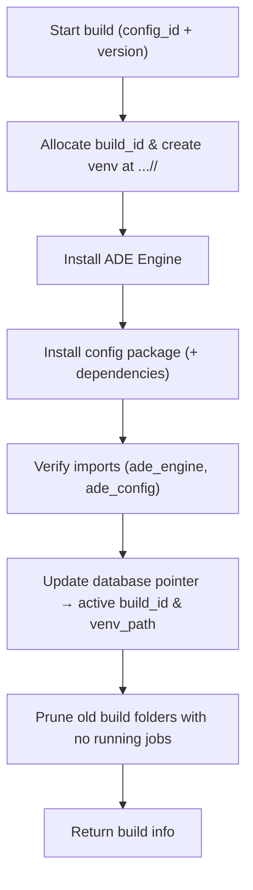

# 02 — Build: Freeze the Runtime (Virtual Environment)

When you press **Build** in the frontend config builder, ADE takes your editable configuration and turns it into a **ready‑to‑run runtime environment**.
This process—called a **build**—packages your configuration together with the ADE Engine in an isolated Python environment.
That environment is then reused for every job that runs against that configuration version.

---

## What a Build Does

Each build creates a **virtual environment** (a “venv”)—a private folder containing:

1. **A dedicated Python interpreter**, separate from the system one.
2. **The ADE Engine** (`ade_engine`) — the runtime that knows how to process spreadsheets and apply your rules.
3. **Your Config Package** (`ade_config`) — the detectors, transforms, validators, and hooks that define your logic.

Once built, every job for that configuration runs inside this frozen environment, guaranteeing that results are **reproducible**, **auditable**, and **isolated** from other workspaces.

---

## Where Builds Are Stored

The location of virtual environments is controlled by `ADE_VENVS_DIR`.
If you don’t set it, ADE defaults to `./data/.venv` (ignored by Git).
If you do set it—e.g., to a mounted volume—builds persist there.

Each build gets its **own folder named by `build_id`**:

```text
./data/.venv/
└─ <workspace_id>/
   └─ <config_id>/
      └─ <build_id>/           # unique per build
         ├─ bin/python
         └─ <site-packages>/
            ├─ ade_engine/...  # installed engine
            └─ ade_config/...  # installed config package
```

ADE maintains **one active build per configuration**. The **database** stores which `build_id` is active. Older folders are removed when safe (see Cleanup).

---

## How a Build Works (Step by Step)



**Key points**

* **Atomic by pointer:** ADE updates the **database pointer** only after a successful build and verification.
* **No rename needed:** each build has its own folder; switching is a DB update.
* **Safe on failure:** if the build fails, ADE **deletes** the partially built folder and leaves the previous active build unchanged.
* **Fast installs:** the pip cache (`ADE_PIP_CACHE_DIR`) accelerates rebuilds by reusing downloaded wheels.

---

## Database Tracking

Build metadata is stored in a small SQLite table so the API/UI can check status quickly.

| Field            | Description                                  |
| ---------------- | -------------------------------------------- |
| `workspace_id`   | Workspace the build belongs to               |
| `config_id`      | Config this build represents                 |
| `config_version` | Version or digest used during build          |
| `build_id`       | Unique identifier (ULID)                     |
| `status`         | `building`, `active`, or `failed`            |
| `engine_version` | ADE Engine version used                      |
| `python_version` | Interpreter version                          |
| `venv_path`      | Full path including `<build_id>/`            |
| `started_at`     | When this build began (only while building)  |
| `built_at`       | Timestamp when build completed               |
| `expires_at`     | Optional expiration (if TTL policy enabled)  |
| `last_used_at`   | Updated each time a job runs with this build |
| `error`          | Failure message, if applicable               |

The **DB pointer** (`build_id`, `venv_path`, `status`) is authoritative. Jobs use this pointer.

---

## Change Detection & Rebuild Triggers

ADE maintains **one active build per configuration** and rebuilds only when needed.

ADE (re)builds when any of the following change:

* No active build exists for the configuration.
* `config_version` (or content digest) changed.
* `engine_version` changed.
* `python_version` changed.
* The build expired (`expires_at`), if TTL is enabled.
* The request sets `force=true`.

Otherwise, ADE reuses the active build. Requests are **idempotent**—you get the current active pointer.

---

## Concurrency & Safety

**Simple, DB‑based dedupe (no per‑config file locks):**

* **Single‑builder rule:** the first request sets a row to `status="building"`. A unique index guarantees **at most one building row** per `(workspace_id, config_id)`.
  Subsequent requests **see** the `building` state and **do not** start another build.

* **Coalescing:**

  * For the **Build** button (interactive UI), if a build is already in progress, `PUT /build` returns `200 OK` with `"status":"building"` so the client can poll `GET /build`.
  * For **job submission** (server‑side), if a build is in progress, the server **waits briefly** for it to finish (see *Timeouts & Wait Behavior*) to avoid stampedes when many documents arrive at once.

* **No half builds:** the active pointer is only updated after imports succeed.

This keeps behavior correct and predictable without introducing filesystem locks.

---

## Timeouts & Wait Behavior

**Build timeout:**

* A single build is capped by `ADE_BUILD_TIMEOUT_SECONDS`.
* If exceeded (including crash/kill), the build is marked `failed` and any partial folder is deleted.

**Ensure wait (server‑side jobs):**

* When a job calls `ensure_build()` and finds `status="building"`, the server **waits up to `ADE_BUILD_ENSURE_WAIT_SECONDS`** for the active pointer to flip.
* If it flips within that window, the job proceeds. Otherwise, the job submission returns a retriable error (e.g., `409 build_in_progress`) and can retry shortly.

**UI behavior (Build button):**

* `PUT /build` returns immediately with `"status":"building"` when another build is already running; the UI polls `GET /build` until `active` or `failed`.

---

## Crash Recovery & Stale Build Healing

If the app crashes mid‑build, you won’t get stuck:

* Every `building` row stores a `started_at` timestamp.
* On **startup** and on every `ensure_build()` call, ADE checks for **stale** building rows:

  * If `now - started_at > ADE_BUILD_TIMEOUT_SECONDS`, ADE marks the row `failed` and deletes the partial folder (if present).
  * The next ensure will start a fresh build normally.

This self‑healing logic guarantees that a crash during build does not permanently block new builds.

---

## Cleanup

**On failure:** delete the just‑created `<build_id>/` folder and set `status=failed` with an error message.

**On success:** after switching the pointer, **prune old build folders** that are **not** the active pointer and have **no running jobs**.
Pruning can happen immediately after activation and/or via a periodic sweep.

**On startup / periodic sweep:** remove any `<build_id>` folders that aren’t the active pointer and aren’t referenced by any job.

---

## Jobs and Build Reuse

Before each job, the backend calls `ensure_build(workspace_id, config_id)`:

* If a valid active build exists, it returns the **current pointer** (`build_id`, `venv_path`).
* Otherwise, it builds a new one and then returns the pointer.

Jobs launch using the venv from the pointer:

```bash
${ADE_VENVS_DIR}/<workspace_id>/<config_id>/<build_id>/bin/python \
  -I -B -m ade_engine.worker <job_id>
```

> This work package describes the production worker entry point. The current repo
> ships a placeholder CLI exposed via `python -m ade_engine`, which prints the
> installed manifest so you can smoke-test a build until the job service is wired
> up.

Jobs never install packages; they always run inside a verified venv.
The job record stores the `build_id` used, for audit and reproducibility.

---

## API Endpoints

Each configuration has a **single build resource**.

### Get current build

```
GET /api/v1/workspaces/{workspace_id}/configurations/{config_id}/build
```

### Create or rebuild (idempotent)

```
PUT /api/v1/workspaces/{workspace_id}/configurations/{config_id}/build
```

Body:

```json
{ "force": false }
```

* `200 OK` — returned existing active build, or `{"status":"building"}` if a build is already in progress, or the newly built pointer when complete (server may wait for jobs path; UI may poll).
* `409 Conflict` — optional strategy if you choose not to block for certain callers.
* `5xx` — build failed; `error` contains the reason.

### Delete build

```
DELETE /api/v1/workspaces/{workspace_id}/configurations/{config_id}/build
```

Removes the **active** build folder and clears the DB record. The next job or `PUT` will rebuild as needed.

> **Jobs API (submit):** clients provide `workspace_id` and `config_id`. The server resolves and records `build_id` at submit time. An optional `build_id` override may be supported for debugging.

---

## Environment Variables

| Variable                        | Default                | Description                                     |
| ------------------------------- | ---------------------- | ----------------------------------------------- |
| `ADE_DOCUMENTS_DIR`             | `./data/documents`     | Uploaded files + generated artifacts            |
| `ADE_VENVS_DIR`                 | `./data/.venv`         | Where virtual environments are created          |
| `ADE_PIP_CACHE_DIR`             | `./data/cache/pip`     | Cache for pip downloads (safe to delete)        |
| `ADE_BUILD_TTL_DAYS`            | —                      | Optional expiry for builds                      |
| `ADE_ENGINE_SPEC`               | `packages/ade-engine/` | How to install the engine (path or pinned dist) |
| `ADE_PYTHON_BIN`                | system default         | Python executable to use for `venv` (optional)  |
| `ADE_BUILD_TIMEOUT_SECONDS`     | `600`                  | Max duration for a single build before failing  |
| `ADE_BUILD_ENSURE_WAIT_SECONDS` | `30`                   | How long server waits for an in‑progress build  |
| `ADE_MAX_CONCURRENCY`           | `2`                    | Maximum concurrent builds/jobs                  |
| `ADE_JOB_TIMEOUT_SECONDS`       | `300`                  | Hard timeout for jobs                           |
| `ADE_WORKER_CPU_SECONDS`        | `60`                   | CPU limit per job                               |
| `ADE_WORKER_MEM_MB`             | `512`                  | Memory limit per job                            |
| `ADE_WORKER_FSIZE_MB`           | `100`                  | Max file size a job may create                  |

---

## Backend Architecture (Essentials)

* **Router** — `GET/PUT/DELETE /build` per configuration.
* **Service (`ensure_build`)** — checks the DB, computes the fingerprint, applies TTL/force rules, **uses DB `status="building"` to deduplicate concurrent requests** (coalescing), self‑heals stale `building` rows, and triggers the builder if needed.
* **Builder** — creates `…/<build_id>/`, installs engine + config, verifies imports, **updates the DB pointer on success**, deletes the folder on failure, and triggers pruning of old builds with no running jobs.
* **Jobs** — call `ensure_build()` then run the worker using the returned `venv_path`. Each job row stores `build_id`.
* **Database** — one row per build; a unique constraint guarantees **one active** build per `(workspace_id, config_id)`.

---

## Summary

* Keep it simple: **DB‑based dedupe** guarantees **one** build at a time per config—no filesystem locks.
* **Coalesce** concurrent requests: UI returns `"building"` quickly; jobs wait briefly for the pointer to flip.
* **Self‑heal** stale `building` rows after crashes using `started_at + ADE_BUILD_TIMEOUT_SECONDS`.
* Allow **rebuilds while jobs run**; prune old builds only when unreferenced.
* Jobs **don’t pass** `build_id`—the server chooses and **records** it for reproducibility.
* No renames, no symlinks—just clean pointer updates, timeouts, and simple cleanup.
