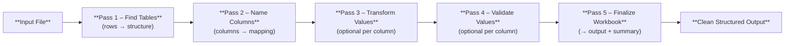

# ADE — Developer Guide

## What is ADE?

ADE is a lightweight engine that takes messy Excel files and turns them into clean, consistent spreadsheets.
It does this automatically through a few simple “passes.” Each pass performs a clear task: first finding tables, then understanding what each column represents, and finally writing a new, standardized workbook — transforming and validating values along the way.

In short, ADE helps you go from *unstructured input* to *reliable output* without manual cleanup.

---

## Key Concepts

#### **1. Streaming I/O — ADE reads files as a stream, not all at once.**

Instead of loading entire spreadsheets into memory, ADE reads them *row by row*.
This streaming approach keeps processing fast and memory-efficient, even for huge files.
It also enables early detection of structure — ADE can begin identifying headers and tables before the full file has been read.

#### **2. Passes — ADE cleans data step-by-step through a simple pipeline.**

ADE processes files through several small, logical passes — each one building on the last:



Each pass has a clear, focused purpose:

* **Pass 1 — Find Tables:** Scans the spreadsheet row-by-row to identify table boundaries and headers.
* **Pass 2 — Name Columns:** Matches each column to a known field (like *Employee ID* or *Start Date*) using detection rules from the config.
* **Pass 3 — Transform Values (optional):**
  If a column defines a `transform` function, ADE calls it for each cell to clean or standardize the value (e.g., trim spaces, fix date formats).
  The transformed value replaces the original in memory — nothing is deleted or lost.
* **Pass 4 — Validate Values (optional):**
  If the column defines a `validate` rule, ADE checks each value (e.g., must match `YYYY-MM-DD`, must be numeric).
  Validation results are recorded for reporting but never alter the data itself.
* **Pass 5 — Finalize Workbook:** Writes the cleaned and validated data into a normalized output file, with summaries of transformations and issues.

#### **3. Config Packages — Rules live in portable, versioned folders.**

All processing logic comes from a **config package**: a small folder of Python scripts that describe how to detect rows, name columns, and (optionally) transform or validate values.
Because configs are just files, you can version-control them, share them between environments, and activate them per workspace.
This makes ADE’s behavior fully deterministic and reproducible.

#### **4. Artifact JSON — One evolving object carries context through every pass.**

During a job, ADE maintains a single **artifact JSON** file that holds the current state of processing.
It begins with basic structure (sheets, bounds, headers) and accumulates mappings, transformations, and validation results as passes run.
By the end, the artifact becomes a complete, transparent record of *how* ADE interpreted and cleaned the input file — perfect for audits, debugging, and reproducibility.

---

## How ADE points to places in a sheet (A1 ranges)

ADE uses **Excel A1 notation** to identify cells and ranges (e.g., `"B4"`, `"B4:G159"`). This is the same notation you see in Excel’s name box, so it’s immediately recognizable.

When ADE reports validation issues or table bounds, you can jump to the exact spot in the original file.

- **Cell:** `"B4"`  
- **Range:** `"B4:G159"`  
- **Header row index:** numeric (easier for code)  
- **Data range:** table range **without** the header row (e.g., `"B5:G159"`)

---

## The artifact JSON

A compact, append‑only JSON file that records how ADE read, mapped, transformed, validated, and wrote your data.

It’s your **audit trail** and **API** in one place: every pass reads from it and writes back to it. It stores **decisions and traces**, not raw cell data.

**Root (minimal shape)**
```json
{
  "artifact_version": "1.1",
  "job": {
    "job_id": "job_2025-10-29T12-45-00Z_001",
    "source_file": "employees.xlsx",
    "config_id": "cfg_acme_v13",
    "created_at": "2025-10-29T12:45:00Z"
  },
  "engine": {
    "writer": {
      "mode": "row_streaming",
      "append_unmapped_columns": true,
      "unmapped_prefix": "raw_"
    }
  },
  "rules": {
    "row_types": {
      "row.header.text_density":  { "impl": "row_types/header.py:detect_text_density",  "version": "a1f39d" },
      "row.header.synonym_hits":  { "impl": "row_types/header.py:detect_synonym_hits",  "version": "a1f39d" },
      "row.data.numeric_density": { "impl": "row_types/data.py:detect_numeric_density", "version": "b1130d" }
    },
    "column_detect": {
      "col.member_id.pattern":   { "impl": "columns/member_id.py:detect_pattern",      "version": "b77bf2" },
      "col.department.synonyms": { "impl": "columns/department.py:detect_synonyms",    "version": "c1d004" }
    },
    "transform": {
      "transform.member_id":     { "impl": "columns/member_id.py:transform",           "version": "d93210" }
    },
    "validate": {
      "validate.member_id":      { "impl": "columns/member_id.py:validate",            "version": "ee12c3" },
      "validate.required":       { "impl": "columns/_shared.py:validate_required",     "version": "0aa921" }
    }
  },
  "sheets": [],
  "output": null,
  "summary": null,
  "pass_history": []
}
```

**How rule tracing stays readable**
The `rules` section acts as a **registry**. Everywhere else we reference rules by short IDs (like `"col.member_id.pattern"`). That keeps the artifact small, consistent, and fully auditable.

---

## Pass‑by‑pass: how the artifact grows

Each subsection starts by explaining the *why*, then shows a **small** JSON slice for the *how*. Ellipses (`"..."`) mean “unchanged content.”

### Pass 1 — Find structure (row detection)

ADE scans rows to decide which row is the **header** and where each **table** begins and ends.

Later phases rely on good bounds and header text to make correct mappings.

**Appends:** `sheets[].row_classification`, `sheets[].tables[]`

```json
{
  "sheets": [
    {
      "id": "sheet_1",
      "name": "Employees",
      "row_classification": [
        {
          "row_index": 4,
          "label": "header",
          "confidence": 0.91,
          "scores_by_type": { "header": 1.24, "data": 0.11 },
          "rule_traces": [
            { "rule": "row.header.text_density",  "delta": 0.62 },
            { "rule": "row.header.synonym_hits",  "delta": 0.28 },
            { "rule": "row.data.numeric_density", "delta": -0.05 }
          ]
        }
      ],
      "tables": [
        {
          "id": "table_1",
          "range": "B4:G159",
          "data_range": "B5:G159",
          "header": {
            "kind": "raw",  // or "synthetic" if no header found
            "row_index": 4,
            "source_header": ["Employee ID", "Name", "Department", "Start Date"]
          },
          "columns": [
            { "column_id": "col_1", "source_header": "Employee ID" },
            { "column_id": "col_2", "source_header": "Name" },
            { "column_id": "col_3", "source_header": "Department" }
          ]
        }
      ]
    }
  ],
  "pass_history": [
    { "pass": 1, "name": "structure", "completed_at": "2025-10-29T12:45:07Z" }
  ]
}
```

> **No obvious header?** ADE sets `"header.kind": "synthetic"` and uses `["Column 1", "Column 2", …]` so mapping can still proceed.

---

### Pass 2 — Map raw columns to target fields

**Plain language:** For each table, ADE checks every raw column and asks, “Which **target field** is this?” Detectors add score deltas; top score wins.

**Why this matters:** Mapping defines how we’ll build the normalized output.

**Appends:** `tables[].mapping[]`, `tables[].target_fields`

```json
{
  "sheets": [
    {
      "id": "sheet_1",
      "tables": [
        {
          "id": "table_1",
          "mapping": [
            {
              "raw": { "column": "col_1", "header": "Employee ID" },
              "target_field": "member_id",
              "score": 1.8,
              "contributors": [
                { "rule": "col.member_id.pattern", "delta": 0.90 }
              ]
            },
            { "raw": { "column": "col_2", "header": "Name" }, "target_field": "first_name", "score": 1.2 },
            {
              "raw": { "column": "col_3", "header": "Department" },
              "target_field": "department",
              "score": 0.9,
              "contributors": [
                { "rule": "col.department.synonyms", "delta": 0.60 }
              ]
            }
          ],
          "target_fields": ["member_id", "first_name", "department"]
        }
      ]
    }
  ],
  "pass_history": [
    { "pass": 2, "name": "mapping", "completed_at": "2025-10-29T12:45:12Z" }
  ]
}
```

---

### Passes 3 & 4 — Transform and validate (while writing)

**Plain language:** ADE writes the normalized sheet **row by row**. For each cell, it applies the configured **transform** (if any) and then runs **validate** rules.

**Why this matters:** you get a clean output and an actionable issues list with exact locations, without keeping the whole sheet in memory.

**Appends:** `tables[].transforms[]`, `tables[].validation.*`

```json
{
  "sheets": [
    {
      "id": "sheet_1",
      "tables": [
        {
          "id": "table_1",
          "transforms": [
            { "target_field": "member_id",  "transform": "transform.member_id", "changed": 120, "total": 155, "notes": "uppercased + stripped non-alnum" },
            { "target_field": "first_name", "transform": null,                   "changed": 0,   "total": 155 }
          ],
          "validation": {
            "issues": [
              {
                "a1": "B20",
                "row_index": 20,
                "target_field": "member_id",
                "code": "pattern_mismatch",
                "severity": "error",
                "message": "Does not match expected pattern",
                "rule": "validate.member_id"
              }
            ],
            "summary_by_field": {
              "member_id": { "errors": 3, "warnings": 1, "missing": 0 }
            }
          }
        }
      ]
    }
  ],
  "pass_history": [
    { "pass": 3, "name": "transform", "completed_at": "2025-10-29T12:45:22Z" },
    { "pass": 4, "name": "validate",  "completed_at": "2025-10-29T12:45:24Z" }
  ]
}
```

> Even though transform and validate happen **inline** with writing, we record them as separate passes so the timeline is easy to read.

---

### Pass 5 — Finish the normalized workbook

**Plain language:** ADE finalizes the **Normalized** sheet, using the mapping and your manifest’s order/labels. It can **append unmapped** columns at the right if you want.

**Why this matters:** you get the same headers and order every time, and you don’t lose context from leftovers.

**Appends:** `output`, `summary`

```json
{
  "output": {
    "format": "xlsx",
    "sheet": "Normalized",
    "path": "jobs/2025-10-29/normalized.xlsx",
    "column_plan": {
      "target": [
        { "field": "member_id",  "output_header": "Member ID",  "order": 1 },
        { "field": "first_name", "output_header": "First Name", "order": 2 },
        { "field": "department", "output_header": "Department", "order": 3 }
      ],
      "appended_unmapped": [
        { "source_header": "Start Date", "output_header": "raw_Start_Date", "order": 4 }
      ]
    }
  },
  "summary": {
    "rows_written": 155,
    "columns_written": 4,
    "issues_found": 4
  },
  "pass_history": [
    { "pass": 5, "name": "generate", "completed_at": "2025-10-29T12:45:29Z" }
  ]
}
```

---

## Minimal artifact skeleton

```json
{
  "artifact_version": "1.1",
  "job": { "job_id": "...", "source_file": "...", "config_id": "...", "created_at": "..." },
  "engine": { "writer": { "mode": "row_streaming", "append_unmapped_columns": true, "unmapped_prefix": "raw_" } },
  "rules": { "row_types": { }, "column_detect": { }, "transform": { }, "validate": { } },

  "sheets": [
    {
      "id": "sheet_1",
      "name": "Employees",

      "row_classification": [ /* Pass 1 traces (row scores + rule deltas) */ ],

      "tables": [
        {
          "id": "table_1",
          "range": "B4:G159",
          "data_range": "B5:G159",
          "header": { "kind": "raw", "row_index": 4, "source_header": [ "..." ] },
          "columns": [ { "column_id": "col_1", "source_header": "..." } /* … */ ],

          "mapping":    [ /* Pass 2 raw→target with contributors */ ],
          "transforms": [ /* Pass 3 per-field summaries */ ],
          "validation": {
            "issues": [ /* Pass 4 cell-level issues with A1 + rule id */ ],
            "summary_by_field": { /* counts by target field */ }
          }
        }
      ]
    }
  ],

  "output":  { "format": "xlsx", "sheet": "Normalized", "path": "...", "column_plan": { /* headers + order */ } },
  "summary": { "rows_written": 0, "columns_written": 0, "issues_found": 0 },
  "pass_history": [
    { "pass": 1, "name": "structure", "completed_at": "..." }
    /* passes 2..5 appended over time */
  ]
}
```

---

## How configs and jobs fit into this story

* A **config package** defines your rules (detectors, transforms, validations) and column order/labels. Start here to customize behavior. See the **[config package guide](./01-config-packages.md)** for folder layout, manifest schema, and script contracts.
* A **job** applies one active config to one file, building the artifact as it runs. See the **[job orchestration guide](./02-job-orchestration.md)** for execution details and streaming behavior.

---

## Recap: why ADE’s design stays simple

* **Familiar references**: A1 ranges + simple IDs (`sheet_1/table_1/col_1`) make locations obvious.
* **Human flow**: *Detect what’s there → name it → write it* mirrors how people clean spreadsheets.
* **Explainable**: rule deltas and scores show **why** ADE made each choice.
* **Safe & small**: no raw cell data in the artifact; issues say **where** and **what**.
* **Scales with file size**: streaming read/write keeps memory flat.

---

### Where to go next

* Configure rules and structure: **[Config package guide](./01-config-packages.md)**
* Understand the engine passes: **[Job orchestration guide](./02-job-orchestration.md)**
* Browse definitions quickly: **[Shared terminology](./12-glossary.md)**
