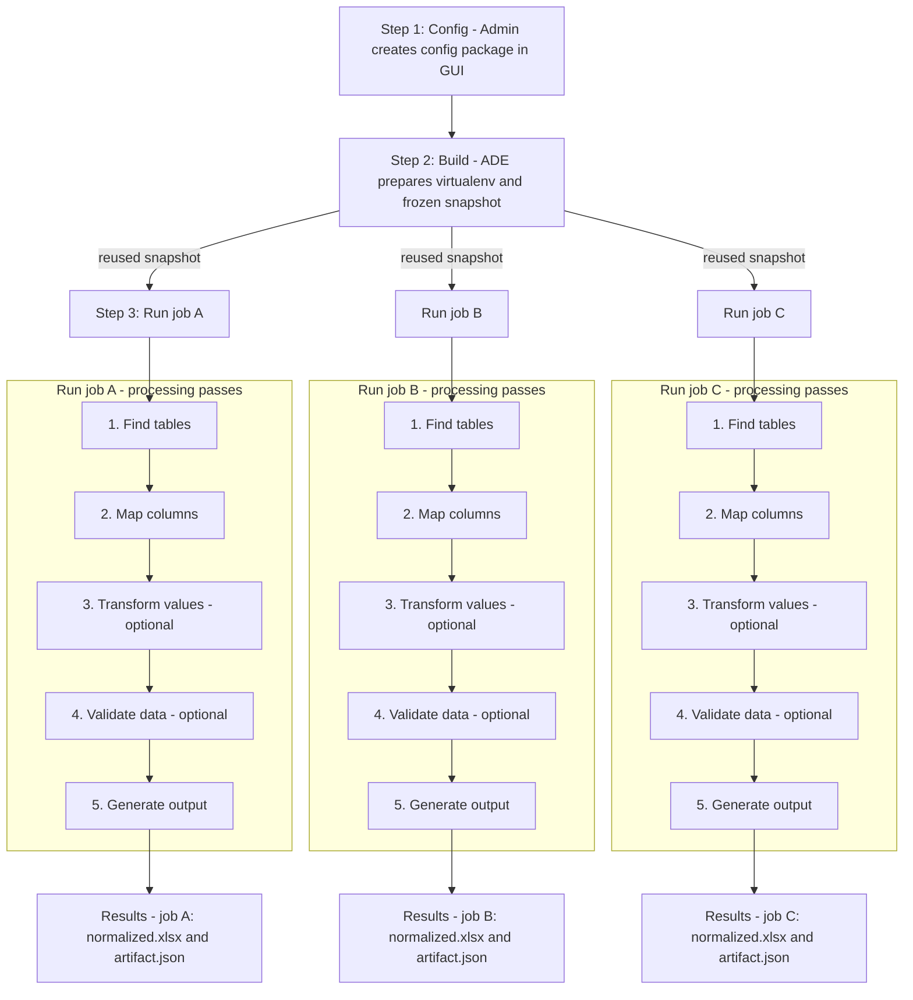

# Developer Guide

## 1. What ADE Is — and Why It Exists

**ADE (Automatic Data Extractor)** turns messy spreadsheets — inconsistent headers, irregular tables, and varying formats — into clean, structured workbooks you can trust.

It does this using small, human-readable Python scripts that describe *how* to find, map, and clean data.
Those scripts live inside a **[config package](./01-config-packages.md)** — a simple folder that tells ADE *how to think* about a file.

Instead of machine learning, ADE runs on *rules you write*.
It’s explainable, reproducible, and deterministic:

> same input + same config = the same output, every time.

---

## The Persistent Storage Layout (ADE_DATA_DIR)

Everything ADE does—config packages, environments, jobs, logs, and caches—lives neatly under one data root directory, usually ./data during development. In production, this folder is typically mounted to an external file share (e.g., Azure File Storage) so it persists across restarts.

Each folder has one job:

* **`config_packages/`** — where configs you author in the GUI live
* **`venvs/`** — where ADE builds and stores virtual environments for each config
* **`jobs/`** — where each run’s inputs, outputs, and logs are kept
* **`documents/`** — where shared uploaded files are stored

```text
${ADE_DATA_DIR}/                                  # Root folder for all ADE state (default: ./data)
├─ config_packages/                               # Editable config packages you author in the UI (source of truth)
│  └─ <config_id>/                                # One folder per published config (immutable once published)
│     ├─ manifest.json                            # Config manifest (engine defaults, field metadata, script paths)
│     ├─ columns/                                 # Field logic: detect → transform (optional) → validate (optional)
│     │  └─ <field>.py                            # One Python file per target field (e.g., member_id.py)
│     ├─ row_types/                               # Row-level detectors used to find tables and header rows
│     │  ├─ header.py                             # Heuristics that vote for “this row looks like a header”
│     │  └─ data.py                               # Heuristics that vote for “this row looks like data”
│     ├─ hooks/                                   # Optional lifecycle hooks that run around job stages
│     │  ├─ on_job_start.py                       # Runs before ADE starts processing the file
│     │  ├─ after_mapping.py                      # Runs after column mapping completes
│     │  ├─ after_transform.py                    # Runs after transforms complete
│     │  └─ after_validate.py                     # Runs after validations complete
│     └─ requirements.txt?                        # Optional per-config dependencies installed during prepare
│
├─ venvs/                                         # Prepared virtual environments (built once per config, reused by jobs)
│  └─ <config_id>/                                # Matches a config in config_packages/<config_id>
│     ├─ bin/python                               # Python interpreter used at runtime for this config’s jobs
│     └─ ade-build/                               # Read-only build artifacts used by jobs (safe to import from)
│        ├─ config_package_snapshot/              # Frozen copy of your scripts taken at prepare time (deterministic)
│        ├─ packages.txt                          # Exact dependency versions (output of `pip freeze`)
│        ├─ install.log                           # Text log of `pip install` (diagnostics for prepare failures)
│        └─ build.json                            # Build metadata: { content_hash, deps_hash, prepared_at, ... }
│
├─ jobs/                                          # One working directory per job (inputs, outputs, and audit trail)
│  └─ <job_id>/                                   # A single run of ADE on a single input using a single config
│     ├─ inputs/                                  # Uploaded files for this job (e.g., spreadsheets to process)
│     ├─ artifact.json                            # Human/audit-readable record of what happened and why (no raw dumps)
│     ├─ normalized.xlsx                          # Final clean workbook produced by ADE for this job
│     ├─ events.ndjson                            # Append-only timeline: enqueue, start, finish, error (for debugging)
│     ├─ run-request.json                         # Snapshot of parameters handed to the worker subprocess
│     └─ .venv  →  ../../venvs/<config_id>/       # Symlink to the prepared environment used by this job (no copying)
│
├─ document/                                      # Document store (original uploads, normalized files, etc..)
│  ├─ <document_id>.<ext>                          # Raw uploaded file (primary store)
│
├─ db/                                            # Application database (SQLite by default; easy to back up)
│  └─ backend.app.sqlite                          # Single-file SQLite database containing ADE metadata and state
│
└─ cache/                                         # Local caches to make prepares faster and reduce network usage
   └─ pip/                                        # Pip download/build cache (safe to delete; will be repopulated)
```

---

## 2. The Big Idea — How ADE Works

ADE is a small, deterministic engine.
You teach it *how* to interpret a spreadsheet, and it does the rest — the same way, every time.

At a high level, ADE runs in three steps:

1. **Config — Define the rules**
   An admin authors a [config package](./01-config-packages.md) in the GUI.
   It’s a folder of small Python scripts that describe how to detect tables, map columns, and (optionally) transform or validate data.

2. **Build — Freeze the environment**
   ADE builds a dedicated Python virtual environment for that config, installs dependencies, and freezes a snapshot of your scripts.
   This snapshot is versioned and reusable — the same input and config always yield the same output.

3. **Run — Process files**
   When jobs execute, they reuse the prepared environment.
   Each job applies the same five passes — **Find → Map → Transform → Validate → Generate** — and produces its own results:

   * `normalized.xlsx` — the clean, structured workbook
   * `artifact.json` — the audit trail of what happened and why

Once built, the environment can be reused by **many jobs**.
That means faster runs, no redundant installs, and perfect reproducibility.
You only rebuild when the config or its dependencies change.

---

### Visual Overview



---

### Key Idea

> **Prepare once, run many.**
> Build the environment once per config; reuse it for every job.
> Each run is isolated, reproducible, and fully auditable — the same logic, the same results, every time.

---
Here’s a fully rewritten, polished continuation that matches the tone, rhythm, and clarity of your new *Big Idea* section — tighter, more narrative, less repetitive, and structured for developers who want to *understand, not just operate* ADE.

It preserves all the meaning from your original sections but reads like a unified, thoughtfully written developer story.

---

## 7. The Runtime — How Jobs Actually Run

When a job is submitted, ADE places it into a lightweight internal queue.
A small pool of worker subprocesses picks up queued jobs one at a time.
Each worker launches in isolation, loads the frozen snapshot for its assigned config, and executes the five passes — **Find → Map → Transform → Validate → Generate**.

Every worker process runs inside its own sandbox.
Network access is disabled by default, and CPU, memory, and file-size limits ensure that one misbehaving script can’t affect others.
When finished, the worker writes three outputs back to disk:

* `normalized.xlsx` — the clean workbook
* `artifact.json` — the audit record
* `events.ndjson` — a chronological event log for debugging

The runtime design stays intentionally simple:

* One FastAPI service — no external queue brokers or daemons
* Predictable concurrency for steady throughput
* Safe restarts and easy recovery on reboot

*Deep dive:* [Job Orchestration → Queue & Workers](./02-job-orchestration.md#queue-and-worker)

---

## 8. Safety, Determinism, and Reproducibility

ADE treats every config package as untrusted code.
To protect stability and ensure explainability, each job runs inside a tightly isolated environment:

* Each run executes in its **own subprocess**, separate from the main API.
* **Network access** is off by default (enable only via `runtime_network_access`).
* **Resource limits** cap CPU time, memory, and file size.
* ADE logs **only structured metadata** — never raw data or file contents.

The frozen `snapshot/` folder guarantees reproducibility.
Even if you edit or republish a config later, old jobs remain fully explainable — each one references the exact snapshot used at execution time.

*Learn more:*
[Config Packages → Hooks and Safety](./01-config-packages.md#hooks)
[Job Orchestration → Isolation and Safety](./02-job-orchestration.md#isolation-and-safety)

---

## 9. Environment and Configuration

ADE’s behavior is controlled entirely through environment variables — simple, predictable, and portable.
The key one is **`ADE_DATA_DIR`**, which defines where ADE stores all runtime data.
Every other path (`config_packages/`, `venvs/`, `jobs/`, etc.) is derived from it.

Performance and safety knobs include:

| Variable                             | Default                   | What it controls                                               |
| ------------------------------------ | ------------------------- | -------------------------------------------------------------- |
| `ADE_DATA_DIR`                       | `./data`                  | Root directory for all ADE state                               |
| `ADE_CONFIGS_DIR`                    | `$ADE_DATA_DIR/configs`   | Where editable config packages live                            |
| `ADE_VENVS_DIR`                      | `$ADE_DATA_DIR/venvs`     | One virtualenv per `config_id` (prepare step)                  |
| `ADE_JOBS_DIR`                       | `$ADE_DATA_DIR/jobs`      | Per‑job working directories                                    |
| `ADE_PIP_CACHE_DIR`                  | `$ADE_DATA_DIR/cache/pip` | Pip cache for wheels/sdists (speeds prepares)                  |
| `ADE_WHEELHOUSE`                     | *(unset)*                 | Local wheels dir for offline/air‑gapped prepares               |
| `ADE_MAX_CONCURRENCY`                | `2`                       | Worker subprocesses in parallel                                |
| `ADE_QUEUE_SIZE`                     | `10`                      | Max waiting jobs before 429 is returned                        |
| `ADE_JOB_TIMEOUT_SECONDS`            | `300`                     | Wall‑clock timeout per job                                     |
| `ADE_WORKER_CPU_SECONDS`             | `60`                      | CPU limit per job (rlimit)                                     |
| `ADE_WORKER_MEM_MB`                  | `512`                     | Memory limit per job (MiB, rlimit)                             |
| `ADE_WORKER_FSIZE_MB`                | `100`                     | Max file size a job can create (MiB, rlimit)                   |
| `ADE_RUNTIME_NETWORK_ACCESS_DEFAULT` | `false`                   | Default runtime network policy (prepare may still use network) |


Defaults are conservative for development and scale easily upward in production.

---

## 10. Where to Go Next

If you’re new to ADE, start small — create a config that maps a single table, then follow the system end to end.
From there, explore the deeper guides in this order:

1. **[Config Packages](./01-config-packages.md)** — how you define ADE’s behavior
2. **[Job Orchestration](./02-job-orchestration.md)** — how jobs move through the pipeline
3. **[Artifact Reference](./14-job_artifact_json.md)** — how ADE records its audit trail
4. **[Glossary](./12-glossary.md)** — common terms and system vocabulary