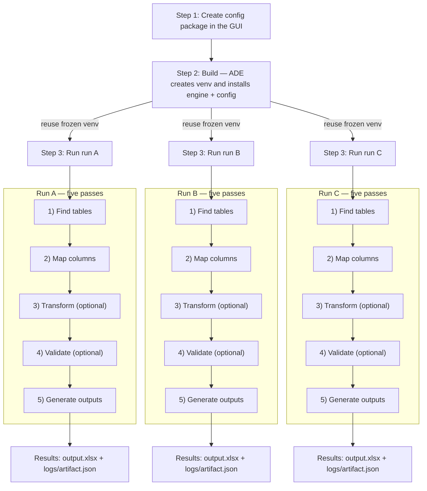

# Developer Guide

ADE turns messy spreadsheets into consistent, auditable workbooks through a simple, repeatable flow:

1. **Config** — define detection, mapping, and transformation rules ([`01-config-packages.md`](./01-config-packages.md))
2. **Build** — set up a dedicated virtual environment (`.venv/<config_id>/<build_id>/`) with `ade_engine` and your `ade_config` installed
3. **Run** — use that frozen environment to process one or more input files deterministically

At run runtime, the **ADE Engine** and your versioned **ADE Config** are installed in an isolated virtual environment (venv) and produce a normalized Excel workbook.

## Repository and Runtime Layout

The ADE monorepo brings together four cooperating layers:

* **Frontend (React Router)** — web app where workspace owners create and manage config packages, edit code, and trigger builds and runs.
* **Backend (Python FastAPI)** — API service that stores metadata, builds isolated Python environments, and orchestrates run execution.
* **Engine (Python `ade_engine`)** — runtime module that executes inside the worker process, reading spreadsheets, applying detectors and hooks, and producing normalized outputs with full audit trails.
* **Config package (Python `ade_config`)** — built and managed in the frontend; defines the business logic that tells ADE how to detect, map, and transform data. Versioned for draft, testing, rollback, and extension through a flexible Python interface.

```text
automatic-data-extractor/
├─ apps/                                   # Deployable applications (things you run/ship)
│  ├─ ade-api/                             # FastAPI service (serves /api + static SPA)
│  │  ├─ pyproject.toml
│  │  ├─ src/ade_api/                      # settings, routers, features, shared modules, templates, web assets
│  │  ├─ migrations/                       # Alembic migration scripts
│  │  └─ tests/                            # API service tests
│  └─ ade-web/                             # React SPA (Vite)
│     ├─ src/                              # routes, components, features
│     ├─ public/                           # static public assets
│     ├─ package.json
│     └─ vite.config.ts
│
├─ packages/                               # Reusable libraries (imported by apps)
│  └─ ade-engine/                          # installable Python package: ade_engine
│     ├─ pyproject.toml
│     ├─ src/ade_engine/                   # engine runtime, IO, pipeline, hooks integration, bundled schemas
│     └─ tests/                            # engine unit tests
│
├─ tools/                                   # Python orchestration CLI (console script: ade)
│  └─ ade-cli/
│     ├─ pyproject.toml
│     └─ src/ade_tools/
├─ examples/                                # sample inputs/outputs for docs/tests
├─ docs/                                    # Developer Guide, HOWTOs, operations runbooks
├─ scripts/                                 # helper scripts (legacy node helpers, etc.)
│
├─ infra/                                   # deployment infra (container, compose, k8s, IaC)
│  ├─ docker/
│  │  └─ api.Dockerfile                     # multi-stage: build web → copy dist → apps/ade-api/src/ade_api/web/static
│  └─ compose.yaml                          # optional: local prod-style run
│
├─ .env.example                             # documented env vars for local/dev
├─ .editorconfig
├─ .pre-commit-config.yaml
├─ .gitignore
└─ .github/workflows/                       # CI: lint, test, build, publish
```

Bundled ADE config templates now live under `apps/ade-api/src/ade_api/templates/config_packages/` and ship with the backend package.

Everything ADE produces (config_packages, venvs, runs, logs, cache, etc.) is persisted under `./data/workspaces/<workspace_id>/...` by default. Set `ADE_WORKSPACES_DIR` to move the workspace root, or override `ADE_CONFIGS_DIR`, `ADE_VENVS_DIR`, `ADE_RUNS_DIR`, or `ADE_DOCUMENTS_DIR` to relocate a specific storage type—ADE always nests the workspace ID beneath the override. In production, mount this folder to external storage so it persists across restarts.

```text
./data/
├─ workspaces/
│  └─ <workspace_id>/
│     ├─ config_packages/           # GUI-managed installable config projects (source of truth)
│     │  └─ <config_id>/
│     │     ├─ pyproject.toml       # Distribution metadata (ade-config)
│     │     └─ src/ade_config/
│     │        ├─ column_detectors/ # detect → transform (opt) → validate (opt)
│     │        ├─ row_detectors/    # header/data row heuristics
│     │        ├─ hooks/            # on_run_start/after_mapping/before_save/on_run_end
│     │        ├─ manifest.json     # read via importlib.resources
│     ├─ .venv/                     # Python virtual environments organized by workspace
│     │  └─ <config_id>/<build_id>/ # unique per build
│     │     ├─ bin/python
│     │     └─ <site-packages>/
│     │        ├─ ade_engine/
│     │        └─ ade_config/
│     ├─ runs/
│     │  └─ <run_id>/
│     │     ├─ input/               # Uploaded files
│     │     ├─ output/              # Generated output files
│     │     └─ logs/
│     │        ├─ artifact.json     # human/audit-readable narrative
│     │        └─ events.ndjson     # append-only timeline
│     └─ documents/
│        └─ <document_id>.<ext>     # optional shared document store
│
├─ db/
│  └─ app.sqlite                    # SQLite in dev (or DSN for prod)
├─ cache/
│  └─ pip/                          # pip download/build cache (safe to delete)
└─ logs/                            # optional: centralized service logs
```

## Visual Overview



## Step 1: Config — Define the Rules

Every ADE workflow starts with a **config package** you create in the **in‑browser editor**. The editor lets you browse files, edit Python, and save changes in real time.

Under the hood, a config is just a Python package named **`ade_config`**. Inside it, you define three ideas that tell ADE how to read, interpret, and clean your spreadsheets:

1. **How to find the table**

   * *Row detectors*  — classify each row (header, data, separator, etc.) so ADE can pinpoint where each table begins and ends.

2. **What each column means**

   * *Column detectors*  — recognize fields like "Invoice Date" or "Amount," even when header names vary. This is how ADE maps columns reliably across inconsistent inputs.

3. **How to make the data trustworthy**

   * *Transforms (optional)* — clean or normalize values.
   * *Validators (optional)* — check that values match the expected format.
   * *Hooks (optional)* — run custom logic at key points in the run lifecycle.

### Lifecycle Hooks

Hooks give you precise control over the pipeline without changing the core engine. Each hook is an optional Python module that exposes a callable function and runs at a specific stage:

| Hook                   | Runs                           | Typical use                                                                      |
| ---------------------- | ------------------------------ | -------------------------------------------------------------------------------- |
| **`on_run_start.py`**  | Before any files are processed | Initialize shared state, load reference data, or record metadata in the artifact |
| **`after_mapping.py`** | After columns are mapped       | Adjust mappings, reorder fields, or correct mislabeled headers                   |
| **`before_save.py`**   | Just before output is written  | Add summary tabs, rename sheets, or tweak formatting                             |
| **`on_run_end.py`**    | After the run completes        | Clean up temporary resources or emit final notes                                 |

Each hook receives structured context objects (e.g., `run`, `table`, `book`) and can safely write observations to the audit artifact using `note()`.

### Example Config Package Layout

```text
./data/                                                  # Default root for ADE state
├─ config_packages/                                       # Editable config packages you author in the UI (source of truth)
│  └─ <config_id>/                                        # One folder per published config (immutable once published)
│     ├─ manifest.json                                    # Config manifest: metadata, defaults, entrypoints
│     ├─ pyproject.toml?                                  # Optional dependency list (supersedes requirements.txt)
│     ├─ column_detectors/                                # Field logic: detect → transform (optional) → validate (optional)
│     │  └─ <field>.py                                    # One Python file per target field (e.g., member_id.py)
│     ├─ row_detectors/                                   # Row-level detectors used to find tables and header rows
│     │  ├─ header.py                                     # Heuristics that vote for “this row looks like a header row”
│     │  └─ data.py                                       # Heuristics that vote for “this row looks like a data row”
│     ├─ hooks/                                           # Optional lifecycle hooks that run around run stages
│     │  ├─ on_run_start.py                               # def run(*, run, **_): initialize tiny policy/state; note() to artifact
│     │  ├─ after_mapping.py                              # def after_mapping(*, run, table, **_): correct mapping/order/labels
│     │  ├─ before_save.py                                # def before_save(*, run, book, **_): rename tab, add sheets, widths
│     │  └─ on_run_end.py                                 # def run(*, run, **_)
│     └─ __init__.py                                      # Required by Python; marks this folder as a package
```

> For a deeper look inside config packages, see ([`01-config-packages.md`](./01-config-packages.md)).

## Step 2: Build — Freeze the Environment

Click **Build** in the editor to lock your configuration into a self‑contained, reproducible runtime.

Behind the scenes ADE:

1. Creates a fresh virtual environment at `.venv/<config_id>/` using Python’s built‑in `venv`.
2. Installs the custom python **`ade_engine`** (the runtime that executes runs) and your custom configured **`ade_config`** (your rules created in step 1).
   If you declared dependencies in the config package `pyproject.toml`, those are installed here as well.

> You can build as often as you like while the config package is in **Draft**. Each build produces a clean virtual python environment.

## Step 3: Run — Process Files

Once the configuration environment is built, ADE can process real spreadsheets safely and consistently.

* Each run reuses the frozen virtual environment created in **Step 2: Build**.
* ADE launches an isolated worker that loads the **`ade_engine`** and your custom **`ade_config`**.
* The engine streams rows from the uploaded file through your detectors, transforms, and hooks, using your logic to identify tables, map columns, and clean or validate data.
* The result is a fully normalized Excel workbook, written along with a complete audit trail.

**Manifest check (current CLI)**

```bash
${ADE_VENVS_DIR}/<workspace_id>/.venv/<config_id>/<build_id>/bin/python -I -B -m ade_engine
```

This placeholder command prints the engine version together with the installed
`ade_config` manifest so you can verify a build without the UI. The production
worker entry point will eventually accept a `run_id` argument once the run
service orchestrator is in place.

All results are written atomically inside the run folder so you always have a consistent, inspectable record:

```
runs/<run_id>/
  input/
    input.xlsx
  output/
    output.xlsx       # final structured workbook
  logs/
    artifact.json     # full audit trail and rule explanations
    events.ndjson     # timeline of the run
```

## Environment & Configuration

ADE is configured via environment variables so it remains simple and portable. Defaults suit development and scale cleanly to production.

| Variable                  | Default                         | What it controls                                            |
| ------------------------- | ------------------------------- | ----------------------------------------------------------- |
| `ADE_WORKSPACES_DIR`      | `./data/workspaces`             | Workspace root for ADE storage                              |
| `ADE_DOCUMENTS_DIR`       | `./data/workspaces`             | Base for documents (`<ws>/documents/...`)                   |
| `ADE_CONFIGS_DIR`         | `./data/workspaces`             | Base for configs (`<ws>/config_packages/...`)               |
| `ADE_VENVS_DIR`           | `./data/workspaces`             | Base for venvs (`<ws>/.venv/<cfg>/<build>/...`)             |
| `ADE_RUNS_DIR`            | `./data/workspaces`             | Per‑run working directories (`<ws>/runs/<run_id>/...`)      |
| `ADE_PIP_CACHE_DIR`       | `./data/cache/pip`              | pip cache for wheels/sdists (speeds up building)            |
| `ADE_MAX_CONCURRENCY`     | `2`                             | Backend dispatcher parallelism                              |
| `ADE_QUEUE_SIZE`          | `10`                            | Max enqueued runs before the API returns 429                |
| `ADE_RUN_TIMEOUT_SECONDS` | `300`                           | Parent‑enforced wall‑clock timeout for a worker             |
| `ADE_WORKER_CPU_SECONDS`  | `60`                            | Best‑effort CPU limit per run (POSIX `rlimit`)              |
| `ADE_WORKER_MEM_MB`       | `512`                           | Best‑effort address‑space ceiling per run (POSIX `rlimit`)  |
| `ADE_WORKER_FSIZE_MB`     | `100`                           | Best‑effort max file size a run can create (POSIX `rlimit`) |

Workspace IDs are always nested beneath the configured roots, even when you override one storage type.

### Bypass authentication for local debugging

When you need to poke around the UI or APIs without creating accounts, set
`ADE_AUTH_DISABLED=true` in your `.env`. ADE will auto‑provision a development
user (default `developer@example.test`) with the `global-administrator` role and
skip every authentication/authorization gate. Never enable this in a shared or
production environment: every request is treated as trusted and CSRF checks are
ignored. You can customize the injected user with `ADE_AUTH_DISABLED_USER_EMAIL`
and `ADE_AUTH_DISABLED_USER_NAME`.

## Excel and CSV Support

ADE reads `.xlsx` and `.csv` inputs and always writes a normalized `.xlsx` workbook as the final output. Excel is handled by `openpyxl` in streaming mode (`read_only=True`, `data_only=True`); CSV uses the Python standard library with UTF‑8 as the default encoding. Other formats can be added later as pluggable readers without changing how configurations are authored.

## A First Run You Can Try Locally

You can exercise the complete path without the frontend. Copy the template to create a configuration, build the environment, and run a run by hand:

```bash
# 1) Create a per-config virtual environment and install engine + config (production installs)
python -m venv data/.venv/<config_id>
data/.venv/<config_id>/bin/pip install apps/ade-engine/
data/.venv/<config_id>/bin/pip install data/config_packages/<config_id>/
data/.venv/<config_id>/bin/pip freeze > data/.venv/<config_id>/ade-runtime/packages.txt

# 2) Smoke-test the installed manifest (placeholder runtime)
data/.venv/<config_id>/bin/python -I -B -m ade_engine
```

The CLI prints the ADE engine version plus the packaged `ade_config` manifest.
The worker command that accepts `run_id` will replace this once the full run
orchestrator lands.

## Troubleshooting and Reproducibility

If a build fails, re‑run the build action and check `packages.txt` to see the resolved dependency set. If imports fail inside the worker, verify that `ade_engine` and `ade_config` exist in the venv’s `site‑packages` and that this command succeeds:

```bash
data/.venv/<config_id>/bin/python -I -B -c "import ade_engine, ade_config; print('ok')"
```

If mapping results look unexpected, open `artifact.json`; it records the winning scores and the rules that contributed to each decision. Performance issues usually trace back to heavy work in detectors; prefer sampling in detectors, move heavier cleanup into transforms, and keep validators light. Because every configuration has its own environment, installs are isolated; if you suspect a dependency clash, run `pip check` in the venv to diagnose.

## Where to go next

1. **[Config Packages](./01-config-packages.md)** — what a config is, Script API v1, detectors, transforms, validators, hooks.
2. **[Run Orchestration](./02-run-orchestration.md)** — queue, workers, resource limits, atomic writes.
3. **[Artifact Reference](./14-run_artifact_json.md)** — the per‑run audit trail (schema and examples).
4. **[Glossary](./12-glossary.md)** — common terms and system vocabulary.
