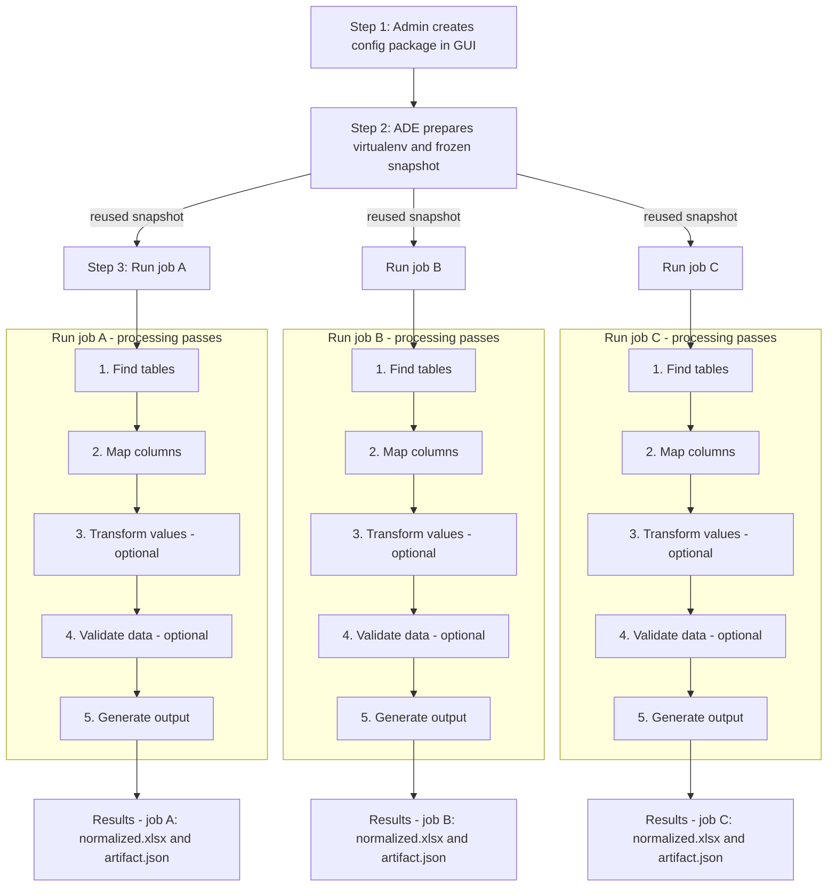

# Developer Guide

## What ADE Is — and Why It Exists

**ADE (Automatic Data Extractor)** turns messy spreadsheets — inconsistent headers, irregular tables, and varying formats — into clean, structured workbooks you can trust.

It does this using small, human-readable Python scripts (called `config package scripts`) that describe *how* to find, map, and clean data.
Those config package scripts live inside a **[config package](./01-config-packages.md)** and are created & managed by workspace owners in the frontend web interface (http://localhost:8000/workspaces/<workspace_id>/configs).

---

## The Persistent Storage Layout (ADE_DATA_DIR)

Everything ADE does—config packages, environments, jobs, logs, and caches—lives neatly under one data root directory, usually ./data during development. In production, this folder is typically mounted to an external file share (e.g., Azure File Storage) so it persists across restarts.

Each folder has one job:

* **`config_packages/`** — where configs you author in the GUI live
* **`venvs/`** — where ADE builds and stores virtual environments for each config
* **`jobs/`** — where each run’s inputs, outputs, and logs are kept
* **`documents/`** — where shared uploaded files are stored

```text
${ADE_DATA_DIR}/                                          # Root folder for all ADE state (default: ./data)

├─ config_packages/                                       # Editable config packages you author in the UI (source of truth)
│  └─ <config_id>/                                        # One folder per published config (immutable once published)
│     ├─ manifest.json                                    # Config manifest (engine defaults, field metadata, script paths)
│     ├─ column_detectors/                                # Field logic: detect → transform (optional) → validate (optional)
│     │  └─ <field>.py                                    # One Python file per target field (e.g., member_id.py)
│     ├─ row_detectors/                                   # Row-level detectors used to find tables and header rows
│     │  ├─ header.py                                     # Heuristics that vote for “this row looks like a header row”
│     │  └─ data.py                                       # Heuristics that vote for “this row looks like a data row”
│     ├─ hooks/                                           # Optional lifecycle hooks that run around job stages
│     │  ├─ on_job_start.py                               # def run(*, job, **_): initialize tiny policy/state; note() to artifact
│     │  ├─ after_mapping.py                              # def after_mapping(*, job, table, **_): correct mapping/order/labels
│     │  ├─ before_save.py                                # def before_save(*, job, book, **_): rename tab, add sheets, widths
│     │  └─ on_job_end.py                                 # def run(*, job, **_)
│     └─ requirements.txt?                                # Optional per-config dependencies installed during prepare
|
├─ venvs/                                                 # Prepared Python virtual environments (one per config version)
│  └─ <config_id>/                                        # Matches a config in config_packages/<config_id>
│     ├─ bin/python  |  Scripts/python.exe                # Interpreter the worker uses at runtime for this config’s jobs
│     └─ ade-runtime/                                     # Read-only build artifacts + ephemeral per-job mounts
│        ├─ config_snapshot/                              # ← Frozen copy of your config package (import root at runtime)
│        │  ├─ manifest.json                              # Snapshot taken at prepare; jobs import only from this folder
│        │  ├─ column_detectors/                          # Deterministic: editing config_packages/ later won’t affect runs
│        │  ├─ row_detectors/
│        │  └─ hooks/
│        ├─ packages.txt                                  # Exact dependency versions (output of `pip freeze`)
│        ├─ install.log                                   # Text log of `pip install` (diagnostics for prepare failures)
│        ├─ build.json                                    # { content_hash, deps_hash, python_version, prepared_at, ... }
│        └─ jobs/                                         # ← Per-job mount points (ephemeral; one entry per running job)
│           └─ <job_id>  →  ${ADE_DATA_DIR}/jobs/<job_id>/ # Symlink (POSIX) or junction (Windows) to the live job folder
│                                                          #   The worker’s CWD is set to this folder. If link creation
│                                                          #   isn’t possible, we set CWD to the real job dir directly.
├─ jobs/                                                  # One working directory per job (inputs, outputs, and audit trail)
│  └─ <job_id>/                                           # A single run of ADE on a single input using a single config
│     ├─ inputs/                                          # Uploaded files for this job (e.g., spreadsheets to process)
│     ├─ artifact.json                                    # Human/audit-readable record of what happened and why (no raw dumps)
│     ├─ normalized.xlsx                                  # Final clean workbook produced by ADE for this job (atomic writes)
│     ├─ events.ndjson                                    # Append-only timeline: enqueue, start, finish, error (for debugging)
│     ├─ run-request.json                                 # Snapshot of parameters handed to the worker subprocess
|
├─ documents/                                             # Document store (original uploads, normalized files, etc.)  [plural]
│  └─ <document_id>.<ext>                                 # Raw uploaded file (primary store)

├─ db/                                                    # Application database (SQLite by default; easy to back up)
│  └─ backend.app.sqlite                                  # Single-file SQLite database containing ADE metadata and state

└─ cache/                                                 # Local caches to make prepares faster and reduce network usage
   └─ pip/                                                # Pip download/build cache (safe to delete; will be repopulated)
```

---

## The Big Idea — How ADE Works

ADE is a small, deterministic engine.
You teach it *how* to interpret a spreadsheet, and it does the rest — the same way, every time.

At a high level, ADE runs in three steps:

1. **Config — Define the rules**
   An admin authors a [config package](./01-config-packages.md) in the GUI.
   It’s a folder of small Python scripts (referred to as `config package scripts`) that describe how to detect tables, map columns, and (optionally) transform or validate data.

2. **Build — Freeze the environment**
   ADE builds a dedicated Python virtual environment for that config, installs dependencies, and freezes a snapshot of your scripts.
   This snapshot is versioned and reusable — the same input and config always yield the same output.

3. **Run — Process files**
   When jobs execute, they reuse the prepared environment.
   Each job applies the same five passes — **Find → Map → Transform → Validate → Generate** — and produces its own results:

   * `normalized.xlsx` — the clean, structured workbook
   * `artifact.json` — the audit trail of what happened and why

Once built, the environment can be reused by **many jobs**.
That means faster runs, no redundant installs, and perfect reproducibility.
You only rebuild when the config or its dependencies change.

---

### Visual Overview



## The runtime — how jobs actually run

When a job is submitted, ADE places it into a lightweight internal queue. A bounded pool of worker subprocesses picks up queued jobs. Each worker launches in isolation, loads the **frozen snapshot** for its config, and executes the five passes.

Every worker runs inside its own sandbox:

* **Network access** is disabled by default (opt‑in per job/config).
* **CPU, memory, and file‑size limits** prevent a bad script from impacting others.
* The worker writes **three outputs** to the job folder:

  * `normalized.xlsx` — the clean workbook (atomic write)
  * `artifact.json` — the full audit record (atomic updates)
  * `events.ndjson` — a chronological event log for debugging

### Where the worker runs (precisely)

For each job, ADE starts the prepared interpreter:

```
venvs/<config_id>/bin/python -I -B -m ade.worker <job_id>
```

with:

* **CWD** = `venvs/<config_id>/ade-runtime/jobs/<job_id>/`
  This is a symlink/junction to `${ADE_DATA_DIR}/jobs/<job_id>/`, so relative IO is local and obvious.
  If link creation isn’t possible, ADE falls back to **CWD = `${ADE_DATA_DIR}/jobs/<job_id>`**. Behavior is identical.

* **PYTHONPATH** = `venvs/<config_id>/ade-runtime/config_snapshot/`
  Workers import **only** from the frozen snapshot; editing config files later does not affect running jobs.

* **Environment variables** (the worker’s IO contract):

  * `ADE_JOB_DIR` — `${ADE_DATA_DIR}/jobs/<job_id>`
  * `ADE_INPUTS_DIR` — `${ADE_DATA_DIR}/jobs/<job_id>/inputs`
  * `ADE_OUTPUT_PATH` — `${ADE_DATA_DIR}/jobs/<job_id>/normalized.xlsx`
  * `ADE_ARTIFACT_PATH` — `${ADE_DATA_DIR}/jobs/<job_id>/artifact.json`
  * `ADE_EVENTS_PATH` — `${ADE_DATA_DIR}/jobs/<job_id>/events.ndjson`
  * `ADE_SNAPSHOT_DIR` — `venvs/<config_id>/ade-runtime/config_snapshot`
  * Safety knobs: `ADE_WORKER_CPU_SECONDS`, `ADE_WORKER_MEM_MB`, `ADE_WORKER_FSIZE_MB`, `ADE_RUNTIME_NETWORK_ACCESS`

> **Config package scripts never touch files directly.** The engine streams values to your detectors/transforms/validators and writes outputs on your behalf. Your code remains pure, deterministic, and easy to reason about.

---

## 5) Safety, determinism, and reproducibility

ADE treats every config package as untrusted:

* Each run executes in its **own subprocess**, separate from the API.
* **Network** is off by default (opt‑in when necessary).
* **Resource limits** cap CPU time, memory, and file size.
* ADE logs **only structured metadata** in the artifact — never raw cell dumps.

**Determinism:** jobs import from the **frozen snapshot** (`config_snapshot/`). Even if you edit or republish a config later, past and in‑flight jobs stay explainable — the artifact records exactly which rules and versions ran.

**Atomicity:** ADE writes `normalized.xlsx` and `artifact.json` using atomic replace semantics to avoid torn files.

---

## 6) Config → Build → Run (expanded)

* **Author** a config package in the UI. You declare target fields and write small functions:

  * **Row detectors** label rows as header/data/separator.
  * **Column detectors** map raw columns to target fields using additive scoring (can boost one field and nudge down lookalikes).
  * Optional **transform** and **validate** per field; optional **hooks** at stable moments.

* **Prepare** the config. ADE:

  * Creates a clean **virtual environment** for the config version.
  * Installs pinned dependencies (if any).
  * Copies your package into `venvs/<config_id>/ade-runtime/**config_snapshot/**` and records metadata (`packages.txt`, `build.json`, `install.log`).
  * Skips work if the content/deps hashes haven’t changed.

* **Run** jobs. Workers import from the snapshot and execute the five passes. Hooks can adjust mapping, tweak the final workbook, and leave notes in the artifact. Results are written to the job folder.

> Deep dive and complete API: **[Config Packages](./01-config-packages.md)**

---

## 7) Environment & configuration

ADE is configured via environment variables (simple, portable). The important ones:

| Variable                             | Default                         | What it controls                                               |
| ------------------------------------ | ------------------------------- | -------------------------------------------------------------- |
| `ADE_DATA_DIR`                       | `./data`                        | Root directory for all ADE state                               |
| `ADE_CONFIGS_DIR`                    | `$ADE_DATA_DIR/config_packages` | Where editable config packages live                            |
| `ADE_VENVS_DIR`                      | `$ADE_DATA_DIR/venvs`           | Prepared environments per `config_id`                          |
| `ADE_JOBS_DIR`                       | `$ADE_DATA_DIR/jobs`            | Per‑job working directories                                    |
| `ADE_PIP_CACHE_DIR`                  | `$ADE_DATA_DIR/cache/pip`       | pip cache for wheels/sdists (speeds prepares)                  |
| `ADE_WHEELHOUSE`                     | *(unset)*                       | Local wheels dir for offline/air‑gapped prepares               |
| `ADE_MAX_CONCURRENCY`                | `2`                             | Worker subprocesses in parallel                                |
| `ADE_QUEUE_SIZE`                     | `10`                            | Max waiting jobs before 429 is returned                        |
| `ADE_JOB_TIMEOUT_SECONDS`            | `300`                           | Wall‑clock timeout per job                                     |
| `ADE_WORKER_CPU_SECONDS`             | `60`                            | CPU limit per job (rlimit)                                     |
| `ADE_WORKER_MEM_MB`                  | `512`                           | Memory limit per job (MiB, rlimit)                             |
| `ADE_WORKER_FSIZE_MB`                | `100`                           | Max file size a job can create (MiB, rlimit)                   |
| `ADE_RUNTIME_NETWORK_ACCESS_DEFAULT` | `false`                         | Default runtime network policy (prepare may still use network) |

Defaults are conservative for development and scale easily for production.

---

## 8) What gets written where (quick reference)

* **`jobs/<job_id>/inputs/`** — raw input files for this run.
* **`jobs/<job_id>/normalized.xlsx`** — generated workbook (atomic write).
* **`jobs/<job_id>/artifact.json`** — audit record (append‑only narrative; atomic updates).
* **`jobs/<job_id>/events.ndjson`** — lifecycle event log (enqueue/start/finish/error).
* **`venvs/<config_id>/ade-runtime/config_snapshot/`** — frozen import root that made the decisions.

---

## 9) Troubleshooting at a glance

* **Prepare errors** → read `venvs/<config_id>/ade-runtime/install.log` and `build.json`.
* **Unexpected mapping** → inspect `artifact.json` (it includes the winning score and top contributing rules).
* **Performance** → detectors should use **samples**; heavy cleanup belongs in **transform**; keep validators light.
* **Crashes** → rule errors are captured in the artifact; jobs continue with neutral results.

---

## 10) Where to go next

1. **[Config Packages](./01-config-packages.md)** — what a config is, Script API v1, detectors, transforms, validators, hooks.
2. **[Job Orchestration](./02-job-orchestration.md)** — queue, workers, resource limits, atomic writes.
3. **[Artifact Reference](./14-job_artifact_json.md)** — the per‑job audit trail (schema and examples).
4. **[Glossary](./12-glossary.md)** — common terms and system vocabulary.