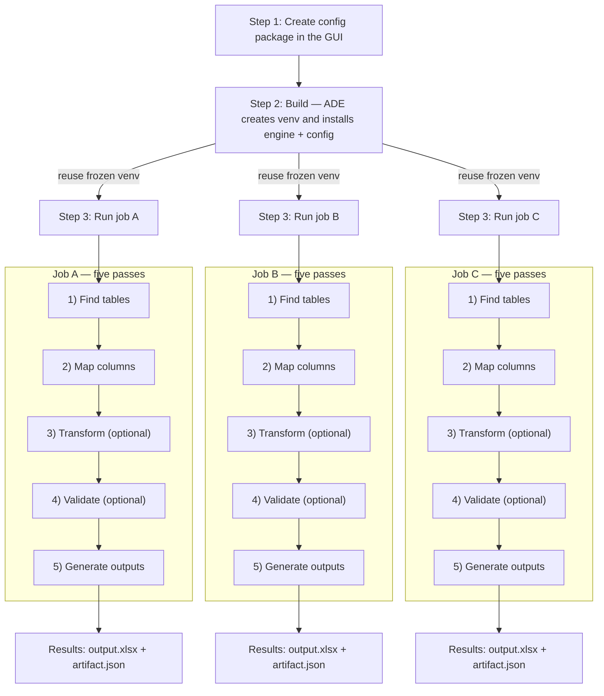

# Developer Guide

ADE turns messy spreadsheets into consistent, auditable workbooks through a simple, repeatable flow:

1. **Config** — define detection, mapping, and transformation rules ([`01-config-packages.md`](./01-config-packages.md))
2. **Build** — set up a dedicated virtual environment (`venvs/<config_id>/`) with `ade_engine` and your `ade_config` installed
3. **Run** — use that frozen environment to process one or more input files deterministically

## Repository and Runtime Layout

The ADE monorepo brings together four cooperating layers:

* **Frontend (React Router)** — web app where workspace owners create and manage config packages, edit code, and trigger builds and runs.
* **Backend (FastAPI)** — API service that stores metadata, builds isolated Python environments, and orchestrates job execution.
* **Engine (Custom Python `ade_engine`)** — python runtime module that executes inside the worker process, reading spreadsheets, applying detectors and hooks, and producing normalized outputs with full audit trails.
* **Config package (Custom Python `ade_config`)** — built and managed in the frontend; defines the business logic that tells ADE how to detect, map, and transform data. Versioned for draft, testing, rollback, and extension through a flexible Python interface.

At job runtime, the **ADE Engine** and your versioned **ADE Config** are installed in an isolated virtual environment (venv) and produce a normalized Excel workbook.

```text
automatic-data-extractor/
├─ backend/                         # FastAPI app (serves API and the built SPA in prod)
│  ├─ app/
│  │  ├─ main.py                    # mounts: /api (routers), / (StaticFiles for SPA build)
│  │  ├─ api/                       # routers
│  │  ├─ core/                      # settings, logging, lifespan, security
│  │  ├─ services/                  # build/run/queue logic
│  │  ├─ repositories/              # DB persistence
│  │  ├─ schemas/                   # Pydantic models
│  │  ├─ workers/                   # subprocess orchestration (engine worker)
│  │  ├─ web/static/                # ← SPA build copied here from web/dist (kept in repo; .gitignore the contents)
│  │  └─ templates/                 # optional: server-side templates/emails (keep .keep)
│  ├─ migrations/                   # Alembic
│  ├─ pyproject.toml
│  └─ tests/
│
├─ frontend/                        # React SPA (Vite/CRA)
│  ├─ src/
│  ├─ public/
│  ├─ package.json
│  └─ vite.config.ts
│
├─ engine/                          # ade-engine (installable Python package)
│  ├─ pyproject.toml
│  ├─ src/ade_engine/...
│  └─ tests/
│
├─ templates/
│  └─ config-packages/
│     ├─ default/
│     │  ├─ template.manifest.json  # template catalog metadata (name/description/tags/min engine)
│     │  └─ src/ade_config/         # detectors/hooks + runtime manifest/env
│     │     ├─ manifest.json
│     │     ├─ config.env
│     │     ├─ column_detectors/
│     │     ├─ row_detectors/
│     │     └─ hooks/
│     └─ <other-template>/
│        ├─ template.manifest.json
│        └─ src/ade_config/...
│
├─ schemas/                         # JSON Schemas for validation (IDE‑friendly)
│  ├─ config-manifest.v1.json
│  └─ template-manifest.v1.json
│
├─ examples/                        # sample inputs/outputs for docs/tests
├─ docs/                            # Developer Guide + HOWTOs
├─ scripts/                         # helper scripts (copy build, seed data, etc.)
├─ Dockerfile                       # multi-stage: build web → copy into backend/app/web/static
├─ compose.yaml                     # optional: local prod run (app + reverse proxy)
├─ Makefile                         # quickstarts (setup/dev/build/run)
├─ .env.example                     # documented env vars
├─ .editorconfig
├─ .pre-commit-config.yaml
├─ .gitignore
├─ .github/workflows/               # CI (lint, test, build, publish)
```

Everything ADE produces (config_packages, venvs, jobs, logs, cache, etc..) is persisted under `ADE_DATA_DIR` (default `./data`). In production, this folder is typically mounted to an external file share so it persists across restarts.

```text
${ADE_DATA_DIR}/
├─ workspaces/
│  └─ <workspace_id>/
│     ├─ config_packages/           # GUI-managed installable config projects (source of truth)
│     │  └─ <config_id>/
│     │     ├─ pyproject.toml       # Distribution metadata (ade-config)
│     │     ├─ requirements.txt     # Optional overlay pins (editable in GUI)
│     │     └─ src/ade_config/
│     │        ├─ column_detectors/ # detect → transform (opt) → validate (opt)
│     │        ├─ row_detectors/    # header/data row heuristics
│     │        ├─ hooks/            # on_job_start/after_mapping/before_save/on_job_end
│     │        ├─ manifest.json     # read via importlib.resources
│     │        └─ config.env        # optional env vars
│     ├─ venvs/                     # One Python virtualenv per config_id
│     │  └─ <config_id>/
│     │     ├─ bin/python
│     │     ├─ ade-runtime/
│     │     │  ├─ packages.txt      # pip freeze
│     │     │  └─ build.json        # {config_version, engine_version, python_version, built_at}
│     │     └─ <site-packages>/
│     │        ├─ ade_engine/...    # Installed ADE engine
│     │        └─ ade_config/...    # Installed config package
│     ├─ jobs/                      # One working directory per job (inputs, outputs, audit)
│     │  └─ <job_id>/
│     │     ├─ input/               # Uploaded files
│     │     ├─ output/              # Generated output files
│     │     └─ logs/
│     │        ├─ artifact.json     # human/audit-readable narrative
│     │        └─ events.ndjson     # append-only timeline
│     └─ documents/
│        └─ <document_id>.<ext>     # optional shared document store
│
├─ db/
│  └─ app.sqlite                    # SQLite in dev (or DSN for prod)
├─ cache/
│  └─ pip/                          # pip download/build cache (safe to delete)
└─ logs/                            # optional: centralized service logs
```

## Visual Overview



## Step 1: Config — Define the Rules

Every ADE workflow starts with a **config package** you create in the **in‑browser editor**. The editor lets you browse files, edit Python, and save changes in real time.

Under the hood, a config is just a Python package named **`ade_config`**. Inside it, you define three ideas that tell ADE how to read, interpret, and clean your spreadsheets:

1. **How to find the table**
   * *Row detectors*  — classify each row (header, data, separator, etc.) so ADE can pinpoint where each table begins and ends.

2. **What each column means**
   * *Column detectors*  — recognize fields like "Invoice Date" or "Amount," even when header names vary. This is how ADE maps columns reliably across inconsistent inputs.

3. **How to make the data trustworthy**

   * *Transforms (optional)* — clean or normalize values.
   * *Validators (optional)* — check that values match the expected format.
   * *Hooks (optional)* — run custom logic at key points in the job lifecycle.

### Lifecycle Hooks

Hooks give you precise control over the pipeline without changing the core engine. Each hook is an optional Python module that exposes a callable function and runs at a specific stage:

| Hook                   | Runs                           | Typical use                                                                      |
| ---------------------- | ------------------------------ | -------------------------------------------------------------------------------- |
| **`on_job_start.py`**  | Before any files are processed | Initialize shared state, load reference data, or record metadata in the artifact |
| **`after_mapping.py`** | After columns are mapped       | Adjust mappings, reorder fields, or correct mislabeled headers                   |
| **`before_save.py`**   | Just before output is written  | Add summary tabs, rename sheets, or tweak formatting                             |
| **`on_job_end.py`**    | After the job completes        | Clean up temporary resources or emit final notes                                 |

Each hook receives structured context objects (e.g., `job`, `table`, `book`) and can safely write observations to the audit artifact using `note()`.

### Example Config Package Layout

```text
${ADE_DATA_DIR}/                                          # Root folder for all ADE state (default: ./data)
├─ config_packages/                                       # Editable config packages you author in the UI (source of truth)
│  └─ <config_id>/                                        # One folder per published config (immutable once published)
│     ├─ manifest.json                                    # Config manifest: metadata, defaults, entrypoints
│     ├─ config.env?                                      # Optional environment file loaded before detectors/hooks
│     ├─ pyproject.toml?                                  # Optional dependency list (supersedes requirements.txt)
│     ├─ column_detectors/                                # Field logic: detect → transform (optional) → validate (optional)
│     │  └─ <field>.py                                    # One Python file per target field (e.g., member_id.py)
│     ├─ row_detectors/                                   # Row-level detectors used to find tables and header rows
│     │  ├─ header.py                                     # Heuristics that vote for “this row looks like a header row”
│     │  └─ data.py                                       # Heuristics that vote for “this row looks like a data row”
│     ├─ hooks/                                           # Optional lifecycle hooks that run around job stages
│     │  ├─ on_job_start.py                               # def run(*, job, **_): initialize tiny policy/state; note() to artifact
│     │  ├─ after_mapping.py                              # def after_mapping(*, job, table, **_): correct mapping/order/labels
│     │  ├─ before_save.py                                # def before_save(*, job, book, **_): rename tab, add sheets, widths
│     │  └─ on_job_end.py                                 # def run(*, job, **_)
│     └─ __init__.py                                      # Required by Python; marks this folder as a package
```

> For a deeper look inside config packages, see ([`01-config-packages.md`](./01-config-packages.md)).

## Step 2: Build — Freeze the Environment

Click **Build** in the editor to lock your configuration into a self‑contained, reproducible runtime.

Behind the scenes ADE:

1. Creates a fresh virtual environment at `venvs/<config_id>/` using Python’s built‑in `venv`.
2. Installs the custom python **`ade_engine`** (the runtime that executes jobs) and your custom configured **`ade_config`** (your rules created in step 1).
   If you declared dependencies in the config package `pyproject.toml`, those are installed here as well.

> You can build as often as you like while the config package is in **Draft**. Each build produces a clean virtual python environment.

## Step 3: Run — Process Files

Once a configuration environment is built, ADE can process real spreadsheets safely and predictably—over and over.

* Each run reuses the frozen virtual environment from **Step 2: Build**.
* ADE launches an isolated worker that imports your `ade_config`, then streams rows from the uploaded document through your detectors and hooks.
* Your logic helps ADE understand the file: where tables start, what each column represents, and how to clean/validate values.
* The engine produces the finalized spreadsheet.

**Worker command**

```bash
${ADE_DATA_DIR}/venvs/<config_id>/bin/python -I -B -m ade_engine.worker <job_id>
```

All results are written atomically inside the job folder so you always have a consistent, inspectable record:

```
jobs/<job_id>/
  input/
    input.xlsx
  output/
    output.xlsx     # final structured workbook
  artifact.json     # full audit trail and rule explanations
  events.ndjson     # timeline of the run
```

## Environment & Configuration

ADE is configured via environment variables so it remains simple and portable. Defaults suit development and scale cleanly to production.

| Variable                  | Default                         | What it controls                                            |
| ------------------------- | ------------------------------- | ----------------------------------------------------------- |
| `ADE_DATA_DIR`            | `./data`                        | Root directory for all ADE state                            |
| `ADE_CONFIGS_DIR`         | `$ADE_DATA_DIR/config_packages` | Where GUI‑managed, installable config projects live         |
| `ADE_VENVS_DIR`           | `$ADE_DATA_DIR/venvs`           | Builds environments (one per `config_id`)                   |
| `ADE_JOBS_DIR`            | `$ADE_DATA_DIR/jobs`            | Per‑job working directories                                 |
| `ADE_PIP_CACHE_DIR`       | `$ADE_DATA_DIR/cache/pip`       | pip cache for wheels/sdists (speeds up building)            |
| `ADE_MAX_CONCURRENCY`     | `2`                             | Backend dispatcher parallelism                              |
| `ADE_QUEUE_SIZE`          | `10`                            | Max enqueued jobs before the API returns 429                |
| `ADE_JOB_TIMEOUT_SECONDS` | `300`                           | Parent‑enforced wall‑clock timeout for a worker             |
| `ADE_WORKER_CPU_SECONDS`  | `60`                            | Best‑effort CPU limit per job (POSIX `rlimit`)              |
| `ADE_WORKER_MEM_MB`       | `512`                           | Best‑effort address‑space ceiling per job (POSIX `rlimit`)  |
| `ADE_WORKER_FSIZE_MB`     | `100`                           | Best‑effort max file size a job can create (POSIX `rlimit`) |

If a configuration ships `ade_config/config.env`, the engine loads its variables at worker start *before* importing configuration code. If you need to override values for a single run later, add a job‑level mechanism in the backend and set env vars before spawning the worker.

## Excel and CSV Support

ADE reads `.xlsx` and `.csv` inputs and always writes a normalized `.xlsx` workbook as the final output. Excel is handled by `openpyxl` in streaming mode (`read_only=True`, `data_only=True`); CSV uses the Python standard library with UTF‑8 as the default encoding. Other formats can be added later as pluggable readers without changing how configurations are authored.

## A First Run You Can Try Locally

You can exercise the complete path without the frontend. Copy the template to create a configuration, build the environment, and run a job by hand:

```bash
# 1) Create a per-config virtual environment and install engine + config (production installs)
python -m venv data/venvs/<config_id>
data/venvs/<config_id>/bin/pip install engine/
data/venvs/<config_id>/bin/pip install data/config_packages/<config_id>/
data/venvs/<config_id>/bin/pip freeze > data/venvs/<config_id>/ade-runtime/packages.txt

# 2) Seed a job and run it
mkdir -p data/jobs/<job_id>/inputs
cp examples/inputs/sample.xlsx data/jobs/<job_id>/inputs/
data/venvs/<config_id>/bin/python -I -B -m ade_engine.worker <job_id>
```

When the worker exits, `artifact.json` explains each decision and its supporting scores, `output.xlsx` contains the cleaned workbook, and `events.ndjson` shows a timestamped trail of the run.

## Troubleshooting and Reproducibility

If a build fails, re‑run the build action and check `packages.txt` to see the resolved dependency set. If imports fail inside the worker, verify that `ade_engine` and `ade_config` exist in the venv’s `site‑packages` and that this command succeeds:

```bash
data/venvs/<config_id>/bin/python -I -B -c "import ade_engine, ade_config; print('ok')"
```

If mapping results look unexpected, open `artifact.json`; it records the winning scores and the rules that contributed to each decision. Performance issues usually trace back to heavy work in detectors; prefer sampling in detectors, move heavier cleanup into transforms, and keep validators light. Because every configuration has its own environment, installs are isolated; if you suspect a dependency clash, run `pip check` in the venv to diagnose.

## Where to go next

1. **[Config Packages](./01-config-packages.md)** — what a config is, Script API v1, detectors, transforms, validators, hooks.
2. **[Job Orchestration](./02-job-orchestration.md)** — queue, workers, resource limits, atomic writes.
3. **[Artifact Reference](./14-job_artifact_json.md)** — the per‑job audit trail (schema and examples).
4. **[Glossary](./12-glossary.md)** — common terms and system vocabulary.